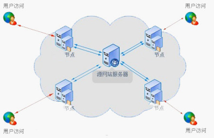

- ## CDN
	- content Delivery network 内容分发网络，是现有网络基础上的智能虚拟网络，
	- 
	- ## 通过 npm 使用 React
		- 如果你的系统还不支持 Node.js 及 NPM 可以参考我们的 [Node.js 教程](https://www.runoob.com/nodejs/nodejs-tutorial.html)。
		  
		  我们建议在 React 中使用 CommonJS 模块系统，比如 browserify 或 webpack，本教程使用 webpack。
		  
		  国内使用 npm 速度很慢，你可以使用淘宝定制的 cnpm (gzip 压缩支持) 命令行工具代替默认的 npm:
		  
		  ```
		  $ npm install -g cnpm --registry=https://registry.npmmirror.com
		  $ npm config set registry https://registry.npmmirror.com
		  ```
		  
		  这样就可以使用 cnpm 命令来安装模块了：
		  
		  ```
		  $ cnpm install [name]
		  ```
- ## Webpack
- ## DOM
	- 文档对象模型：是HTML和XML文档的编程接口，是浏览器上元素对象的结构化对应表述
-