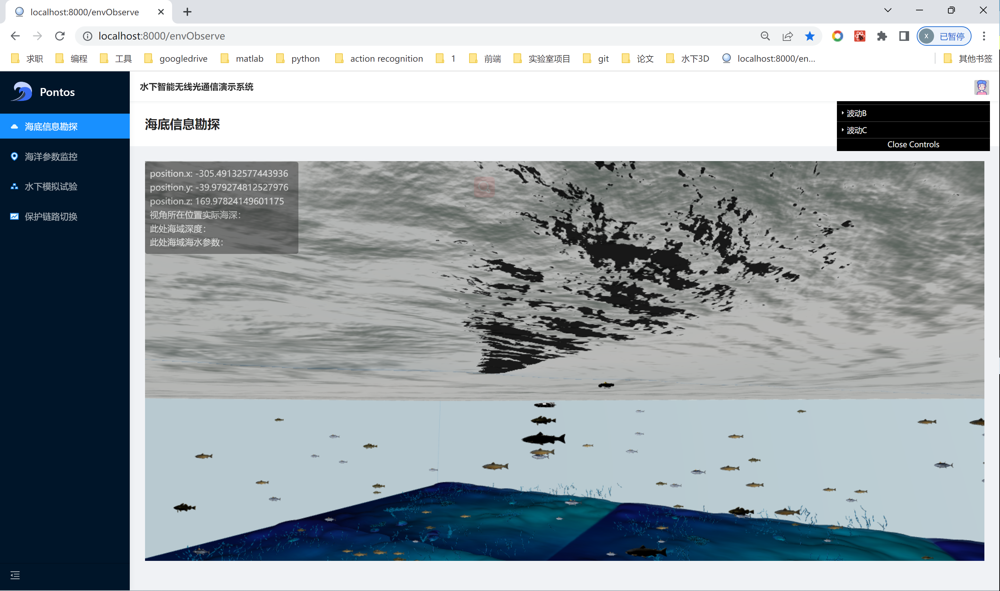

- 技术笔记
  collapsed:: true
	- #Suspense
	  collapsed:: true
		- 作用：异步加载组件，异步请求数据
		- ```
		  const A = React.lazy(() => import('./A'))
		  
		  return (
		    <Suspense fallback={<p>loading</p>}>
		      <Route component={A} path="/a">
		    </Suspense>
		  )
		  
		  ```
		- 这样在打包代码时，可以显著减少主包的体积，加快加载速度
- 实验室项目
  collapsed:: true
	- 
- #论文
	- 专利：
		- https://www.mdpi.com/2073-431X/10/10/119
			- 相应技术：
				- 水下通信技术（声、光、射频对比，最后选用是射频）
				- 水下延迟容错网络（DTN）
				- 水下数据传输
				- AUV导航和定位（传感器滤波和非线性动力学方程）
				- 评估结果
	- 论文
		- https://www.mdpi.com/1424-8220/22/20/8043
			- *虚拟海洋环境的构建*
			- UUV姿态、角速度和线速度控制器的设计
			- 建立了基于Matlab和ROS的协同仿真模板，并基于该模板演示了路径规划、任务调度等仿真案例。
		- # 水声通信及组网协议研究与仿真
			- 本文还对近年来的水声通信仿真平台进行研究,并对其优势和不足进行了分析和归纳,同时,研究了NS-3和Aqua-SIM-NG网络仿真模拟器的网络框架和模块运行机制,为本文水声通信仿真平台的设计和实现提供理论基础。
			- 本文设计并实现了一款基于NS-3和Aqua-SIM-NG模拟器的水声通信仿真平台。在保留NS-3和Aqua-SIM-NG的基础功能上对仿真环境进行合理配置,设计了仿真平台的整体框架和软件架构。通过测试用例进行仿真实验,结果显示该水声通信仿真平台支持2种以上典型信道传输模型和三维拓扑,支持链路层和网络层协议性能统计和评估,降低了实验成本,提高了实验准确性、灵活性和实验效率。
			-