- 后端知识体系
  collapsed:: true
	- 查漏补缺
	  collapsed:: true
		- MYSQL语法
		  collapsed:: true
			- ```
			  https://javaguide.cn/database/sql/sql-syntax-summary.html#%E5%88%9B%E5%BB%BA%E8%A7%A6%E5%8F%91%E5%99%A8
			  ```
			- ```
			  https://javaguide.cn/database/sql/sql-questions-01.html#%E8%BF%94%E5%9B%9E%E5%9B%BA%E5%AE%9A%E4%BB%B7%E6%A0%BC%E7%9A%84%E4%BA%A7%E5%93%81
			  ```
		-
		-
	- 项目
	  collapsed:: true
		- 教程
		  collapsed:: true
			- 1-简介
				- 更新时间，readme，技术栈，框架
			- 2-怎么启动和安装
			- 3-从整体到局部
			  collapsed:: true
				- 先看整体框架目录结构
				- 关键配置文件
				- java核心代码（mvc架构）
					- controller接收请求和响应
					- mapper是mybatis的数据库映射文件，操作数据库
					- page控制页面的返回
					- service业务逻辑
					- vo返回给页面的数据
					- core核心类
				- resources静态资源
					- mybatis数据库命令
					- static前端静态资源
					- templates前端
				-
			- 关键是业务逻辑
		- 瑞吉外卖
		  collapsed:: true
			- 项目地址：E:\我的文件_E\开发准备\2-project\ruiji
			- 项目地址2：E:\我的文件_E\开发准备\2-project\瑞吉外卖-资料\5 瑞吉外卖项目优化篇\5 瑞吉外卖项目优化篇\代码\day01
			- first
				- 项目整体介绍：
				  collapsed:: true
					- 产品原型
					  collapsed:: true
						- 后台-管理端
						- 前台-服务端
						- 后台管理员
						- 后台普通用户
						- C端用户
					- 技术选型
					  collapsed:: true
						- 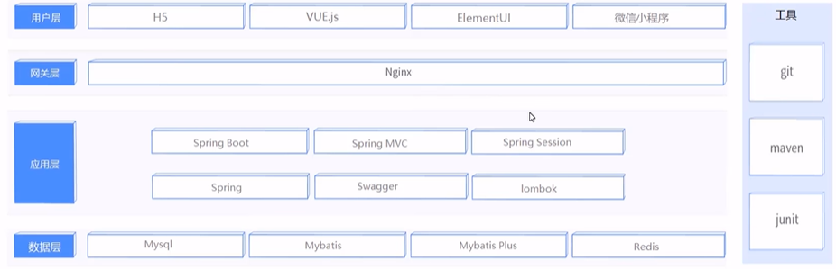
						- 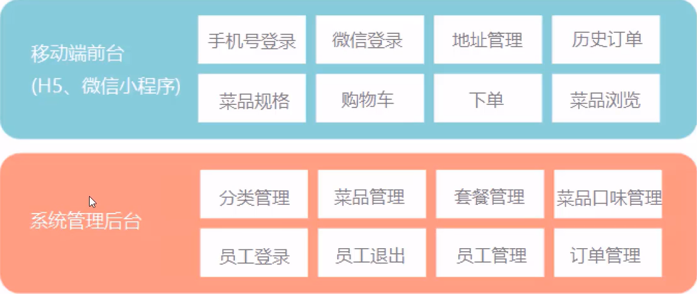
				- # 开发环境搭建
				  collapsed:: true
					- 数据库环境搭建-导入表结构
						- 1-运行sql文件（保存的是语句）
						- 2-命令行导入 source d:/xxxx.sql
					- maven项目搭建
						- 1.创建maven项目
						- 2.导入pom.xml
						- 3.导入SpringBoot配置文件application.yml
							- 路径：src/main/resources/application.yml
							- 端口号、数据库、mybatis-plus配置（主键生成策略--驼峰命名法）
						- 4.编写启动类ReggieApplication
						  background-color:: #497d46
							- ```
							  public class reggieApplication{
							  	public static void main(String[] args){
							      	SpringApplication.run(reggieApplication.class,args);
							          log.into("项目启动成功")
							      }
							  }
							  ```
						- 5.导入前端页面
						  background-color:: #497d46
							- 【1】前端静态资源导入resources路径
							- 【2】配置类的方式设置静态资源的映射：com/itheima/reggie/config/WebMvcConfig.java
								- 原因：默认情况下浏览器只能访问static和public下的静态资源
								- 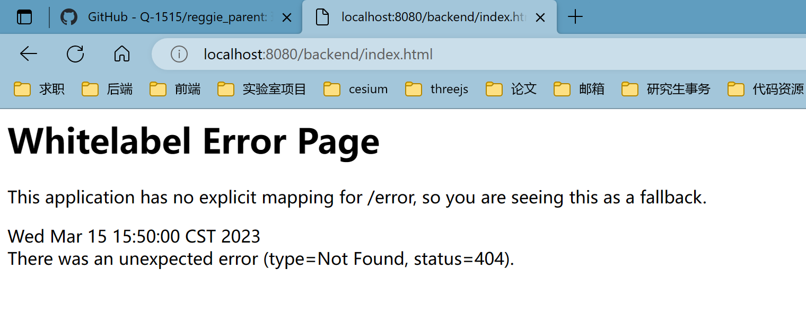
				- # 后台登录功能开发
				  collapsed:: true
					- 需求分析
					  collapsed:: true
						- 查看登录请求信息
							- 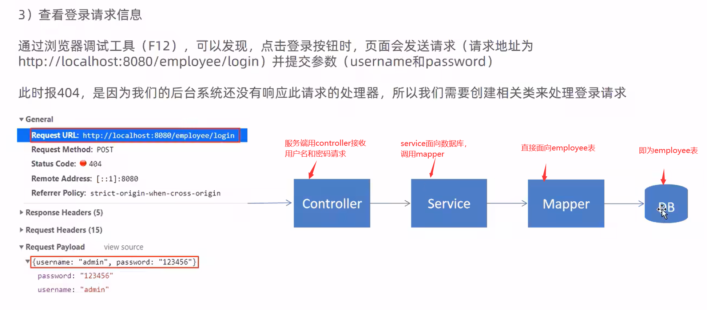
						- 后端返回数据分析-login.html
						  background-color:: #497d46
							- 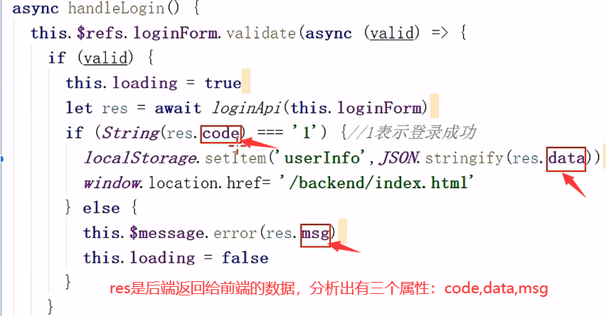
					- 代码开发
					  collapsed:: true
						- （1）创建实体类Employee和employee表进行映射--直接导入entity包
						  collapsed:: true
							- 路径：com/itheima/reggie/entity/Employee.java
						- （2）创建Controller、Service、Mapper包
						  collapsed:: true
							- 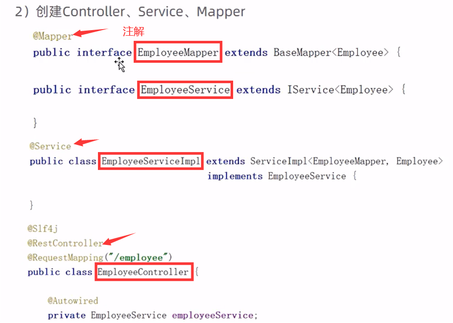
							- 【1】Mapper：com/itheima/reggie/mapper/EmployeeMapper.java
							  collapsed:: true
								- 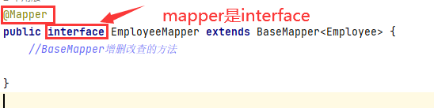
							- 【2】Service：com/itheima/reggie/service/EmployeeService.java
							  collapsed:: true
								- 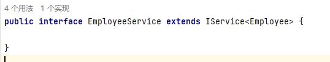
							- 【3】ServiceImpl：com/itheima/reggie/service/impl/EmployeeServiceImpl.java
							- 【4】Controller：com/itheima/reggie/controller/EmployeeController.java
						- （3）导入返回通用的结果类R--服务端所有返回结果都会包装成这种类型
						  collapsed:: true
							- 路径：com/itheima/reggie/common/R.java
							- 响应成功就是返回R.sucess()，自动生成一个R对象来返回
						- （4）登陆方法EmployeeController修改
						  background-color:: #497d46
						  collapsed:: true
							- 笔记
							  collapsed:: true
								- 【1】注解：@RequestMapping("/employee")
								  collapsed:: true
									- 请求路径中对应employee的
									- Note: @RequestMapping用法
									  background-color:: #264c9b
										- https://blog.csdn.net/demo_yo/article/details/123608034
										- 将HTTP请求映射到控制器方法上
								- 【2】注解：@Autowired--自动装配
								  collapsed:: true
									- Note：@Autowired用法--bean的实例化
										- https://blog.csdn.net/weixin_45755816/article/details/118654961
										- 标注的属性是构造函数：为构造器自动完成属性方法的装配，默认根据无参构造函数。
										- 标注的属性是接口：注入的是这个接口的实现类
								- 【3】注解：@PostMapping("/login")--前端发送的请求映射
								- 【4】注解：@ResquestBody--页面提交的JSON形式的参数接收
								  collapsed:: true
									- 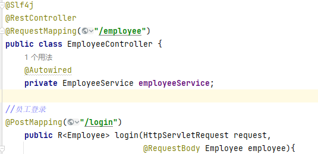
								- 【5】将页面提交的密码password进行md5加密处理
								  collapsed:: true
									- 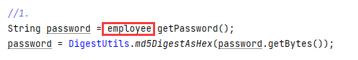
								- 【6】根据页面提交的用户名username查询数据库
								  collapsed:: true
									- **声明查询对象--给查询对象增加查询条件--让Service包裹查询对象去查数据库--返回一个结果**
									- 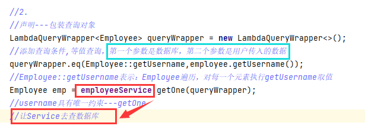
								- 【7】如果没有查询到则返回登录失败结果
								  collapsed:: true
									- 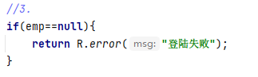
								- 【8】密码比对，如果不一致则返回登录失败结果
								  collapsed:: true
									- 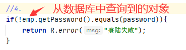
								- 【9】查看员工状态，如果为已禁用状态，则返回员工已禁用结果
								  collapsed:: true
									- 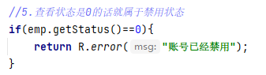
									  id:: 64186891-7a45-44a1-8647-72dff6682800
								- 【10】登录成功，将员工id存入Session并返回登录成功结果
								  collapsed:: true
									- 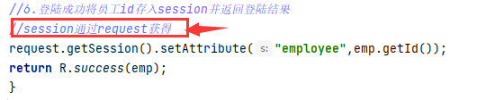
								- 测试结果
								  collapsed:: true
									- 
							- 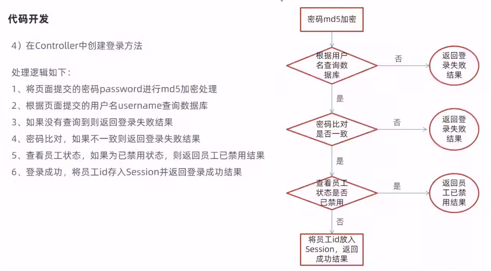{:height 359, :width 643}
							-
				- # 后台退出功能开发
				  collapsed:: true
					- 需求分析
					  collapsed:: true
						- 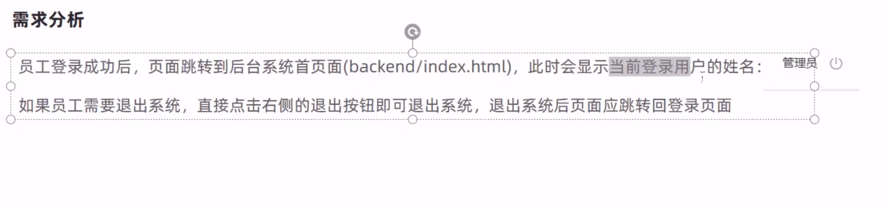
					- 代码开发
						- 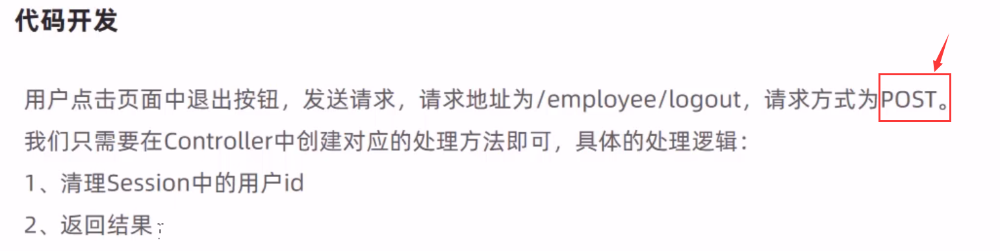
						- Controller：com/itheima/reggie/controller/EmployeeController.java
						  collapsed:: true
							- 【1】注解：@PostMapping("/logout")--前端发送的请求映射
							  collapsed:: true
								- 我个人的理解相当于if(posturl=../logout){ 后面跟着的方法... }
								- request和post的关系：request包括post和get方式
								  collapsed:: true
									- 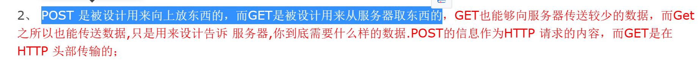
							- 【2】logout函数
							  collapsed:: true
								- 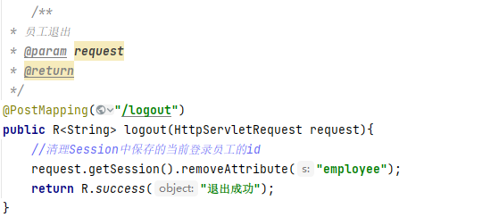
							- 测试结果
							  collapsed:: true
								- 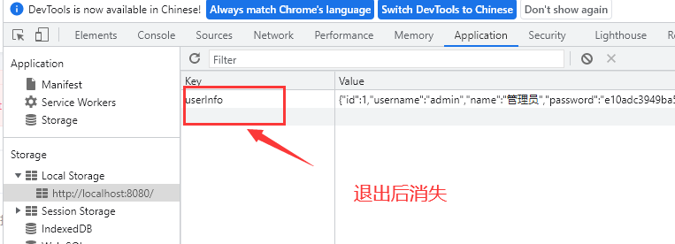
				- # 完善登录功能
				  collapsed:: true
					- 完善登录功能代码逻辑
					  collapsed:: true
						- 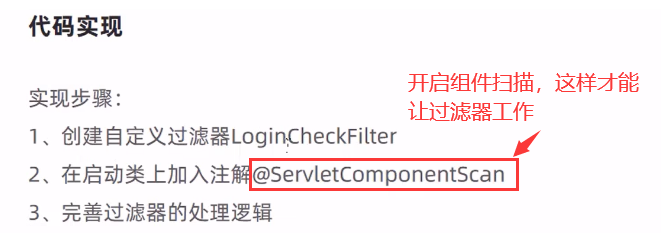
						- 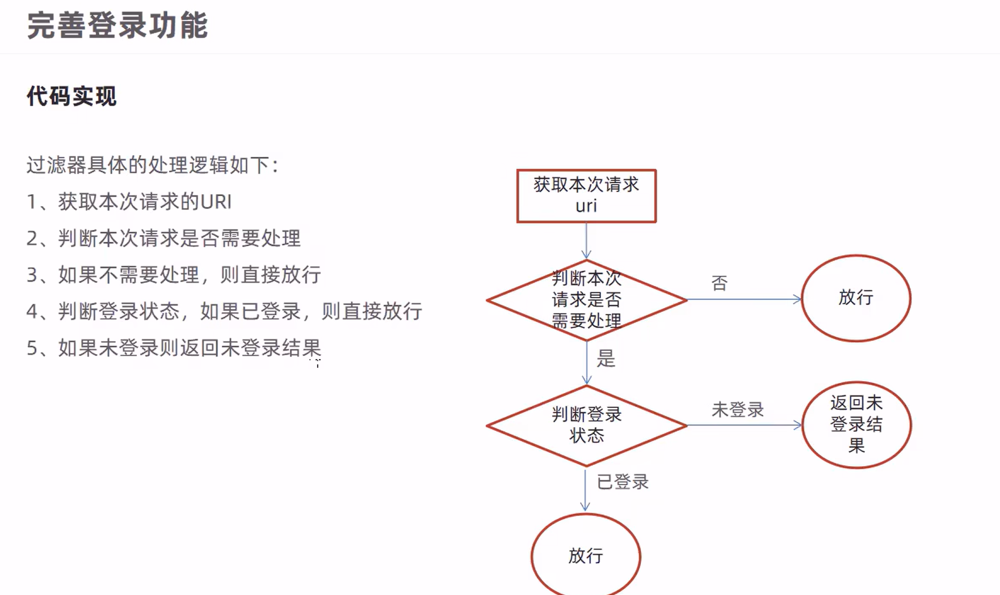
					- 1-创建过滤器：
					  collapsed:: true
						- 【1】过滤器类：com/itheima/reggie/filter/LoginCheckFilter.java
						  collapsed:: true
							- 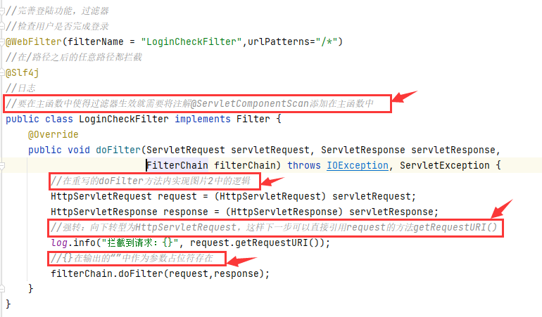
						- 【2】启动方法：com/itheima/reggie/ReggieApplication.java
						  collapsed:: true
							- 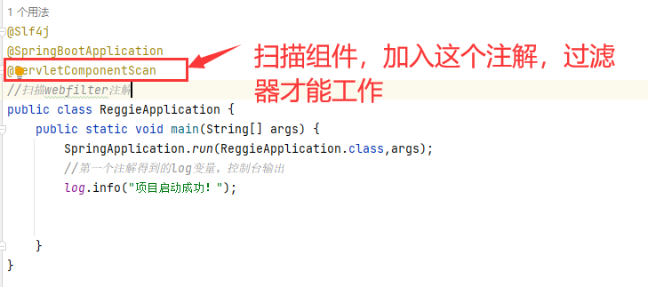
						- 测试结果1：
						  collapsed:: true
							- 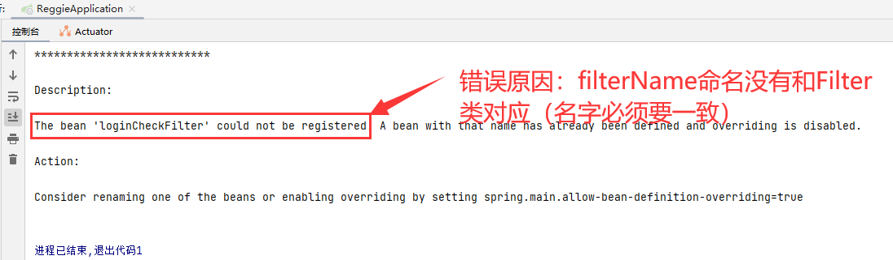
						- 测试结果成功
						  collapsed:: true
							- 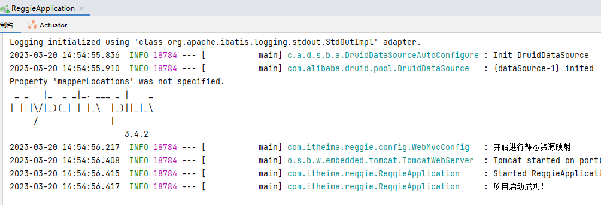
					- 2-dofilter方法中完善过滤器逻辑
					  collapsed:: true
						- 【1】过滤器类：com/itheima/reggie/filter/LoginCheckFilter.java
						  collapsed:: true
							- （1）获取本次请求的URL
							  collapsed:: true
								- 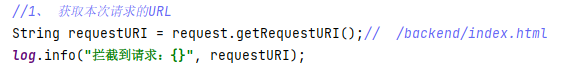
							- （2）定义不需要处理的请求路径
							  collapsed:: true
								- 已经登陆、退出登录、静态页面
								- 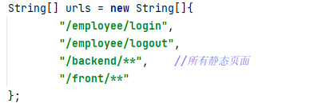
							- （3）设置路径匹配器PATH_MATCHER
							  collapsed:: true
								- 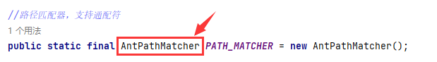
							- （4）定义函数判断URL是否需要放行
							  collapsed:: true
								- 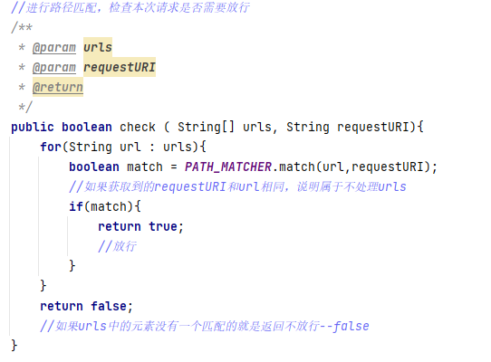
							- （5）判断本次请求是否需要处理
							  collapsed:: true
								- 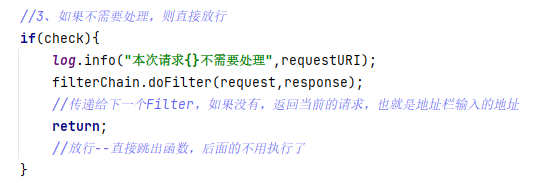
							- （6）判断登录状态，如果已登录，则直接放行
							  collapsed:: true
								- 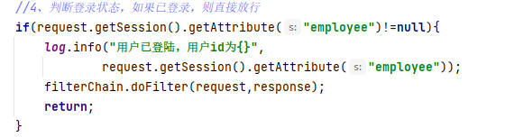
							- （7）如果未登录就返回未登陆结果
							  collapsed:: true
								- 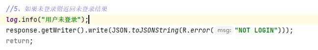
						- Note
						  collapsed:: true
							- **AntPathMatcher 接口**
							  collapsed:: true
								- https://cloud.tencent.com/developer/article/1840091
								- ```
								  // Since: 1.2
								  public interface PathMatcher {
								  	boolean isPattern(String path);
								  	boolean match(String pattern, String path);
								  	boolean matchStart(String pattern, String path);
								  	String extractPathWithinPattern(String pattern, String path);
								  	Map<String, String> extractUriTemplateVariables(String pattern, String path);
								  	Comparator<String> getPatternComparator(String path);
								  	String combine(String pattern1, String pattern2);
								  }
								  ```
								- **boolean isPattern(String path)**：判断path是否是一个模式字符串
								- **boolean match(String pattern, String path)**：最重要的方法。判断path和模式pattern是否匹配，**后者是前端取到的值**
								- **boolean matchStart(String pattern, String path)**：判断path是否和模式pattern前缀匹配（前缀匹配：path的前缀匹配上patter了即可，当然全部匹配也是可以的）
								- **String extractPathWithinPattern(String pattern, String path)**：返回和pattern模式真正匹配上的那部分字符串。举例： `/api/yourbatman/*.html` 为pattern， `/api/yourbatman/form.html` 为path，那么该方法返回结果为 `form.html` （注意：返回结果永远不为null，可能是空串）
								- 正则表达式
								- Ant风格
						- 前端调试
						  collapsed:: true
							- 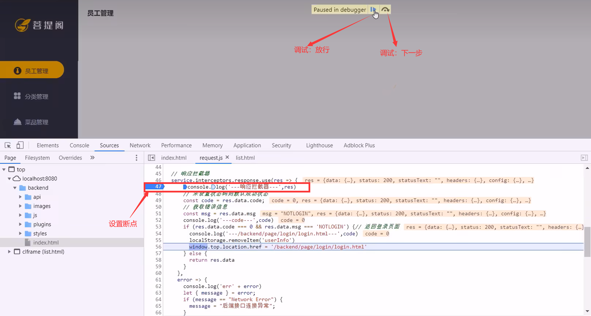
							-
				- # 新增员工
				  collapsed:: true
					- 需求分析
					  collapsed:: true
						- 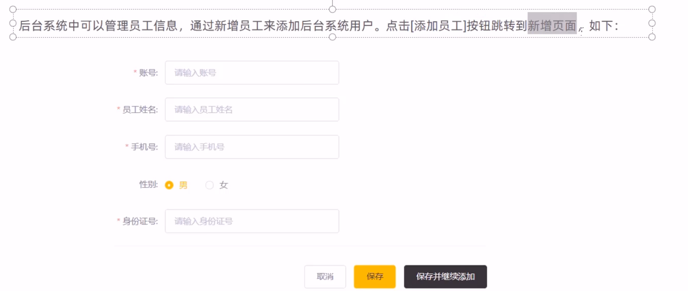
					- 数据模型
					  collapsed:: true
						- 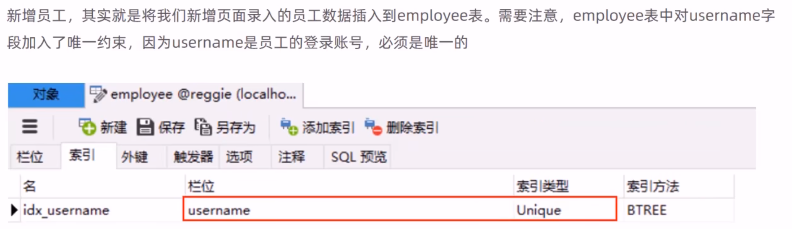
						- 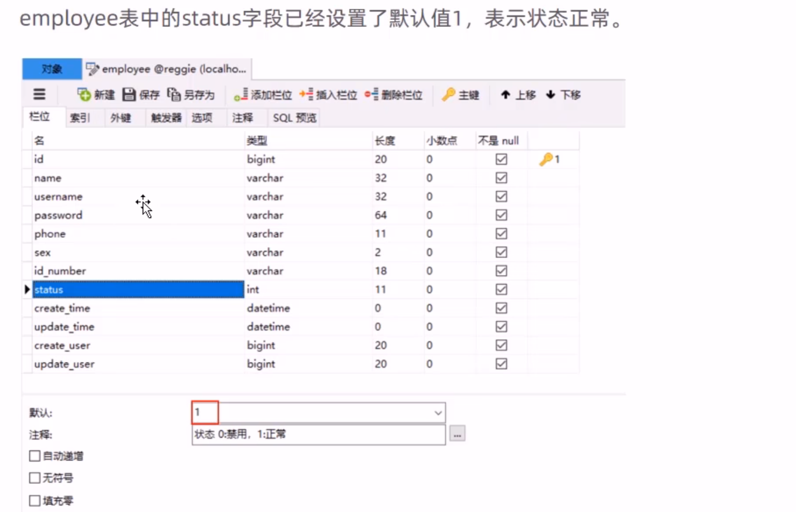
					- 代码实现
					  collapsed:: true
						- 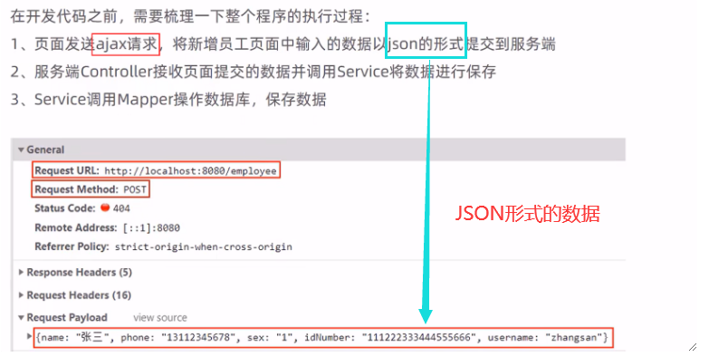
						  id:: 64190386-c478-46bb-a8a8-9057656cf5b3
						- 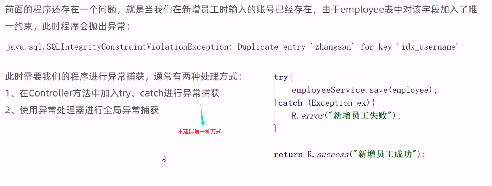
						- 【1】Controller：com/itheima/reggie/controller/EmployeeController.java
						  collapsed:: true
							- Note:
							  collapsed:: true
								- getBytes()
								  collapsed:: true
									- 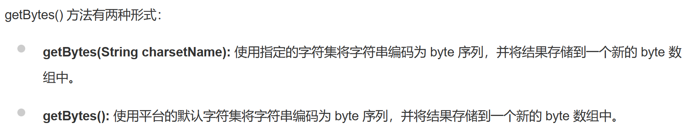
							- 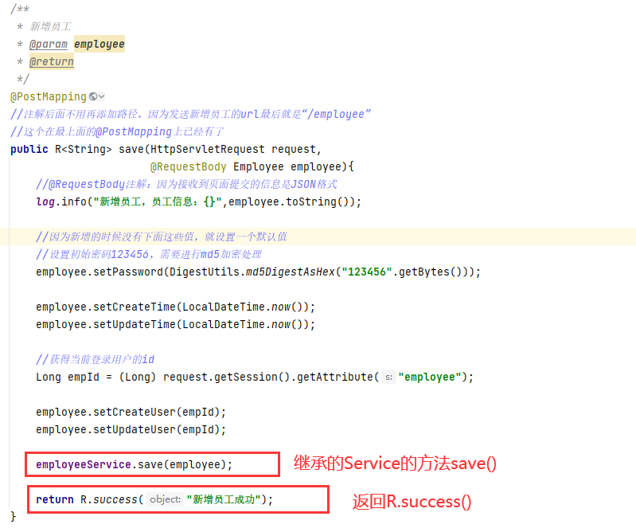
						- 【2】GlobalExceptionHandler--全局异常捕获：com/itheima/reggie/common/GlobalExceptionHandler.java
						  collapsed:: true
							- Note：
							  collapsed:: true
								- @RestController：
								  collapsed:: true
									- https://www.cnblogs.com/yaqee/p/11256047.html
									- 
								- @ControllerAdvice
								  collapsed:: true
									- 通知，指定拦截的controller
									- annotions意思是：拦截带有RestController注解的controller
								- @ResponseBody
								  collapsed:: true
									- 返回数据封装成JSON，返回是数据而不是跳转页面
							- 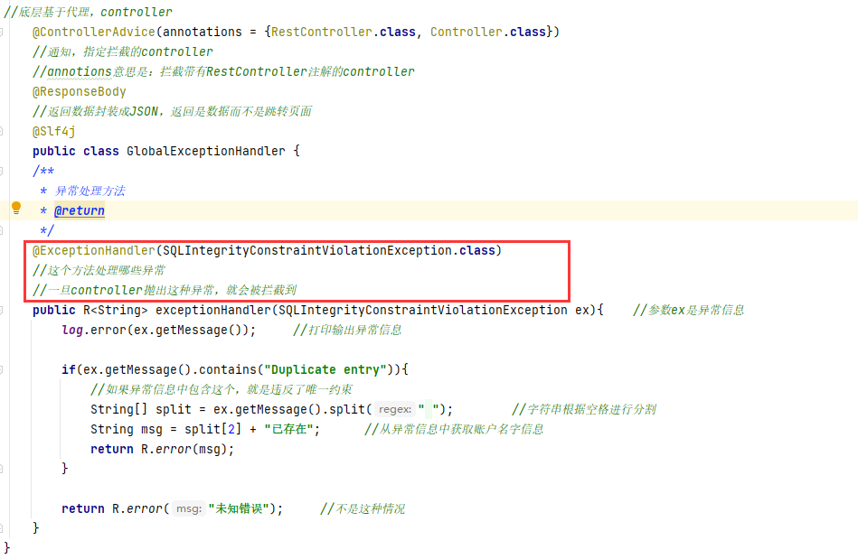
				- # 员工信息分页查询
				  collapsed:: true
					- 代码开发
					  collapsed:: true
						- 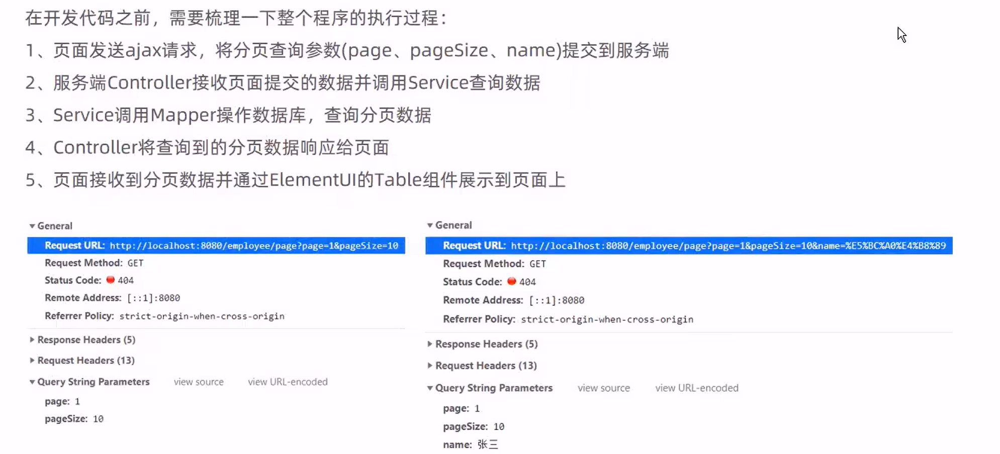
						- 【1】配置类：MybatisPlusConfig：com/itheima/reggie/config/MybatisPlusConfig.java
						  collapsed:: true
							- 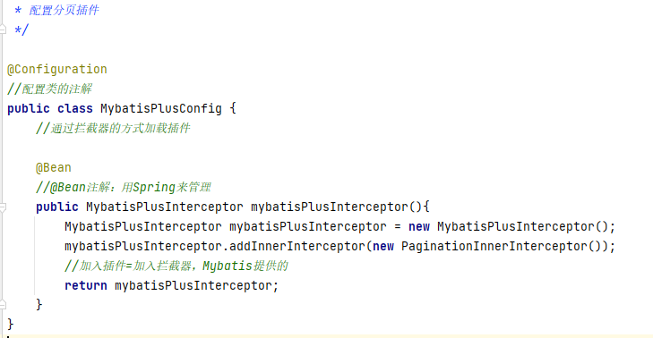
						- 【2】Controller：com/itheima/reggie/controller/EmployeeController.java
						  collapsed:: true
							- 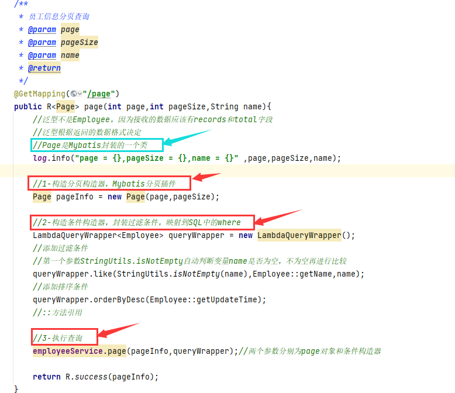
					- 需求分析：
					  collapsed:: true
						- member/list.html
						  collapsed:: true
							- created()函数：
							  collapsed:: true
								- 是vue内置的函数，（钩子？）,生命周期函数，vue组件加载完毕就执行，当有一些函数需要它在加载完就执行的可以写在created()中
				- # 启用禁用员工账号
				  collapsed:: true
					- 需求分析
					  collapsed:: true
						- 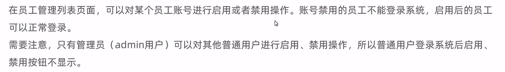
						- 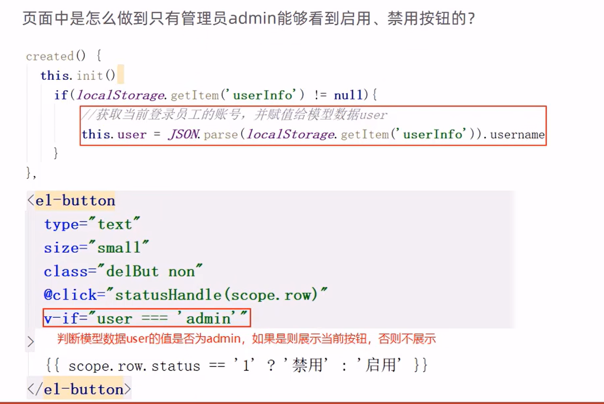{:height 383, :width 569}
						- 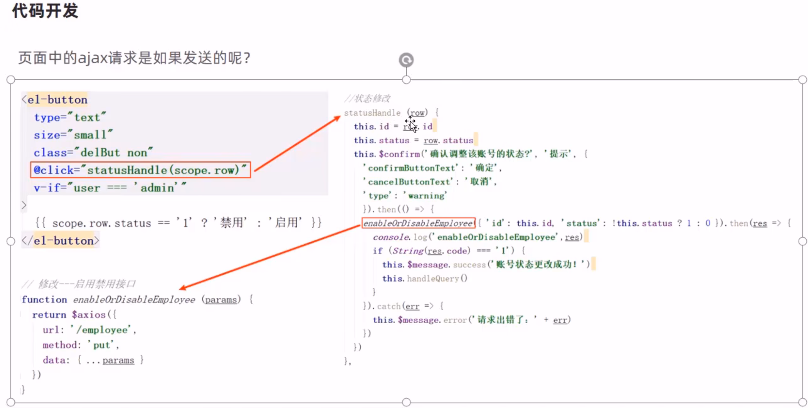
					- 代码开发
						- 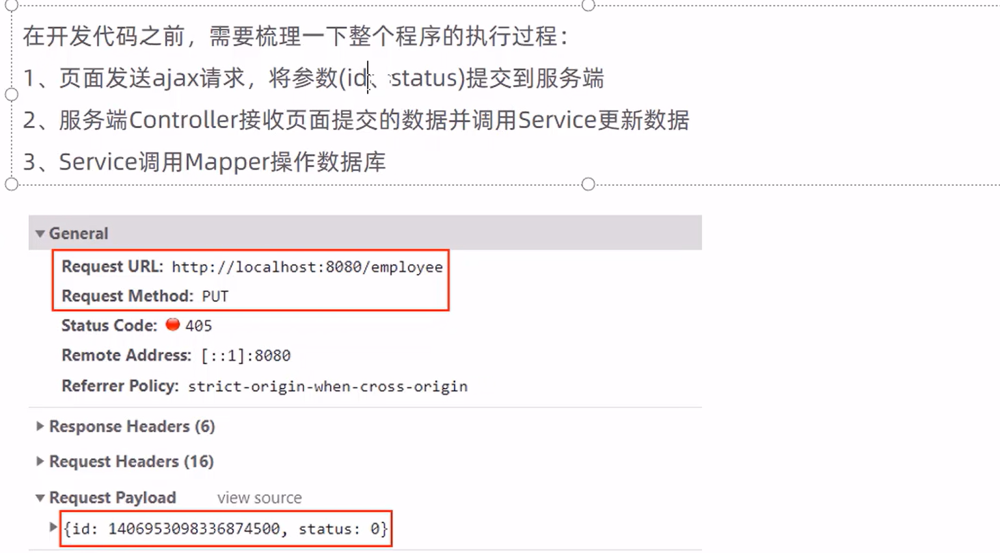
						- 
						- 
						- 【1】com/itheima/reggie/controller/EmployeeController.java
						  collapsed:: true
							- 
						- 【2】代码修复：Java对象序列化：com/itheima/reggie/common/JacksonObjectMapper.java--复制
						- 【3】代码修复：消息转换器：com/itheima/reggie/config/WebMvcConfig.java
							- 消息转换器是在加载之后就自动执行的
							- 
					- 代码修复
						- 
						- 页面js的问题：js只能保证前16位的精度，丢失精度，导致提交的id和数据库中对不上
						- 解决方法：把数字long型变成字符串string处理--Java对象序列化
						- 
						-
				- # 编辑员工信息
				  collapsed:: true
					- 需求分析
					  collapsed:: true
						- 发送两次ajax
						- 
					- 代码开发
					  collapsed:: true
						- 
						- 【1】根据id查询员工信息Controller-com/itheima/reggie/controller/EmployeeController.java
						  collapsed:: true
							- 
						- 【2】前端逻辑
						  collapsed:: true
							- add.html
							  collapsed:: true
								- 
							- index.js
							  collapsed:: true
								- 
							- member.js
							  collapsed:: true
								- 
				- # 员工公共字段自动填充
				  collapsed:: true
					- --> 为Mybatis Plus提供的功能
					- 问题分析
					  collapsed:: true
						- 
					- 代码实现
					  collapsed:: true
						- 
						- 【1】在实体类中加入注解指定填充策略：com/itheima/reggie/entity/Employee.java
						  collapsed:: true
							- 
						- 【2】自定义元数据对象处理器：com/itheima/reggie/common/MyMetaObjecthandler.java
						  collapsed:: true
							- 
							- 
							- {:height 366, :width 681}
					- 功能完善
					  collapsed:: true
						- 自定义元数据对象处理器不能获取request和response和当前登录用户
						  collapsed:: true
							- 
							- 
							- 
							- 
							- 
						- 【1】com/itheima/reggie/common/BaseContext.java
						  collapsed:: true
							- 
							- 
						- 【2】com/itheima/reggie/filter/LoginCheckFilter.java
						  collapsed:: true
							- 
						- 【3】com/itheima/reggie/common/MyMetaObjecthandler.java
						  collapsed:: true
							- 
				- # 菜品新增分类
				  collapsed:: true
					- 需求分析
					  collapsed:: true
						- 
						- 
					- 数据模型
					  collapsed:: true
						- 
						- {:height 173, :width 560}
					- 代码开发
					  collapsed:: true
						- 
						- 【1】复制--com/itheima/reggie/entity/Category.java
						- 【2】复制--src/main/java/com/itheima/reggie/mapper/CategoryMapper.java
						- 【3】继承于IService接口--CategoryService：com/itheima/reggie/service/CategoryService.java
						  collapsed:: true
							-
						- 【4】继承于ServiceImpl并且实现Category接口--CategoryServiceImpl：com/itheima/reggie/service/impl/CategoryServiceImpl.java
						- 【5】创建CategoryController：com/itheima/reggie/controller/CategoryController.java
						- 
						- 【6】补充CategoryController：com/itheima/reggie/controller/CategoryController.java
						  collapsed:: true
							- 分析list.html：回调res只用到了code属性==>返回类的R对象的泛型为<String>
							- 
				- # 菜品分类信息分类查询
				  collapsed:: true
					- 需求分析
					  collapsed:: true
						- {:height 219, :width 442}
					- 代码开发
					  collapsed:: true
						- 
						- 【1】在Controller中创建分页方法：com/itheima/reggie/controller/CategoryController.java
						  collapsed:: true
							- 
				- # 菜品删除分类
				  collapsed:: true
					- 需求分析
					  collapsed:: true
						- 
					- 代码开发
					  collapsed:: true
						- 
						- 【1】com/itheima/reggie/controller/CategoryController.java
						  collapsed:: true
							- 
					- 功能完善
					  collapsed:: true
						- 
						- 【1】CategoryService：com/itheima/reggie/service/CategoryService.java
						  collapsed:: true
							- 
						- 【2】CategoryServiceImpl：com/itheima/reggie/service/impl/CategoryServiceImpl.java
						  collapsed:: true
							- 
							- 
						- 【3】自定义业务异常类：com/itheima/reggie/common/CustomException.java
						  collapsed:: true
							- 
						- 【4】全局异常处理器：com/itheima/reggie/common/GlobalExceptionHandler.java
						  collapsed:: true
							- 
						- 【5】com/itheima/reggie/service/impl/CategoryServiceImpl.java
						  collapsed:: true
							- 
						-
				- # 修改菜品分类
				  collapsed:: true
					- 需求分析
					  collapsed:: true
						- 
						- 页面为什么可以自动回显-target/classes/backend/page/category/list.html
						  collapsed:: true
							- Vue
							- 
					- 代码开发
					  collapsed:: true
						- 提交过来的数据只需要通过id修改即可
						- 【1】com/itheima/reggie/controller/CategoryController.java
						  collapsed:: true
							- 
						- Note：
						  collapsed:: true
							- 修改的菜品有些字段进行自动填充：
							- com/itheima/reggie/entity/Category.java
							- 
				- # 文件上传下载
				  collapsed:: true
					- 文件上传介绍
					  collapsed:: true
						- 
						- Element UI基于form表单
						- 
						- 服务端
						- 
						-
					- 文件下载介绍
					  collapsed:: true
						- 
						- 展示在页面其实就是文件下载在浏览器打开，本质上还是流的操作
						-
					- 文件上传代码实现
					  collapsed:: true
						- ‘
						- 【1】Controller：com/itheima/reggie/controller/CommonController.java
						  collapsed:: true
							- 
							- 
							- 
						- 【2】BasePath配置：src/main/resources/application.yml
						  collapsed:: true
							- 
					- 文件下载代码实现
					  collapsed:: true
						- 逻辑流程：
						  collapsed:: true
							- 【1】img标签先发请求将文件上传到服务端--在controller中进行处理【upload函数】，临时路径转存了
							- 【2】img标签指定src属性，页面向这个地址（用这个地址向服务端）发送请求，请求服务端下载回来
							  collapsed:: true
								- 这个imgurl是网页上的一个模型数据
								- 文件保存在服务器或者云端
							- 【3】然后服务端通过输出流的方式写回页面【Controller写入download函数处理这个请求】，经过img标签展示出来
							  collapsed:: true
								- 
								- 上传完成之后进行展示
								- target/classes/backend/page/demo/upload.html
								- 
								  collapsed:: true
									-
						- 代码流程：
						  collapsed:: true
							- 【1】Controller：com/itheima/reggie/controller/CommonController.java
				- # 新增菜品
				  collapsed:: true
					- 需求分析
					  collapsed:: true
						- 
						- 
						- 
					- 数据模型
					  collapsed:: true
						- 
					- 代码开发
					  collapsed:: true
						- 
						- 
						- 
						- 【1】CategoryController处理前端获取菜品分类数据呈现在下拉框中请求 --> com/itheima/reggie/controller/CategoryController.java
						  collapsed:: true
							- {:height 397, :width 656}
						- 【2】页面请求上传图片--upload函数--com/itheima/reggie/controller/CommonController.java
						- 【3】页面请求下载图片--download()--com/itheima/reggie/controller/CommonController.java
						- 【4】新增菜品保存--com/itheima/reggie/controller/DishController.java
						  collapsed:: true
							- 
						- 【5】com/itheima/reggie/service/DishService.java
						  collapsed:: true
							- 方法声明
						- 【6】com/itheima/reggie/service/impl/DishServiceImpl.java
						  collapsed:: true
							- 方法的实现
							- 
							- 
				- # 菜品信息分页查询
				  collapsed:: true
					- 需求分析
					  collapsed:: true
						- 
					- 代码开发
					  collapsed:: true
						- 
						- 【1】1-分页查询：com/itheima/reggie/controller/DishController.java
						  background-color:: #497d46
						  collapsed:: true
							- 
							- 
				- # 修改菜品
				  collapsed:: true
					- 需求分析
					  collapsed:: true
						- 
					- 代码开发
					  background-color:: #497d46
					  collapsed:: true
						- 
						- **第二步：根据id查询当前菜品信息**
						- 【1】根据id查询菜品信息和对应的口味信息：com/itheima/reggie/controller/DishController.java
						  collapsed:: true
							- 
						- 【2】DishService中扩展方法getByIdWithFlavor：com/itheima/reggie/service/DishService.java
						  collapsed:: true
							- 
						- 【3】在实现类中实现方法getByIdWithFlavor：com/itheima/reggie/service/impl/DishServiceImpl.java
						  collapsed:: true
							- 
							-
						- **第四步：保存修改后的相关菜品数据**
						- 【4】Controller中的修改更新方法：com/itheima/reggie/controller/DishController.java
						  collapsed:: true
							- 
							- Note：如果需要同时对一个表进行操作，就需要在对应的Service中扩展方法，然后在对应的ServiceImpl中进行实现
						- 【5】DishService中的对新增方法的声明：com/itheima/reggie/service/DishService.java
						  collapsed:: true
							- 
						- 【6】对新增方法的实现：com/itheima/reggie/service/impl/DishServiceImpl.java
						  collapsed:: true
							- 
				- # 新增套餐
				  collapsed:: true
					- 需求分析
					  collapsed:: true
						- 
					- 数据模型
					  collapsed:: true
						- 
					- 代码开发
					  collapsed:: true
						- {:height 324, :width 975}
						- 
						- **第三个过程**：根据条件查询对应的菜品数据
						- 【1】在Controller中提供list方法：com/itheima/reggie/controller/DishController.java
						  collapsed:: true
							- 
							- Note：Service的list方法传入的参数就是一个添加了判断条件的条件构造器queryWapper
						- **第六个过程**
						- 【1】com/itheima/reggie/controller/SetmealController.java
						  collapsed:: true
							- 
							- 参数传进来的格式setMealDto
							  collapsed:: true
								- 
						- 【2】com/itheima/reggie/service/SetmealDishService.java
						  collapsed:: true
							- 
						- 【3】com/itheima/reggie/service/impl/SetmealServiceImpl.java
						  collapsed:: true
							- {:height 308, :width 488}
					- # 套餐分页查询
					  collapsed:: true
						- 需求分析
						  collapsed:: true
							- 
						- 代码开发
						  collapsed:: true
							- 
							- 【1】套餐分页查询：com/itheima/reggie/controller/SetmealController.java
							  collapsed:: true
								- 
								- 
				- # 删除套餐
				  collapsed:: true
					- 需求分析
					  collapsed:: true
						- 
					- 代码开发
					  collapsed:: true
						- 
						- 【1】com/itheima/reggie/controller/SetmealController.java
						  collapsed:: true
							-
						- 【2】扩展方法：com/itheima/reggie/service/SetmealService.java
						- 【3】com/itheima/reggie/service/impl/SetmealServiceImpl.java
						  collapsed:: true
							- 
							- 
				- # 短信发送
				  collapsed:: true
					- 短信服务介绍
					  collapsed:: true
						- 
						- 
						- 
						- 
						- 腾讯云审核只要有备案了的网站，或者上线了的个人小程序都能过
						- 
						- 
						- 
						- 
						- 
						- 
						- 
					- 代码开发
					  collapsed:: true
						- 短信服务开发
						  collapsed:: true
							-  阿里云短信服务注册
							- 
							- 
							- 
						- 导入工具类
						  collapsed:: true
							- com/itheima/reggie/utils/SMSUtils.java
						- 修改依赖文件pom.xml
						  collapsed:: true
							- 
				- # 手机验证码发送
				  collapsed:: true
					- 需求分析
					  collapsed:: true
						- 
					- 数据模型
					  collapsed:: true
						- 
					- 代码开发
					  collapsed:: true
						- 
						- {:height 301, :width 640}
						- 
						- 
						-
						- 【1】com/itheima/reggie/filter/LoginCheckFilter.java
						- 【2】处理验证码发送请求：com/itheima/reggie/controller/UserController.java
						  collapsed:: true
							- 
						- 【3】处理登录请求（自己进行了修改）：com/itheima/reggie/controller/UserController.java
						  collapsed:: true
							- 
							- 
							-
				- # 导入用户地址簿
				  collapsed:: true
					- 需求分析
					  collapsed:: true
						- 
					- 数据模型
					  collapsed:: true
						- {:height 501, :width 769}
						-
					- 代码开发
					  collapsed:: true
						- 
						- 【1】com/itheima/reggie/controller/AddressBookController.java
				- # 菜品展示
				  collapsed:: true
					- 需求分析
					  collapsed:: true
						- 
					- 代码开发
					  collapsed:: true
						- 
						- 【1】已经完成list方法：展示分类：com/itheima/reggie/controller/CategoryController.java
						- 【2】部分完成list方法：根据分类条件查询对应菜品：默认显示的就是第一个分类下的菜品
						  collapsed:: true
							- com/itheima/reggie/controller/DishController.java
							- 但是此时展示的菜品数据没有口味数据 --> 所以返回对象是dishDto
							- 新建一个list函数
							- 
							- 
							-
						- 【3】套餐的list方法：com/itheima/reggie/controller/SetmealController.java
						  collapsed:: true
							- 
				- # 购物车功能
				  collapsed:: true
					- 需求分析
					  collapsed:: true
						- 
					- 数据模型
					  collapsed:: true
						- 
					- 代码开发
					  collapsed:: true
						- 
						- 
						- 【1】将菜品或者套餐添加进购物车中：com/itheima/reggie/controller/ShoppingCartController.java
						  collapsed:: true
							- （1）设置用户id，指定当前是哪个用户的购物车数据
							- （2）查询当前菜品或者套餐是否在购物车中
							- 
							- 
						- 【2】查询购物车信息：com/itheima/reggie/controller/ShoppingCartController.java
						  collapsed:: true
							- 
						- 【3】删除购物车信息：com/itheima/reggie/controller/ShoppingCartController.java
						  collapsed:: true
							- 
				- # 用户下单
				  collapsed:: true
					- 需求分析
					  collapsed:: true
						- 
					- 数据模型
					  collapsed:: true
						- 
						- 
					- 代码开发
					  collapsed:: true
						- 
						- 
						- 【1】用户下单：com/itheima/reggie/controller/OrderController.java
						  collapsed:: true
							- 
						- 【2】用户下单-扩展方法（操作不止一个表）：com/itheima/reggie/service/OrderService.java
						  collapsed:: true
							- com/itheima/reggie/service/impl/OrderServiceImpl.java
							- 
							- 
							- 
							- 
				- Nginx
				  collapsed:: true
					- 静态资源、服务器
				- 优化——————————————————
				  collapsed:: true
					- 路径E:\我的文件_E\开发准备\2-project\瑞吉外卖-资料\5 瑞吉外卖项目优化篇\5 瑞吉外卖项目优化篇\代码\day01\reggie_take_out\reggie_take_out
					- git管理代码
					- 环境搭建
					  collapsed:: true
						- maven坐标 --pom.xml依赖
						- 配置文件
						  collapsed:: true
							- {:height 256, :width 484}
						- 配置类--建议
						  collapsed:: true
							- 
					-
				- # 缓存信息验证码
				  collapsed:: true
					- ## 实现思路
					  collapsed:: true
						- 
					- ## 代码改造
					- ## 功能测试
					-
				- # 缓存菜品数据-Redis
				  collapsed:: true
					- ## Redis-实现思路
					  collapsed:: true
						- 每发一次请求就要查询一次数据库，增加数据库压力
						- 缓存菜品按照分类
						- 
						- 脏数据：访问的缓存跟数据库不一致
					- ## Spring Cache实现思路
					  collapsed:: true
						- ### Spring Cache介绍
						  collapsed:: true
							- #### 【1】介绍--通过注解方式实现缓存--CacheManager
							  collapsed:: true
								- 
							- #### 【2】常用注解
							  collapsed:: true
								- 
							- #### 【3】使用方式
							  collapsed:: true
								- （1）在usecontroller中增加cacheManager
								  collapsed:: true
									- 
								- 
								- （2）启动类添加@EnableCashing
								- （3）相应的方法中添加要用的功能对应注解
								  collapsed:: true
									- 
									- @CachePut
									  collapsed:: true
										- {:height 234, :width 707}
									- @CacheEvict
									-
						- ### 代码改造-redis
						  collapsed:: true
							- 
							- 
							-
				- # 主从复制+读写分离
				  collapsed:: true
					- 问题分析
					  collapsed:: true
						- 
						- 
						-
					- ## MySql主从复制
					  collapsed:: true
						- ### 介绍
						  collapsed:: true
							- 
						- ### 配置
						  collapsed:: true
							- 
							- 
							- 
							- 
							- 
							- 
							- 
							- 
							- 
							-
					- ## 读写分离案例
					  collapsed:: true
						- ### 背景
						  collapsed:: true
							- 
						- ### Sharding-JDBC介绍
						  collapsed:: true
							- 
						- ### 入门案例
						  collapsed:: true
							- {:height 192, :width 563}
							- 完成主从复制的配置，操作user表
							- 【1】maven：pom.xml
							  collapsed:: true
								- 
							- 【2】5 瑞吉外卖项目优化篇\资料\\day02\\rw_demo\\src\\main\\resources\\application.yml
							  collapsed:: true
								- 从库可以有多个
							- 【3】5 瑞吉外卖项目优化篇\资料\\day02\\rw_demo\\src\\main\\resources\\application.yml
							  collapsed:: true
								- 
					- ## 项目实现
					  collapsed:: true
						- ### 数据库环境准备
						  collapsed:: true
							- 
							- 只要操作主库，从库就会去复制
						- ### 代码改造
						  collapsed:: true
							- 
							-
				- # Nginx【中间件】
				- # 前后端分离
				  collapsed:: true
					- 问题：效率低
					- ## 前后端分离开发
					  collapsed:: true
						- ### 介绍
						  collapsed:: true
							- {:height 186, :width 614}
						- ### 流程
						  collapsed:: true
							- {:height 355, :width 685}
							- {:height 480, :width 448}
						- ### 前端技术栈（了解）
						  collapsed:: true
							- {:height 266, :width 584}
							- mock用来模拟数据测试
							- webpack打包
					- ## Yapi
					  collapsed:: true
						- ### 介绍
						  collapsed:: true
							- {:height 224, :width 660}
						- ### 使用方式
						  collapsed:: true
							- {:height 246, :width 639}
							- {:height 345, :width 704}
							- 
							- 
					- ## Swagger
					  collapsed:: true
						- ### 介绍
						  collapsed:: true
							- 
						- ### 使用方式
						  collapsed:: true
							- 
							- 【1】----------------------------
							- 
							- 【2】-------------------------一些关于项目的描述配置
							- 
							- 
							- 【3】--------------------------------------设置静态资源映射
							- 
							- 
							- 【4】------------------------设置不需要处理的请求路径
							- 
						- ### 测试
						  collapsed:: true
							- 
							- 对项目中的各个类进行方法的扫描，汇总出所有的请求及其对应json消息响应
							- 生成接口文档
						- ### 常用注解
						  collapsed:: true
							- 
							- 
							- 
					- ## 项目部署
					  collapsed:: true
						- ### 部署架构
						  collapsed:: true
							- {:height 403, :width 471}
						- ### 部署环境说明
						  collapsed:: true
							- 
							-
						- ### 前端部署
						  collapsed:: true
							- 
							- **dist目录**：前端项目打包之后的
							- 
							- 
							- 然后nginx -s reload
							- 最后启动nginx服务
							- 
							-
						- ### 后端部署
						  collapsed:: true
							- 
							- 
							- {:height 446, :width 574}
							- 
							- 进行相应的改造
							- 
							- 推送
							- 重新执行脚本文件
							-
					- 
					- collapsed:: true
						-
			- 复习
				-
			-
		- 商城
		  collapsed:: true
			- 知识点：
			- 环境配置
				- Vagrant创建linux虚拟机
				  collapsed:: true
					- cmd： 
					- 创建centos/7： 
						- 
					- 启动：  或者直接图形界面【右键启动】
						- 下载过慢：
						- https://blog.csdn.net/weixin_42302291/article/details/107271267
						- https://blog.csdn.net/padawan75/article/details/107520914
					- 远程连接虚拟机： 
					- 查看用户：`whoami`
					- 查看所有文件：`ls /`
					- 退出：`exit`
					- 关机：图形界面-右键退出
				- 虚拟机网络设置
				  collapsed:: true
					- 介绍
					  collapsed:: true
						- {:height 251, :width 455}
					- 端口映射-图形界面【每在VM中安装一个软件就要进行一次端口映射】
					  collapsed:: true
						- 
					- 端口映射-VM固定的IP地址设置【方法1】
					  collapsed:: true
						- 原因：VM的IP地址不是固定ip，不方便
						- 操作Vagrantfile文件：
							- 
						- windows:  ipconfig查看电脑上的VM_only的ip
						- 检查：在windows和VM上分别进行ping对方的ip
							- 
							- 怎么查看自己电脑ip
								- 【方法1】
									- https://blog.csdn.net/active2489595970/article/details/83793038#:~:text=1%20%E9%A6%96%E5%85%88%E7%82%B9%E5%87%BBWindows%E5%9B%BE%E6%A0%87%202,%E7%84%B6%E5%90%8E%E5%9C%A8%E5%AF%B9%E8%AF%9D%E6%A1%86%E4%B8%AD%E8%BE%93%E5%85%A5CMD%EF%BC%8C%E6%8C%89%E4%B8%8B%E5%9B%9E%E8%BD%A6%203%20%E7%AD%89%E8%BF%9B%E5%85%A5%E5%91%BD%E4%BB%A4%E7%AA%97%E5%8F%A3%E4%B9%8B%E5%90%8E%EF%BC%8C%E8%BE%93%E5%85%A5%EF%BC%9Aipconfig%2Fall%20%EF%BC%8C%E6%8C%89%E4%B8%8B%E5%9B%9E%E8%BD%A6%E5%8D%B3%E5%8F%AF%E7%9C%8B%E5%88%B0%E7%9D%80%E6%95%B4%E4%B8%AA%E7%94%B5%E8%84%91%E7%9A%84ip%E8%AF%A6%E7%BB%86%E4%BF%A1%E6%81%AF
								- 【方法2】ipconfig
									- 
									-
					- VM端口通信和IP通信
						- 
						- 
				- linux安装docker
				  collapsed:: true
					- docker到仓库中下载镜像，直接基于镜像启动容器，就相当于一个系统，容器之间互相隔离
					- 官方文档：社区版  --  【步骤】课件PDF
					- 【注意】权限不足 前面加sudo
				- docker配置镜像加速
				  collapsed:: true
					- ```
					  https://cr.console.aliyun.com/cn-hangzhou/instances/mirrors
					  ```
					- 
					- 
				- docker安装mysql
				  collapsed:: true
					- 安装完毕： {:height 60, :width 804}
					- 切换root： 
					  collapsed:: true
						- password：vagrant
					- 创建实例并启动：
					  collapsed:: true
						- 
						- 
					- 查看当前正在运行的容器： docker ps
					- 【关键】：连接MySQL
					  collapsed:: true
						- 
						- {:height 224, :width 360}
						-
					- 进入mysql容器文件系统：`docker exec -it mysql /bin/bash`
					  id:: 646d6975-425f-4e87-a55d-c793b42ca413
					  collapsed:: true
						- 
						- 
						- 
					- 进入vagrant环境中：
					  collapsed:: true
						- 
					- 配置Mysql：PDF【MySQL配置】
					- 重启mysql：`docker restart mysql`
					- 启动mysql：`docker start mysql`
				- docker安装redis
				  collapsed:: true
					- 直接进入redis，而不是bash控制台（默认持久化：数据从内存保存到硬盘）
					- 连接上redis管理工具（不用用户名和密码）
				- 开发工具和环境安装配置
				- 配置git-ssh
				  collapsed:: true
					- git bash配置
					  collapsed:: true
						- {:height 542, :width 770}
				- 项目结构创建+提交到码云
					-
				- 数据库初始化
				-
			- 快速开发
			- 分布式组件
			- 前端基础
				- ES6
				- Vue
			- 商品服务
				- API
					- 三级分类
					- 品牌管理
					- 属性分组
					- 平台属性
					- 新增商品
					- 仓库管理
			- 全文检索
				- ElasticSearch【问的少】
			- 商城业务
				- 商品上架
				- 首页
				- nginx
			- 性能压测
				- 压力测试
				- 性能监控
				- 优化
			- 缓存
				- 缓存使用
				- 分布式锁
				- SpringCache
			- 商城业务
				- 检索服务
				- 异步
				- 商品详情
				- 认证服务
				- 购物车
				- 消息队列
				- 订单服务
				- 分布式事务
				- 订单服务
				- 支付
				- 订单服务2
				- 秒杀服务
			- Sentinel
			- Sleuth
		- 秒杀
			- `E:/我的文件_E/开发准备/2-project/Sec_Kill/seckill_demo-master/seckill_demo-master/document/Java秒杀方案.pdf`
			- 介绍
			  collapsed:: true
				- 
			- #### 创建步骤
			  collapsed:: true
				- 选择Spring initial新建
				- pom.xml
				- application.yml
				- 目录构建
				- 启动类@MapperScan
				- 测试controller：democontroller
					- @controller
					- @requestmapping
				- 构建hello.html
				-
			- 项目报错：
			  collapsed:: true
				- （1）mysql依赖报错：导入新的mysql依赖，可能是旧版本已经不适用
			- 1-两次MD5加密
			  collapsed:: true
				- 什么时候？
				  collapsed:: true
					- （1）用户端输入明文密码传入后端时候
						- 防止用户密码在传输过程中明文传输
					- （2）在后端接收数据之后、存入数据库之前
						- 防止数据库被盗用之后还原密码（根据salt和密文）
				- 操作步骤：
				  collapsed:: true
					- （1）数据库构建
					- （2）MD5依赖
					- （3）MD5Util工具类
			- #### 2-逆向工程-准备工作
			  collapsed:: true
				- （1）新建项目
				- （2）启动类
				- （3）Mabatis依赖--pom.xml
				  collapsed:: true
					- https://baomidou.com/pages/d357af/#%E6%B7%BB%E5%8A%A0%E4%BE%9D%E8%B5%96
				- （4-1）逆向工程工具类【不能用】
					- 报错解决：
					- https://blog.csdn.net/weixin_42396266/article/details/124162287
					- https://gitee.com/guizhizhe/code-generator/blob/master/src/main/java/com/generator/generator/CodeGenerator.java
				- （4-2）代码生成【可用】
					- Mybatis-X和Easy-code
					- https://blog.csdn.net/wnrun/article/details/124274017
					  id:: 64accdfb-17d6-4d47-8ffb-3e5594f5ceec
					- https://blog.csdn.net/Aqting/article/details/123622714
				- （5）启动类@MapperScan
				- （6）postman测试
					- https://blog.csdn.net/m0_61843874/article/details/123324727
					- https://blog.csdn.net/fxbin123/article/details/80428216
				- （7）静态资源
				- （8）枚举类和公共返回对象实体类
			- #### 3-登录功能开发
			  collapsed:: true
				- （1）页面测试-thymeleaf方式
				  collapsed:: true
					- 步骤
						- 1-依赖导入
						- 2-yml配置文件
						- 3-用thymeleaf模板创建html
						- 4-controller中进行路径映射【注意】
							- 【注意】
							- return 的字符串是对应html的路径
				- （2）页面测试-jsp方式
				  collapsed:: true
					- 步骤：
					  collapsed:: true
						- 1-在  `src/main/webapp/WEB-INF`  目录下创建一个名为  `login.jsp`  的 JSP 文件
						- 2-在  `login.jsp`  文件中添加以下代码：
						  collapsed:: true
							- ```
							  <%@ page language="java" contentType="text/html; charset=UTF-8"
							      pageEncoding="UTF-8"%>
							  <!DOCTYPE html>
							  <html>
							  <head>
							      <meta charset="UTF-8">
							      <title>Login测试</title>
							  </head>
							  <body>
							      <h1>Returned Value: <%= request.getAttribute("login") %></h1>
							  </body>
							  </html>
							  ```
						- 3-controller
						  collapsed:: true
							- ```
							  @RequestMapping("/toLogin")
							  public ModelAndView toLogin() {
							      ModelAndView modelAndView = new ModelAndView("login");
							      modelAndView.addObject("login", "success");
							      return modelAndView;
							  }
							  ```
				- （3）vo对象用来传递接收的登陆参数
				- （4）controller 中
					- doLogin函数
					- 注入service，跳转到service层
				- （5）service层接口和实现类分别添加逻辑doLogin抽象方法和重写方法【】
					- 【注意】：实现类中重写的方法设成public
					  background-color:: #787f97
				- （6）校验类LoginUtil--ValidatorUtil
			- #### 4-参数校验
				- （1）依赖
					- ```
					  <!--        参数校验-->
					          <dependency>
					              <groupId>org.springframework.boot</groupId>
					              <artifactId>spring-boot-starter-validation</artifactId>
					          </dependency>
					  ```
				- （2）controller方法参数前面加注解@Valid
					- 后面实体类参数前面加的注解才会生效
				- （3）vo类参数前面加注解
					- ```
					  @NotNull
					  @Length(min=32)
					  ```
				- （4）创建自定义校验组件isMobile【@interface】
				  background-color:: #787f97
					- ```
					  @Constraint(
					          validatedBy = {isMobileValidator.**class**}
					  )*//**准备一个校验的类**--**校验规则**--**自定义*
					  ```
				- （5）创建自定义校验规则类isMobileValidator（实现ConstraintValidator接口）
					- 重写initalize方法和isValid方法（校验逻辑）
					- 声明required变量来表示校验的这个变量必填还是非必填
				- （6）测试：
					- serviceimpl类中的参数校验部分删掉（在实体类中参数被校验了）
					- 【】：抛出异常但是没有被捕获
			- #### 5-异常处理
				- 步骤
					- （1）全局异常类【继承于RuntimeException】
					- （2）全局异常处理类【异常强转】
					- （3）修改serviceimpl类，return异常可以换成throw new GlobalException(RespBeanEnum.LOGIN.ERROR)
				- springboot全局异常处理方式注解：
					- controlleradvice：只能处理控制器异常
					- errorcontroller--restcontrolleradvice
				- 异常处理方法注解：
					- @exceptionhandler
				-
		-
	- 编程题
	  collapsed:: true
		- 文件路径
		  collapsed:: true
			- ```
			  E:\我的文件_E\开发准备\10-编程笔试\HuaweiJ\HJ16\src\main\java\LeetCode
			  ```
		- 第一阶段：分类型刷题
		  collapsed:: true
			- 笔记：
			  BFS题号写错了～ 102 107 200
			- 1.数据结构：
			  数组Array 485/283/27
			  链表Linked List 203/206
			  队列Queue 933/225（用队列实现栈）/622/641
			  栈stack 20/496/232（用栈实现队列）
			  哈希表Hash table 217/389/496
			  集合set 217/705（设计）
			  堆Heap 215/692
			  树&图
			  2.算法：
			  双指针two pointers 141/344/881
			  二分查找 binary search 704/35/162/74
			  滑动窗口 sliding window（技巧） 209/1456
			  递归 recursion 509/206/344/687
			  分治 divide&conquer 169/53
			  回溯 backtracking 22/78/77/46（全经典）
			  深度优先搜索DFS 938/78/200
			  宽度优先搜索BFS  更改为 102 107 200
			  并查集 union find 200/547/721
			  贪心 greedy 322/1217/55   //322没做出来
			  记忆化搜索（技巧）509/322
			  动态规划 dynamic programm ping 5 09/62/121/70/279/221  /322
			  拓扑排序 topologic sort 207/210
			  前缀树 trie 208/720/692
		- 第二阶段：代码随想录
		- 数据结构
		  collapsed:: true
			- # 数组
			  collapsed:: true
				- ## 性质
				  collapsed:: true
					- ### Arrays的方法
					  collapsed:: true
						- ### Arrays.sort(String str)
						  collapsed:: true
							- #### **HJ14**** 字符串排序**
							  id:: 642c26ee-337c-4248-90e2-e51f9c912427
								- 描述：给定 n 个字符串，请对 n 个字符串按照字典序排列。
								- 方式1：Arrays.sort(String str)利用数组性质排序
								  collapsed:: true
									- ```
									  import java.util.*;
									  
									  public class Main {
									      public static void main(String[] args) {
									          Scanner in = new Scanner(System.in);
									          int length = in.nextInt();
									          String[] str = new String[length];	//给定长度+要排序 --> 优先选择数组
									          for(int i =0;i<length;i++){
									              str[i] = in.next();
									          }
									          Arrays.sort(str);//关键步骤：利用Arrays方法 --> 对数组进行排序，这就是为什么不用集合的原因
									          for(String temp : str){
									              System.out.println(temp);
									          }
									      }
									  }
									  ```
						- ### Arrays.asList 数组转集合
				- ## 题目
				  collapsed:: true
					- 485
					- 283
					- 27
			- # 链表
			  collapsed:: true
				- ## 题目
					- 203
					- 206
			- # 队列
			  collapsed:: true
				- ## 题目
					- 933
					- 225
					- 622 设计循环队列
						- 方法【1】用数组
						- 方法【2】用listNode
					- 641 设计循环双端队列
						- 方法【1】数组
						- 方法【2】双向链表
			- # 栈
			  collapsed:: true
				- ## 题目
					- ### 20 有效的括号
					  collapsed:: true
						- 方法【1】栈
					- ### 469 下一个更大元素
					  collapsed:: true
						- 方法【1】暴力解法
						- 方法【2】单调栈+哈希表
					- ### 232 用栈实现队列
					  collapsed:: true
						- 方法【1】双栈
			- # 哈希表
			  collapsed:: true
				- ## 题目
				  collapsed:: true
					- ### 217 存在重复元素
						- 方法【1】排序
						- 方法【2】哈希表
					- ### 389
						- 方法【1】计数法
						- 方法【2】求和
						- 方法【3】位运算-异或
			- # 集合
			  collapsed:: true
				- ## TreeSet性质
				  collapsed:: true
					- ### **HJ3**** 明明的随机数**
					  collapsed:: true
						- 描述：随机数删掉重复项并且从小到大输出
						- 方式1：利用TreeSet的性质：有序不重复，升序排列
						  collapsed:: true
							- ```
							  import java.util.Scanner;
							  import java.util.TreeSet;
							  public class Main{
							      public static void main(String[] args){
							          Scanner scanner=new Scanner(System.in);
							          while(scanner.hasNext()){
							              TreeSet<Integer> number=new TreeSet<Integer>();
							              int m=scanner.nextInt();
							              if(m>0){
							                  for(int i=0;i<m;i++){
							                      number.add(scanner.nextInt());
							                      //这两步是关键
							                  }
							              }
							              for(Integer i:number){
							                  System.out.println(i);
							              }
							          }
							      }
							  }
							  ```
					- ### **HJ9**** 提取不重复的整数**
					  collapsed:: true
						- 描述：提取不重复的整数
						- 方式1：利用Set的性质：不重复，set.add()执行成功说明当前元素是第一次出现
						  collapsed:: true
							- 注意取余和取整的区别
							- ```
							  import java.util.*;
							  
							  public class Main {
							      public static void main(String[] args) {
							          Scanner in = new Scanner(System.in);
							          while (in.hasNext()) { 
							              int number = in.nextInt();
							              HashSet<Integer> set = new HashSet<Integer> ();
							              while(number!=0){   
							                  int temp = number%10;
							                  if(set.add(temp)){ //如果能加入就是没有重复
							                      System.out.print(temp);
							                  }
							                  number = number/10;
							              }
							          }
							      }
							  }
							  ```
				- ## LinkedHashSet 和 LinkedHashMap !!
				  collapsed:: true
					- 都可以实现去掉重复元素，并且保留原有的顺序
					- LinkedHashSet保留的是第一次出现的元素
					- LinkedHashMap保留的是最后一次出现的元素
					- 如果想存储键值对，去重同时保留元素的第一次实现，用LinkedHashMap，在元素添加的时候增加一个判断map.containsKey(key)
						- {:height 270, :width 743}
				- ## Map性质
				  collapsed:: true
					- ### **HJ5**** 进制转换**
					  collapsed:: true
						- 描述：16进制转10进制
						- 方式1：暴力计算switch（）{case: ...}
						- 方式2：Integer方法，将字符串解析为整数Integer.decode(str)，将字符串中解析为整数 Integer.parseInt(str,16);
						  collapsed:: true
							- ```
							      public static void main(String[] args) {
							          Scanner in = new Scanner(System.in);
							          while (in.hasNext()) {
							              System.out.println(Integer.decode(in.nextLine()));
							          }
							      }
							      //Integer.decode(str)
							  ```
							- ```
							      public static void main(String[] args) {
							          Scanner in = new Scanner(System.in);
							          while (in.hasNext()) {
							              System.out.println(Integer.parseInt(in.nextLine().substring(2),16));
							          }
							      }
							      //Integer.parseInt(str,16);
							  ```
						- 方式3：利用map的get方法和map的字典功能
						  collapsed:: true
							- ```
							  import java.util.*;
							  public class Main {
							      private final static int BASE = 16;
							      private static Map<Character, Integer> map = new HashMap<Character, Integer>() {
							          {
							              put('0', 0);           put('1', 1);            put('2', 2);            put('3', 3);
							              put('4', 4);            put('5', 5);            put('6', 6);            put('7', 7);
							              put('8', 8);            put('9', 9);            put('A', 10);            put('B', 11);
							              put('C', 12);            put('D', 13);            put('E', 14);            put('F', 15);
							              put('a', 10);            put('b', 11);            put('c', 12);            put('d', 13);
							              put('e', 14);            put('f', 15);
							          }
							      };
							  public static int getDec(String number){
							      int res = 0;
							      for(char ch:number.toCharArray()){
							          res=res*BASE+map.get(ch);    //map的get方法
							      }
							      return res;
							  }
							      public static void main(String[] args) {
							          Scanner in = new Scanner(System.in);
							          int dec_number = 0;
							          while (in.hasNext()) {
							              String number_str = in.nextLine().substring(2);
							              int res_dec = getDec(number_str);
							              System.out.println(res_dec);
							          }
							      }
							  }
							  ```
					- ### **HJ8**** 合并表记录**
						- 描述：对表中索引相同的记录进行合并（求和）
						- 案例：
						  collapsed:: true
							- 
						- 方式1：map添加方法是put(key,value)，collection添加方法是add()；从map中取值是value=map.get(key)；在map中查是否存在这个key的方法是map.containsKey(key)，返回一个布尔值，用来合并相同key对应的value。
						  collapsed:: true
							- ```
							  import java.util.*;
							  public class Main {
							      public static void main(String[] args) {
							          Scanner in = new Scanner(System.in);
							          while (in.hasNextInt()) { 
							              int length = in.nextInt();
							              Map<Integer,Integer> table = new HashMap<>(length);
							              for(int i=0;i<length;i++){
							                  int key = in.nextInt();
							                  int value = in.nextInt();
							                  if(table.containsKey(key)){ //table.contains(key)方法
							                      table.put(key,table.get(key)+value);
							                      //table.get(key)方法
							                  }else{
							                      table.put(key,value);
							                  }
							              }
							              for(Integer key:table.keySet()){
							                  System.out.println(key+" "+table.get(key));
							              }
							          }
							      }
							  }
							  ```
					- ### **HJ21 简单密码（密码对应解码）**
						- ```
						  Set<String> keys = map.keySet();
						  for (String k : keys) {
						    if (k.contains(String.valueOf(c))) {
						    	buffer.append(map.get(k));	
						    }
						  }
						  ```
				- ## List性质
				  collapsed:: true
					- ### **HJ13**** 句子逆序**‘
					  collapsed:: true
						- 描述：输入的字符串倒序输出
						- 示例：输入  I am a boy  输出  boy a am I
						- 方式1：利用list.get(i)方法
						  collapsed:: true
							- ```
							  import java.util.*;
							  
							  public class Main {
							      public static void main(String[] args) {
							          Scanner in = new Scanner(System.in);
							          ArrayList<String> list = new ArrayList<String>();
							          while (in.hasNext()) { 
							              String str = in.next();
							              list.add(str);
							          }
							          for(int i = list.size();i>0;i--){
							              System.out.print(list.get(i-1)+" ");
							              //list(i)是错误用法；list.get(i)是正确用法
							          }
							      }
							  }
							  ```
				- ## Queue性质
				  collapsed:: true
					- ### queue的长度控制--要求输出最后8条记录
					  collapsed:: true
						- #### **HJ19 简单错误记录**
						  collapsed:: true
							- ```
							  if (map.get(name) == null) { //name第一次出现
							                  map.put(name, 1); //key:name+num   value:次数
							                  if (queue.size() == 8) { //
							                      queue.poll();//移除队列头--> 保留最后出现的8个
							                  }
							                  queue.add(name);
							              } else {
							                  map.put(name, map.get(name) + 1);
							              }
							              
							  for (String s : queue) {   //用的时候取出
							              System.out.println(s + " " + map.get(s));
							          }
							  ```
				- ## 综合
				  collapsed:: true
					- **HJ25**** 数据分类处理**
						- 一组输入整数序列I和一组规则整数序列R，I和R序列的第一个整数为序列的个数，从R依次中取出R<i>，对I进行处理，找到满足条件的I，并且输出响应的数据
						- ```
						  import java.util.*;
						  /**
						   * @Author: Jiaqi Lv
						   * @Date: 2023/4/15 22:00
						   * @UpdateTime: 2023/4/15 22:00
						   */
						  public class Main {
						      public static void main(String[] args) {
						          Scanner in = new Scanner(System.in);
						  
						          while(in.hasNext()){
						              int N_I = in.nextInt();
						              String[] I = new String[N_I]; //I是字符串数组：需要进行是否包含的判断
						              for(int i=0;i<N_I;i++){
						                  I[i]=String.valueOf(in.nextInt());
						              }
						              int N_R = in.nextInt();
						              Set<Integer> R = new TreeSet<>(); //R是泛型为Integer的TreeSet，因为提到”排序“，”去重“！！！
						              for(int i=0;i<N_R;i++){
						                  R.add(in.nextInt());
						              }
						  
						              //创建两个List用来保存要求打印输出的元素,因为是"按照一定顺序输出”
						              List<Integer> I_list = new ArrayList<>(); //临时
						              List<Integer> R_list = new ArrayList<>(); //保存最终被打印输出的数据
						              for(int item:R){ //可以用基本数据类型遍历包装类为泛型的集合
						                  int count=0;
						                  for(int i=0;i<N_I;i++){
						                      if(I[i].contains(String.valueOf(item))){
						                          count++;  //统计R中元素在I中出现的次数
						                          I_list.add(i);//存入满足条件的I索引
						                          I_list.add(Integer.valueOf(I[i]));//存入满足条件的I本身
						                      }
						                  }
						                  if(count!=0){ //对某个R中元素遍历完整个I之后，如果count为0说明不必输出当前的R
						                      R_list.add(Integer.valueOf(item)); //R<i>
						                      R_list.add(Integer.valueOf(count)); //满足条件的I个数
						                      R_list.addAll(I_list); //满足条件的I在数组中的索引+I本身
						                  }
						                  I_list.clear();//I_List是临时保存第i个R元素的集合，清零
						              }
						              System.out.print(R_list.size()+" ");//输出的数字个数
						              for(int result:R_list){
						                  System.out.print(result+" ");//输出（1）（2）（3）（4）
						              }
						              System.out.println();
						          }
						      }
						  }
						  
						  ```
			- # 堆
			- # 树-图
			  collapsed:: true
				- ## 二叉树
				  collapsed:: true
					- ### 总结：
						- 【1】自顶向下：就是从某一个节点(不一定是根节点)，从上向下寻找路径，到某一个节点(不一定是叶节点)结束
							- 
						- 【2】非自顶向下：从任意节点到任意节点的路径，不需要自顶向下
							- 
						- https://leetcode.cn/problems/longest-univalue-path/solution/yi-pian-wen-zhang-jie-jue-suo-you-er-cha-94j7/
						-
			- # 图论
			  collapsed:: true
				- ## 匈牙利算法 ==> 指派和配对问题
					- ### 指派：消耗资源最少
					- ### 配对：配成对数最多
					  collapsed:: true
						- #### HJ28
							- 在这个题中，能够配对成功是有两个条件
							  （1）这个奇数能在所有偶数中找到素数伴侣
							  （2）在这些素数伴侣中能找到伴侣
							- ```
							      public static boolean find(int x,ArrayList<Integer> evens,boolean[] used,int[] matchenvens){
							          //遍历偶数
							          //检查当前传入的奇数是否能和偶数中的匹配
							          for (int i = 0; i < evens.size(); i++) {
							              if(isPrime(x+evens.get(i)) && used[i]==false){//used被标记为true的条件是：这个偶数能和奇数结成素数伴侣
							                  used[i]=true;//used某处为true表示：对这个奇数来说，非false处的偶数可以和奇数配对 ==> 再考虑能不能配对
							                  if(matchenvens[i]==0 || find(matchenvens[i],evens,used,matchenvens)){//能配对的条件是（1）这个偶数本来就没有对（2）这个偶数原来有对，但是这个对可以和其他偶数结成对
							                      //匈牙利算法：能让则让，旧的对如果可以和别的偶数结成对就让出去
							                      matchenvens[i]=x;
							                      return true;//如果这个数能够找到素数伴侣并且在素数伴侣中能够配对成功，就返回true
							                  }
							              }
							          }
							          return false;
							      }
							  ```
		- 算法
		  collapsed:: true
			- # 双指针
			- # 二分查找
			- # 滑动窗口
			- # 递归
			- # 分治
			- # 回溯
			- # 深度优先搜索
			- # 宽度优先搜索
			- # 并查集
			- # 贪心算法
			- # 记忆化搜索
			- # 动态规划
			  collapsed:: true
				- ## 背包问题
				  collapsed:: true
					- ## 0-1背包（重要）
					  collapsed:: true
						- ### 区别
						  collapsed:: true
							- 0-1背包：n种物品每种一个
							- 完全背包：n种物品每种有无限个
							- 多重背包：n种物品各不相同
						- ### 学习资料
						  collapsed:: true
							- https://www.bilibili.com/video/BV1cg411g7Y6/?spm_id_from=333.337.search-card.all.click&vd_source=c26a5e941a61dc3de5554c840e294a25
						- ### 动态规划解法
							- 【1】dp数组的解法
								- [0, i]物品任取放在容量为j的背包中所能取到的最大价值
							- 【2】递推公式
								- {:height 170, :width 413}
							- 【3】dp数组初始化
								- {:height 258, :width 348}
								- 先初始化第一行第一列
								- 后面其他元素可以初始化成0
							- 【4】遍历顺序
								- 先遍历物品还是背包都没关系
								- {:height 149, :width 351}
							- 【5】打印
								-
						- ### 暴力解法
							- 回溯算法
						- ### 代码写法
						- ### 例题
						  collapsed:: true
							- #### HJ16 购物单（主件附件）
							  collapsed:: true
								- 
					- ## 完全背包
					- ## 多重背包（了解）
				- ## 最长子序列问题
					- ### 最长递增子序列
						- #### 例题
						  collapsed:: true
							- **HJ24 合唱队队形问题**
						- #### 解题思路
							- **【1】dp含义**
							  collapsed:: true
								- dp[i]：nums[i]时的最长递增子序列
							- **【2】递推公式**
							  collapsed:: true
								- 前提条件：i>j
								- ```
								  if(nums[i]>nums[j]){
								  	dp[i]=Math.max(dp[j]+1,dp[i])
								  }
								  ```
								- 个人理解：
									- ```
									  为什么取最大值的时候要考虑到dp1[i]，因为dp1[i]不只是比较一次
									  对于每个i。都要跟前面的每一个元素的dp数组进行比较
									  是一个动态变化着的值，不是赋值一次就完事的
									  ```
							- **【3】初始化**
							  collapsed:: true
								- dp[i]=1
							- **【4】遍历顺序**
							  collapsed:: true
								- i：从小到大，从1到N-1，因为0的时候没意义恒为1（因为dp[i]的结果依赖之前的结果）
								- j：都可，**从0到i**，因为j的顺序对最终结果没影响（本质上这一步是寻找nums[j]<nums[i]且dp最大的情况）
								- ```
								  for(int i=1;i<N;i++){
								  	for(int j=0;j<i;j++){
								      	//递推公式
								      	if(nums[i]>nums[j]){
								  			dp[i]=Math.max(dp[j]+1,dp[i])
								  		}
								      }
								  }
								  ```
							- **【5】打印结果**
								- 结果不是dp[N-1]，而是dp中的最大值
					- ### 最长连续递增子序列
					  collapsed:: true
						- #### 解题思路--对比最长递增子序列问题
							- **【1】dp含义**
								- dp[i]：以i为结尾的最长连续递增子序列长度
							- **【2】递推公式**
								- 不需要用j进行0-i的遍历，只需要进行nums[i]和nums[i-1]的比较
								- ```
								  if(nums[i]>nums[i-1]){
								  	dp[i]=dp[i-1]+1;
								  }
								  ```
							- **【3】初始化**
								- dp[i]=1
							- **【4】遍历顺序**
								- i：从小到大，从1到N-1，dp[0]恒为1，（因为dp[i]依赖于dp[i-1]）
								- ```
								  for(int i=1;i<N;i++){
								  	//递推公式
								  	if(nums[i]>nums[i-1]){
								  		dp[i]=dp[i-1]+1;
								  	}
								  }
								  ```
							- **【5】打印结果**
								- 结果不是dp[N-1]，而是dp中的最大值
					- ### 最长重复子数组（连续）
						- #### 解题思路
							- 【1】dp含义
								- dp[i][j]：第一个数组nums到**i-1**处，第二个数组nums到**j-1**处，的时候最长重复子数组长度
								  background-color:: #497d46
							- 【2】递推公式
								- ```
								  if(nums[i-1]==nums[j-1]){
								  	dp[i][j]=dp[i-1][j-1]+1
								      //如果增加一个长度，相当于i和j都要向后一位！！！
								      //两个数组一起回退
								  }
								  ```
							- 【3】初始化
								- dp[i][0] dp[0][j]：无意义状态，为0（i-1，j-1会出现负数）
								- 剩下的初始化成多少都是一样的，因为都是会被覆盖的，
								- 方便操作都初始化成0
							- 【4】遍历顺序
								- 两层for循环，先遍历谁都可以
								- i：从1开始到N1
								- j：从1开始到N1
								- ```
								  for(int i = 0;i<=N1;i++){
								  	for(int j=0;j<=N2;j++){
								      	//递推公式
								          if(nums[i-1]==nums[j-1]){
								            dp[i][j]=dp[i-1][j-1]+1
								            //如果增加一个长度，相当于i和j都要向后一位！！！
								            //两个数组一起回退
								  		}
								      }
								      if(dp[i][j]>result){
								      	result=dp[i][j]    
								      }
								  }
								  ```
							- 【5】打印结果
								- 不是dp[N1][N2]，而是遍历求出max（dp[][]）
								- 打印dp数组方便调试
							- 【6】拓展：
								- 如果是下标为i，j的话，就需要对dp[i][0]和dp[0][j]进行遍历初始化，分别对一个数组和另一个数组的第一个元素进行比较遍历
					- ### 最长公共子序列（不连续）
					  collapsed:: true
						- #### 解题思路
							- 【1】dp含义
								- dp[i][j]：第一个数组nums到**i-1**处，第二个数组nums到**j-1**处，的时候最长公共子序列
							- 【2】递推公式
								- ```
								  if(nums[i-1]==nums[j-1]){
								  	dp[i][j]=dp[i-1][j-1]+1;
								      //如果增加一个长度，相当于i和j都要向后一位！！！
								      //两个数组一起回退
								  }else{
								  	dp[i][j]=Math.max(dp[i][j-1],dp[i-1][j]);//如下图所示，有两种情况，数组1回退1或者数组2回退1
								  }
								  ```
								- {:height 192, :width 406}
							- 【3】初始化
								- （1）由于dp[i][j]可以通过dp[i][j-1]，dp[i-1][j-1]，dp[i-1][j]推导出，所以先初始化第一行第一列
									- dp[0][j]=0，dp[i][0]=0
									- {:height 140, :width 377}
								- （2）剩余部分初始化成多少都是会被覆盖掉的，为了方便都初始化成0
							- 【4】遍历顺序
								- i：从小到大，1-N1
								- j：从小到大，1-N2
								- ```
								  for(int i=1;i<=N1;i++){
								  	for(int j = 1;j<=N2;j++){
								      	
								      }
								  }
								  ```
							- 【5】打印结果
								- dp[N1][N2]
								  background-color:: #497d46
								- 打印dp数组方便调试
				- ## 回文子串
					- 回文：两边是对称的
					- ### 回文子串总数（子串：连续的）
						- 案例：
							- {:height 219, :width 266}
						- 两种方式：1-动态规划，2-双指针（空间复杂度比较低）
						- 1-动态规划
						  collapsed:: true
							- 【1】dp含义：dp[i][j]表示i到j的子串 是回文子串(boolean)
							- 【2】递推公式：
								- 分成三种情况：（1）i==j  此时a；（2）j=i+1 此时aa；（3）j-i>1 此时 判断
								- ```
								  if(s[i]==s[j]){
								  	if(j-i<=1){
								      	dp[i][j]=true;count++;
								      }else if(dp[i-1][j+1]==true){
								      	dp[i][j]==true;count++; //看i和j中间的子串是不是符合
								      } 
								  }
								  dp[i][j]=false;
								  ```
							- 【3】初始化：  false
							- 【4】遍历顺序
								- ```
								  for(i=s.size-1;i>=0;i--){
								  	for(j=i;j<s.size;j++){
								      //递推
								      }
								  }
								  ```
								- 
							- 【5】打印dp
					- ### 最长回文子序列（序列：可以不连续的）
						- 案例：
							- {:height 146, :width 241}
						- 1-动态规划法
						  collapsed:: true
							- 【1】dp含义：[i, j]区间内的回文子序列长度
							- 【2】递推公式
								- 两种情况：（1）s[i]==s[j]；（2）s[i]!=s[j]
								- {:height 261, :width 531}
								- ```
								  if(s[i]==s[j]){
								  	dp[i][j]=dp[i+1][j-1]+2;
								  }else{
								  	dp[i][j] = max(dp[i][j-1],dp[i+1][j])
								  }
								  ```
							- 【3】初始化
								- 最终结果会趋向i=j，所以初始化dp[i][j]=1; 其他位置可以是0
							- 【4】遍历顺序
								- i从大到小；j从小到大
								- ```
								  for(i=s.size-1;i>=0;i--){
								  	for(j=i+1;j<s.size;j++){   //因为i=j的初始化位置已经有i=j，所以从j=i+1开始
								      //递推
								      }
								  }
								  ```
							- 【5】打印
					- ### 最长回文子串长度
						- 例题：
							- HJ32 密码截取
						- 2-双指针法：
							- 思路：
								- 最长回文子串的中心扩散法，遍历每个字符作为中间位，进行左右比较
								- 从右到左，对每个字符进行遍历处理，并且每个字符要处理两次，因为回文子串有两种情况：
								- **ABA型：**只需要从当前字符向两边扩散，比较左右字符是否相等，找出以当前字符为中心的最长回文子串长度
								- **ABBA型**：只需要从当前字符和下一个字符向两边扩散，比较左右字符是否相等，找出以当前字符和下一个字符为中心的最长回文子串长度
								- 最后比对两种类型的长度，取自较长的长度
							- 代码：
								- ```
								  public static int solution(String str){
								          int res=0;
								          for (int i = 0; i < str.length(); i++) {
								              //奇数 ABA
								              int len1 = longest(str,i,i);
								              //偶数 ABBA
								              int len2 = longest(str,i,i+1);
								              res = Math.max(res,len1>len2?len1:len2);
								          }
								          return res;
								  
								      }
								      public static int longest(String str,int l,int r){
								          while (l>=0 && r<str.length() && str.charAt(l)==str.charAt(r)){ 
								          //如果两端的元素相同就再向两边扩展，同时判断两端的位置是否合法
								              l--;
								              r++;
								          }
								          return r-l-1;
								      }
								  ```
			- # 拓扑排序
			- # 前缀树-
		- java语言特性
		  collapsed:: true
			- # 字符串
			  collapsed:: true
				- 性质和方法
				  collapsed:: true
					- ## 正则表达式匹配str.matches("[WASD][0-9]{1,2}")
					  collapsed:: true
						- ### 例题
							- HJ17 坐标移动
							- HJ20 识别合法密码
							- HJ31 单词倒排
								- ```
								  //1、构成单词的字符只有26个大写或小写英文字母；
								  //2、非构成单词的字符均视为单词间隔符
								  String[] str_split = str.split("[^A-Za-z]+");
								  ```
								- {:height 148, :width 515}
						- ### pattern.compile()
						  collapsed:: true
							- pattern类是一个正则表达式的编译结果
							  collapsed:: true
								- ```
								  Pattern p1 = Pattern.compile(regex);
								  Pattern p1 = Pattern.compile(regex, Pattern.CASE_INSENSITIVE);
								  //Pattern.CASE_INSENSITIVE 是忽略大小写
								  ```
							- pattern对象的matcher方法生成一个matcher对象，用于对字符串进行匹配和操作
							  collapsed:: true
								- ```
								  Matcher matcher = p1.matcher(str);
								  ```
							- matcher对象的find函数，返回true/false
							  collapsed:: true
								- **个人理解：**当需要判断字符串中是否含有指定的字符，不能用str.matches("[A-Z]")，而是pattern.matcher(str).find();
					- ## substring方法
					  collapsed:: true
						- ### **HJ4**** 字符串分隔**
						  collapsed:: true
							- 描述：输入字符串按照长度8进行每个字符串拆分，少于8位补齐0
							- 方式1：利用while和substring方法
							  collapsed:: true
								- ```
								  import java.util.Scanner;
								  
								  // 注意类名必须为 Main, 不要有任何 package xxx 信息
								  public class Main {
								      public static void main(String[] args) {
								          Scanner in = new Scanner(System.in);
								          // 注意 hasNext 和 hasNextLine 的区别
								          while (in.hasNext()) { // 注意 while 处理多个 case
								              String str = in.next();
								              
								              while(str.length()>8){
								                  System.out.println(str.substring(0,8));
								                  str = str.substring(8);
								              }
								              while(str.length()>0 && str.length()<8){
								                  str +='0'; 
								                  //这一步的长度控制是while
								              }
								              System.out.println(str);
								          }
								      }
								  }
								  ```
					- ## StringBuffer
					  collapsed:: true
						- ### String与StringBuffer的区别
						  collapsed:: true
							- 简单地说，就是一个变量和常量的关系。StringBuffer对象的内容可以修改；而String对象一旦产生后就不可以被修改，重新赋值其实是两个对象。
							  StringBuffer的内部实现方式和String不同，StringBuffer在进行字符串处理时，不生成新的对象，在内存使用上要优于String类。所以在实际使用时，如果经常需要对一个字符串进行修改，例如插入、删除等操作，使用StringBuffer要更加适合一些。
						- ### StringBuilder和StringBuilder的区别
						  collapsed:: true
							- StringBuffer更安全、效率低
							- StringBuilder效率更高但是线程不安全（不能同步访问）
						- ### buffer.toString()
							- ```
							  System.out.println(buffer.toString());
							  System.out.println(buffer);//都可以通过
							  ```
						- 例题
						  collapsed:: true
							- ### HJ21简单密码
							  collapsed:: true
								- ```
								  StringBuffer buffer = new StringBuffer();
								              for (char c : str.toCharArray()) {
								                  //如果是数字
								                  if (c >= '0' && c <= '9') {
								                      buffer.append(String.valueOf(c));
								                  }
								                  //如果是大写字母!!!!!
								                  //如果是A~Y的大写字母则需要将其+32位转换成小写再向后移1位
								                  else if (c >= 'A' && c <= 'Y') {
								                      char newChar = (char)(c + 32 + 1);
								                      buffer.append(String.valueOf(newChar));
								                  } 
								  ```
					- ## 字符串转int型 int a = Integer.valueOf(str.subString(1))‘
					  collapsed:: true
						- Integer.valueOf 参数是String
					- ## 字符串分割 split("\\.") split("\\\\")
					- ## 将数字十进制字符串转换成二进制字符串
					  collapsed:: true
						- Integer.toBinaryString 参数是int型
						- str=Integer.toBinaryString(Integer.valueOf(num))
					- ## 判断是否有重复子串
					  collapsed:: true
						- 思路：利用递归和str.subString(r).contains(str.subString(l,r))
						- 代码实现：
						  collapsed:: true
							- ```
							  public static boolean getSubSame(String str, int l,
							                                       int r) { //检查是否有重复子串
							          if (r >= str.length()) {
							              return false;
							          }
							          if (str.substring(r).contains(str.substring(l, r))) {
							              return true;
							          }else{
							              return getSubSame(str,l+1,r+1);
							          }
							          
							      }
							  ```
				- 典型思路
				- 典型综合题：
					- HJ33 整数和ip地址之间转换
						- 方法1：暴力解法
						  collapsed:: true
							- 【1】注意把二进制字符串填充到32位或者是8位
							- 【2】32位二进制数转化成的数字类型应该是long（4个字节）
							- 【3】！！！split方法分割".", "*", "|"要用转义字符“//”
							- 【4】十进制int转二进制字符串：Integer.toBinaryString(int)
								- 二进制字符串转十进制数组：Integer.parseInt(str,2);  Long.parseLong(str,2);
							- 【5】其他类型转int：Integer.valueOf(str);
								- int转string（其中一种）： Integer.valueOf(int).toString();
						- 方法2：利用256进制
							- ```
							  import java.util.*;
							  
							  public class Main {
							  
							      private final int N = 4;
							      public Main() {
							      }
							  
							      public String convert(String str) {
							          // ipv4 -> int
							          if (str.contains(".")) {
							              String[] fields = str.split("\\.");
							              long result = 0;
							              for (int i = 0; i < N; i++) {
							                  result = result * 256 + Integer.parseInt(fields[i]);
							              }
							              return "" + result;
							          }
							          // int -> ipv4
							          else {
							              long ipv4 = Long.parseLong(str);
							              String result = "";
							              for (int i = 0; i < N; i++) {
							                  result = ipv4 % 256 + "." + result;
							                  ipv4 /= 256;
							              }
							              return result.substring(0, result.length() - 1);
							          }
							      }
							  
							      public static void main(String[] args) {
							          Main solution = new Main();
							          Scanner in = new Scanner(System.in);
							          while (in.hasNext()) {
							              String str = in.next();
							              String res = solution.convert(str);
							              System.out.println(res);
							          }
							      } 
							  }
							  ```
			- # 包装类
			  collapsed:: true
				- ### Character方法
				  collapsed:: true
					- isLetter(ch)
					- toLowercase(ch)
						- ```
						  //首先从str中选出英文字母进行处理
						          List<Character> letters = new ArrayList<>();
						          for (char ch : str.toCharArray()) {
						              if (Character.isLetter(
						                          ch)) { //!!!!!包装类Character不是工具类，方法：isLetter(ch)、toLowercase(ch)
						                  letters.add(Character.valueOf(ch));
						              }
						          }
						  ```
			- # 工具类
			  collapsed:: true
				- ### Collections工具类
				  collapsed:: true
					- 方法
					  collapsed:: true
						- Collections.min()
							- **HJ23 删除字符串中出现次数最少的字符**
							  collapsed:: true
								- ```
								  //统计每个字母出现的次数
								              for (char c : str.toCharArray()) {
								                  if (map.containsKey(Character.valueOf(c))) {
								                      temp = map.get(Character.valueOf(c)) + 1;
								                      map.put(Character.valueOf(c), temp);
								                  } else {
								                      map.put(Character.valueOf(c), 1);
								                  }
								              }
								              //找到数量最少的字符数量
								              Collection<Integer> values = map.values();
								              Integer min = Collections.min(values);
								              //用空字符串替换该字母
								              for(Character ch:map.keySet()){
								                  if(map.get(ch)==min){
								                      str=str.replace(String.valueOf(ch),"");
								                  }
								              }
								  ```
						- Collections.sort()
				- ### Arrays工具类
				  collapsed:: true
					- Arrays.sort()
				- ### 比较器Comparator
				  collapsed:: true
					- #### 集合List的排序sort方法：在参数中重写Comparator的compare方法（匿名内部类）
						- 集合中只有LIst有sort方法，Set和Map没有
						- 需要保持元素插入顺序，可以使用 `LinkedHashSet` 代替 `HashSet` 。
						- ```
						  List<Character> letters = new ArrayList<>();
						  //!!!!!List的sort方法,重写compare方法
						          letters.sort(new Comparator<Character>() {
						              @Override
						              public int compare(Character o1, Character o2) {
						                  return Character.toLowerCase(o1) - Character.toLowerCase(o2);
						              }
						          });
						  ```
						- 【补充】
							- 集合的排序方法之二：工具类Collections的sort方法，默认从小到大排序
								- ```
								  Collections.sort(list);
								  ```
								- 注意：！！
									- 要让集合中的元素是可以比较的  ==>  **集合中的对象要实现Comparable<T>接口（implements Comparable），重写compareTo() 方法**，有时也需要重写toString()方法
										- ```
										  public class Student implements Comparable<Student> {
										      private int id;
										      private int age;
										      private String name;
										  
										      public Student(int id, int age, String name) {
										          this.id = id;
										          this.age = age;
										          this.name = name;
										      }
										      @Override
										      public int compareTo(Student o) {
										          //降序
										          //return o.age - this.age;
										          //升序
										          return this.age - o.age;        
										      }
										      @Override
										      public String toString() {
										          return "Student{" +
										                  "id=" + id +
										                  ", age=" + age +
										                  ", name='" + name + '\'' +
										                  '}';
										      }
										  }
										  ```
					- #### 两个对象要能够进行比较，要实现Comparator接口，并且重写compare方法
						- `Comparator.comparingInt()`  是一个静态方法，它返回一个比较器，可以按照对象的一个整数属性进行排序。
					- #### 工具类的排序方法
						- 对基本数据类型进行排序
							- ```
							  int[] arr = {3, 2, 1};
							  Arrays.sort(arr);
							  ```
						- 对对象进行排序
							- ```
							  String[] arr = {"apple", "orange", "banana"};
							  Arrays.sort(arr, Comparator.comparing(String::length));
							  ```
						- 对二维数组进行排序
							- ```
							  int[][] arr = {{1, 2}, {3, 4}, {5, 6}};
							  Arrays.sort(arr, Comparator.comparingInt(a -> a[0]));
							  ```
						- 对部分元素进行排序
							- ```
							  int[] arr = {3, 2, 1, 5, 4};
							  Arrays.sort(arr, 1, 4); // 对第2到第4个元素进行升序排序
							  ```
				- ### BigInteger类 -- 超过64位数字运算
				  collapsed:: true
					- BigInteger对象加法：sum.add(new BigInteger(str))
					- BigInteger的0：BigInteger.ZERO
				- ### 例题
				  collapsed:: true
					- #### 利用排序方法解题
						- HJ27 查找兄弟单词
						  collapsed:: true
							- ```
							  public static boolean isBrother(String x,String ss){
							          //先排除不合法情况
							          if(x.length()!=ss.length() || x.equals(ss)){
							              return false;
							          }
							          //利用排序方法选出兄弟单词 -- 包含的字符一样，顺序不同的字符串
							          char[] x_char = x.toCharArray();
							          char[] ss_char = ss.toCharArray();
							          Arrays.sort(x_char);
							          Arrays.sort(ss_char);
							          boolean res = new String(x_char).equals(new String(ss_char));
							          //!!!String不是工具类，必须要创建实例才能调用方法
							          return res;
							      }
							  ```
		- 数学问题
		  collapsed:: true
			- ## 质数
			  collapsed:: true
				- ### **HJ6**** 质数因子**
				  background-color:: #497d46
				  collapsed:: true
					- 描述：输出正整数的质因子
					- 例子：输入 180 输出 2 2 3 3 5
					- ```
					  //超大素数会超时--循环边界设置为num^(1/2)
					  import java.util.Scanner;
					  
					  public class Main {
					      public static void main(String[] args) {
					          Scanner in = new Scanner(System.in);
					  
					          long num = in.nextInt();
					          long k = (long) Math.sqrt(num);
					  
					          if (num == 1) {
					              System.out.print(num + " ");
					          }
					  
					          for (long i = 2; i <= k; i++) {   //！！！！关键步骤
					              while (num % i == 0) {
					                  System.out.print(i + " ");
					                  num = num / i;
					              }
					          }
					          if (num != 1) {  //输出最后一个数
					              System.out.print(num + " ");
					          }
					      }
					  }
					  ```
				- ### 判断一个数是否是质数/素数
				  collapsed:: true
					- 思路：从2开始遍历到根号n
					- 注意踩坑
						- 【1】除数从2开始
						- 【2】i的取值限制条件：i*i<=x  （有等于号，包括N）
						- ```
						      public static boolean isPrime(int x){
						         int N = (int)Math.sqrt(x); //报错
						          for (int i = 2; i<=N ; i++) {   //i*i<=x
						              if(x%i==0){
						                  return false;
						              }
						          }
						          return true;
						      }
						  ```
			- ## 取近似值
			  collapsed:: true
				- ### **HJ7**** 取近似值**
				  collapsed:: true
					- 描述：对浮点数取整，边界为0.5
					- 方式1：该数+0.5然后除1
					  collapsed:: true
						- ```
						  import java.util.Scanner;
						  
						  public class Main {
						      public static void main(String[] args) {
						          Scanner in = new Scanner(System.in);
						          while (in.hasNext()) { 
						              float a = in.nextFloat();
						              System.out.println((int)(a+0.5));
						          }
						      }
						  }
						  ```
			- ## 二进制数运算
			  collapsed:: true
				- ### **HJ15**** 求int型正整数在内存中存储时1的个数**
				  collapsed:: true
					- 描述：输入一个 int 型的正整数，计算出该 int 型数据在内存中存储时 1 的个数。也就是输入一个整数（int类型）计算它转换成2进制后输出1的个数。
					- 方式【1】：和1做【与运算】得到的结果就是对应二进制数的最后一位；与运算之后就无符号右移（相当于除2）
					  collapsed:: true
						- ```
						  public int countBit (int n) {
						          int sum=0;
						          for (int i = 0; i < 32; i++) {
						              if((n&1)==1){
						                  sum++;
						              }
						              n=n>>>1;
						          }
						          return sum;
						      }
						  ```
					- 方式【2】：十进制转二进制的思路
					  collapsed:: true
						- ```
						  public int countBit2(int n){
						          int count=0;
						          while(n!=0){
						              count+=(n%2);
						              n=n>>>1;
						          }
						          return count;
						      }
						  ```
			- ## 数列规律
				- ### 矩阵上三角
				  collapsed:: true
					- 
					- ```
					          for (int i = 0; i < N; i++) {
					              arr[i][0] = 1 + i * (i + 1) / 2;   //第0个元素num = i*(i+1)/2+1 是高斯数列之和
					              int count = i + 2;
					              for (int j = 1; j < N - i; j++) {
					                  arr[i][j] = arr[i][j - 1] + count; //后面的每个元素增加的数每次都变大一个
					                  count++;
					              }
					          }
					  ```
				- ### 斐波那契数列
				  collapsed:: true
					- {:height 68, :width 672}
					- #### 实现方式：
						- 【1】循环（推荐）
							- {:height 375, :width 579}
						- 【2】递归（时间复杂度较高并且容易栈溢出）
							- {:height 219, :width 581}
						- #### 例题：
							- 兔子繁殖计算总数 HJ37
								- 
								- 
								-
			- ## 日期计算
				- ### SimpleDateFormat
					- #### 构造器
						- `SimpleDateFormat sdf = new SimpleDateFormat("yyyy-MM-dd HH:mm:ss");`
					- #### format(): 将Date类型转成String
					- #### parse()：将字符串转成Date类型
				- ### Date
				  collapsed:: true
					- #### 构造器
						- `Date date1 = new Date();` 当前时间
						- `Date date2 = new Date(155030620410L);`  若干毫秒数
					- #### getTime()
						- 获取当前Date对象对应的毫秒数。（时间戳）
				- ### 题目
					- #### 阅文3 日期计算
						- 地址：
						  collapsed:: true
							- ```
							  https://www.nowcoder.com/exam/test/68827588/detail?pid=28151186&examPageSource=Company&testCallback=https%3A%2F%2Fwww.nowcoder.com%2Fexam%2Fcompany%3FcurrentTab%3Drecommand%26jobId%3D100%26keyword%3D%E9%98%85%E6%96%87%26selectStatus%3D0&testclass=%E8%BD%AF%E4%BB%B6%E5%BC%80%E5%8F%91
							  ```
						- {:height 186, :width 369}
						- ```
						  import java.text.ParseException;
						  import java.text.SimpleDateFormat;
						  import java.util.Date;
						  import java.util.Scanner;
						  
						  /**
						   * @Author: Jiaqi Lv
						   * @Date: 2023/4/24 16:48
						   * @UpdateTime: 2023/4/24 16:48
						   */
						  public class Main {
						      public static void main(String[] args) throws ParseException {
						          Scanner in = new Scanner(System.in);
						          String start = in.nextLine();
						          String end = in.nextLine();
						  
						          SimpleDateFormat sdf1 = new SimpleDateFormat("yyyy-MM-dd HH:mm:ss");
						          Date start_date = sdf1.parse(start);
						          Date end_date = sdf1.parse(end);
						  
						          long diff=(end_date.getTime()-start_date.getTime())/(1000*60);
						          System.out.println(diff);
						      }
						  }
						  ```
		- 经典案例
		  collapsed:: true
			- ## 汽水瓶问题
			  collapsed:: true
				- 例题：
					- **HJ22 汽水瓶**
					  collapsed:: true
						- 描述：两个瓶子的时候借一瓶，再还一瓶 ==> 相当于两个瓶子换一瓶，求解时就是将空瓶数除以2
							- 代码：
							- ```
							  public static void main(String[] args) {
							          Scanner in = new Scanner(System.in);
							          while (in.hasNextInt()) {
							              int bottle = in.nextInt();
							              if(bottle==0){
							                  break;
							              }
							              System.out.println(bottle/2);
							          }
							      }
							  ```
		-
		-
	- 笔试题
	  collapsed:: true
		- 云智研
		  collapsed:: true
			- 
			- ```
			  #include <iostream>
			  #include <map>
			  
			  using namespace std;
			  
			  int main() {
			  
			      char str[100] = { 0 };
			      cin.getline(str, sizeof(str));
			  
			      // write your code here......
			      map<char,int> mapChar;
			      for(char c:str){
			          if(isalpha(c)){ //如果是字母
			              mapChar[c]++;
			          }
			      }
			      for(auto &[key,value]:mapChar){
			          cout<<key<<":"<<value<<endl;
			      }
			      return 0;
			  }
			  ```
	- 面试
	  collapsed:: true
		- 自我介绍
		  collapsed:: true
			- ```
			  各位老师好，我是来自北京邮电大学通信工程专业的硕士研究生吕佳奇，
			  非常荣幸获得贵公司的面试机会，
			  我本硕的专业都是通信工程，
			  对软件开发怀有浓烈的兴趣，学习过计算机网络和数据结构等基础知识
			  在2022年有一段暑期实习，亚投行
			  有良好的java基础、能使用SSM框架、MySQL数据库、熟悉React等流行的前端技术
			  在实验室参加过一些重点项目。有前端可视化框架的使用经验，在实验室的项目中我负责水下无线光通信演示系统的软件仿真的主要部分，技术栈主要是JavaScript、Jquery、React，
			  也包括可视化框架three.js和地理信息可视化系统Cesium的使用。
			  java项目是外卖管理平台，
			  在本科和研究生阶段获得过多次一等奖学金。目前担任党支部书记。
			  
			  
			  在研一被老师分派组里的软件开发和仿真算法部分的任务后，
			  在研一一年我作为实验室里唯一的负责软件平台的同学，一直保持着自学的习惯，摸索着用哪种技术实现老师分配的任务，实现理想的效果，有
			  在研二开始帮助师妹快速上手项目、分享我在学习一系列技术的路上踩过的坑，
			  我一直认为自己是一个抗压能力和自律性比较强的人，周围的同学也评价我是一个技术上能够愿意和别人交流，共同学习进步的人。
			  我的职业发展目标就是能够不断地学习，在自身获得成长的同时，也能给公司带来一些价值。
			  ```
		- HR面
		- 宁波银行科技岗
		  collapsed:: true
			- 准备
				- 自我介绍
					-
				- 自身在银行有什么优势、你的优势在哪里
				  collapsed:: true
					- （1）专业知识方面，我是通信工程专业，有相关的专业技能和理论基础，有java和js等语言的软件开发经验，具备解决实际问题的能力
					- （2）团队合作方面，我善于和别人合作，作为班级党支部书记，有比较强的团队协作和沟通能力。
					- （3）个人经历方面，我曾经在亚投行的IT基础设施部门实习过，对银行的IT基础设施模式和风险管理和合规管理方面有一定的认识。能够在实际项目中注重客户需求，从客户角度出发进行分析，体现为客户为中心的服务理念。
				- 对于银行要做的开发工作有什么了解
				  collapsed:: true
					- 银行要做的开发工作主要有以下方面
					- （1）后台系统开发：后台管理，账户管理，资金结算和清算，风险管理
					- （2）前端开发：网上银行，还有一些自助服务的终端
					- （3）大数据分析：从海量的交易数据中进行数据分析和数据挖掘，实现精准营销和风险管理和预测决策。
					- （4）人工智能应用：智能客服，风险评估
					- （5）区块链技术应用：数字货币，供应链金融
				- 对数据库有什么了解
				  collapsed:: true
					- 数据库是按照一定的数据模型组织、存储和管理数据的软件系统，并且对数据进行访问和操作。
					- 数据库管理系统：数据定义语言DDL，数据操作语言DML，数据控制语言DCL
					- 关系型数据库（表格）和非关系型数据库（键值对，文档）
				- 安装mysql
				  collapsed:: true
					- （1）下载安装
					- （2）启动服务
					- （3）配置环境变量
					- （4）测试MYSQL：设置root密码，`mysql -uroot -p`
				- 数据库进行优化
				  collapsed:: true
					- （1）数据库设计优化：表的结构
					- （2）架构优化：数据库读写分离，分布式架构
					- （3）SQL语句优化：尽量使用索引
					- （4）缓存优化：增加缓存机制
				- 家庭情况
				- 遇到困难会如何处理
				  collapsed:: true
					- （1）冷静分析
					- （2）制定计划
					- （3）勇于面对，态度端正
					- （4）坚持执行
					- （5）寻求帮助
				- 重载和重写的区别
				  collapsed:: true
					- 重载：函数根据不同的输入采取不同的响应
					- 重写：子类继承父类的方法，对方法进行修改来代替原有的实现
					- 重写和重载都是实现多态的方式，重写是基于继承，在继承关系中实现运行时多态；重载是在一个类内部实现的，函数名相同但是参数列表不同，实现编译时多态
				- $和# 的区别
				  collapsed:: true
					- 在数据库中：’test$‘ 查询以test为结尾的字符串（用户名称），#temp_table 创建一个名字为temp_table的临时表
				- sql注入的形式，sql注入及预防
				  collapsed:: true
					- 是一种网络攻击的方式
					- （1）盲注SQL注入
					- （2）键盘记录SQL注入
					- （3）登陆绕过SQL注入
					- （4）堆叠查询SQL注入
					- 预防：参数化查询、权限控制、过滤用户输入、实施数据加密
				- 字符串如何去重（算法题）--思路
				- 如何判断链表有环（算法题）--思路
				- 与科班的差距在哪里
				  collapsed:: true
					- （1）跟科班相比，通信工程涉及到计算机网络、信号处理等方面的知识，而且通信工程专业也比较注重实践，有一定的系统设计和开发经验，能够运用相关的技术进行开发。
					- （2）差距：相对于科班来说，我可能在深入理解计算机系统、算法设计方面有一定的差距
				- JVM调优参数：
				  collapsed:: true
					- -xms：初始堆大小
					- -xmx：最大堆大小
					- -xx：永久代最大大小
					- -xss：指定线程栈的初始大小
				- String Stringbuffer  Stringbuilder
				  collapsed:: true
					- （1）不可变字符串，一旦创建就不能修改
					- （2）线程安全，
					- （3）线程不安全
				- hashtable hashmap
				  collapsed:: true
					- （1）table是线程安全的，性能稍差，数组+链表，不允许null作为key，扩容2n+1
					- （2）map是线程不安全的，替代ConcurrentHashMap，红黑树，扩容2n
				- 创建对象方法
				  collapsed:: true
					- new
					- Class类的newInstance
					- 对象的clone（）
				- 写一种排序算法
				- 为什么选择宁波银行
					- （1）银行的发展前景
					- （2）宁波地理位置
					- （2）发展空间
				- 为什么会来宁波
					- （1）经济相对发达
					- （2）人文环境：历史文化底蕴
					- （3）地理位置
				- 解决困难的例子
					-
				- 链表和数组的区别，优缺点，应用场景
					-
				- 两个栈实现队列
				- 计算机网络
				- IDEA快捷键
				- 项目里用的什么服务器
				- get和post的区别
				- 输入一个URL的过程
				- 你的专业有什么和这个岗位匹配的
				- 常见的异常类
				- 项目中最难的点和印象最深的点
				- 如何实现多线程
				- servlet生命周期
				- 落户需求
				- cookie和session的区别
				- JDBC连接步骤
				- springAOP
				- TCP报文头
				- 印象深刻的一门课
				- 在开发过程中跟同学产生分歧怎么办
				- 数据库的分布式架构？
				  collapsed:: true
					- 子数据库部署在不同的服务器上，通过网络进行连接和数据交换
					- 常用分布式方案：主从复制，分区分片，集群
				- 为什么读写分离可以进行数据库优化？
				  collapsed:: true
					- 可以充分利用不同服务器的处理能力，提高数据吞吐量
					- 提高可扩展性，实现负载均衡
				- 为什么采用缓存技术可以优化数据库的读操作？
				  collapsed:: true
					- 减少对数据库的频繁访问，进一步提高系统的性能
				- #### _____
				- 无领导小组提问
				- 自己的优缺点
					- 优点：
						- 组织和协调能力比较好，在本科和研究生阶段参与过很多学生工作，在这些活动中锻炼了我的组织协调和策划能力
						- 做事有计划性并且准时
						- 心态比较好，当我遇到一件事，我会预想一个最坏的结果，然后用百分百的努力去完成。
					- 缺点：
						- 工作中不太会拒绝别人
						- 英语口语不是很好，虽然口语不太好，但是看和写英文邮件没有太大问题，这也是我后面需要安排计划提高的点。
				- 学习方式
					- 首先是时间管理，理解性知识和记忆性知识交替学习
					- 做笔记和定期复盘，有一部分是手写笔记
					- 定期检查自己
				- 实习经历获得的成长
					- 在专业技术方面：在学校学习到的知识能够结合实践，对网络、计算和存储的关系有了更深入的了解。对云管理平台有一定的了解，并且掌握了一些新的自动化运维的方式
					- 个人素质方面：实习有助于我了解自己的优势和职业发展方向。提高了我的解决问题和自主学习的能力。
				- 为什么想来XX的金融科技岗
					- 金融科技岗的理解：将先进的技术应用在金融领域以提供更好的金融服务。这包括但不限于人工智能、大数据分析、区块链。。。实现安全保障、金融技术服务
					-
					-
				- 和父母的相处模式
				- 情绪失控的例子
				- 自我介绍
					- 各位老师好，我是吕佳奇，来自北京邮电大学，目前是电子信息专硕在读研二。我的意向实习方向是金融科技实习生。
					  我曾有过一段实习经历，是2022年6月到9月在亚洲基础设施投资银行的IT基础设施部门实习生。
					  在研究生和本科阶段多次获得一等奖学金，获得过三好学生等和浙江省物理创新竞赛省二等奖。目前担任党支部书记。
					  我在实验室中的研究方向是水下无线光通信，并且在组里负责主要的软件开发和场景仿真任务。
				- 软件开发过程中最有成就感的一件事
				- 特长：
					- 我的特长是在本科和研究生阶段参与过很多学生工作，在这些活动中锻炼了我的组织协调和策划能力，
					  因为活动中也要不断学习新的东西，所以在这个过程中我的学习能力也得到了提升。
					-
			-
		-
	- Java-八股
	  collapsed:: true
		- Java 基础
		  collapsed:: true
			- ## 基础
			  collapsed:: true
				- ### 常见面试题总结
				  collapsed:: true
					- Java语言的特点
					  collapsed:: true
						- （1）面向对象：封装、继承、多态
						- （2）平台无关性：Java虚拟机实现平台无关性
						  collapsed:: true
							- Docker实现跨平台？
						- （3）支持多线程：C++没有内置的多线程机制，需要引入库
						- （4）支持网络编程
						- （5）编译与解释并存
					- JVM、JRE、JDK
					  collapsed:: true
						- JVM：
						  collapsed:: true
							- Java 虚拟机（JVM）是运行 Java 字节码的虚拟机，有针对不同系统的特定实现，目的是使用相同的字节码会给出相同的结果。
							- 字节码和不同系统的 JVM 实现是 Java 语言“一次编译，随处可以运行”的关键所在。
							- JVM 并不是只有一种，HotSpot VM 仅仅是是 JVM 规范的一种实现而已。
						- JRE：
						  collapsed:: true
							- Java运行时环境，不能创建新程序
							- **JRE = JVM + Java类库**
						- JDK：
						  collapsed:: true
							- Java Development Kit，可以创建编译程序
							- JDK = JRE + Javac(编译器) + Java开发工具
						- OpenJDK：
						  collapsed:: true
							- Oracle JDK 是 OpenJDK 的一个实现
							- OpenJDK 的代码是从 Oracle JDK 代码派生出来的，可以理解为在 Oracle JDK 分支上拉了一条新的分支叫 OpenJDK，所以大部分代码相同
					- 字节码：
					  collapsed:: true
						- .class文件，JVM可以理解的代码就是字节码，只面向虚拟机
						- 字节码并不针对一种特定的机器，不需要重新编译
						- Java程序从源代码到运行：
						  collapsed:: true
							- 
							- 
							- 编译器javac：  .java --> .class字节码
							- 解释器和JIT编译器：   .class字节码 -->机器码
							  collapsed:: true
								- JIT编译器是运行时编译
								- JIT一次编译后会将字节码对应的机器码保存下来下次可以直接使用，机器码运行效率高于解释器，所以Java是编译和解释共存的语言
					- 为什么不全部使用AOT：
					  collapsed:: true
						- AOT：直接将字节码编译成机器码
						- 和Java的动态特性有关
						- 
					- 为什么说Java语言是解释和编译共存
					  collapsed:: true
						- 
						- Java：先编译后解释两个步骤，中间生成字节码文件，字节码文件必须要Java解释器来解释执行
					- 面向过程比面向对象高
					  collapsed:: true
						- 
					- Java和C++的区别
					  collapsed:: true
						- 相同：
						  collapsed:: true
							- 面向对象
							- 支持封装/继承/多态
						- 不同：
						  collapsed:: true
							- java没有指针，内存安全
							- Java类单继承、接口多继承；C++多继承
							- 自动内存管理垃圾回收机制（GC）
							- Java只支持方法重载，C++支持方法重载和操作符重载
					- 注释几种形式
					  collapsed:: true
						- 3种
					- 标识符和关键字的区别
					  collapsed:: true
						- 标识符是一个名字
						- 关键字是带有特殊意义的标识符
						- 
					- 移位运算符--3种
					  collapsed:: true
						- 
						- 只能操作二进制数
						- 
					- continue、break、return
					  collapsed:: true
						- {:height 187, :width 800}
					- 成员变量和局部变量的区别
					  collapsed:: true
						- 
					- 静态变量的作用
					  collapsed:: true
						- 可以被类的所有实例共享
						- 一般静态变量会被final关键字修饰成常量
					- 字符型常量和字符串常量的区别
					  collapsed:: true
						- 
					- 基本类型和包装类型的区别
					  collapsed:: true
						- 
					- 包装类的缓存机制
					  background-color:: #497d46
					  collapsed:: true
						- 【1】4种缓存机制的包装类
						  collapsed:: true
							- 
							  collapsed:: true
								- 案例：
								- 
								- **自动装箱时候使用的缓存中的对象是保存在堆中，而且是在java程序启动时就创建的（编译）**
						- 【2】2种没有缓存机制的包装类
						  collapsed:: true
							- 
							  collapsed:: true
								- 案例：
								- 
						- 【3】缓存机制源码：...valueOf()
						  collapsed:: true
							- 
							- 
							- 
						- 【4】！！！所有包装类的值的比较，使用equals方法
					- 自动装箱和拆箱
					  background-color:: #497d46
					  collapsed:: true
						- 【1】定义：
							- 
							- 装箱：包装类的 `valueOf()` 方法
							- 拆箱：包装类实例对象的`xxxValue()` 方法
							- 
						- 【2】包装类和基本数据类型的转换
							- 
					- 字符串转某进制 -- 包装类Integer
					  collapsed:: true
						- 字符串转2进制的int型数据
							- 【1】10进制string转16进制int：Integer.parseInt(s,16)
							- 【2】16进制int转2进制String：Integer.toBinaryString(hex_int)
						- 2进制String转16进制String
							- 【1】2进制String转2进制int：Integer.parseInt(s,2)
							- 【2】2进制int转16进制String：integer.toHexString(dec_int)
					- Java中基本数据类型--8种
					  collapsed:: true
						- 【1】基本类型
						  collapsed:: true
							- 
							  collapsed:: true
								- 所占存储空间不变性 --> Java可移植性
								- 
						- 【2】数据类型转换：
						  collapsed:: true
							- byte、short、char --> int --> long --> float --> double
						- 【3】4种引用数据类型：
						  collapsed:: true
							- 数组
							- 接口
							- 类
							- 字符串
					- 基本数据类型和引用数据类型的存放位置
					  collapsed:: true
						- 
					- 方法有几种类型
					  collapsed:: true
						- 根据是否有参数、返回值，分成四种
					- 静态方法为什么不能调用非静态成员
					  collapsed:: true
						- 静态方法在类加载的时候创建，非静态成员是在对象实例化的时候存在
						- 非静态成员不存在的时候静态方法就已经存在，所以静态方法不能调用还不存在的非静态变量，属于非法操作
					- 静态方法和实例方法的区别
					  collapsed:: true
						- 
					- 重写和重载的区别
					  collapsed:: true
						- 定义：
						  collapsed:: true
							- 重载就是同样的一个方法能够根据输入数据的不同，做出不同的处理
							- 重写就是当子类继承自父类的相同方法，输入数据一样，但要做出有别于父类的响应时，你就要覆盖父类方法
						- 
						- ！！！返回值小于等于父类的含义：
						  collapsed:: true
							- void和基本数据类型的返回值不能修改
							- 返回值是引用类型则重写可以返回它的子类
						- 可变长参数：
						  collapsed:: true
							- ```
							  public static void method2(String arg1, String... args) {
							     //......
							     //可变长参数放在参数列表中最后一个
							  }
							  ```
							- 重载优先匹配固定参数的方法，后匹配可变参数的方法
							- 可变参数会编译后转换成一个数组 --> .class文件
							-
					- 浮点数运算的时候有精度丢失的风险，为什么？
					  collapsed:: true
						- 计算机在表示一个数字时，宽度是有限的，无限循环的小数存储在计算机时，只能被截断
					- 如何结局浮点数运算丢失精度的问题
					  collapsed:: true
						- BigDecimal
						  collapsed:: true
							- 
					- 超过long整型的数据应该怎么表示
					  collapsed:: true
						- BigInteger
						  collapsed:: true
							- 内部使用int []来保存任意大小的整型数据
					- 面向对象和面向过程的区别
					  collapsed:: true
						- 
					- 创建对象用什么运算符
					- 对象实体和对象引用的区别
					  collapsed:: true
						- 【1】存储位置
						  collapsed:: true
							- 对象实例存储在堆内存
							- 对象引用指向对象实例，存储在栈内存
						- 【2】映射关系
						  collapsed:: true
							- 对象实例可以有n个对象引用（对象实例和对象引用是一对多的关系）
							- 对象引用可以指向0或者1个对象
					- 对象相等和引用相等的区别
					  collapsed:: true
						- 
					- 类的构造方法作用
					  collapsed:: true
						- 完成对象的初始化工作
					- 如果一个类没有构造方法的声明可以执行吗
					  collapsed:: true
						- 可以，默认无参数的构造方法
						  collapsed:: true
							- --创建对象的时候带一个括号，调用无参的构造方法
					- 构造方法（构造器、构造方法）的特点
					  collapsed:: true
						- 【1】名字与类名相同
						- 【2】没有返回值，但是构造函数不能用void声明
						- 【3】生成类的对象的时候自动执行，无需调用
						- 【4】构造函数之间不能互相调用
						  collapsed:: true
							- 一般函数不能直接调用构造函数，但构造函数可以去直接调用一般函数。
						- 【5】可以用return，return不是用于返回返回值的，只是用于结束构造函数的，所以用法是 return;
						- 【6】构造方法不能被重写，但是可以重载，所以一个类中可以有多个构造函数
					- 面向对象三大特征
					  collapsed:: true
						- 封装
						- 继承
						  collapsed:: true
							- 【1】子类拥有父类对象所有的属性和方法（包括私有属性和私有方法），但是父类中的私有属性和方法子类是**无法访问**，**只是拥有**。
							- 【2】子类可以拥有自己属性和方法，即子类可以对父类进行扩展
						- 多态：父类的引用指向子类的实例
						  background-color:: #497d46
						  collapsed:: true
							- 【1】对象类型和引用类型之间具有继承（类）、实现（接口）的关系
							- 【2】引用类型变量调用方法，调用的是哪个类的方法，必须在程序运行期间才能确定
							- 【3】多态不能调用只在子类存在但是父类不存在的方法
							- 【4】如果子类重写父类的方法，执行的是子类方法，没有重写，执行父类方法
					- 接口和抽象类有什么共同点和区别
					  background-color:: #497d46
					  collapsed:: true
						- 共同点：
						  collapsed:: true
							- 都不能被实例化
							- 都可以包含抽象方法
							- 都可以由默认实现的方法（default）
						- 区别：
						  collapsed:: true
							- 一个类只能继承一个类，可以实现多个接口
							- 接口对类进行约束；继承用于代码复用，强调所属关系
							- 接口中的成员变量只能是`public static final`  类型，不能被修改且必须有初始值；抽象类的成员变量默认 default，可在子类中被重新定义，也可被重新赋值。
					- 抽象类
					  collapsed:: true
						- 定义：抽象类不能被实例化，只能被继承
						- 关键字：abstract
						- 作用：给子类提供一个公共的抽象方法和属性。
						- 其方法：可以是抽象方法，也可以是非抽象方法；但是一个类包含抽象方法那他必须被声明为抽象类
						- 抽象方法：没有具体实现，只有方法声明，没有方法体，必须被子类重写实现
						- demo：
							- ```
							  abstract class Animal {
							      protected String name;
							      public Animal(String name) { //非抽象方法
							          this.name = name;
							      }
							      public void eat() {  //非抽象方法
							          System.out.println(name + " is eating");
							      }
							      public abstract void makeSound();  //抽象方法
							  }
							  ```
					- 深拷贝和浅拷贝区别
					  background-color:: #497d46
					  collapsed:: true
						- 浅拷贝：在堆上创建一个新对象。如果原对象内部属性是引用类型，浅拷贝复制内部对象引用地址，拷贝对象和原对象共用一个内部对象。
						- 深拷贝：完全复制新建整个对象，包括这个对象所包含的内部对象。
						- 引用拷贝、浅拷贝、深拷贝
						  collapsed:: true
							- 
					- Object常见方法
					  collapsed:: true
						- 常见方法：
						  collapsed:: true
							- ```
							  /**
							   * native 方法，用于返回当前运行时对象的 Class 对象，使用了 final 关键字修饰，故不允许子类重写。
							   */
							  public final native Class<?> getClass()
							  /**
							   * native 方法，用于返回对象的哈希码，主要使用在哈希表中，比如 JDK 中的HashMap。
							   */
							  public native int hashCode()
							  /**
							   * 用于比较 2 个对象的内存地址是否相等，String 类对该方法进行了重写以用于比较字符串的值是否相等。
							   */
							  public boolean equals(Object obj)
							  /**
							   * naitive 方法，用于创建并返回当前对象的一份拷贝。
							   */
							  protected native Object clone() throws CloneNotSupportedException
							  /**
							   * 返回类的名字实例的哈希码的 16 进制的字符串。建议 Object 所有的子类都重写这个方法。
							   */
							  public String toString()
							  /**
							   * native 方法，并且不能重写。唤醒一个在此对象监视器上等待的线程(监视器相当于就是锁的概念)。如果有多个线程在等待只会任意唤醒一个。
							   */
							  public final native void notify()
							  /**
							   * native 方法，并且不能重写。跟 notify 一样，唯一的区别就是会唤醒在此对象监视器上等待的所有线程，而不是一个线程。
							   */
							  public final native void notifyAll()
							  /**
							   * native方法，并且不能重写。暂停线程的执行。注意：sleep 方法没有释放锁，而 wait 方法释放了锁 ，timeout 是等待时间。
							   */
							  public final native void wait(long timeout) throws InterruptedException
							  /**
							   * 多了 nanos 参数，这个参数表示额外时间（以毫微秒为单位，范围是 0-999999）。 所以超时的时间还需要加上 nanos 毫秒。。
							   */
							  public final void wait(long timeout, int nanos) throws InterruptedException
							  /**
							   * 跟之前的2个wait方法一样，只不过该方法一直等待，没有超时时间这个概念
							   */
							  public final void wait() throws InterruptedException
							  /**
							   * 实例被垃圾回收器回收的时候触发的操作
							   */
							  protected void finalize() throws Throwable { }
							  ```
					- == 和 equals() 的区别
					  collapsed:: true
						- 【1】==
						  collapsed:: true
							- 
						- 【2】equals
						  collapsed:: true
							- 只能用来比较对象，不能用于基本数据类型
							- Object的equals方法：比较的是对象的内存地址
							- String的equals方法重写过：比较的是对象的值
							- ```
							  String a = new String("ab"); // a 为一个引用
							  String b = new String("ab"); // b为另一个引用,对象的内容一样
							  String aa = "ab"; // 放在常量池中
							  String bb = "ab"; // 从常量池中查找
							  System.out.println(aa == bb);// true
							  System.out.println(a == b);// false
							  System.out.println(a.equals(b));// true
							  System.out.println(42 == 42.0);// true
							  ```
							- 当创建  `String`  类型的对象时，虚拟机会在常量池中查找有没有已经存在的值和要创建的值相同的对象，如果有就把它赋给当前引用。如果没有就在常量池中重新创建一个  `String`  对象。
					- instanceof判断类型
					  collapsed:: true
						- **用法：**object instanceof Class
						- 其中  `object`  是一个对象， `Class`  是一个类或接口。
						- **可以判断的类型：**
							- 类  `object instanceof MyClass`
							- 接口 `object instanceof MyInstance`
							- 抽象类
							- 数组 `object instanceof int[]`
							- 原始类型 不能判断，比如是int、char
					- hashCode()方法的作用
					  collapsed:: true
						- 获取哈希码（int证书），确定对象在哈希表中的索引位置
						- 用于比较两个对象是否相等，减少equals的使用次数，增强性能
					- 为什么重写equals()时也要重写hashCode()方法
					  collapsed:: true
						- 
					- String、StringBuffer、StrinBuilder
					  collapsed:: true
						- 
					- String为什么是不可变的
					  collapsed:: true
						- final关键字
						  collapsed:: true
							- 修饰的类不能被继承
							- 修饰的方法不能被重写
							- 修饰的变量是基本数据类型则值不能改变
							- 修饰的类型是引用类型则不能再指向其他对象
						- 根本原因：
						  collapsed:: true
							- 
					- String的底层实现由char[]改为byte[]，为什么
					  collapsed:: true
						- Latin-1 编码方案下， `byte`  占一个字节(8 位)， `char`  占用 2 个字节（16）， `byte`  相较  `char`  节省一半的内存空间。
					- 字符串拼接用“+”还是StringBuilder ？
					  collapsed:: true
						- 字符串对象通过“+”的字符串拼接方式，实际上是通过  `StringBuilder`  调用  `append()`  方法实现的，拼接完成之后调用  `toString()`  得到一个  `String`  对象 。
						- 在循环内使用“+”进行字符串的拼接的话，存在比较明显的缺陷：**编译器不会创建单个  `StringBuilder`  以复用，会导致创建过多的  `StringBuilder`  对象**。
						- ```
						  String[] arr = {"he", "llo", "world"};
						  StringBuilder s = new StringBuilder();
						  for (String value : arr) {
						      s.append(value);
						  }
						  System.out.println(s);
						  ```
						- Java 语言本身并不支持运算符重载，“+”和“+=”是专门为 String 类重载过的运算符，也是 Java 中仅有的两个重载过的运算符。
					- 字符串常量池的作用
					  collapsed:: true
						- 避免字符串的重复创建
						- 
					- String s1 = new String("abc");这句话创建了几个字符串对象？
					  collapsed:: true
						- 会创建 1 或 2 个字符串对象。
						- 1、如果字符串常量池中不存在字符串对象“abc”的引用，那么会在堆中创建 2 个字符串对象“abc”。
						  collapsed:: true
							- （1）堆中创建一个String对象，此时未被初始化
							- （2）堆中创建字符串对象“abc"并且在**字符串常量池中保存对应的引用**
							- （3）调用构造方法对第一步创建的String对象赋值
							- {:height 236, :width 769}
							- 
						- 2、如果字符串常量池中已存在字符串对象“abc”的引用，则只会在堆中创建 1 个字符串对象“abc”。
						  collapsed:: true
							- 
						-
					- String和char之间的转化
					  background-color:: #497d46
					  collapsed:: true
						- https://blog.csdn.net/weixin_32396347/article/details/114628726
						- 【1】char转String
							- 1、String s = String.valueOf('c'); //效率最高的方法
							- 2、String s = String.valueOf(new char[]{'c'}); //将一个char数组喊高转换成String
							- 3、String s = Character.toString('c');// Character.toString(char)方法喊渗好实际上直接返回String.valueOf(char)
							- 4、String s = new Character('c').toString();
							- 5、String s = "" + 'c';// 虽然郑铅这个方法很简单，但这是效率最低的方法；
							- 6. String s = new String(new char[]{'c'});
						- 【2】String转char
							- String.charAt(index)(返回值为char)
							- String.toCharArray()
					- 字符串split方法注意点
					  collapsed:: true
						- 转义字符使用错误：正则表达式中有一些特殊字符需要进行转义，例如点号（ `.` ）、竖线（ `|` ）、星号（ `*` ）等，应该使用  `split("\\.")`
					- intern方法有什么作用
					  collapsed:: true
						- 
						- 
					- String 类型的变量和常量做“+”运算时发生了什么？
					  collapsed:: true
						- 【1】常量折叠：
						  collapsed:: true
							- 编译期间可以确定值得字符串，JVM会将其存入字符串常量池
							- 
							- 
						- 【2】StringBuilder.append().toString()
						  collapsed:: true
							- 对象引用和”+“的字符串拼接方式
							- 
							- 
						- 【3】final关键字
						  collapsed:: true
							- 字符串使用final关键字声明之后，可以让编译器当作常量来处理 --> 字符串常量池中
							- 
							- 注意：就算用final修饰，但是在运行时才能知道其确切值的话，就不能进行优化
							- 
							-
					- 异常层次结构图
					  collapsed:: true
						- 
					- Exception 和 Error 有什么区别？
					  collapsed:: true
						- 相同：共同的父类java.lang.Throwable
						- 不同：
						  collapsed:: true
							- ||程序本身是否可以处理|能否用catch捕获|
							  |--|--|--|
							  |Exception|程序本身可以处理|可以|
							  |Error|程序无法处理|不能|
					- Checked Exception 和 Unchecked Exception 有什么区别？
					  collapsed:: true
						- Checked Exception：受检查异常（编译时异常），catch或者throws处理才能通过编译
						- Unchecked Exception：不受检查异常（运行时异常），可以通过编译
						  collapsed:: true
							- 
					- Throwable类常用方法有哪些
					  collapsed:: true
						- 
					- try-catch-finally如何使用
					  collapsed:: true
						- 
						- 
						- 注意：关于在try-catch-finally中的return的问题
						  background-color:: #497d46
						  collapsed:: true
							- 当 try 语句和 finally 语句中都有 return 语句时，try 语句块中的 return 语句会被忽略，这个返回值会变成finally中的return的返回值
					- finally中的代码一定会执行吗
					  collapsed:: true
						- 不一定，有3种情况
						  collapsed:: true
							- （1）JVM被终止
							- （2）程序所在的线程死亡
							- （3）关闭CPU
					- 如何使用try-with-resources代替try-catch-finally
					  collapsed:: true
						- 面对必须要关闭的资源，我们总是应该优先使用  `try-with-resources`  而不是 `try-finally` 。
					- 泛型？作用？
					  collapsed:: true
						- 定义：
						  collapsed:: true
							- JDK5的新特性
						- 作用：
						  collapsed:: true
							- 增强可读性、稳定性
							- 原生List返回类型是Object，需要手动转换，使用泛型之后编译器自动转换
					- 泛型的使用方式--3种
					  collapsed:: true
						- 【1】泛型类
						  collapsed:: true
							- 实例化泛型类的时候必须指定泛型类型
							- 
							- 
						- 【2】泛型接口
						  collapsed:: true
							- 实现泛型接口的时候不一定指定泛型
							- 
						- 【3】泛型方法
						  collapsed:: true
							- 静态方法的加载早于类的实例化，所以静态泛型方法不能使用类上声明的泛型，只能使用自己声明的<E>
							- 
						- 项目中哪里用到了泛型：自定义接口通过参数T可以根据具体的返回类型动态指定结果的数据类型
					- 反射的定义
					  collapsed:: true
						- 通过反射获取任意一个类的的所有属性和方法，也可以调用它们。是框架的灵魂
					- 反射的优缺点
					  collapsed:: true
						- 优点：让代码更灵活，为各种框架提供开箱即用的功能提供了便利
						- 缺点：安全问题--无视泛型参数的安全检查，性能比较差
					- 反射的应用场景
					  collapsed:: true
						- 【1】Spring/Spring Boot、MyBatis 等等框架中都大量使用了反射机制
						- 【2】框架中使用动态代理，动态代理的实现依赖反射：使用了反射类Method
						  collapsed:: true
							- 
						- 【3】注解：因为基于反射分析类，可以获取到类、属性、方法及其参数上的注解
					- 反射类Method的使用
					  collapsed:: true
						- 
					- 注解的定义
					  background-color:: #497d46
					  collapsed:: true
						- Java5新特性。本质是**继承Annotation的特殊接口。**也可以自定义注解
					- 注解的解析方法--2种
					  collapsed:: true
						- 注解只有被解析后才会生效
						- 【1】编译期扫描：@override，编译器扫描并检查是否重写父类方法
						- 【2】运行期通过反射处理：比如框架中的注解
					- SPI的定义
					  collapsed:: true
						- Service Provider Interface，**专门提供给服务提供者**或者扩展框架功能的开发者去使用的一个接口。
						- 特点：
						  collapsed:: true
							- 服务接口和具体服务分离，提升程序扩展性和可维护性，修改或者替换服务不需要修改调用方
						- 很多框架使用SPI：Spring 框架、数据库加载驱动、日志接口、以及 Dubbo 的扩展实现
					- SPI和API的区别
					  collapsed:: true
						- API：
						  collapsed:: true
							- {:height 115, :width 454}
						- SPI：
						  collapsed:: true
							- {:height 138, :width 432}
						- 接口存在于调用者一方就是SPI，在实现者一方就是API
					- SPI的优缺点
					  collapsed:: true
						- 优点：提高接口灵活性、程序可扩展性
						- 缺点：
						  collapsed:: true
							- 需要遍历加载所有实现类，不能做到按需加载，效率较低
							- 当多个ServiceLoader同时load会有并发问题
					- 序列化和反序列化定义
					  collapsed:: true
						- 序列化：数据结构或者对象转成二进制字节流
						- 反序列化：序列化后的二进制字节流转成数据结构或者对象
						- 常见场景：
						  collapsed:: true
							- 
						- 序列化属于TCP/IP网络**应用层**的一部分
					- 如果有些字段不想进行序列化怎么办
					  collapsed:: true
						- 关键字transient修饰
						- 【特点】：
						  collapsed:: true
							- 只能修饰变量，不能修饰方法和类
							- 修饰的变量反序列化之后被设置成类型的默认值，比如int类型反序列化设置成0
							- **static变量不属于任何对象**，所以有没有transient修饰都**不会被序列化**
					- 常见序列化协议
					  collapsed:: true
						- Hessian、Kryo、Protobuf、ProtoStuff
						- 一般不会选择：JSON、XML
					- 为什么不推荐使用JDK自带的序列化--**java.io.Serializable**
					  collapsed:: true
						- 不支持跨语言调用
						- 性能差
						- 存在安全问题
					- Java IO流是什么
					  collapsed:: true
						- 输入：数据输入到计算机内存的过程
						- 输出：数据输出到外部存储（文件、数据库、远程主机）
						- 
					- IO流为什么要分为字节流和字符流
					  collapsed:: true
						- 字节流：不知道编码类型的话就容易出现乱码问题
						- 字符流：JVM将字节转换得到的，过程比较耗时
					- IO中的设计模式
					  background-color:: #787f97
					  collapsed:: true
						- 装饰器模式
						- 适配器模式
						- 工厂模式
						- 观察者模式
					- BIO、NIO和AIO的区别
					  background-color:: #787f97
					- 语法糖和JVM、编译器
					  collapsed:: true
						- 真正支持语法糖的是Java编译器而不是JVM
						- JVM是.java代码编译后运行的环境
					- Java中有哪些常见语法糖
					  collapsed:: true
						- 泛型、自动拆装箱、变长参数、枚举、内部类、增强 for 循环、try-with-resources 语法、lambda 表达式
					- 关于不同数据结构的翻转方法
					  collapsed:: true
						- Java中**数组**翻转（Java11以上--Arrays.reverse()）
						- **字符串**StringBuilder/StringBuffer.reverse()
						- **集合**（集合中元素实现Comparable接口的）Collections.reverse(list)，set和map不能直接用
				- ### 重要知识点
				  collapsed:: true
					- 为什么Java中只有值传递【Java中参数传递机制】
					  collapsed:: true
						- 值传递&引用传递（实参）
						  collapsed:: true
							- 值传递：是实参值的拷贝，**会创建副本**
							- 引用传递：**是实参值所引用的对象在堆中的地址，不会创建副本，形参的修改会影响到实参**
						- 原因
						  collapsed:: true
							- 出于安全考虑，方法内部对值的操作都是未知的（调用放不关心具体实现）
						- Java中的值传递的两种情况：
						  collapsed:: true
							- 【1】如果传递的参数是基本类型，传递的就是基本类型字面量值的拷贝，会创建副本
							- 【2】如果参数是引用类型，传递的就是实参所引用的对象在堆中地址值的拷贝，会创建副本
						- Java中值传递的情况（交换函数）
							- 【1】情况1：没有实现交换，赋值的是字面值，而不是这个数据本身
							  collapsed:: true
								- 
							- 【2】情况2：实现交换，因为赋值的是变量对象所在的地址值
							  collapsed:: true
								- 局部变量中引用数据类型的变量在方法栈，变量指向的对象在堆
								- 
						- 例题
						  collapsed:: true
							- 例题1：
							  background-color:: #497d46
							  collapsed:: true
								- https://www.bilibili.com/video/BV1Kb411W75N?p=213&spm_id_from=pageDriver&vd_source=c26a5e941a61dc3de5554c840e294a25
									- 
							- 例题2：
							  collapsed:: true
								- https://www.bilibili.com/video/BV1Kb411W75N?p=214&spm_id_from=pageDriver&vd_source=c26a5e941a61dc3de5554c840e294a25
									- 
									- 
									- 
							- 例题3：
							  collapsed:: true
								- 
							- 例题4：
							  collapsed:: true
								- 
								- 
							- 例题5：
							  collapsed:: true
								- 
							- 例题5：
							  collapsed:: true
								- 
					- Java序列化
					- 反射
					  collapsed:: true
						- Class类对象将一个类的方法、变量等信息获取到，然后告诉程序
						- 获取Class对象的四种方式
							- 【1】知道具体类的时候 -- **.class**
								- 
							- 【2】通过**Class.forName()**传入类的全部路径获取
								- 
							- 【3】通过对象实例 **instance.getClass()** 获取：
								- 
							- 【4】通过类加载器 **xxxClassLoader.loadClass()** 传入类路径获取:
								- 
								- ！！！**通过类加载器获取Class对象不会初始化**，意味着不进行包括初始化等一系列步骤，静态代码块和静态对象不会执行
						-
					- 代理模式
					  collapsed:: true
						- 1. 定义：
							- 用代理对象来代替真实对象的访问，可以不用修改原目标对象，**扩展目标对象的功能**
						- 2. 代理方式2种
							- 静态代理（很少）（编译时）
							  collapsed:: true
								- 在编译的时候就将接口、实现类、代理类这些变成class文件
								- 实现步骤：
									- 定义接口A、其实现类、代理类
									- 
							- 动态代理（运行时动态生成类字节码）
							  collapsed:: true
								- **JDK 动态代理只能代理实现了接口的类或者直接代理接口，而 CGLIB 可以代理未实现任何接口的类**
								- 【1】JDK动态代理机制
								  collapsed:: true
									- 1-定义接口、及其实现类（**要实现的方法就写在接口中**）
									- 2-定义JDK动态代理类（实现**InvocationHandler**接口），并重写invoke方法
									- 3-定义代理对象的工厂类，定义其中getProxy函数，利用Proxy.newProxyInstance（**其中将3的动态代理类传入参数**）
									- 实际使用：
										- 
								- 【2】从GLIB动态代理
								  collapsed:: true
									- 1-定义接口
									- 2-定义方法拦截器类（实现MethodInterceptor接口），并重写intercept方法
									- 3-获取代理类
									- 实际使用：
										- 
							- 静态对象和动态对象的对比：
								- 灵活性：动态代理更加灵活，不需要必须实现接口、不想需要针对每个目标类都创建代理类；静态代理一旦新增方法，目标对象和代理对象都要修改。
								- JVM层面：静态代理是编译时就将接口、实现类、代理类这些变成一个个实际的class文件；动态代理是在运行时动态生成类字节码加载到JVM中。
					- BigDecimal
					  collapsed:: true
						- 【1】浮点数float和double运算有精度丢失风险
						  collapsed:: true
							- 浮点数之间的等值判断，基本数据类型不能用==来比较，包装数据类型（包装类）不能用equals来比较
						- 【2】BigDecimal
						  collapsed:: true
							- 创建方法：
							  collapsed:: true
								- （1）BigDecimal(String val) **构造方法**
								- （2）BigDecimal.valueOf(double val) **静态方法**
								- ```
								  BigDecimal a1 = new BigDecimal("0.2");
								  BigDecimal a2 = BigDecimal.valueOf(0.2)
								  //不能用 new BigDecimal(0.2)
								  ```
							- 加减乘除：
								- 
								- 
							- 大小比较
								- 
							- 保留几位小数
								- 
						- 【3】BigDecimal等值比较
						  collapsed:: true
							- equals：不仅比较值，还会比较精度scale
							- compareto()：比较时候忽略精度
					- Java魔法类unsafe
					  collapsed:: true
						- 【1】介绍
							- `Unsafe`  是位于  `sun.misc`  包下的一个类，主要提供一些用于执行低级别、不安全操作的方法，如直接访问系统内存资源、自主管理内存资源等，这些方法在提升 Java 运行效率、增强 Java 语言底层资源操作能力方面起到了很大的作用。
							- 
						- 【2】Unsafe创建
						- 【3】Unsafe功能
							- 内存操作
							- 内存屏障
							- 对象操作
							- 数据操作
							- CAS 操作
							- 线程调度
							- Class 操作
							- 系统信息
					- Java SPI
					- Java语法糖
					  collapsed:: true
						- 【1】switch 支持 String 与枚举
						  collapsed:: true
							- 字符串的 switch 是通过 `equals()` 和 `hashCode()` 方法来实现的。
							- 
						- 【2】泛型
						  collapsed:: true
							- **对于 Java 虚拟机来说，他根本不认识 `Map<String, String> map` 这样的语法。需要在编译阶段通过类型擦除的方式进行解语法糖。**
							- **虚拟机中没有泛型，只有普通类和普通方法，所有泛型类的类型参数在编译时都会被擦除，泛型类并没有自己独有的 `Class` 类对象。比如并不存在 `List<String>.class` 或是 `List<Integer>.class` ，而只有 `List.class`**
							- 类型擦除的主要过程如下： 1.将所有的泛型参数用其最左边界（最顶级的父类型）类型替换。 2.移除所有的类型参数。
							- 
						- 【3】自动装箱与拆箱
						  collapsed:: true
							- 装箱：**Integer.valueOf(int)**
								- 
							- 拆箱：**Integer的intValue()**
								- 
						- 【4】可变长参数
						  collapsed:: true
							- 使用可变长参数先创建一个数组
						- 【5】枚举
						  collapsed:: true
							- 关键字enum
							- **当我们使用 `enum` 来定义一个枚举类型的时候，编译器会自动帮我们创建一个 `final` 类型的类继承 `Enum` 类，所以枚举类型不能被继承。**
							- 
						- 【6】内部类
						  collapsed:: true
							- 内部类又称为嵌套类，可以把内部类理解为外部类的一个普通成员
						- 【7】条件编译
						- 【8】断言
						  collapsed:: true
							- **其实断言的底层实现就是 if 语言，如果断言结果为 true，则什么都不做，程序继续执行，如果断言结果为 false，则程序抛出 AssertError 来打断程序的执行。**
							- 
						- 【9】数值字面值
						  collapsed:: true
							- 数值字面量，不管是整数还是浮点数，都允许在数字之间插入任意多个下划线
							- 
						- 【10】for-each
						  collapsed:: true
							- **for-each 的实现原理其实就是使用了普通的 for 循环和迭代器**
							- 
						- 【11】try-with-resource
						  collapsed:: true
							- 关闭资源的常用方式就是在 `finally` 块里是释放，即调用 `close` 方法。
							- 
						- 【12】lambda 表达式
						  collapsed:: true
							- **lambda 表达式的实现其实是依赖了一些底层的 api，在编译阶段，编译器会把 lambda 表达式进行解糖**
			- ## 集合
			  collapsed:: true
				- ### 集合概述
				  collapsed:: true
					- #### 集合分类
					  collapsed:: true
						- 
						- **collection**
						  collapsed:: true
							- 
						- **map**
						  collapsed:: true
							- 
					- #### List, Set, Queue, Map 四者的区别
					  collapsed:: true
						- Queue：有序，可重复
					- #### List、Set、Map关于set、get方法区别
					  collapsed:: true
						- Set没有set和get方法，只有add和remove
						- List有set和get方法
						- Map没有set(key,value),有get(key), 用put()增加覆盖 ==> set功能
					- #### 关于增加元素
					  collapsed:: true
						- List：list.add()
						- set：set.add()
						- map：map.put()
						- Stringbuffer、StringBuilder ：append()
						- 数组：一般数组不能向其中添加元素改变其长度，有三种方法
							- 【1】定义LIst，用List.add()
							- 【2】数组转化成List，用工具类Arrays.asList(array1)
							  collapsed:: true
								- 出现问题：（直接转成的ArrayList的长度也是固定的，不能对它进行add和remove）
									- ```
									  List<Integer> list=new ArrayList<Integer>();
									          list=Arrays.asList(sz);
									          list.add(5);
									  ```
								- 正确方式：（在进行创建的时候就进行转化）
									- ```
									  List<Integer> list=new ArrayList(Arrays.asList(sz));//**须定义时就进行转化**
									  ```
							- 【3】创建新数组，长度为旧数组+1
					- #### 集合框架底层数据结构总结
					  collapsed:: true
						- 
					- #### 如何选择集合
					  collapsed:: true
						- Map：键值对、需要排序TreeMap、不需要排序HashMap
						- List：元素不唯一，ArrayList或者LinkedList
						- Set：元素唯一，TreeSet、HashSet
					- #### 为什么要使用集合
					  collapsed:: true
						- 数组声明之后长度不可变
						- 数组存储是有序可重复
						- 数组的数据类型声明的时候就决定了
					- #### ArrayList 和 Vector 的区别
					  collapsed:: true
						- 
						- 
					- #### ArrayList 与 LinkedList 区别
					  collapsed:: true
						- 
						- 快速访问功能：`ArrayList`  实现了  `RandomAccess`  接口， 而  `LinkedList`  没有实现。
					- #### ArrayList的扩容机制
					  background-color:: #787f97
					  id:: 64250505-7609-43df-98b0-ee3fd5899a6e
					- #### 数组转List的方法
					  collapsed:: true
						- 工具类方法Arrays.asList，参数为一个数组，其中的元素是包装类，创建后不能改变长度
						- ```
						  Integer[] arr = {1, 2, 3};
						  List<Integer> list = Arrays.asList(arr);
						  ```
					- #### comparable 和 Comparator 的区别
					  collapsed:: true
						- 
					- #### 无序性和不可重复性的含义是什么
					  collapsed:: true
						- 无序性是指存储的数据在底层数组中并非按照数组索引的顺序添加，而是根据数据的哈希值决定的
						- **不可重复性是指添加的元素按照  `equals()`  判断时 ，返回 false，需要同时重写  `equals()`  方法和  `hashCode()`  方法。**
					- #### 比较 HashSet、LinkedHashSet 和 TreeSet 三者的异同
					  collapsed:: true
						- 相同：
						  collapsed:: true
							- 【1】都是Set的实现类，
							- 【2】都能保证元素唯一，有序
							- 【3】都不是线程安全
						- 不同：
						  collapsed:: true
							- 【1】底层结构不同
							  collapsed:: true
								- 
							- 【2】应用场景不同
							  collapsed:: true
								- `HashSet`  用于不需要保证元素插入和取出顺序的场景，
								- `LinkedHashSet`  用**于保证元素的插入和取出顺序**满足 FIFO 的场景（FIFO：先进先出【队列】）
								- `TreeSet`  用于支持对元素**自定义排序**规则的场景。
					- #### Queue 与 Deque 的区别
					  collapsed:: true
						- Queue单端队列
						  collapsed:: true
							- 扩展**Collection的接口**
							- 方法：
							  collapsed:: true
								- 
						- Deque双端队列
						  collapsed:: true
							- 扩展**Queue的接口**
							- 方法：
							  collapsed:: true
								- 
					- #### ArrayDeque 与 LinkedList 的区别
					  background-color:: #497d46
					  collapsed:: true
						- 相同：
						  collapsed:: true
							- 【1】都实现了Deque接口，都具有队列的功能
						- 不同：
						  collapsed:: true
							- 
					- #### PriorityQueue特性
					  background-color:: #497d46
					  collapsed:: true
						- `PriorityQueue`  是在 JDK1.5 中被引入的, 其与  `Queue`  的区别在于元素出队顺序是与优先级相关的，即总是优先级最高的元素先出队。
						- 
					- #### HashMap和Hashtable区别
					  collapsed:: true
						- {:height 85, :width 769}
					- #### HashMap和HashSet区别
					  collapsed:: true
						- 
					- #### HashMap和TreeMap区别
					  collapsed:: true
						- **相比于 `HashMap`，来说  `TreeMap`  主要多了对集合中的元素根据键排序的能力以及对集合内元素的搜索的能力。**
						- NavigableMap：对集合内元素的搜索的能力
						- SortedMap：集合中元素根据键key排序
					- #### HashSet如何检查重复实现
					  collapsed:: true
						- 在 JDK1.8 中，实际上无论 `HashSet` 中是否已经存在了某元素， `HashSet` 都会直接插入，只是会在 `add()` 方法的返回值处告诉我们插入前是否存在相同元素。
						- `HashSet` 的 `add()` 方法只是简单的调用了 `HashMap` 的 `put()` 方法
					- #### HashMap的底层实现（变化）
					  collapsed:: true
						- 【1】JDK1.8之前，拉链法（当要存的位置存在元素时候，key和hash不同，用拉链法操作）：
						  collapsed:: true
							- 
						- 【2】JDK1.8之后，链表长度大于8（数组长度小于64优先扩容数组），链表转化为红黑树提高效率
					- #### HashMap的长度为什么是2的幂次方
					  collapsed:: true
						- 40 亿长度的数组，内存是放不下的。所以这个散列值是不能直接拿来用的。用之前还要先做对数组的长度取模运算，得到的余数才能用来要存放的位置也就是对应的数组下标。这个数组下标的计算方法是“  `(n - 1) & hash` ”。（n 代表数组长度）
						- **取余(%)操作中如果除数是 2 的幂次则等价于与其除数减一的与(&)操作（也就是说 hash%length==hash&(length-1)的前提是 length 是 2 的 n 次方；）**
						- **采用二进制位操作 &，相对于%能够提高运算效率**
					- #### Hash Map的多线程操作导致死循环问题
					  collapsed:: true
						- 【1】**并发下的Rehash会造成元素之间形成循环链表**
						  collapsed:: true
							- 
						- 【2】并发环境下推荐使用ConcurrentHashMap（JUC包下）
						  collapsed:: true
							- 
							- 
					- #### HashMap有哪几种常见的遍历方式-7种或者4种
					  collapsed:: true
						- 
						- 7种：
						  collapsed:: true
							- 代码案例: https://mp.weixin.qq.com/s/zQBN3UvJDhRTKP6SzcZFKw
							- 
					- #### ConcurrebtHashMap和Hashtable的区别
					  collapsed:: true
						- 主要体现在**实现线程安全**的方式上的不同
						  collapsed:: true
							- 【1】底层数据结构：
								- 1. ConcurrentHashMap：分段数组+链表/红黑树
									- 
									- 
								- 2. Hashtable（类似HashMap)：数组+链表，数组是主体，链表作用解决哈希冲突
									- 
							- 【2】实现线程安全的方式！！
								- 1. ConcurrentHashMap（红黑树的节点waiter属性防止多个线程操作树）
									- 
								- 2. Hashtable
									- 
					- #### ConcurrentHashMap线程安全的具体实现方式、具体底层实现
					  collapsed:: true
						- 【1】底层结构
							- JDK1.8之前：
								- {:height 266, :width 527}
								- 
							- JDK1.8之后：
								- {:height 327, :width 802}
								- 
						- 【2】总结
							- 
					- #### JDK1.7和JDK1.8的ConsurrentHashMap实现有什么不同
					  collapsed:: true
						- 【1】**线程安全实现方式**：segment（继承自ReentrantLock） -->  Node+synchronized+CAS
						- 【2】**Hash 碰撞解决方法**：拉链法  -->  拉链法结合红黑树
						- 【3】**并发度**：JDK 1.7 最大并发度是 Segment 的个数，默认是 16。JDK 1.8 最大并发度是 Node 数组的大小，并发度更大。（Node数组没有限制长度）
					- #### map声明的时候用双括号初始化？
						- 创建匿名内部类的方法，第一个大括号表示创建匿名内部类的实例；第二个大括号表示实例化代码块中进行初始化操作
						- 例子：
							- ```
							  Map<Character,Character> map =  new HashMap<Character,Character>(){{
							      put('0', '0');
							  }};
							  ```
				- ### 集合使用注意事项总结
				- ### 源码
				  background-color:: #787f97
			- ## 动态代理
			  collapsed:: true
				- 代码结构
				  collapsed:: true
					- 被代理的业务类
						- {:height 322, :width 418}
					- 接口类
						- {:height 97, :width 437}
					- 代理类
						- {:height 456, :width 832}
				- 程序执行的结果
					- 
				-
			- ## IO
			- ## 并发
			- ## JVM
			- ## 新特性
		- JDBC
		- Java web
		  collapsed:: true
			- url
			  collapsed:: true
				- ```
				  ```
			- ## 1.Jquery
			  collapsed:: true
				- ```
				  $(function () { // 表示页面加载完成 之后，相当 window.onload = function () {}
				      var $btnObj = $("#btnId"); // 表示按 id 查询标签对象
				      $btnObj.click(function () { // 绑定单击事件
				      alert("jQuery 的单击事件");
				    });
				  });
				  ```
				- $是核心函数，传入参数有四种
					- 函数：表示页面加载完成之后，相当于window.onload = function(){}
					- HTML字符串：创建这个html标签对象
					- 选择器字符串：按照#id、标签名、.class属性值进行查询
					- DOM对象：把这个DOM对象转成JQuery对象
				- JQuery对象：
					- DOM对象+JQuery提供的一系列功能函数
				- DOM对象和JQuery对象互转
					- 
				- Jquery事件
					- $( function(){} );和window.onload = function(){}的区别？
					- JQuery：页面加载完成之后、浏览器内核解析完页面的标签创建好DOM之后就执行
					- 原生js：页面加载完成之后、浏览器内核解析完页面的标签创建好DOM之后、**标签显示时需要的内容也加载完成**之后执行
				- 事件的冒泡：
					- 事件子传给父（解决：return false）
			- ## 2. Tomcat
			  collapsed:: true
				- 启动和停止
				- 部署项目在tomcat服务器上见ediary日记
			- ## 3. Servlet
			  collapsed:: true
				- javaweb三大组件：
				  collapsed:: true
					- servlet程序、Filter过滤器、Listen监听器
					- servlet是运行在服务器上的java程序，主要负责接收请求并响应数据给客户端
				- servlet程序实现流程：
				  collapsed:: true
					- （1）编写类实现servlet接口（implements继承接口Servlet）
					- （2）实现service方法，处理请求响应数据
					- （3）web.xml中配置servlet程序的访问地址
					- 
					- ```
					  <servlet>
					  		<!--servlet-name 标签 Servlet 程序起一个别名（一般是类名） -->
					  	<servlet-name>HelloServlet</servlet-name>
					  		<!--servlet-class 是 Servlet 程序的全类名-->
					  	<servlet-class>com.atguigu.servlet.HelloServlet</servlet-class>
					  </servlet>
					  		<!--servlet-mapping 标签给 servlet 程序配置访问地址-->
					  	<servlet-mapping>
					  		<!--servlet-name 标签的作用是告诉服务器，我当前配置的地址给哪个 Servlet 程序使用-->
					  	<servlet-name>HelloServlet</servlet-name>
					  		<!--url-pattern 标签配置访问地址 <br/>
					  		/ 斜杠在服务器解析的时候，表示地址为：http://ip:port/工程路径 <br/>
					  		/hello 表示地址为：http://ip:port/工程路径/hello <br/>
					  		-->
					  	<url-pattern>/hello</url-pattern>
					  </servlet-mapping>
					  ```
				- url地址到Servlet程序的访问
				  collapsed:: true
					- 
				- GET和POST的分发处理
				  collapsed:: true
					- 
				- 通过extends继承**httpServlet**实现Servlet
					- 
					- （1）HttpServletRequest类
						- 定义：通过httpServletRequest对象获取到所有请求的信息
						- 过程：
						  collapsed:: true
							- 请求进入Tomcat服务器，服务器就把请求过来的http协议解析封装到Request对象中
							- 将这个Request对象传递到Service方法（doGet和doPost）中使用
						- 常用方法：
						  collapsed:: true
							- getRequestURI()  //获取请求资源路径
							- getRequestURL()  //获取请求统一资源定位符
							- getHeader()  //获取请求头
							- getParameter()  //获取请求参数
							- getRemoteHost()  //获取客户端地址
							- getMethod()  //获取请求的方式GET和POST
						- 如何获取请求参数
						  collapsed:: true
							- 
							- 
							-
						- 请求转发：
							- 服务器收到请求之后从一个资源跳转到另一个资源
							- 特点：
								- 浏览器地址栏没有变化
								- 共享Request域中的数据
								- 可以转发到WEB-INF目录下
								- 不可以访问工程以外的资源
						- base标签
						  collapsed:: true
							- 设置页面上所有相对路径工作时默认地址
					- （2）HttpServletResponse类
						- 两个输出流：
						  collapsed:: true
							- 字节流：getOutputStream()  ==>下载
							- 字符流：getWriter()  ==>回传，常用
						- 向客户端回传数据
						  collapsed:: true
							- 
						- 解决中文乱码：
						  collapsed:: true
							- ```
							  resp.setContentType("text/html; charset=UTF-8");
							  ```
						- 重定向：
							- 浏览器url变化、不能共享Request数据，不能访问WEB-inf下的资源、可以访问工程外的资源
							- 两种方案
								- 方案一：
									- ```
									  // 设置响应状态码 302 ，表示重定向，（已搬迁）
									  resp.setStatus(302);
									  // 设置响应头，说明 新的地址在哪里
									  resp.setHeader("Location", "http://localhost:8080");
									  ```
								- 方案二：
									- ```
									  resp.sendRedirect("http://localhost:8080")
									  ```
				- ServletConfig类
				  collapsed:: true
					- 定义：Servlet程序的配置信息类，第一次创建servlet类时就被创建 --> web.xml
					- init函数
						- ```
						  private transient ServletConfig config;
						  public void init(ServletConfig config) throws ServletException{
						  <span style="white-space:pre">	</span>this.config=config;
						          this.init();
						  }
						  public void init() throws ServletException{}
						  
						  //容器（Tomcat）调用init（）
						  ```
						- （1）重写init函数要调用父类的 init ( ServletConfig config)
						- （2）init方法再Servlet实例化之后执行，并且只执行一次
						- （3）过程：容器Tomcat调用init(ServletConfig config)并且传过来一个参数config
				- ServletContext类
				  collapsed:: true
					- 定义：是一个接口，表示servlet上下文对象
						- 一个工程只有一个Servlet对象实例，在工程启动时候创建，web工程停止时候销毁
						- ```
						  ServletContext context = getServletContext();
						  System.out.println("保存之前: Context1 获取 key1 的值是:"+ context.getAttribute("key1"));
						  context.setAttribute("key1", "value1")
						  ```
					- 四个作用：
					  collapsed:: true
						- 获取web.xml中配置的上下文参数context-param
						- 获取当前的工程路径
						- 获取工程部署在服务器上的绝对路径
						- 像Map一样存取数据
					- 域对象：
					  collapsed:: true
						- 可以像map一样存取对象的对象
						- 这里的域指的是存取数据的操作范围==>整个web工程
						- map接口：存储键/值对（集合collection），key唯一不能重复
							- map：HashMap、Treemap
				- ServletContextListener监听器
				  collapsed:: true
					- 定义：是对ServletContext监听器
					- 使用步骤：
					  collapsed:: true
						- 定义类继承生命周期的监听器接口
						- 
						- 在web.xml文件中配置
						- ```
						  <listener>
						  <listener-class>com.atguigu.listener.RequestListener</listener-class>
						  </listener>
						  ```
					- 两种方法：
					  collapsed:: true
						- public void contextInitialized(ServletContextEvent sce)
						- public void contextDestroyed(ServletContextEvent sce)
			- ## 4.HTTP协议
			  collapsed:: true
				- 定义：客户端和服务器之间发送数据遵守的规则，（报文）
				- 两种请求
					- GET请求
						- 
					- POST请求
						- 
				- 响应的HTTP协议
					- 
				- 响应码说明
					- 
				- MIME类型
					- 定义：HTTP协议中数据类型，"Multipurpose Internet Mail Extensions" 多功能 Internet 邮件扩充服务
			- ## 5.jsp
			  collapsed:: true
				- 如何在工程中创建jsp资源
				  collapsed:: true
					- ```
					  //jsp头部的page指令
					  <%@ page contentType="text/html;charset=UTF-8" language="java" %>
					  ```
				- jsp运行原理
				  collapsed:: true
					- 本质上是一个Servlet程序
				- 三种脚本：
				  collapsed:: true
					- 声明脚本
						- ```
						  <%!
						  java 代码
						  %>
						  ```
					- 表达式脚本
						- ```
						  <%=表达式 %>
						  ```
					- 代码脚本
						- ```
						  <% java 代码 %>
						  ```
				- 九种内置对象
				  collapsed:: true
					- 
				- 四大域对象
				  collapsed:: true
					- 
					- 用来保存数据
					- ```
					  <%
					  //设置 page 域的数据
					  pageContext.setAttribute("key", "pageContext-value");
					  //设置 request 域的数据
					  request.setAttribute("key", "request-value");
					  //设置 session 域的数据
					  session.setAttribute("key", "session-value");
					  //设置 application 域的数据
					  application.setAttribute("key", "application-value");
					  %>
					  ```
				- jsp中out输出流和response.getWriter()输出流
				  collapsed:: true
					- ```
					  // out 输出
					  out.write("这是 out 的第一次输出<br/>");
					  // out flush 之后。会把输出的内容写入 writer 的缓冲区中（刷新）
					  out.flush();
					  // 最后一次的输出，由于没有手动 flush，会在整个页面输出到客户端的时候，自动写入到 writer
					  缓冲区
					  out.write("这是 out 的第二次输出<br/>");
					  
					  // writer 的输出
					  response.getWriter().write("这是 writer 的第一次输出<br/>");
					  response.getWriter().write("这是 writer 的第二次输出<br/>")
					  ```
					- 
					- 工作原理：
						- jsp中out输出流的内容必须先flush写入到Response的writer对象的缓冲区中，输出方式是追加在writer缓冲区的末尾
				- 常用标签
				  collapsed:: true
					- 静态包含
						- ```
						  <%@ include file="" %>
						  //包含的页面内容原封不动输出到包含的位置
						  ```
					- 动态包含
						- ```
						  <jsp:include page=""></jsp:include>
						  //将包含的jsp页面翻译成servlet程序，执行的时候才会加载
						  ```
					- 页面转发
						- ```
						  <jsp:forward page=""></jsp:forward>
						  //相当于
						  //request.getRequestDispatcher("/xxxx.jsp").forward(request, response);
						  ```
					- getRequestDispatcher和sendRedirect区别
						- request.getRequestDispatcher()请求转发，url不变
						- response.sendRedirect()重新定向，url变化
			- ## 6.EL表达式
			  collapsed:: true
				- 一般操作的是域对象中的数据
				- 语法结构：
					- ```
					  ${expression}
					  ```
					- 
				- 运算
					- empty：数据为空则输出true，不为空输出false
						- 
			- ## 7.JSTL 标签库
			  collapsed:: true
				- 使用步骤
				  collapsed:: true
					- （1）引入jar包
					- （2）使用 taglib 指令引入标签库
					  collapsed:: true
						- ```
						  <%@ taglib prefix="c" uri="http://java.sun.com/jsp/jstl/core" %>
						  ```
				- 案例
					- <c:set />
					- <c:if />
					- <c: choose> <c:when><c:otherwise>
					- <c:forEach /> 遍历
			- ## 8.Cookie
			  collapsed:: true
				- （1）如何创建cookie
					- 
					- servlet中的代码
						- ```
						  protected void createCookie(HttpServletRequest req, HttpServletResponse resp) throws ServletException,
						  IOException {
						  //1 创建 Cookie 对象
						  Cookie cookie = new Cookie("key4", "value4");
						  //2 通知客户端保存 Cookie
						  resp.addCookie(cookie);
						  //1 创建 Cookie 对象
						  Cookie cookie1 = new Cookie("key5", "value5");
						  //2 通知客户端保存 Cookie
						  resp.addCookie(cookie1);
						  resp.getWriter().write("Cookie 创建成功");
						  }
						  ```
				- （2）服务器如何获取cookie
					- 
				- （3）cookie的修改
					- 方案一：
						- ```
						  方案一：
						  // 1、先创建一个要修改的同名的 Cookie 对象
						  // 2、在构造器，同时赋于新的 Cookie 值
						  Cookie cookie = new Cookie("key1","newValue1");
						  // 3、调用 response.addCookie( Cookie ); 通知 客户端 保存修改
						  resp.addCookie(cookie);
						  ```
					- 方案二：
						- ```
						  方案二：
						  // 1、先查找到需要修改的 Cookie 对象
						  Cookie cookie = CookieUtils.findCookie("key2", req.getCookies());
						  if (cookie != null) {
						  // 2、调用 setValue()方法赋于新的 Cookie 值。
						  cookie.setValue("newValue2");
						  // 3、调用 response.addCookie()通知客户端保存修改
						  resp.addCookie(cookie);
						  }
						  ```
				- （4）浏览器查看cookie
				- （5）cookie生命控制
					- ```
					  Cookie cookie = new Cookie("life3600", "life3600");
					  cookie.setMaxAge(60 * 60); // 设置 Cookie 一小时之后被删除。无效
					  resp.addCookie(cookie);
					  ```
					- **setMaxage()：**
						- 正数-指定秒数后过期
						- 负数-浏览器一关就被删除，默认是-1
						- 零：马上删除
				- （6）cookie有效路径path的设置
			- ## 9.Session
			  collapsed:: true
				- 定义：
					- 会话，维持客户端和服务器之间关联，保存用户登陆之后的信息
				- 如何创建Session和获取
					- **request.getSession()**
					- 第一次调用是：创建 Session 会话
					  之后调用都是：获取前面创建好的 Session 会话对象
				- Session域数据的存取
					- ```
					  protected void setAttribute(HttpServletRequest req, HttpServletResponse resp) throws ServletException,
					  IOException {
					  req.getSession().setAttribute("key1", "value1");
					  resp.getWriter().write("已经往 Session 中保存了数据");
					  }
					  protected void getAttribute(HttpServletRequest req, HttpServletResponse resp) throws ServletException,
					  IOException {
					  Object attribute = req.getSession().getAttribute("key1");
					  resp.getWriter().write("从 Session 中获取出 key1 的数据是：" + attribute);
					  }
					  ```
					- req.getSession().setAttribute("key","value")
					- req.getSession().getAttribute("key")
				- 生命周期控制
					- public void setMaxInactiveInterval(int interval)  //设置Session的超时时间
					- public int getMaxInactiveInterval()    //获取 Session 的超时时间
					- public void invalidate()   //让当前 Session 会话马上无效
					- 在web.xml中默认的配置
						- ```
						  <session-config>
						  	<session-timeout>30</session-timeout>
						  </session-config>
						  ```
					- 示例代码
						- ```
						  protected void life3(HttpServletRequest req, HttpServletResponse resp) throws ServletException,
						  IOException {
						    // 先获取 Session 对象
						    HttpSession session = req.getSession();
						    // 设置当前 Session3 秒后超时
						    session.setMaxInactiveInterval(3);
						    resp.getWriter().write("当前 Session 已经设置为 3 秒后超时");
						  }
						  ```
				- session和cookie
					- session基于cookie实现的
			- ## 10.Filter
			  collapsed:: true
				- 定义：拦截请求，过滤响应
					- demo：
					- ```
					  <%
					  Object user = session.getAttribute("user");
					  //从session中取出用户登录信息
					  // 如果等于 null，说明还没有登录
					  if (user == null) {
					  request.getRequestDispatcher("/login.jsp").forward(request,response);
					  return;
					  }
					  %>
					  ```
				- 使用步骤：
					- 编写一个类实现Filter接口
					  collapsed:: true
						- ```
						  public class AdminFilter implements Filter {
						  /**
						  * doFilter 方法，专门用于拦截请求。可以做权限检查
						  */
						    @Override
						    public void doFilter(ServletRequest servletRequest, ServletResponse servletResponse, FilterChain
						    filterChain) throws IOException, ServletException {
						      HttpServletRequest httpServletRequest = (HttpServletRequest) servletRequest;
						      HttpSession session = httpServletRequest.getSession();
						      Object user = session.getAttribute("user");
						      // 如果等于 null，说明还没有登录
						      if (user == null) {
						      	servletRequest.getRequestDispatcher("/login.jsp").forward(servletRequest,servletResponse);
						      return;
						      } else {
						      // 让程序继续往下访问用户的目标资源
						      	filterChain.doFilter(servletRequest,servletResponse);
						      }
						    }
						  }
						  ```
					- 实现过滤方法doFilter()
					- 到web.xml中配置Filter的拦截路径
						- ```
						  <!--filter 标签用于配置一个 Filter 过滤器-->
						  <filter>
						      <!--给 filter 起一个别名-->
						      <filter-name>AdminFilter</filter-name>
						      <!--配置 filter 的全类名-->
						      <filter-class>com.atguigu.filter.AdminFilter</filter-class>
						  </filter>
						  <!--filter-mapping 配置 Filter 过滤器的拦截路径-->
						  <filter-mapping>
						      <!--filter-name 表示当前的拦截路径给哪个 filter 使用-->
						      <filter-name>AdminFilter</filter-name>
						      <!--url-pattern 配置拦截路径
						      / 表示请求地址为：http://ip:port/工程路径/ 映射到 IDEA 的 web 目录
						      /admin/* 表示请求地址为：http://ip:port/工程路径/admin/*
						      -->
						      <url-pattern>/admin/*</url-pattern>
						  </filter-mapping>
						  ```
						- <url-pattern>url*.html </url-pattern>
						  以上配置的路径，表示请求地址必须以.html 结尾才会拦截到
						   <url-pattern>*.do </url-pattern>
						  以上配置的路径，表示请求地址必须以.do 结尾才会拦截到
						   <url-pattern>*.action </url-pattern>
						  以上配置的路径，表示请求地址必须以.action 结尾才会拦截
				- filter生命周期包含的方法
					- （1）构造器方法
					- （2）init方法
					- （3）dofilter方法
					- （4）destroy方法
				- FilterConfig方法
					- 定义：Filter过滤器的配置文件类，创建Filter的时候同时创建一个FilterConfig类，包含配置信息
					- 作用：
						- 1、获取 Filter 的名称 filter-name 的内容
						  2、获取在 Filter 中配置的 init-param 初始化参数
						  3、获取 ServletContext 对象
						- ```
						  @Override
						  public void init(FilterConfig filterConfig) throws ServletException {
						    System.out.println("2.Filter 的 init(FilterConfig filterConfig)初始化");
						    // 1、获取 Filter 的名称 filter-name 的内容
						    System.out.println("filter-name 的值是：" + filterConfig.getFilterName());
						    // 2、获取在 web.xml 中配置的 init-param 初始化参数
						    System.out.println("初始化参数 username 的值是：" + filterConfig.getInitParameter("username"));
						    System.out.println("初始化参数 url 的值是：" + filterConfig.getInitParameter("url"));
						    // 3、获取 ServletContext 对象
						    System.out.println(filterConfig.getServletContext());
						  }
						  ```
				- FilterChain 过滤器链
					- 
				-
			- ## 11.JSON
			  collapsed:: true
				- json字符串转json对象
					- JSON.stringify( json ); 此方法可以把一个 json 对象转换成为 json 字符串
					  JSON.parse( jsonString ); 此方法可以把一个 json 字符串转换成为 json 对象
				- Java对象转json
					- Gson包
					- Java对象转json字符串
						- ```
						  // json 操作，一定要先 new 一个 gson 对象。
						  Gson gson = new Gson();
						  // java 对象--json
						  Person person = new Person(12, "wzg168");
						  // 把对象转成为 json 字符串
						  String personjson = gson.toJson(person);
						  ```
					- json转成java对象
						- ```
						  Person p = gson.fromJson(personjson, Person.class);
						  ```
			- ## 12.Ajax
			  collapsed:: true
				- 定义：浏览器异步发起请求，局部更新页面（异步JavaScript和XML）
				- JavaScript原生Ajax
					- 1-发起请求流程：
						- （1）创建XMLHttpRequest对象
						- （2）调用open方法设置请求参数
						- （3）调用send方法发送请求
						- （4）在send方法前绑定onreadystatechange事件，处理请求完成之后的操作
						- ```
						  function ajaxRequest() {
						    // 1、我们首先要创建 XMLHttpRequest
						    var xhr = new XMLHttpRequest();
						    // 2、调用 open 方法设置请求参数
						    xhr.open("GET","ajaxServlet?action=javaScriptAjax&a="+new Date(),true);
						    // 4、在 send 方法前绑定 onreadystatechange 事件，处理请求完成后的操作。
						    xhr.onreadystatechange = function() {
						    // 判断请求完成，并且成功
						    if (xhr.readyState == 4 && xhr.status == 200) {
						    		document.getElementById("div01").innerHTML = xhr.responseText;
						    	}
						    }
						    // 3、调用 send 方法发送请求
						    xhr.send();
						  }
						  ```
					- 2-接收请求流程（AjaxServlet）
						- 创建一个AjaxServlet程序接受请求，其中包含ajax方法，读取request和response
						- 
					- 3-在web.xml文件中修改配置
						- 
						-
				- JQuery的Ajax请求
					- 1-四个ajax请求方法
						- $.ajax
						- $.get
						- $.post
						- $.getJSON
					- 2-表单序列化serialize()方法
						- 作用：form表单项转成name-value形式
						- demo
							- html
							- 
							- JQuery
							- 
							- $(document).ready(function()详解
							  background-color:: #497d46
								- $ ()是一个选择器，document是html的所有元素，$ (document)返回一个数组，这个数组是一个对象，调用ready()方法表示在页面全都加载完之后执行写入的函数，相当于window.onload()，简写为$(function(){});
								- ready()的返回值是JQuery类型，返回当前JQuery对象本身
								- ready()三种形式：
									- ```
									  function handler(){
									    //这里是需要执行的代码
									  }
									  - // 形式一
									  $(document).ready( handler );
									  // 形式二
									  $( ).ready( handler ); // 不推荐该形式
									  // 形式三
									  $( handler );
									  ```
								- 在多个js库共存的情况下，$的控制权可能会交给其他的JS库，比如Prototype
									- 
							- prototype（原型对象）
							  background-color:: #497d46
								- 构造器不能添加新的属性，添加新的属性就用到原型对象
									- ```
									  function Person(first, last, age, eyecolor) {
									    this.firstName = first;
									    this.lastName = last;
									    this.age = age;
									    this.eyeColor = eyecolor;
									  }
									   
									  Person.prototype.nationality = "English";
									  ```
							- php为例子写后台代码
							- 
					- 3-ajax请求的函数
						- | 
						   | $.ajax | 
						   | url请求地址 | 
						   | type请求方式 | 
						   | data请求的参数 | 
						   | success成功的回调函数 | 
						   | dataType返回的数据类型 |
						- | 
						   | $.get | 
						   | url请求地址 | 
						   | data待发送的key-value参数 | 
						   | callback载入成功时回调函数 | 
						   | type返回内容格式 |
						- | 
						   | $.post | 
						   | url请求地址 | 
						   | data待发送的key-value参数 | 
						   | callback载入成功时回调函数 | 
						   | type返回内容格式 |
						- | 
						   | $.getJSON | 
						   | url待载入页面的URL地址 | 
						   | data待发送的key-value参数 | 
						   | callback载入成功时的回调函数 |
			- ## 13.Maven
			  collapsed:: true
				- 仓库--简介
				  collapsed:: true
					- 
					- 
				- 安装配置
				  collapsed:: true
					- 
					- ```
					  	<mirror>
					  		<id>alimaven</id>
					  		<name>aliyun maven</name>
					  		<url>https://maven.aliyun.com/repository/public</url>
					  		<mirror0f>central</mirrorOf>
					  	</mirror>
					  ```
				- 常用命令
				  collapsed:: true
					- 
				- 生命周期
				  collapsed:: true
					- 
				- IDEA配置
				  collapsed:: true
					- 
				- 创建maven项目
				  collapsed:: true
					- maven坐标
						- 
						- 
					- 
						- 
				- IDEA导入maven项目
				  collapsed:: true
					- 
					- 
				- 配置Maven-Helper插件
				  collapsed:: true
					- 
				- 依赖管理
				  collapsed:: true
					- 
				- 依赖范围
				  collapsed:: true
					- 
					- 
					-
					-
				-
					-
			- ## 14.Mybatis
			  collapsed:: true
				- 项目地址：E:\我的文件_E\开发准备\3-Javaspring\project_prac\PracSpring01
				- 定义
				  collapsed:: true
					- 
					- 
				- JDBC缺点
				  collapsed:: true
					- 
					- 
				- 快速开发
					- 
					- （1）创建表
						- 
						- 
						- ```
						  create DATABASE mybatis_prac;
						  use mybatis_prac;
						  
						  drop table if exists t_student;
						  drop table if exists t_class;
						  
						  create table t_class(
						  	classno int primary key,
						  	classname varchar(255)
						  );
						  create table t_student(
						  	no int primary key auto_increment,
						  	name varchar(255),
						  	cno int,
						  	foreign key(cno) references t_class(classno)
						  );
						  
						  insert into t_class(classno, classname) values(100, 'class1');
						  insert into t_class(classno, classname) values(101, 'class2');
						  
						  insert into t_student(name,cno) values('jack', 100);
						  insert into t_student(name,cno) values('lucy', 100);
						  insert into t_student(name,cno) values('lilei', 100);
						  insert into t_student(name,cno) values('hanmeimei', 100);
						  insert into t_student(name,cno) values('zhangsan', 101);
						  insert into t_student(name,cno) values('lisi', 101);
						  insert into t_student(name,cno) values('wangwu', 101);
						  insert into t_student(name,cno) values('zhaoliu', 101);
						  
						  select * from t_student;
						  select * from t_class;
						  ```
					- （2）创建模块
						- 
					- （3）配置文件
						- pom.xml
						  collapsed:: true
							- ```
							  <dependency>
							    <groupId>org.mybatis</groupId>
							    <artifactId>mybatis</artifactId>
							    <version>x.x.x</version>
							  </dependency>
							  ```
							- ```
							  <dependencies>
							  <!--        mybatis的依赖-->
							          <dependency>
							              <groupId>org.mybatis</groupId>
							              <artifactId>mybatis</artifactId>
							              <version>3.5.6</version>
							          </dependency>
							  
							  <!--        导入其他依赖：mysql驱动-->
							          <dependency>
							              <groupId>mysql</groupId>
							              <artifactId>mysql-connector-java</artifactId>
							              <version>8.0.23</version>
							          </dependency>
							  
							  <!--        单元测试Junit-->
							          <dependency>
							              <groupId>junit</groupId>
							              <artifactId>junit</artifactId>
							              <version>4.13.1</version>
							              <scope>test</scope>
							          </dependency>
							  
							          <dependency>
							              <groupId>org.slf4j</groupId>
							              <artifactId>slf4j-api</artifactId>
							              <version>1.7.30</version>
							          </dependency>
							          
							          <dependency>
							              <groupId>ch.qos.logback</groupId>
							              <artifactId>logback-classic</artifactId>
							              <version>1.2.3</version>
							          </dependency>
							  
							          <dependency>
							              <groupId>ch.qos.logback</groupId>
							              <artifactId>logback-core</artifactId>
							              <version>1.2.3</version>
							          </dependency>
							      </dependencies>
							  ```
						- logback.xml放在resources目录下（日志文件配置）
						- **mybatis-config.xml**放在resources目录下（mybatis官网--入门）
							- https://mybatis.org/mybatis-3/zh/getting-started.html
							- ```
							  <?xml version="1.0" encoding="UTF-8" ?>
							  <!DOCTYPE configuration
							          PUBLIC "-//mybatis.org//DTD Config 3.0//EN"
							          "https://mybatis.org/dtd/mybatis-3-config.dtd">
							  <configuration>
							      <environments default="development">
							          <environment id="development">
							              <transactionManager type="JDBC"/>
							              <dataSource type="POOLED">
							  <!--                数据库连接信息-->
							                  <property name="driver" value="com.mysql.cj.jdbc.Driver"/>
							                  <property name="url" value="jdbc:mysql://localhost:3306/mybatis?useSSL=false"/>
							  <!--                &amp;serverTimezone=UTC-->
							                  <property name="username" value="root"/>
							                  <property name="password" value="123456"/>
							              </dataSource>
							          </environment>
							      </environments>
							      <mappers>
							  <!--        加载当前SQL映射文件-->
							          <mapper resource="com/itheima/mapper/UserMapper.xml"/>
							  
							      </mappers>
							  </configuration>
							  ```
						- UserMapper.xml构建，在resources目录下，是对Mysql的映射配置文件
							- ```
							  <?xml version="1.0" encoding="UTF-8" ?>
							  <!DOCTYPE mapper
							          PUBLIC "-//mybatis.org//DTD Mapper 3.0//EN"
							          "https://mybatis.org/dtd/mybatis-3-mapper.dtd">
							  <!--根标签Mapper：-->
							  <!--    namespace：名称空间-->
							  <mapper namespace="test">
							      <select id="selectaAll" resultType="com.itheima.pojo.User">
							  <!--        数据返回类型resultType,id是SQL语句的唯一标识-->
							          select * from t_student;
							      </select>
							  </mapper>
							  ```
						- 在mybatis-config文件中将<mapper>修改为UserMapper.xml
							- 
					- （4）编码
						- 
						- 编写User类
							- 打开sql文件，复制变量过来
							- 编写get、set方法
							- tostring方法
						- 编写MybatisDemo类
							- 官网复制
						- 测试输出debug：
							- Mysql连接失败：
								- 修改远程登陆密码
								- 密码写错了！！！
					- 解决mysql数据库链接报警
						- 
						- 不显示表--解决
							- 
							- 
							- 
				- Mapper代理开发
				  collapsed:: true
					- 规则：
						- 
						- 
						- 
						- 
						-
				- Mybatis核心配置文件
				  collapsed:: true
					- 
					- environments:配置数据库连接环境信息。可以配置多个environment，通过default属性 切换不同的environment
					- transactionManager：事务管理方式
					- 类型别名
						- 
						- 在这个包下的所有类不用写完整路径，不区分大小写
						- 需要遵守顺序（了解）
				- 配置文件完成增删改查
					- 准备环境
					  collapsed:: true
						- 
					- 配置文件完成增删改查
						- 
						- （1）查询所有数据
						  collapsed:: true
							- 
							- SQL映射文件：com/itheima/mapper/BrandMapper.xml
								- 
							- mapper映射方法：com/itheima/mapper/BrandrMapper.java
								- 
							- 
							- 测试用例：
								- ```
								  public class MyBatisDemo2 {
								      public static void main(String[] args) throws IOException {
								          //1.加载mybatis的核心配置文件。获取sqlSessionFactory
								          String resource = "mybatis-config.xml";
								          InputStream inputStream = Resources.getResourceAsStream(resource);//返回字节输入流
								          SqlSessionFactory sqlSessionFactory = new SqlSessionFactoryBuilder().build(inputStream);
								  
								          //2.获取sqlSession对象，用它来执行sql
								          SqlSession sqlSession = sqlSessionFactory.openSession();
								  
								          //3.执行sql -->
								  //        List<Object> users = sqlSession.selectList("com.itheima.mapper.UserMapper.selectAll");
								  //        3.1获取UserMapper接口的代理对象
								          BrandMapper mapper = sqlSession.getMapper(BrandMapper.class);
								          List<Brand> brands = BrandMapper.selectAll();
								  
								          System.out.println(brands);
								  
								          //4.执行资源
								          sqlSession.close();
								      }
								  }
								  ```
							- resultMap
							  collapsed:: true
								- 
								- resultMap爆红解决：type修改成com.itheima.pojo.Brand
						- （2）查看详情：网页上查询某一条
						  collapsed:: true
							- 
							- 【1】 类：com/itheima/mapper/BrandMapper.java
							  collapsed:: true
								- 
							- 【2】配置文件：com/itheima/mapper/BrandMapper.xml
							  collapsed:: true
								- 
								- 在此之前配置<resultMap id="brandResultMap" type="com.itheima.pojo.Brand">
							- 【3】测试方法 com/itheima/test/MybatisTest.java
							  collapsed:: true
								- 
							- 【4】SQL配置文件 src/main/resources/mybatis-config.xml
							  collapsed:: true
								- 
							- 【5】主函数 com/itheima/MyBatisDemo2.java  -->  其实就是3的方法放进项目主函数
							  collapsed:: true
								- 
							- Note：
								- 参数占位符
									- #{}：会替换成？ 为了防止SQl注入，参数传递#{}
									- ${}：拼SQL，会存在SQL注入问题，表名或者列名不固定
									- 
								- 参数类型parameterType
								  collapsed:: true
									- 
								- 特殊字符处理：转义字符
								  collapsed:: true
									- 
						- （3）条件查询
							- 多条件查询-三种参数接受方法
							  collapsed:: true
								- 
									- 传递参数：含义是右边的status传递给左边的，找到的是与左边同名的参数占位符
										- 
									- 三种参数传递方法：
										- 1.散装参数：如果方法中有多个参数。就用@Param("SQL参数占位符名字")
										- 2.对象参数：对象属性名称要和参数占位符名称一致
										- 3.map集合参数
								- 1.散装参数
									- 【1】类：com/itheima/mapper/BrandMapper.java
									  collapsed:: true
										- 
									- 【2】配置文件：com/itheima/mapper/BrandMapper.xml
									  collapsed:: true
										- 
									- 【3】测试方法：com/itheima/MyBatisDemo2.java
									  collapsed:: true
										- 
								- 2.对象参数
									- 【1】类：com/itheima/mapper/BrandMapper.java
									  collapsed:: true
										- 
									- 【2】测试方法：com/itheima/MyBatisDemo2.java
									  collapsed:: true
										- 
										- 
								- 3.Map集合参数
									- 【1】类：com/itheima/mapper/BrandMapper.java
									  collapsed:: true
										- 
									- 【2】测试方法：com/itheima/MyBatisDemo2.java
									  collapsed:: true
										- 
										- 
							- 多条件-动态条件查询--动态SQL
							  collapsed:: true
								- 【1】配置文件：com/itheima/mapper/BrandMapper.xml
									- 方案一
									- 
									- 方案二
									- 
								- 【2】测试方法：com/itheima/MyBatisDemo2.java
									- 
									-
							- 单条件动态查询--用户选择的查询条件不一定
							  collapsed:: true
								- 
								- 【1】类：com/itheima/mapper/BrandMapper.java
								  collapsed:: true
									- 
								- 【2】配置文件：com/itheima/mapper/BrandMapper.xml
								  collapsed:: true
									- 
								- 【3】测试方法：com/itheima/MyBatisDemo2.java
								  collapsed:: true
									-
									- 
									- 
							- Note：
								- 模糊查询 like
									- 
									- ？ 是用来传递参数
								-
						- （4）添加
							- 
							- 【1】类：com/itheima/mapper/BrandMapper.java
							  collapsed:: true
								- 
							- 【2】配置文件：com/itheima/mapper/BrandMapper.xml
							  collapsed:: true
								- 
							- 【3】测试方法 com/itheima/test/MybatisTest.java
							  collapsed:: true
								- 
								- 
							- 测试结果：
							  collapsed:: true
								- 
								- 方式一：
								- 
								- 方式二：
								- 
								-
							- Note：主键返回
							  collapsed:: true
								- 
									- keyProperty是设置的一个值对应数据表中主键的名称，图中的案例就是对应数据表中的“id”属性
									- 【1】配置文件：com/itheima/mapper/BrandMapper.xml
										- 
									- 【2】测试方法 com/itheima/test/MybatisTest.java
										- 
						- （5）修改
							- 1-修改全部字段
							  collapsed:: true
								- 
								- 【1】类：com/itheima/mapper/BrandMapper.java
									- 
								- 【2】配置文件：com/itheima/mapper/BrandMapper.xml
									- 
								- 【3】测试方法 com/itheima/test/MybatisTest.java
									- 
									- 
							- 2-修改部分动态字段
							  collapsed:: true
								- 配置文件：com/itheima/mapper/BrandMapper.xml
								- 
								- 测试方法 com/itheima/test/MybatisTest.java
								- 
						- （6）删除
							- 删除一个
								- 
								- 批量删除
									- 
									-
					- 参数传递
					  collapsed:: true
						- 
						- 
						- 所以用注解设置参数名称，替换默认的map键名：arg1....
						- Mybatis提供**ParamNameResolver**来进行参数封装
				- 注解完成增删改查
					- 
					- 【1】类：com/itheima/mapper/UserMapper.java
						- 
					- 【2】测试文件：com/itheima/MyBatisDemo2.java
						- 
					-
				- 动态SQl
			-
			-
		- Java Spring
		  collapsed:: true
			- url
			  collapsed:: true
				- ```
				  ```
			- ## 介绍
			  collapsed:: true
				- 定义：IOC反转控制和AOP面向切面编程
				- 程序开发步骤
				  collapsed:: true
					- 原本一般做法
					  collapsed:: true
						- 
					- Spring开发
					  collapsed:: true
						- 实现解耦-->利用配置文件xml
						- （1）用当前的配置文件中的id标识要引用的类名
						- （2）spring框架的作用就是读取配置文件
						- （3）类的实例化并且调用的代码转为找spring框架要对象，传入id标识
						- （4）此时的spring文件作用：读取xml文件并且根据传入的id标识，通过反射创建bean对象
						- 
					- 编程的时候步骤：
					  collapsed:: true
						- （1）导入框架对象的jar包，maven开发就要导入maven对象
						- （2）编写要引用的类的接口
						- （3）创建spring配置文件xml，配置要用的类
						- （4） 
						- 使用Spring的API获得bean实例
				- 系统架构
				  collapsed:: true
					- 
					- 
					- 
				- 核心概念
				  collapsed:: true
					- 
					- 
					- 
				- 案例
				  collapsed:: true
					- 
					-
			- ## 配置文件
			  collapsed:: true
				-
			- ## 设计模式
				- （1）分类
					- 
				- （2）案例
					- 包装器设计模式：实现不同数据源的切换
					  collapsed:: true
						- 接口`DataSource`：
						  collapsed:: true
						  :LOGBOOK:
						  CLOCK: [2023-06-14 Wed 10:46:42]--[2023-06-14 Wed 10:46:43] =>  00:00:01
						  :END:
						  属性：url，name，password。方法`getConnection()`，`closeConnection(Connection connection)`
							- 
						- 该接口实现的具体类`MySQLdatasource`
						  collapsed:: true
						  构造器、重写`Datasource`的两个方法
							- 
							- 
							-
							-
						- 该接口实现的具体类`Oracledatasource`
						  collapsed:: true
						  构造器、重写`Datasource`的两个方法
							- 
							- 
							-
							-
						- 定义包装类`DataSourceWrapper`
						  collapsed:: true
						  属性：dataSource，`setdataSource`方法，构造器、重写`Datasource`的两个方法
							- 
						- 主函数
						  collapsed:: true
							- 
							-
					- 模板方法模式：对数据库操作（抽象类）
					  collapsed:: true
						- 定义一个抽象类  `AbstractJdbcTemplate` ，它包含了执行数据库操作的基本流程，具体实现留给其子类去完成。
						- 定义一个具体的子类  `JdbcUserTemplate` ，它继承自  `AbstractJdbcTemplate` ，并实现其中的抽象方法  `setParameters` 。
						- 最后，我们可以使用  `JdbcUserTemplate`  类来查询、添加用户
					-
		- Java Spring Boot
		  collapsed:: true
			- ### 读取配置文件
			  collapsed:: true
				- #### @value（常用）
					- （1）配置文件：格式可以是xml或者properties或者yaml格式，这个文件是自定义的，位置放在项目下的某个路径
						- ```
						  <bean id="myBean" class="com.example.MyBean">
						     <property name="name" value="${mybean.name}" />
						     <property name="age" value="${mybean.age}" />
						  </bean>
						  ```
					- （2）在bean中使用@value注解注入属性（注入该类的对应成员变量中）
						- ```
						  public class MyBean {
						     @Value("${mybean.name}")
						     private String name;
						     
						     @Value("${mybean.age}")
						     private int age;
						     
						     // getter/setter
						  }
						  ```
					- （3）开启SpEL表达式的支持（YAML格式不用）
						- 对于XML格式：在Spring配置文件中
							- ```
							  <context:annotation-config />
							  ```
						- 对于properties格式：在主类上使用如下的注解
							- @EnableConfigurationProperties
							- @SpringBootApplication
				- #### @Configurationproperties（常用）
					- （1）配置文件中定义属性
						- ```
						  myapp.name=My Application
						  myapp.version=1.0
						  ```
					- （2）在javaBean中使用注解注入属性前缀（@ConfigurationProperties(prefix = "myapp")）
						- ```
						  @ConfigurationProperties(prefix = "myapp")
						  public class MyAppProperties {
						     private String name;
						     private String version;
						     
						     // getter/setter
						  }
						  ```
					- （3）在配置类中声明创建这个JavaBean（@ConfigurationProperties(prefix = "myapp")）
						- ```
						  @Configuration
						  public class MyConfig {
						     @Bean
						     @ConfigurationProperties(prefix = "myapp")
						     public MyAppProperties myAppProperties() {
						        return new MyAppProperties();
						     }
						  }
						  ```
					- （4）在应用程序中可以通过注入这个javabean使用属性
						- 这个javabean就是MyAppProperties，这些属性是他的成员变量
						- ```
						  @Service
						  public class MyService {
						     private MyAppProperties myAppProperties;
						     
						     public MyService(MyAppProperties myAppProperties) {
						        this.myAppProperties = myAppProperties;
						     }
						     
						     public void printInfo() {
						        System.out.println(myAppProperties.getName() + " " + myAppProperties.getVersion());
						     }
						  }
						  ```
				- #### @PropertySource（只能用properties文件）
					- （1）配置文件myapp.properties
						- ```
						  myapp.name=My Application
						  myapp.version=1.0
						  ```
					- （2）创建Spring配置类，并在其中使用  `@PropertySource`  注解指定需要加载的属性文件
						- ```
						  @Configuration
						  @PropertySource("classpath:myapp.properties")
						  public class MyConfig {
						     // ...
						  }
						  ```
					- （3）使用@value注解将属性值注入到需要使用的Bean
						- 如果属性文件不存在或者属性名不存在，程序可能会抛出异常，因此在使用  `@Value`  注解时需要考虑异常处理。
						- ```
						  @Service
						  public class MyService {
						     @Value("${myapp.name}")
						     private String appName;
						     
						     @Value("${myapp.version}")
						     private String appVersion;
						     
						     // getters
						  }
						  ```
					-
			-
		- Java MyBatis
		- Java并发
			- threadlocal
			  collapsed:: true
				- ```
				  public void set(T value) {
				      //获取当前请求的线程
				      Thread t = Thread.currentThread();
				      //取出 Thread 类内部的 threadLocals 变量(哈希表结构) ----- threadlocal在thread源码中实际上是ThreadMap
				      //是threadloacl定制的hashmap
				      //执行getmap函数的是当前的线程
				      ThreadLocalMap map = getMap(t);
				      if (map != null)
				          // 将需要存储的值放入到这个哈希表中
				          map.set(this, value);
				      else
				          createMap(t, value);
				  }
				  ThreadLocalMap getMap(Thread t) {
				      return t.threadLocals;
				  }
				  
				  ```
				-
		-
		- JVM
		  collapsed:: true
			- 学习路线
				- 
			- # 类加载器
			- # 内存结构
				- ## 方法区
				  collapsed:: true
					- ### 定义
					  collapsed:: true
						- 所有线程共享的区域，存储类相关的信息
						- 运行时常量池：run-time constant pool
						- 虚拟机启动的时候创建
						- {:height 218, :width 658}
					- ### 方法区内存溢出
					  collapsed:: true
						- {:height 197, :width 659}
						- 场景：
							- 字节码的动态生成技术会有时导致（动态加载类和动态生成类的过程会导致方法区溢出）
							- 
					- ### 常量池（运行时常量池）
					  collapsed:: true
						- #### 位置
							- {:height 228, :width 354}
							- {:height 239, :width 372}
							- {:height 242, :width 370}
						- #### 定义
						  collapsed:: true
							- 
						- #### 解析:
						  collapsed:: true
							- 二进制字节码包括：类基本信息,常量池,类方法定义,包含了虚拟机指令
							- 
							- //反编译并且输出详细信息
							- 
							- 运行时常量池会将#1这种地址变成真正的地址
					- ### StringTable串池
						- #### 面试题
						  collapsed:: true
							- {:height 463, :width 684}
							- false, true, true
							- false（有疑问）, true，false
						- #### 解析案例【1】
						  background-color:: #497d46
						  collapsed:: true
							- 
							- 上面的代码编译字节码之后
							- 
							- 
							- 加载常量池2号位置的常量或者对象的引用，然后保存到局部变量表1的位置
							- 
							- 常量池中信息运行的时候加载到运行时常量池，这时a b还是常量池中的符号还不是java字符串对象
							- ldc # 2 会把a符号变成字符串对象（用到才会创建字符串对象）
							- 此时StringTable中找是否有a字符串对象，没有的话放进新的（Hash表）
							- 
							-
						- #### 解析案例【2】
						  background-color:: #533e7d
						  collapsed:: true
							- 
							- 创建的是StringBuilder对象，init构造方法
							- aload1 从局部变量表中加载s1
							- 
							- 
							- s4又创建了一个新的字符串对象
							- 
							- false：因为s3是在串池中，s4是创建新的对象
							- 
							-
						- #### 特点
						  collapsed:: true
							- 
							- HashTable结构
						- #### 位置
						  collapsed:: true
							- 1.8串池是堆空间
							- 1.6是方法区永久代，效率低
							- {:height 452, :width 667}
						- #### 垃圾回收
						- #### 性能调优
							- 【1】字符串个数较多的时候就可以调高桶的个数（数组的容量个数称为桶）
								- 
							- 【2】考虑字符串对象是否入池
								- 字符串可以重复使用，减少空间占用
				- ## 堆
				  collapsed:: true
					- ### 定义
					  collapsed:: true
						- new关键字创建的对象都使用堆内存
					- ### 特点
					  collapsed:: true
						- 线程共享（除了方法区和堆，剩下那三个都是线程私有）
						- 垃圾回收机制
					- ### 堆内存溢出OutOfMemoryError
					  collapsed:: true
						- #### 案例
							- list生命周期是在try那个大括号内，没有结束所以也不会被回收
							- 
					- ### 堆内存诊断工具
					  collapsed:: true
						- 
						- 直接在终端输入工具名称即可
						- 4. jvisualvm （可视化工具）
						- 能够截取堆的快照，并且进行查找，查看对象的属性和方法占用空间情况
						- 
						- 
						-
					- ### 案例
					  collapsed:: true
						- #### 垃圾回收之后内存占用仍然很高
				- ## 虚拟机栈
				  collapsed:: true
					- ### 栈帧
					  collapsed:: true
						- 一个方法对应需要的内存
						- **每个线程只能有一个活动栈帧**，对应着每次方法调用时所占用的内存（栈顶），线程私有
						- 方法内：参数，局部变量，返回地址
					- ### 经典问题
					  collapsed:: true
						- 【1】垃圾回收是否涉及栈内存？不涉及
							- GC涉及到的是堆中的无用对象
						- 【2】栈内存分配越大越好吗？不是，物理内存是一定的，栈内存过大导致线程数变少
							- 
						- 【3】方法内的局部变量是否线程安全？**要看是不是static；是不是不同线程内引用类型；是不是返回给其他线程**
							- 举例：
							  collapsed:: true
								- {:height 181, :width 464}
								- x是每个栈帧内的局部变量，如果x设static则不一定
								- {:height 284, :width 537}
							- 结论：
							  collapsed:: true
								- 如果局部变量没有逃离方法的作用范围 == 线程安全
								- 局部变量是基本数据类型 == 线程安全
					- ### 栈内存溢出
					  collapsed:: true
						- #### 【1】栈内存过多
						  collapsed:: true
							- 大多数原因：方法递归调用
							  collapsed:: true
								- 
							- 库方法
							  collapsed:: true
								- 
						- #### 【2】栈帧过大
						  collapsed:: true
							- 少见
					- ### 线程诊断
					  collapsed:: true
						- 【1】cpu占用过多--排查占用过多
						  collapsed:: true
							- {:height 146, :width 610}
						- 【2】程序运行很久没有结果--排查死锁
						  collapsed:: true
							- jstack 进程id
							- 查看代码
							- 案例分析：
								- 
								- 两个线程各所锁住一个，都等待对方释放
				- ## 程序计数器（寄存器）
				  collapsed:: true
					- ### 作用
					  collapsed:: true
						- {:height 251, :width 525}
						- 记住下一条jvm指令的执行地址
					- ### 特点
					  collapsed:: true
						- 线程私有，每个线程有自己的线程计数器
						- 唯一存在不会内存溢出的地方
				- ## 本地方法栈
				  collapsed:: true
					- ### 定义
					  collapsed:: true
						- java与底层打交道的时候需要的本地方法接口的运行空间
						- 例如Object的clone()，hashCode方法，都是native的
						- 线程私有
				- ## 直接内存
					- 不属于JVM，而是操作系统内存
					- ### 定义：
						- NIO操作：例如ByteBuffer
						- {:height 168, :width 619}
						- #### 1-读写性能高
						  collapsed:: true
							- 【1】传统阻塞io方式：分配一段**java缓冲区**
							  collapsed:: true
								- 
							- 【2】直接内存读取方式（direct Buffer）：分配一段**系统缓冲区ByteBuffer**
							  collapsed:: true
								- 
								-
							- 时间对比
							- 
							- 原因：
								- 文件读写过程，Java本身不具有磁盘读写能力，用操作系统的方法
								- 
								- 
								-
						- #### 2-不受内存管理
							- 【1】直接内存溢出（存在这样现象）
							- 【2】分配和释放原理
								- 
								- unsafe类，分配和释放直接内存
								- 
								- 
								-
			- # 执行引擎
				- ## 解释器
				- ## 即时编译器
				- ## 垃圾回收
		- Java 设计模式
		- JUC
		  collapsed:: true
			- ## 介绍
				- IO操作和cpu占用的关系
					- IO操作不占用cpu，因为一般拷贝文件使用的是【阻塞IO】，所以相当于线程没有使用cpu，但是需要一直等待直到IO结束，cpu没有充分利用线程，所以才有后面的【非阻塞IO】【异步IO】
			- ## 线程
				-
			-
		-
	- 数据库
	  collapsed:: true
		- # 系统学习
			- 学习链接：
			  collapsed:: true
				- ```
				  https://www.bilibili.com/video/BV1Kr4y1i7ru?p=60&spm_id_from=pageDriver&vd_source=c26a5e941a61dc3de5554c840e294a25
				  ```
			- ## MySQL
			  collapsed:: true
				- `mysql -uroot -p123456`
				- ## 基础
				  collapsed:: true
					- ### 数据模型
					  collapsed:: true
						- {:height 141, :width 538}
						- {:height 278, :width 379}
					- ### SQL命令
					  collapsed:: true
						- #### 分类
						  collapsed:: true
							- 
						- ### DDL
						  collapsed:: true
							- 操作数据库和表的命令
							  collapsed:: true
								- 
								- 先use数据库才能操作表
								- 
									- {:height 169, :width 353}
									- 
									- 
									- 
									- 
									- {:height 104, :width 385}
									- {:height 42, :width 480}
									- 
									-
							- 总结
							  collapsed:: true
								- 
							- 数据类型
							  collapsed:: true
								- （1）数值类型
								  collapsed:: true
									- {:height 141, :width 639}
									- 案例
									- 
									- 第一个参数是长度，第二个是小数位数
								- （2）字符串类型
								  collapsed:: true
									- 
									- 定长会补齐位数，性能比较好
									- 变长性能较差
									- 案例
									- {:height 89, :width 300}
								- （3）日期类型
								  collapsed:: true
									- 
									- 案例
									- 
								- 案例
								  collapsed:: true
									- 
						- ### DML
						  collapsed:: true
							- 介绍
							  collapsed:: true
								- 
							- 添加数据
							  collapsed:: true
								- 
							- 修改数据
							  collapsed:: true
								- 
							- 删除数据
							  collapsed:: true
								- 
							- 总结
							  collapsed:: true
								- 
						- ### DQL
						  collapsed:: true
							- 语法结构
							  collapsed:: true
								- 
							- 基本查询
							  collapsed:: true
								- 
							- 条件查询
							  collapsed:: true
								- 
								- 
							- 聚合函数
							  collapsed:: true
								- 
								- null不参与聚合运算
							- 分组查询
							  collapsed:: true
								- 
								- 
							- 排序查询
							  collapsed:: true
								- 
								-
							- 分页查询
							  collapsed:: true
								- 
								- 
								- 
							- 执行顺序
							  background-color:: #497d46
							  collapsed:: true
								- 
							- 总结
							  collapsed:: true
								- 
						- ### DCL
						  collapsed:: true
							- 介绍
							  collapsed:: true
								- 
							- 管理用户
							  collapsed:: true
								- 
								- 
								- 
							- 权限控制
							  collapsed:: true
								- 
								- 
								- 
							- 总结
							  collapsed:: true
								- 
						- ### TCL
					- ### 函数
					  collapsed:: true
						- #### 字符串函数
						  collapsed:: true
							- 
							- 
							- 
						- #### 数值函数
						  collapsed:: true
							- 
							- {:height 123, :width 414}
							- {:height 70, :width 565}
						- #### 日期函数
						  collapsed:: true
							- 
							- 
						- #### 流程函数
						  collapsed:: true
							- 
							- 
							-
					- ### 约束
					  collapsed:: true
						- #### 介绍
						  collapsed:: true
							- 
						- #### 约束演示
						  collapsed:: true
							- 
							- 
						- #### 外键约束
						  collapsed:: true
							- 
							- 
							- 
					- ### 多表查询
					  collapsed:: true
						- #### 多表关系
							- 
							- 
							- 
							- 
						- #### 多表查询概述
							- 
							- 
							- 
						- #### 内连接
							- 
							- 
							- 
							- inner可以省略
						- #### 外连接
						  collapsed:: true
							- 
							- 
							- 左外连接==>查询结果完全包含左表的数据，这个例子中的左表就是e
							- 
							- 右外连接：只在左外命令中修改left和两个表的顺序，是等价的
							- 右外连接 ==> 查询结果完全包含右表的数据，这个例子中的右表是d
							- **左表还是右表取决于join，他们是在join的哪一边**
						- #### 自连接
							- 
							- 
							- 
							- 
							- 上面案例：需要查询结果中包含员工表的所有名字，所以要用外连接的左外连接或者右外连接
						- #### 联合查询
							- 
							- 
							- union all直接列出，union是去重
						- #### 子查询
							- 分类
								- 
							- 标量子查询
								- 
								- 
								- 合并
								- 
								- 
								-
							- 列子查询
								- 
								- 
								- 
								- 
							- 行子查询
								- {:height 119, :width 505}
								- 
								- 
							- 表子查询
								- 
								- 
								- 
						- #### 多表查询案例
							- 
							- 
							- 三个条件
							- 
							- 
							- 
							- 
							- 多对多，设计一个中间表
							- 
							- 
							- 
							-
					- ### 事务
					  collapsed:: true
						- #### 概述
						  collapsed:: true
							- 
						- #### 操作
						  collapsed:: true
							- 
							- 默认值是1，为0的时候就是手动提交
							- 
						- #### 四大特性
						  collapsed:: true
							- 
							- 原子性：转账过程中的所有事务all成功或者all失败
							- 一致性：转账操作之后，A的余额和B的余额数据变化是一致的
							- 隔离性：对于并发事务来说，事务A和事务B同时操作数据库但是不会相互影响
							- 持久性：改变是保存到磁盘中，一旦改变就是永久的
						- #### 并发事务问题
						  collapsed:: true
							- 
							- 
							- 
							- 
						- #### 事务隔离级别
						  collapsed:: true
							- 
							- 
							- 
							-
						- #### 演示
						  collapsed:: true
							- 可重复读--解决不可重复读
							  collapsed:: true
								- 
								- 隔离级别：可重复读
									- 在同一个事务过程中，查询到的结果是相同的
									- 就算另一个事务在两次查询期间进行了提交更改
									- 当这个事务提交之后，才能查到另一个事务进行的更改
							- 可重复读--不能解决幻读
							  collapsed:: true
								- 
							- 串行化-解决幻读
							  collapsed:: true
								- 
						- #### 总结
						  collapsed:: true
							- 
					-
				- ## 进阶
				  collapsed:: true
					- ### 存储引擎
					  collapsed:: true
						- #### MySQL体系结构
						  collapsed:: true
							- 连接层：校验授权
							- 服务层：绝大多数的功能，跨存储引擎的实现
							- 存储引擎层：可插拔，控制数据存储和提取方式，**index是在这一层实现的**
							- 存储层：底层存储
							- 
							- 
						- #### 存储引擎简介
						  collapsed:: true
							- 
							- {:height 374, :width 645}
							- 
							- 
							- MyIsam是MySql的早期默认引擎，
							- Memory一般用来做临时表的引擎
						- #### 存储引擎特点
						  collapsed:: true
							- **【1】InnoDB**
							  collapsed:: true
								- DML增删改
								- ACID事务的四个特性：原子性、隔离性、一致性、持久性
								- {:height 373, :width 882}
								- {:height 259, :width 591}
								- 查看ibd文件（转成sdi文件--表结构信息--json文件）
								- 
								- page是磁盘操作的最小单元16k，extent大小是固定的1M，包含64个页
								- 
							- 【2】MyISAM
							  collapsed:: true
								- 
							- 【3】Memory
							  collapsed:: true
								- 缺点：不持久
								- 
								-
							- 总结：
							  collapsed:: true
								- {:height 292, :width 686}
								- 面试题：
									- InnoDB和MyISAM的三大区别
						- #### 存储引擎选择
						  collapsed:: true
							- 
							- MyISAM--MongoDB
							- MEMORY--redis
						- #### 小结
						  collapsed:: true
							- 
					- ### 索引
					  collapsed:: true
						- #### 概述
						  collapsed:: true
							- {:height 73, :width 431}
							- 如果没有创建索引的话，查询数据的时候会比较慢，大多数需要手动创建
							- 
						- #### 索引结构
						  collapsed:: true
							- 总述
							  collapsed:: true
								- 
								- 
							- 【1】B-Tree（多路平衡查找树）
							  collapsed:: true
								- 
								- 红黑树解决了二叉树形成链表的问题，但是没有解决大数据量的层级较深问题
								- 
								- **指针个数=叶子节点个数=节点度数=数据个数(key)+1 = 阶数**
								- **构建过程：**
								- （当插入数据超出阶数，中间元素向上分裂）
								- {:height 49, :width 264}插入1200
								- {:height 74, :width 239}
								- 
								- 
								- 
								- 
								- 
							- 【2】B+Tree
							  collapsed:: true
								- 
								- （1）所有数据都出现在叶子节点
								- （2）叶子节点形成一个单向链表
								- 构建过程：
								- 插入890 
								- 
								- 
								- 
							- 【3】Hash索引
							  collapsed:: true
								- 
								- 
								-
							- 思考题
							  collapsed:: true
								- 
								- **每一个节点放在一个page结构中，存储的数据是有限的**
								- 非叶子节点放在大小固定的page结构中，如果存放的数据增加了，那么存放的指针就减少了，要保存大量数据就只能增加树的高度，导致性能降低。
								- B+Tree将数据都存放在叶子节点上，查找的时候性能比较稳定
						- #### 索引分类
						  collapsed:: true
							- 
							- 
							- 演示（存储结构的不同）：【聚集索引、二级索引】【双向链表】
							- 
							- 执行语句的过程：【回表查询】
							- 查询的索引尽量用聚集索引（主键索引或者唯一索引）
							- 
							- 思考题：
								- {:height 162, :width 449}
								- 2.
								- 
						- #### 索引语法
						  collapsed:: true
							- 
							- 
							- 
							- 给name字段创建索引
							- 
							- 
							- 联合索引的顺序有讲究（后面讲）
						- #### SQL性能分析
						  collapsed:: true
							- SQL执行频率
							  collapsed:: true
								- 
							- 慢查询日志
							  collapsed:: true
								- 
								- 
								- 
								- 重启
								- 
								- 
								- 有新的命令追加在后面，执行命令之后
								- 
							- profile详情（弥补慢查询日志的不足）
							  collapsed:: true
								- 
								- 
								-
							- explain执行计划（常用）
							  collapsed:: true
								- 
								- 
								- 
								- 主要关注的字段
								- 
						- #### 索引设计原则【重要】
						  collapsed:: true
							- 【1】联合索引
							  collapsed:: true
								- 最左前缀原则（联合索引）
								  collapsed:: true
									- 演示：
										- show index from table_name
										- 
										- 前面的某个字段不存在，后面的索引会失效；走索引查找【面试题】
										- 第一个字段存在否决定是否使用索引查找
										- 
									- 【思考题】
									  collapsed:: true
										- 
										- 跟命令中的顺序无关
								- 范围查询（联合查询）
								  collapsed:: true
									- 
							- 【2】索引使用
							  collapsed:: true
								- 索引列运算
								- 字符串不加引号
								- 头部模糊匹配（%...）
								- or连接条件（两个都有索引才不会失效）
								- 数据分布影响
							- 【3】SQL提示
							  collapsed:: true
								- 
								-
							- 【4】覆盖索引-回表查询
							  collapsed:: true
								- 
								- 回表：根据二级索引查到的数据进行回表查询
								- 下图是不用回表查询和需要回表查询的情况
								- （尽量少用*，少用到回表查询）
								- （【复习】聚集索引：一般是主键或者唯一列，关系型数据库中必须有一个聚集索引，决定着表的物理存储方式，否则变成堆，而辅助索引不决定表的物理存储方式）
								- 
								- 
								- 思考题（面试题）
									- 
									- **【优化】针对usename和password建立联合索引，是二级索引，叶子节点下面挂着就是id，所以不需要回表查询**
									- 还有一种方式，username建立索引，但是其他信息（password）仍然需要回表查询整个row才能得到
							- 【5】前缀索引（解决索引过长）
							  collapsed:: true
								- 
								- 
							- 【6】单列&联合索引
							  collapsed:: true
								- 
								- 联合索引的结构（所以在例子中不需要回表查询）
								- 
								- 创建联合索引需要考虑顺序（phone和name）
								- 演示过程
								  collapsed:: true
									- 
									- 单列索引方式查找，然后回表查询找其他的信息（name)
									- 创建联合索引：
									- 
									- 重复上面的查找还是使用单列索引（phone）
									- 
									- 强制使用哪种索引
									- 
							- 设计原则
							  collapsed:: true
								- 
							- 索引失效总结
							  collapsed:: true
								- 
								- 
								- 
								- 
								- 
								- 
								- 
								-
							- 小结
					- ### SQL优化
					  collapsed:: true
						- #### 插入数据insert
						  collapsed:: true
							- 
							- 
							- 查看这个参数: select @@变量名
						- #### 主键优化
						  collapsed:: true
							- 
							- 
							- 
							- UUID是无序的
							- 
						- #### order by优化
						  collapsed:: true
							- 
							- 
							- 创建联合索引的时候要注意是升序还是降序
							- 
						- #### group by优化
						  collapsed:: true
							- 【优化方法】：尽量创建联合索引，同时考虑到where和group
							- 
						- #### limit优化
						  collapsed:: true
							- limit显示数据条数，参数：（开始位置，显示条数）。越往后性能越低
							- 【优化方法】：
							- 
						- #### count优化
						  collapsed:: true
							- 
							- 
							- 
							- 
						- #### update优化
						  collapsed:: true
							- 
							- 要根据索引条件进行更新
					- ### 视图、存储过程、触发器
					  collapsed:: true
						- #### 视图
						  collapsed:: true
							- 介绍
								- 
								- 
							- 检查选项
								- 
								- 
								- 
							- 更新和作用
								- 
								- 
								- 
						- #### 存储过程
						  collapsed:: true
							- 介绍
							  collapsed:: true
								- 
								- 
							- 基本语法
							  collapsed:: true
								- 
								- 
								- 
								- 
							- 变量
							  collapsed:: true
								- 1.系统变量
									- 
									- 默认session
									- 重启后
									- 
								- 2.用户变量
									- 
								- 3.局部变量
									- 
							- 语法2
								- if
								  collapsed:: true
									- {:height 120, :width 212}
								- 参数
								  collapsed:: true
									- 
									- 
									- 
									- 
									- 
								- case
								  collapsed:: true
									- 
								- while
								  collapsed:: true
									- 
									- 
								- repeat
								  collapsed:: true
									- 
									- 
								- loop
								  collapsed:: true
									- 
									- 
									- 
								- cursor
								  collapsed:: true
									- 弥补变量无法保存数据表的缺点
									- 
									- 
									- 
								- 条件处理程序（handler）
									- 
									- 
									- exit之后执行close游标操作
									- 这个状态码就已经表明了出现的故障或者异常
						- #### 存储函数（--存储过程）
						  collapsed:: true
							- 
							- 如果当前二进制开启，必须添加返回类型：return type [characteristic]
							- {:height 298, :width 434}
						- #### 触发器
						  collapsed:: true
							- 
							- 语句级触发和行级触发
							- 
							- 当数据触发操作，自动进行一些额外的操作，比如**写入日志**，更新表数据
							- 
							-
						- 总结
						  collapsed:: true
							- 
					- ### 锁
					  collapsed:: true
						- #### 概述
						  collapsed:: true
							- 
						- #### 全局锁
						  collapsed:: true
							- 介绍
								- 
								- stock表数据不一致
								- mysqldump数据备份命令
								- 加上全局锁之后进行数据备份：
									- 
							- 演示：
								- **数据备份操作在全局命令行下执行**
								- 
							- 特点：
								- 
								- 主库上加锁，从库不能修改日志，导致主从延迟
						- #### 表级锁
						  collapsed:: true
							- #### 介绍+分类
							  collapsed:: true
								- 
							- #### 【1】表锁
							  collapsed:: true
								- 分类：
									- {:height 98, :width 710}
									- 
								- 语法：
									- 
							- #### 【2】元数据锁MDL-系统自动：为了解决DML和DDl语句时的冲突
							  collapsed:: true
								- 
								- 
								- 元数据锁的类型：【前两种兼容 ，最后一种排他】
								- SHARED READ
								  SHARED WRITE
								  EXCLUSIVE
							- #### 【3】意向锁-自动添加：解决行锁和表锁的冲突
							  collapsed:: true
								- 解决行锁和表锁的冲突
								- 添加行锁的时候就添加一个意向锁，使得另一端要添加表锁的时候不需要逐行检查了
								- 
								- 
								- 
								- 
								-
						- #### 行级锁
						  collapsed:: true
							- #### 介绍
								- 
							- #### 行锁
								- 
								- 
								- 
								- 【行锁 --> 表锁】：升级，不通过索引检索数据
								- 【临键锁 --> 行锁】：优化，唯一索引进行等值匹配
							- #### 间隙锁
							- #### 临键锁（行锁+间隙锁）=next-key
								- 
								- 间隙锁不包括间隙两边 的数据行，事务提交之后间隙锁消失
								- 下图是第二种情况
								- 
								- 
								-
					- ### InnoDB引擎（理解为主）
						- #### 逻辑存储结构
						  collapsed:: true
							- 5层逻辑结构
								- 
						- #### 架构
						  collapsed:: true
							- 整体结构
							  collapsed:: true
								- 
							- 内存结构
							  collapsed:: true
								- 
								- 
								- hash索引相对于B+树优点：一次即可，比较快，缺点：只能做等值匹配
								- 
								- 查看默认是否开启
								- 
								- 
								- 
								-
							- 磁盘结构
							  collapsed:: true
								- 
								- 
								- 
								-
								- 
								-
							- 后台线程（内存缓冲区数据 -->  磁盘）
							  collapsed:: true
								- 
								-
						- #### 事务原理
						  collapsed:: true
							- ACID
								- 
								- 这四种特性靠什么实现
								- 
								- 
								- **redo log，undo log满足ACID，但不是事务，他们是保证事务ACID的机制**
							- redo log【脏页刷新出现故障时进行磁盘数据恢复】
							  collapsed:: true
								- 当对数据库进行update等操作时，bufferpool会将对应的数据从磁盘加载过来，缓冲区数据变化，此时与磁盘数据不同。脏页
								- redo log日志更新是【追加机制】：顺序磁盘io性能高于随机磁盘io
								- 
							- undo log【回滚，MVCC】
							  collapsed:: true
								- 
							- 区别
								- 
						- #### MVCC【快照读】
						  collapsed:: true
							- 介绍
							  collapsed:: true
								- 
								- 演示
								- 
								- 
								- 左边线程读到的数据是【快照读】，在第一次读到数据之后生成快照，在这之后读的数据都是快照
							- 隐藏字段
							  collapsed:: true
								- 
								-
							- undo log
							  collapsed:: true
								- 
								- 
							- readview 【undo log的版本链返回哪个版本？ --> readview】
							  collapsed:: true
								- 
								- 
								- 
							-
					- ### MySQL管理
					  collapsed:: true
						- 
						-
				- ## 运维
				  collapsed:: true
					- ### 日志
					- ### 主从复制
					- ### 分库分表
					- ### 读写分离
				- ## 八股
				  collapsed:: true
					- ### order by
						- 
				- ### 复习
					- 主键索引、唯一索引和常规索引是只针对innodb引擎来说的吗，还是所有b+树结构的存储引擎来说的？
					  collapsed:: true
						- ```
						  主键索引、唯一索引和常规索引是针对大多数使用B+树结构的存储引擎来说的，
						  而不仅仅是InnoDB引擎。
						  这些索引的概念和功能是在关系型数据库中普遍存在的。
						  ```
					- 聚集索引和二级索引索引是只针对innodb引擎来说的吗，还是所有b+树结构的存储引擎来说的？
					  collapsed:: true
						- ```
						  聚集索引和二级索引的概念在关系型数据库中普遍适用，
						  但实现方式和特性可能因存储引擎而异。
						  聚集索引是一种特殊类型的索引，它决定了表中数据的物理存储顺序。
						  在InnoDB存储引擎中，每个表只能有一个聚集索引，通常是主键索引。
						  聚集索引的叶子节点包含了整条数据记录，因此可以满足覆盖查询的需要。
						  ```
					- 前缀索引创建【2种】
						- ```
						  ALTER TABLE XXX ADD INDEX XX_index(XX(10)) 
						  和 CREATE INDEX XX_index(XX(10)) ON XXX 
						  这两种方式都可以用来创建前缀索引
						  ```
			- ## Redis
			  collapsed:: true
				- `E:\我的文件_E\开发准备\14-redis\shangguigu\笔记\笔记\`
				- ### 第一章：介绍Nosql
				  collapsed:: true
					- #### 1-应用：
						- 客户端 --> web服务器（CPU及内存压力） --> 数据库（IO压力）
						- **（1）解决cpu及内存压力【分布式架构】**
							- 登录之后产生session对象存储用户信息，在分布式服务器架构中的session共享问题：
							- 1- 存储到客户端cookie，缺点安全性问题
							- 2- session复制，缺点空间浪费
							- 3- nosql数据库，用户信息存储，不需要io操作直接放在内存中，速度快，数据结构简单
						- **（2）IO压力**
							- 数据库压力解决方法：
								- 水平切分：按照行拆分数据库分散存储到不同的物理位置上
								- 垂直切分：按照列拆分数据库分散存储到不同的物理位置上
								- 读写分离：读操作和写操作用不同的数据库处理。【主从复制、读操作负载均衡、异步同步、数据一致性】
								- 缓存数据库：减少io的读操作
							- 但是上述方法1 2 3有一定缺点，是破坏了一定的业务逻辑来换取性能
					- #### 2-Nosql：非关系型数据
						- 特点：
							- 键值对
							- 不遵循SQL标准
							- 不支持ACID【不等于不支持事务】
								- ```
								  ACID是数据库事务的四个特性，原子性，一致性，隔离性，持久性
								  ACID是确保数据库在执行并发操作和数据恢复的时候
								  保持数据完整性和事务可靠性的重要概念
								  
								  隔离性：
								  有四个隔离级别：读已提交，读未提交，可重复读，串行化
								  有三个并发问题：脏读，不可重复读，幻读
								  ```
							- **远超SQL性能**
						- 场景：
							- 数据高并发的读写
							- 海量数据的读写
						- 不适用场景：
							- 需要事务支持
							- 基于sql的结构化查询存储
						- 种类：
							- **Memcache：早期，支持数据类型单一，不支持持久化（只能在内存中存储），多线程+锁**
							- **Redis：【支持持久化、支持多种数据结构（list、set、hash、zset）、单线程+多路IO复用】**
							- MongoDB：文档型数据库，对value的查询方式丰富，支持大型对象
					- #### 3-大数据
						- 行式数据库
							- 将每一行都存储成一部分
							- 
						- 列式数据库
							- 将每一列存储成一部分
							- 
						- 种类：
							- Hbase：大数据
							- Cassandra：海量数据
							- Neo4j：图关系数据库
				- ### 第二章：Redis概述
				  collapsed:: true
					- #### 1-特点
						- 原子性操作
						- 支持不同类型的排序
						- 周期性写入内存（持久化），在此基础上主从同步
					- #### 2-安装
						- `E:/我的文件_E/开发准备/13-商城项目/谷粒商城/课件和文档/基础篇/课件/01、分布式基础&项目环境搭建.pdf`
						- 设置后台启动
						- ```
						   docker exec -it redis bash
						   docker exec -it redis redis-cli
						  ```
					- #### 3-介绍
						- 为什么是接口6379
						- 16个默认数据库，用的是0号库，密码都相同
							- 
						- Redis是单线程+多路IO复用技术
							- 
							- （1）单线程：redis一次只能处理一个请求，不能同时处理多个请求
							- 这样的优点：
								- 没有线程切换开销
								- 避免竞争条件：简化并发处理
								- 原子操作保证：每个操作都是原子的，不担心资源争夺问题
							- （2）多路IO复用
								- 高并发
						- Redis和Memcache的三个区别
				- ### 第三章：Redis的数据类型（5个）
				  collapsed:: true
					- key相关操作
						- 查看所有 keys *
						- 判断是否存在 exists
						- 查看类型 type
						- 删除 del
						- 非阻塞删除（异步删除）unlink key
						- 设置过期时间 expire
						- 查看还有多久过期：ttl   -1永不过期 -2已过期
						- 查看当前库的key数量 dbsize
						- 切换数据库 select
						- 清空当前库 flushdb
						- 通杀所有库 flushall
					- **字符串String**
						- 特点：二进制安全的，value的String最大521M
						- 操作：
							- set key-value
							- get
							- append key-value
							- strlen
							- setnx key-value (key不存在才成功否则返回0)
							- incr
							- decr
							- incrby/decrby
							- mset
							- mget
							- msetnx
							- getrange
							- setrange(索引从0开始)
							- setex 设置过期时间
							- getex 以新换旧
						- 原子性：不能被其他线程打断的操作
						- 数据结构：**动态字符串**，类似于ArrayList
							- **补充**：
								- ArrayList底层是Object数组
								- LinkedList底层是双向链表
							- 实际分配空间是capacity，字符串长度是len，capacity>len
							- len<1M，扩容加倍
							- len>1M，扩容+1M
							- len最大是512M
					- **列表List**
						- 逻辑结构：**双向链表**，字符串列表，有顺序，头部或者尾部
						- 数据结构：
							- 列表元素较少时：zipList，压缩列表，连续内存
							- 列表元素较多时：quickList，快速链表
							- 节省指针占用的空间，又实现快速插入删除
						- 操作
							- lpush/rpush
							- lpop/rpop     【value清空之后key就消失】
							- rpoplpush 右边吐出一个值，然后左插
							- lrange 【-1表示右边第一个】【从左到右】
							- lindex 按照下标索引获得元素
							- llen 获得value的list长度
							- linsert key before value new_value 后面插入
							- lrem 删除n个value
							- lset 替换
					- **集合Set**
						- 特点：无序，自动去重
						- 逻辑结构：字典
						- 数据结构：hash表【value=null】
							- 增删查的复杂度都是O(1)，数据增多并不改变时间复杂度
							- **补充**：HashSet数据结构也是HashMap【非线程安全】，hashtable【线程安全但效率低】
						- 操作：`E:\我的文件_E\开发准备\14-redis\shangguigu\笔记\笔记\`
							- sadd
							- smembers
							- sismember
							- scard
							- srem 删除
							- spop
							- srandmember
							- smove
							- sinter
							- sunion
							- sdiff
					- **哈希Hash**
						- 逻辑结构：value是一整个hash表，可以用来存有几个属性的对象
						- 存储方式：
							- {:height 193, :width 544}
						- 数据结构：
							- ZipList：压缩列表，数据长度较短并且数量比较少
							- HashTable：哈希表
						- 操作：
							- hset
							- hget
							- hexists
							- hkeys
							- hvals
							- hincrby
							- hsetnx
					- **有序集合Zset**
						- 逻辑结构：有序（自动排序），不重复的字符串集合。【评分：评分的依据，不同成员的评分可以相同】
						- 数据结构：
							- hash：关联value和score
							- 跳跃表：有序链表，类似于二分查找？【快速查找】
						- 操作：
							- zadd
								- 
							- zrange [withscores]
							- zrangebyscore 【闭区间】
								- 
							- zincrby
							- zrem
							- zcount
							- zrank
						-
				- ### 第四章：配置文件
				  collapsed:: true
					- 单位
						- 仅支持bytes，不支持bit
					- 引入其他配置文件
					- 网络
						- tcp-backlog 连接队列
						- timeout 空闲的客户端多久关闭
					- 通用
						- daemonsize 是否为后台进程
						- loglevel 日志记录级别
					- 安全
					- 限制
						- **maxmemory**，必须设置，否则内存满则服务器宕机
						- **maxmemory-policy**，移除规则（6个）
							-
				- ### 第五章：发布和订阅
				  collapsed:: true
					- redis可以订阅任意个频道
					- 发布的消息没有持久化，只能收到订阅后的消息
				- ### 第六章 新数据类型
				  collapsed:: true
					- **Bitmaps**：活跃用户
						- 实际上是进行位操作的字符串
						- 缺点：偏移量很大的时候执行慢
						- 操作
						- Bitmaps和Set区别
							- 节省空间，针对活跃用户量较多
					- **HyperLogLog** ： 统计去重，计算基数
						- 场景：独立访客IP数，搜索记录等
						- 优点：即使计算基数数量很大，需要的空间总是固定的，并且很小
						- 操作：
							- 添加
							- 统计数量
							- 合并
					- **Geospatial**：
						- 场景：地理信息
						- 操作：
				- ### 第七章 Redis_Jedis_测试
				  collapsed:: true
					- `E:\我的文件_E\开发准备\14-redis\shangguigu\Myproject\Prac`
					- 步骤
						- （1）pom.xml引入依赖
						- （2）JedisDemo.class测试连通redis
						- （3）具体操作
				- ### 第八章 实例：手机验证码
				  collapsed:: true
					- `E:\我的文件_E\开发准备\14-redis\shangguigu\Myproject\Prac`
					- ```
					  （1）Random工具类的nextInt方法
					  （2）限制最多三次的逻辑0，1 2，3，>3
					  （3）return结束代码
					  ```
				- ### 第九章 Redis和SpringBoot整合
				  collapsed:: true
					- `E:\我的文件_E\开发准备\14-redis\shangguigu\Myproject\Prac2_redis_springboot`
					- #### 步骤
					  collapsed:: true
						- （1）pom.xml依赖引入【两个依赖】
							- springboot-starter-data-redis
							- commen-pool连接池
							- ```
							  这两个配置版本号去掉：冲突
							  ```
						- （2）配置文件.properties
						- （3）redis配置类
						- （4）redisController类
						- 
						-
				- ### 第十章 事务、锁机制、秒杀
				  collapsed:: true
					- Redis事务特点
					- multi、exec、discard
					- 事务的错误处理
					- 锁机制：
						- 乐观锁：redis
						- 悲观锁：mysql
					- watch key
					- **事务三特性**
						- 单独的隔离操作
						- 没有隔离界别
						- 不保证原子性
				- ### 第十一章 事务--秒杀案例
				  collapsed:: true
					- #### 1-进行基础逻辑的事务操作
					  collapsed:: true
						- 步骤：【在SecKill_redis.class中】（有代码）
						  collapsed:: true
							- ```
							  package com.atguigu;
							  
							  import redis.clients.jedis.Jedis;
							  import redis.clients.jedis.JedisPool;
							  
							  import java.io.IOException;
							  
							  public class SecKill_redis {
							      public static void main(String[] args) {
							          Jedis jedis = new Jedis("192.168.33.10",6379);
							          System.out.println(jedis.ping());
							          jedis.close();
							      }
							  
							      //秒杀,用户id和商品id
							      public static boolean doSecKill(String uid,String proid) throws IOException{
							          System.out.println(uid+" "+proid);
							          
							          //1-uid和proid非空判断
							          if(uid==null||proid==null){
							              return false;
							          }
							  
							          //2-连接redis
							          Jedis jedis = new Jedis("192.168.33.10",6379);
							  
							          //3-拼接key
							          //redis两部分数据：库存和用户id
							          //库存
							          String kcKey = "sk:"+proid+":qt";
							          //用户
							          String userKey = "sk:"+proid+":user";
							  
							          //4-获取库存，如果是空：开没开始；
							          if(jedis.get(kcKey)==null){
							              System.out.println("秒杀还未开始，等待ing");
							              jedis.close();
							              return false;
							          }
							  
							          //5-判断用户是否是重复秒杀，每人只有一次
							          //用户key是否存在，用户列表是一个set列表
							          Boolean sismember = jedis.sismember(userKey, uid);
							          if(sismember){
							              System.out.println("已经秒杀过，不能重复秒杀");
							              jedis.close();
							              return false;
							          }
							  
							          //6-如果商品数量<1，秒杀结束
							          String kc = jedis.get(kcKey);
							          if(Integer.parseInt(kc)<1){
							              System.out.println("商品库存不足，秒杀结束");
							              jedis.close();
							              return false;
							          }
							  
							  
							          //7-秒杀过程
							          //库存-1
							          jedis.decr(kcKey);
							          //秒杀成功用户加入清单
							          jedis.sadd(userKey,uid);
							          System.out.println("用户秒杀成功");
							          jedis.close();
							          return true;
							      }
							  
							  
							  }
							  ```
						- 配置：
							- （1）pom.xml
							- （2）Tomcat配置【IDEA种配置Tomcat】
							  background-color:: #497d46
								- ```
								  https://www.bilibili.com/video/BV1YR4y1G7j2?spm_id_from=333.880.my_history.page.click
								  ```
						- 数据库结构：
							- ```
							  set sk:0101:qt  1000 //设置库存
							  ```
					- #### 2-秒杀并发模拟--测试
					  collapsed:: true
						- 安装httpf-tools
							- ```
							  docker pull httpd
							  
							  docker run -dit -p 2080:80 --name httpd -d httpd
							  docker exec -it httpd bash
							  
							  docker cp httpd:/usr/local/apache2/conf/ /mydata/httpd/conf/
							  
							  docker stop httpd
							  docker rm httpd
							  
							  docker run -p 2080:80 --name httpd \
							  -v /mydata/httpd/htdocs:/usr/local/apache2/htdocs \
							  -v /mydata/httpd/conf:/usr/local/apache2/conf \
							  -v /mydata/httpd/logs:/usr/local/apache2/logs \
							  -d httpd
							  ```
						- 测试：ab --help
							- ```
							  ab -n 1000 -c 100 -p /usr/local/apache2/htdocs/postfile -T application/x-www-form-urlencoded http://10.28.134.102:8080/SecKill2_war_exploded/doseckill
							  
							  ab -n 1000 -c 100 -p postfile -T application/x-www-form-urlencoded http://10.28.134.102:8080/SecKill2_war_exploded/doseckill
							  
							  -n 请求
							  -c 并发
							  -p postfile文件
							  -T 类型，表单的enctype属性值
							  uri localhost换成windows的ip
							  ```
						- 产生问题
							- （1）连接超时
								- 连接数过多不能同时处理，进行等待
							- （2）并发--超卖问题
								- 
								-
					- #### 3-连接超时--【连接池解决】【存在问题】
					  background-color:: #497d46
					  collapsed:: true
						- （1）连接池工具类 JedisPoolUtil.class
						  background-color:: #497d46
						- （2）秒杀逻辑类改步骤2：通过连接池获得jedis
							- ```
							  JedisPool jedisPoolInstance = JedisPoolUtil.*getJedisPoolInstance*();
							  Jedis jedis = jedisPoolInstance.getResource();
							  ```
					- #### 4-超卖问题--【乐观锁（版本号校验）】
					  collapsed:: true
						- 原因：多事务之间相互产生影响，redis事务使用的就是乐观锁
						- 步骤：
							- **监视库存**
							- **秒杀过程：库存-1和添加用户id，将这个过程添加到事务种【multi，exec】**
						- 测试：
							- ```
							  ab -n 100 -c 10 -p postfile -T application/x-www-form-urlencoded http://10.28.134.102:8080/SecKill2_war_exploded/doseckill
							  ```
						-
					- #### 5-剩余库存问题--【原因：乐观锁】
						- 原因：乐观锁造成库存遗留
						- ```
						  2000人同时购买，库存500，初始版本号是1.0
						  用户1购买之后的版本号是1.1
						  剩下1999个用户的版本号都是1.0
						  版本号不一致不能购买
						  ```
						- 解决方案：
							- （1）悲观锁？不可以，redis默认乐观锁，不能使用悲观锁
							  background-color:: #978626
								- redis是单线程系统，基于内存的键值存储数据库。redis是事件驱动来处理请求，每个请求是原子级别的。**由于redis是单线程的，如果使用悲观锁，在读写之前需要获取锁然后再操作。会导致性能问题**，获取锁涉及网络通信和排队等待开销。乐观锁不用获取锁，也不会阻塞其他请求，只有提交时才会检查冲突。
								- **redis是基于内存的数据库**（mysql是基于磁盘的），数据存储在内存中没有磁盘IO的开销，读写快。因此采用乐观锁机制在大多数情况下也能保证数据一致性和并发操作正确性。
									- ~磁盘读写延迟：有其他数据依赖于尚未持久化的数据就会出错
									- ~读写内存通常是单线程，读写磁盘可以采用多线程，因此产生并发线程之间线程安全的问题
								- 【总结】：redis不用悲观锁是为了保持高性能和并发能力，并且基于内存也能在大多数情况下保持数据一致性
							- （2）Lua脚本（嵌入式脚本语言）
								- 特点：有一定原子性，执行不会被其他操作打断解决超卖问题，也是利用其单线程特性，用任务队列的方式解决多任务并发问题
								- 步骤：
									- SecKill_redisByScript构造
									- SecKillServlet修改
							-
								-
				- ### 第十二章 持久化
				  collapsed:: true
					- 方式：
						- RDB：【写时复制技术】子进程Fork写临时文件，然后替换上次持久化的文件（周期性）
							- 优点：适合大数据备份
							- 缺点：对数据精确性要求不高，最后一次数据备份可能丢失（记秒的时候可能服务器宕机）、
							- 测试：备份恢复过程--redis启动之后自动利用临时文件dump.rdb恢复数据
						- AOF：【默认不开启】【开启即优先】日志只记录写操作，追加方式
							- 开启：配置文件
							- **流程：**
							  background-color:: #497d46
							- **aof文件异常恢复**：docker
							  background-color:: #497d46
							- 配置：
							- rewrite：64M
							- rewrite过程
							  background-color:: #497d46
							- 优点
							- 缺点
						- 对比
				- #### 第十三章 主从复制
				  collapsed:: true
					- 步骤：【一主两从】【docker创建】【重启就失效】
						- 参考：`https://blog.csdn.net/qq_36850813/article/details/91350727`
						- 创建三个容器
							- ```
							  docker run -p 6380:6379 --name redis_s1 -v /mydata/s1_redis/data:/data \
							  -v /mydata/s1_redis/conf/:/etc/redis/ \
							  -d redis redis-server /etc/redis/redis.conf
							  
							  docker run -p 6381:6379 --name redis_s2 -v /mydata/s2_redis/data:/data \
							  -v /mydata/s2_redis/conf/:/etc/redis/ \
							  -d redis redis-server /etc/redis/redis.conf
							  
							  docker run -p 6382:6379 --name redis_m -v /mydata/m_redis/data:/data \
							  -v /mydata/m_redis/conf/:/etc/redis/ \
							  -d redis redis-server /etc/redis/redis.conf
							  ```
						- 查看三个的ip
							- ```
							  docker inspect 容器id
							  172.17.0.6 m
							  172.17.0.5 s2
							  172.17.0.4 s1
							  ```
						- docker配置
							- ```
							  进入从库的redis—cli
							  输入：info replication
							  输入：SLAVEOF 172.17.0.6 6379
							  ```
						- 检查配置
							- 
					- 1-其中一台从服务器挂掉--恢复所有数据
					- 2-主服务器挂掉--重启后仍然有主从关系
					- **原理**
						- （1）从服务器主动发起：从服务器启动，主服务器发送持久化的rdb文件
						- （2）主服务器主动发起：写操作
					- 3-薪火相传
					- 4-反客为主：（主机挂掉，下面的slave升级成master）
						- ```
						  slaveof no one //手动操作
						  ```
						- **哨兵模式【自动操作--当主机宕机】**
							- 配置
								- `https://blog.csdn.net/Alvin199765/article/details/109007971`
								- ```
								  //  /mydata/m_redis/conf/sentinel.conf
								  sentinel monitor redis_m 172.17.0.6 6379 1
								  ```
							- 启动
							  collapsed:: true
								- ```
								   docker exec -it redis_m redis-sentinel /etc/redis/sentinel.conf
								   或者
								   docker exec -it redis_m bash
								   redis-sentinel /etc/redis/sentinel.conf
								  ```
							- 缺点：复制延时
							- **选举新master规则【redis.conf】**
							  collapsed:: true
								- slave-priority值越小优先级越高(replice-priority)
								- 偏移量最大的（与主服务器数据差距最小）
								- runid最小的：redis启动时随机生成40位的runid
							- java代码实现哨兵模式
								- `sentinelSet.add("172.7.0.6", 26379)`
								- `jedisSentinelPool = new JedisSentinelPool("redis_m", sentiellSet, jedisPoolConfig)`
				- ### 第十四章 集群
				  collapsed:: true
					- 问题：扩容和并发
						- 主从模式、薪火相传等配置是通过代理主机来解决
						- 【redis3新方法】：**无中心化集群**配置
					- 代理主机：
					  collapsed:: true
						- 
					- 无中心化集群方式
						- 任何服务器都可以作为入口，互相可以访问；每个节点存储总数居的1/N【水平扩容】
						- 可用性：其中一个出故障仍然可用
						- 
					- slots插槽（一个集群）
						- 16384个hash slot，平均分
						- `CRC16(key)%16384`公式计算key对应哪个slot，加入数据
						- 
					- #### 1-搭建集群
					  collapsed:: true
						- `https://www.cnblogs.com/niceyoo/p/14118146.html`
						- 拉取镜像
							- ```
							  docker pull redis:5.0.5
							  ```
						- 创建redis容器然后启动，进入其中一个bash
							- ```
							  docker create --name redis-node1 --net host -v /mydata/cluster_redis/n1_redis/conf/:/etc/redis/ -v /mydata/cluster_redis/n1_redis/data:/data redis:5.0.5 --port 6380 --cluster-enabled yes --cluster-config-file nodes-node-1.conf
							  docker create --name redis-node2 --net host -v /mydata/cluster_redis/n2_redis/conf/:/etc/redis/ -v /mydata/cluster_redis/n2_redis/data:/data redis:5.0.5 --port 6381 --cluster-enabled yes --cluster-config-file nodes-node-2.conf
							  docker create --name redis-node3 --net host -v /mydata/cluster_redis/n3_redis/conf/:/etc/redis/ -v /mydata/cluster_redis/n3_redis/data:/data redis:5.0.5 --port 6382 --cluster-enabled yes --cluster-config-file nodes-node-3.conf
							  docker create --name redis-node4 --net host -v /mydata/cluster_redis/n4_redis/conf/:/etc/redis/ -v /mydata/cluster_redis/n4_redis/data:/data redis:5.0.5 --port 6383 --cluster-enabled yes --cluster-config-file nodes-node-4.conf
							  docker create --name redis-node5 --net host -v /mydata/cluster_redis/n5_redis/conf/:/etc/redis/ -v /mydata/cluster_redis/n5_redis/data:/data redis:5.0.5 --port 6384 --cluster-enabled yes --cluster-config-file nodes-node-5.conf
							  docker create --name redis-node6 --net host -v /mydata/cluster_redis/n6_redis/conf/:/etc/redis/ -v /mydata/cluster_redis/n6_redis/data:/data redis:5.0.5 --port 6385 --cluster-enabled yes --cluster-config-file nodes-node-6.conf
							  docker exec -it redis-node1 bash
							  ```
							- 
						- 执行组件集群命令（在bash下）
							- ```
							  redis-cli --cluster create 192.168.33.10:6380 192.168.33.10:6381 192.168.33.10:6382 192.168.33.10:6383 192.168.33.10:6384 192.168.33.10:6385 --cluster-replicas 1
							  ```
						- 测试：集群连接无中心化（在bash下）
							- `redis-cli -c -p 6380【port--对应的！！！！（非常重要）】` //连接
							- `CONFIG SET protected-mode no`
							- `cluster nodes`  //信息
					- #### 2-分配原则
						- ip不同（主从、主和主）
					- #### 3-操作
					  collapsed:: true
						- （1）加值
						- 
						- （2）加入多个值，计算slot的key是user
						- 
						- （3）查询值
						- （4）故障恢复
							- 主机恢复变成从机
							- 主机和从机都宕机
								- cluster-require-full-coverage=yes：整个集群都挂掉
								- cluster-require-full-coverage=no：只有这个插槽不能用
					- #### 4-集群的Jedis开发
						- ```
						  //创建一个对象--连接集群
						  //相当于redis-cli -c -p 6379
						  HostAndPort hostAndPort = new HostAndPort("192.168.33.10", 6379);
						  JedisCluster jedisCluster = new JedisCluster(hostAndPort);
						  
						  //进行操作
						  jedisCluster.set("key1","value1");
						  String value = jedisCluster.get("key1");
						  
						  //关闭
						  jedisCluster.close();
						  ```
					- 优点：
						- 扩容、无中心化、分担压力
					- 缺点：
						- 多键操作不支持，多键操作的事务不支持，lua脚本不支持，出现较晚
				- ### 第十五章 缓存
				  collapsed:: true
					- 访问请求先查缓存再查数据库
					- #### 缓存穿透【访问压力突然增加】
						- 原因：key在缓存中不存在，因此服务器大量访问数据库查询
						- 现象：1-查询不到数据；2-出现很多非正常的url访问（恶意攻击）
						- **解决方案**
							- 1-对空值进行缓存
							- 2-设置白名单（bitmaps位操作的偏移量）
							- 3-Bloom过滤器（底层也是bitmaps）
							- 4-实时监控，当命中率急剧降低，设置黑名单
					- #### 缓存击穿
						- 现象：1-redis正常运行；2-数据库访问压力激增；3-redis没有出现大量key过期
						- 原因：redis中某个key过期，此时这个key大量查询
						- 解决：
							- 1-预先设置热门数据
							- 2-实时调整key的过期时间
							- 3-锁：
								- 返回结果=空，设置锁，直到成功再释放锁
					- #### 缓存雪崩
						- 现象：1-数据库压力变大，服务器崩溃
						- 原因：缓存极短时间内大量key过期
						- 解决方案：
							- 1-构建多级缓存架构
							- 2-使用锁或者队列（高并发不支持）【锁或者队列可以保证不会有大量的线程同时访问数据库请求】
							- 3-设置过期标志更新缓存
							- 4-缓存失效时间分散开
				- ### 第十六章 分布式锁：解决并发访问和数据一致性问题
				  collapsed:: true
					- 分布式锁：设置的锁对集群中所有机器都有效
					- #### 1-实现方式：介绍的是redis分布式锁
						- 设置锁：
							- setnx（key不存在的时候才能操作），释放锁：del删除key
						- 设置key的过期时间（锁随之过期）：
							- `expire key 10`
							- `setex key value EX 10`
							- `setex key 10 value`
						- 上锁之后突然出现异常【无法设置过期时间】--上锁同时就设置过期时间
							- `set key value nx ex 10`
						- Java代码+压测
							- ```
							  @GetMapping("testLock")
							  public void testLock(){
							      //1获取锁，setnx
							      Boolean lock = redisTemplate.opsForValue().setIfAbsent("lock", "111");
							  Boolean lock = redisTemplate.opsForValue().setIfAbsent("lock", "111"，3, TimeUnit.SECOND);//设置过期时间
							      //2获取锁成功、查询num的值
							      if(lock){
							          Object value = redisTemplate.opsForValue().get("num");
							          //2.1判断num为空return
							          if(StringUtils.isEmpty(value)){
							              return;
							          }
							          //2.2有值就转成成int
							          int num = Integer.parseInt(value+"");
							          //2.3把redis的num加1
							          redisTemplate.opsForValue().set("num", ++num);
							          //2.4释放锁，del
							          redisTemplate.delete("lock");
							  
							      }else{
							          //3获取锁失败、每隔0.1秒再获取
							          try {
							              Thread.sleep(100);
							              testLock();
							          } catch (InterruptedException e) {
							              e.printStackTrace();
							          }
							      }
							  }
							  ```
					- #### 2-防止误删--uuid防止A卡住再恢复将此时操作的B的锁释放
						- 原因：
							- 
						- **解决方案**：
							- **释放**锁的时候，核对当前uuid和锁的uuid
							- `UUID.randomUUID().toString()`
							- 
					- #### 3-保证原子性
						- 原因：没有原子性操作造成（不同进程之间相互影响）【释放锁单一操作中间也可以打断】
						- 解决方案：lua脚本
							- 
							- a的锁自动释放了，释放锁的操作对b进行
					- 保证锁实现的四个条件：
						- （1）互斥性（一段时间只有一个客户端能持有锁）
						- （2）不会发生死锁（没有解锁就不能加锁）
						- （3）加锁和解锁是同一个人
						- （4）加锁和解锁有原子性
				- ### 第十七章 新功能
					- ACL：访问控制列表--用户权限控制和列表
					- IO多线程：专门处理网络数据的读写和协议解析--redis仍然是单线程操作
			-
		- # 八股
		  collapsed:: true
			- 视频链接：
			  collapsed:: true
				- ```
				  https://www.bilibili.com/video/BV1N24y1y7a1/?p=2&spm_id_from=pageDriver&vd_source=c26a5e941a61dc3de5554c840e294a25
				  ```
			- ## MySQL
			  collapsed:: true
				- ### 概述
				  collapsed:: true
					- #### 关系的三个范式
					  collapsed:: true
						- 
					- #### MySQL中的varchar和char区别是什么
					  collapsed:: true
						- 
					- #### join和left join的区别
					  collapsed:: true
						- 
					- #### SQL怎么实现模糊查询（了解）
					  background-color:: #497d46
					  collapsed:: true
						- 索引B+树
						- 索引 B+ 树是按照索引值有序排列存储的，只能根据前缀进行比较。每一次按照模糊匹配的前缀字典序来进行比较。
					- #### select的执行过程
					  collapsed:: true
					  background-color:: #497d46
						- **（1）连接：**
						  collapsed:: true
							- 客户端和MySQL**三次握手**建立连接，基于TCP传输；
							- MySQL正常运行的话就**校验用户名和密码**，检验通过之后获取用户权限并且保存起来
							- 后续的操作基于读取到的权限进行判断
							- 
						- **（2）查询缓存**
						  collapsed:: true
							- 如果是select语句的话就去缓存中查询，看看之前有没有执行过这条select语句。缓存是以k-v形式保存在内存中的，key是SQL语句，value是SQL查询结果。
							- 缓存缺点：对于更新比较频繁的表，查询缓存的命中率很低的，只要一个表有更新操作，那么这个表的查询缓存就会被清空。
						- **（3）SQL解析**
							- 分析器：第一步词法分析，第二步语法分析
						- **（4）执行SQL**
							- 主要是prepare预处理、optimize优化和execute执行阶段
							- 优化器：执行计划生成，索引选择
							- 执行器：操作引擎，返回结果
						- {:height 472, :width 611}
					- #### update的执行过程
					  background-color:: #497d46
						- 执行器负责执行，调用存储引擎的接口，通过主键索引树搜索获取一行记录（所在页是否在bufferpool中）
						- 执行器得到索引记录之后，会看一下更新前的记录和更新后的记录是否一样
						- 如果不一样的话就把更新前的记录和更新后的记录都当作参数传给 InnoDB 层，让 InnoDB 真正的执行更新记录的操作；
						- 开启事务，首先要记录相应的undo log，写入Buffer Pool中的Undo页面，并记录相应的redo log
						- InnoDB 层开始更新记录，会先更新内存（同时标记为脏页），然后将记录写到 redo log 里面，此时更新完成
						- 在一条更新语句执行完成后，然后开始记录该语句对应的 binlog，此时记录的 binlog 会被保存到 binlog cache，在事务提交时才会统一将该事务运行过程中的所有 binlog 刷新到硬盘。
						- 
						- {:height 260, :width 687}
					- #### count的性能比较
						- 
					- #### drop、truncate和delete的区别
						- {:height 360, :width 767}
					- #### MySQL会出现死锁吗，怎么检测死锁
						- 死锁的四个必要条件：**互斥、占有且等待、不可强占用、循环等待**。只要系统发生死锁，这些条件必然成立，但是只要破坏任意一个条件就死锁就不会成立。
						- **如果 update 语句的 where 条件没有用到索引列**，那么就会全表扫描，在一行行扫描的过程中，不仅给行记录加上了行锁，还给行记录两边的空隙也加上了间隙锁，相当于锁住整个表，然后直到事务结束才会释放锁。
						- 解决方法：
							- 
					-
				- ### 1-索引
					- 如何实现索引机制
					  collapsed:: true
						- {:height 34, :width 291}
						- 前两个是配合出现
					- **InnoDB索引与MyISAM索引实现的区别是什么**
						- 指向id；指向内存地址
						-
				- ### 2-内部技术架构
				- ### 3-事务
				  collapsed:: true
					- #### MySQL之事务的四大特性(ACID)？
					  collapsed:: true
						- 
					- #### 并发事务会出现什么问题？
					  collapsed:: true
						- （1）脏读
							- 脏读指的是读到了其他事务未提交的数据
						- （2）对比可重复读
							- 对比可重复读，不可重复读指的是在同一事务内，不同的时刻读到的同一批数据可能是不一样的，可能会受到其他事务的影响
						- （3）幻读
							- 幻读是针对数据插入操作来说的。假设事务A对某些行的内容作了更改，但是还未提交，此时事务B插入了与事务A更改前的记录相同的记录行，并且在事务A提交之前先提交了，而这时，在事务A中查询，会发现好像刚刚的更改对于某些数据未起作用，让用户感觉感觉出现了幻觉，这就叫幻读。
						- （4）可重复读
							- 可重复读指的是在一个事务内，最开始读到的数据和事务结束前的任意时刻读到的同一批数据都是一致的。
					- #### MySQL的事务隔离级别？
						- {:height 193, :width 769}
					- #### 在不同事务隔离级别下会发生什么现象？
						- 
					- #### MVVC实现原理？
					  background-color:: #497d46
						- {:height 343, :width 594}
						-
					- #### 幻读是如何解决的？
					  background-color:: #497d46
						- 快照读
						- 当前读
					- #### 读提交怎么实现的？
					  background-color:: #497d46
						-
				- ### 4-日志
				- ### 5-开发
				- ### 锁
				- ### 存储引擎
				- ### 优化
			- ## Redis
			  collapsed:: true
				- ### 概述
					- #### 1- 数据库分类
					  collapsed:: true
						- {:height 231, :width 402}
					- #### 2- Redis定义
					  collapsed:: true
						- Redis是一个基于内存的key-value结构数据库。
						- 基于内存存储，读写性能高
						- 适合存储热点数据(热点商品、资讯、新闻)
						- 它存储的value类型比较丰富，也被称为结构化的NoSql数据库--非关系型数据库。
					- #### 3- 应用场景
					  collapsed:: true
						- 可以作为缓存（访问速度快）
						- 消息队列
						- 任务队列
						- 分布式锁（并发）
					- #### 4- 安装
					  collapsed:: true
						- linux
							- https://www.bilibili.com/video/BV13a411q753?p=143&spm_id_from=pageDriver&vd_source=c26a5e941a61dc3de5554c840e294a25
						- windows
					- #### 5- 数据类型
					  collapsed:: true
						- Redis存储的是key-value结构的数据，其中key是字符串类型, value有 5种常用的数据类型:
							- {:height 307, :width 700}
							-
					- #### 6- 常用命令
					  collapsed:: true
						- String操作命令
							- 
						- Hash命令
							- 
						- List命令
							- 
						- Set命令
							- 
						- 有序Set命令
							- 
						- 通用命令
							- 
					- #### 在java中操作Redis
						- Jedis操作
							- (1)Jedis导入使用
							- {:height 321, :width 502}
							- {:height 310, :width 775}
							- （2）Spring Data Redis导入使用 -- 需要启动类添加注解@SpringBootApplication
								- {:height 208, :width 690}
								- {:height 239, :width 731}
								- （1）启动类
								- （2）application.yml --redis相关配置
								- （3）测试类 -- 注入对象自动装配
				- ### 数据结构
				- ### 持久化
				- ### 应用
				- ### 集群
	- 微服务
	- 中间件
	  collapsed:: true
		- ## Nginx
		  collapsed:: true
			- 定义：高性能的HTTP和反向代理服务器
			- 正向和反向代理
			  collapsed:: true
				- （1）正向代理：在客户端需要配置代理服务器，通过代理服务器进行互联网访问（请求转发）
					- {:height 336, :width 740}
					- （2）反向代理：客户端不需要配置，代理和真正访问的服务器对外是一个服务器，暴露的是代理服务器
						- 
					- 正向代理：客户端知道代理服务器的存在
					- 反向代理：客户端不知道代理服务器的存在
			- 负载均衡：解决并发量过大，将请求分发到多个服务器上（基于反向代理）
				- {:height 243, :width 660}
			- 动静分离：加快网站的解析速度，降低单个服务器的压力
			  collapsed:: true
				- {:height 232, :width 564}
				-
				-
			- 安装：---浏览器收藏夹
				- 文件挂载关系：
					- ```
					  docker run -p 80:80 --name nginx \
					  -v /mydata/nginx/html:/usr/share/nginx/html \
					  -v /mydata/nginx/logs:/var/log/nginx \
					  -v /mydata/nginx/conf:/etc/nginx \
					  -d nginx:1.10
					  ```
			- 命令
			  collapsed:: true
				- （1）进入nginx的bash
					- docker exec -it nginx bash
				- （2）查看nginx版本（在nginx的bash下）
					- nginx -v
				- （3）检查配置文件并且显示配置文件（在nginx的bash下）
				  collapsed:: true
					- nginx -T
					- 配置文件位置：
						- `/etc/nginx/nginx.conf`
							- ```
							  user  nginx;
							  worker_processes  1;
							  
							  error_log  /var/log/nginx/error.log warn;
							  pid        /var/run/nginx.pid;
							  
							  
							  events {
							      worker_connections  1024;
							  }
							  
							  
							  http {
							      include       /etc/nginx/mime.types;
							      default_type  application/octet-stream;
							  
							      log_format  main  '$remote_addr - $remote_user [$time_local] "$request" '
							                        '$status $body_bytes_sent "$http_referer" '
							                        '"$http_user_agent" "$http_x_forwarded_for"';
							      access_log  /var/log/nginx/access.log  main;
							  
							      sendfile        on;
							      #tcp_nopush     on;
							  
							      keepalive_timeout  65;
							  
							      #gzip  on;
							  
							      include /etc/nginx/conf.d/*.conf;
							  }
							  ```
						- ` /etc/nginx/mime.types`
						  collapsed:: true
							- ```
							  types {
							      text/html                             html htm shtml;
							      text/css                              css;
							      text/xml                              xml;
							      image/gif                             gif;
							      image/jpeg                            jpeg jpg;
							      application/javascript                js;
							      application/atom+xml                  atom;
							      application/rss+xml                   rss;
							  
							      text/mathml                           mml;
							      text/plain                            txt;
							      text/vnd.sun.j2me.app-descriptor      jad;
							      text/vnd.wap.wml                      wml;
							      text/x-component                      htc;
							  
							      image/png                             png;
							      image/tiff                            tif tiff;
							      image/vnd.wap.wbmp                    wbmp;
							      image/x-icon                          ico;
							      image/x-jng                           jng;
							      image/x-ms-bmp                        bmp;
							      image/svg+xml                         svg svgz;
							      image/webp                            webp;
							  
							      application/font-woff                 woff;
							      application/java-archive              jar war ear;
							      application/json                      json;
							      application/mac-binhex40              hqx;
							      application/msword                    doc;
							      application/pdf                       pdf;
							      application/postscript                ps eps ai;
							      application/rtf                       rtf;
							      application/vnd.apple.mpegurl         m3u8;
							      application/vnd.ms-excel              xls;
							      application/vnd.ms-fontobject         eot;
							      application/vnd.ms-powerpoint         ppt;
							      application/vnd.wap.wmlc              wmlc;
							      application/vnd.google-earth.kml+xml  kml;
							      application/vnd.google-earth.kmz      kmz;
							      application/x-7z-compressed           7z;
							      application/x-cocoa                   cco;
							      application/x-java-archive-diff       jardiff;
							      application/x-java-jnlp-file          jnlp;
							      application/x-makeself                run;
							      application/x-perl                    pl pm;
							      application/x-pilot                   prc pdb;
							      application/x-rar-compressed          rar;
							      application/x-redhat-package-manager  rpm;
							      application/x-sea                     sea;
							      application/x-shockwave-flash         swf;
							      application/x-stuffit                 sit;
							      application/x-tcl                     tcl tk;
							      application/x-x509-ca-cert            der pem crt;
							      application/x-xpinstall               xpi;
							      application/xhtml+xml                 xhtml;
							      application/xspf+xml                  xspf;
							      application/zip                       zip;
							  
							      application/octet-stream              bin exe dll;
							      application/octet-stream              deb;
							      application/octet-stream              dmg;
							      application/octet-stream              iso img;
							      application/octet-stream              msi msp msm;
							  
							      application/vnd.openxmlformats-officedocument.wordprocessingml.document    docx;
							      application/vnd.openxmlformats-officedocument.spreadsheetml.sheet          xlsx;
							      application/vnd.openxmlformats-officedocument.presentationml.presentation  pptx;
							  
							      audio/midi                            mid midi kar;
							      audio/mpeg                            mp3;
							      audio/ogg                             ogg;
							      audio/x-m4a                           m4a;
							      audio/x-realaudio                     ra;
							  
							      video/3gpp                            3gpp 3gp;
							      video/mp2t                            ts;
							      video/mp4                             mp4;
							      video/mpeg                            mpeg mpg;
							      video/quicktime                       mov;
							      video/webm                            webm;
							      video/x-flv                           flv;
							      video/x-m4v                           m4v;
							      video/x-mng                           mng;
							      video/x-ms-asf                        asx asf;
							      video/x-ms-wmv                        wmv;
							      video/x-msvideo                       avi;
							  }
							  ```
						- ` /etc/nginx/conf.d/default.conf`
							- ```
							  server {
							      listen       80;
							      server_name  localhost;
							  
							      #charset koi8-r;
							      #access_log  /var/log/nginx/log/host.access.log  main;
							  
							      location / {
							          root   /usr/share/nginx/html;
							          index  index.html index.htm;
							      }
							  
							      #error_page  404              /404.html;
							  
							      # redirect server error pages to the static page /50x.html
							      #
							      error_page   500 502 503 504  /50x.html;
							      location = /50x.html {
							          root   /usr/share/nginx/html;
							      }
							  
							      # proxy the PHP scripts to Apache listening on 127.0.0.1:80
							      #
							      #location ~ \.php$ {
							      #    proxy_pass   http://127.0.0.1;
							      #}
							  
							      # pass the PHP scripts to FastCGI server listening on 127.0.0.1:9000
							      #
							      #location ~ \.php$ {
							      #    root           html;
							      #    fastcgi_pass   127.0.0.1:9000;
							      #    fastcgi_index  index.php;
							      #    fastcgi_param  SCRIPT_FILENAME  /scripts$fastcgi_script_name;
							      #    include        fastcgi_params;
							      #}
							  
							      # deny access to .htaccess files, if Apache's document root
							      # concurs with nginx's one
							      #
							      #location ~ /\.ht {
							      #    deny  all;
							      #}
							  }
							  
							  ```
				- （4）启动和停止
				  collapsed:: true
					- 本虚拟机是利用docker镜像方式安装nginx的（在root下）
					- 启动：docker start nginx
					- 关闭：docker stop nginx
					- 查看：docker nginx -t/-v
				- （5）进程查看
				  collapsed:: true
					- ps -ef | grep nginx
					- master进程：由nginx.conf配置
					- worker进程
					- 例子：
						- 查看nginx相关的进程：
						- 
						- 上述代码的含义：
						- 
						- 寻找nginx.pid这个文件
						- 
						- 这个进程的id和master一致
				- （6）重新加载
				  collapsed:: true
					- docker restart nginx
				- （7）修改配置文件：回到vm环境，通过修改/mydata/nginx/conf对nginx修改配置
				  collapsed:: true
					- 原因：nginx的bash中没有vi、nano等编辑器
					- 注意：修改之后要restart
					- 例子：
						- 修改配置文件/mydata/nginx/conf/nginx.conf，进程数修改成2
						- 此时进行进程的查询
						- 
						- woker进程数改变，master进程有且只有1个
				- （8）
					-
			- 配置文件结构
				- 
				- 一般配置部分就在http块
			- 具体应用
				- ## 部署静态资源
					- nginx作为静态服务器（html，css，js）
					- 原因：nginx处理静态资源比Tomcat效率高（更专注静态资源处理；静态资源高速缓存机制；轻量级和低资源消耗）
					- 做法：将静态文件复制到nginx安装的html目录中即可
					- 文件挂载：/mydata/nginx/html:/usr/share/nginx/html
					- 配置文件
						- 
						- server可以设置多个，比如说设置端口81访问到不同的资源
				- ## 反向代理
					- 配置文件：
					  collapsed:: true
						- 
					- （1）配置一台新的虚拟机，路径在`C:\Users\15796\my_vagrant_project`
					- （2）配置文件设置主机和虚拟机的共享文件夹：
						- 注意：
							- ```
							  使用默认路径
							  文件夹修改要reload重启vagrant
							  ```
					- （3）将jar包用jdk运行`java -jar helloworld-1.0-SNAPSHOT.jar`
						- 注意：
						- ```
						  运行之前要用docker启动nginx才行
						  ```
					- （4）在浏览器输入`http://192.168.33.10:8080/hello`，显示8080，测试jar包可以运行
						- ```
						  为什么不是配置文件中的server块配置的listen 80？
						  因为在程序中配置了监听的是8080端口
						  这个程序中的配置文件:application.yml{
						  	server:
						      	port:8080
						  }
						  ```
					- （5）在`192.168.33.11`虚拟机上配置nginx【docker restart nginx】
						- {:height 266, :width 645}
						- ```
						  注意！！！
						  端口号只能设置成80，这是创建nginx的docker时配置的
						  一旦确定就不能修改了
						  ```
						- 
						- 
						- ```
						  nginx配置文件中是80，浏览器输入的端口是81
						  ```
					- （6）在浏览器中输入`http://192.168.33.11/hello`或者`http://192.168.33.11:80/hello`
						- 显示8080
				- ## 负载均衡
					- 配置文件（server一般是不同的ip，在这里用不同的port区分）
						- 【默认】轮询算法
						- 
					- （1）启动两个jar包
					- （2）配置反向代理
					- （3）在浏览器上输入URI，轮流显示8080和8081
					- 负载均衡策略
						- 
						- weight数值越大分发几率越高
						- 
						- 根据ip，url的方式是计算出hash值，根据hash值分发
		- ## Tomcat
			- ### 基础
				- 1-软件架构
				  collapsed:: true
					- C/S ：客户端/服务端
					- B/S ：浏览器/服务端
				- 2-资源
				  collapsed:: true
					- 静态资源：html，css，js，jpg，所有用户得到结果一样，浏览器只能解析静态资源
					- 动态资源：servlet，jsp，php，不同用户得到的结果不一样，转成静态给服务器
				- 3-网络通信三要素
					- IP
					- 端口：默认80
					- 协议：
					  collapsed:: true
						- tcp
						- udp
				- 4-服务器
					- 服务器软件
					- web服务器软件：可以部署web项目，处理请求
					- 例子：Tomcat、webLogic、webSphere，JBOSS
				- 5-安装
					- bat：windows
					- sh：linux
				- 6-IDEA中使用
					- ```
					  https://www.bilibili.com/video/BV1YR4y1G7j2?spm_id_from=333.880.my_history.page.click
					  ```
			-
	- 消息队列
	- 缓存
	- 计算机基础
	  collapsed:: true
		- ## 计算机网络
		  collapsed:: true
			- ### 概述
			  collapsed:: true
				- #### OSI七层模型
					- 
				- #### TCP/IP模型
					- {:height 454, :width 641}
				- #### 五层因特网协议栈？（了解）
				  collapsed:: true
					- {:height 47, :width 515}
			- ### TCP和UDP
			  collapsed:: true
				- #### TCP头部结构
					- {:height 429, :width 858}
					- **校验和**：16位，由发送端填充，接收端对TCP报文段执行CRC算法以检验TCP报文段在传输过程中是否损坏，这个校验不仅包括TCP头部，也包括数据部分。**这是TCP实现可靠传输的一个重要保障**。
					- 控制位：
						- 
				- #### TCP如何保证可靠传输
					- collapsed:: true
					  1. 检验和：
						- 发送方计算校验和，接收方进行验证，验证发送过程是否有改动
					- collapsed:: true
					  2. 序列号seq/确认应答ACK：
						- TCP传输时发送方对每一个发送的消息都会编号，也就是序列号seq。
					- 3.超时重传
					- 4.连接管理
					  collapsed:: true
						- 三次握手四次挥手
					- 5.流量控制
					  collapsed:: true
						- TCP的报文信息中有一个16位字段来标识滑动窗口，窗口大小就是接收方剩余缓冲区大小，在回复ACK时，接收方将自己剩余缓冲区大小填入。
						- 如果缓冲区大小为0，那么发送方会停止发送数据。并且发送方定期会发送探测报文，来获取缓冲区大小。
					- **6.快速重传**
					  background-color:: #497d46
					  collapsed:: true
						- 当接收端收到比期望号大的seq时候，就会发送冗余ACK，在超时重传之前如果收到三个相同的冗余ACK，那么就知道哪段报文发生了丢包，重传该段报文即可，避免了超时重传。
					- 7.拥塞控制
					  collapsed:: true
						- 慢启动算法：先把拥塞窗口 cwnd 设置为1，每次接收到报文之后将窗口大小翻倍
						- 拥塞算法：如果指数增长到避免拥塞算法的门限ssthresh，则改用避免拥塞算法。
					- 8.避免拥塞算法
					  collapsed:: true
						- 每当收到一个 ACK 时，cwnd 增加 1/cwnd，变为线性增长。一但发现丢包和超时重传，就进入拥塞处理状态。
					- 9.拥塞发生
					  collapsed:: true
						- 就会发生重传，ssthresh 和 cwnd 的值会发生变化
						- 【1】超时重传 -->  3
						- 【2】快速重传 -->  6
					- 10.快速恢复
					  background-color:: #497d46
					  collapsed:: true
						- 
				- #### TCP的三次握手
				  background-color:: #264c9b
					- 
				- #### 为什么要三次握手？
					- 
				- #### TCP的三次握手丢了
					- 
					- #### 为什么不是·两次握手？（重要）
						- 避免历史连接
						- 同步双方初始序列号
							- {:height 102, :width 882}
				- #### TCP的四次挥手
				  background-color:: #264c9b
					- 
				- #### 为什么要四次挥手
					- 
				- #### 在FIN_WAIT_2状态下，是如何处理收到的乱序到 FIN 报文，然后TCP连接又是什么时候才进入到TIME_WAIT状态？（了解）
					- 1. 报文加入乱序队伍
					  2. 等到收到前面被网络延迟的数据包，会判断乱序队伍中是否由可用的数据，找到当前报文序列号相同的报文
					  3. 判断当前报文是否有FIN标志，如果有FIN标志就进入TIME_WAIT状态。
				- #### 四次挥手丢了
					- 第一次挥手：客户端重传FIN报文
					- 第二次挥手：客户端重传FIN报文，直到收到ACk报文或者达到最大重传次数
					- 第三次挥手：服务端重传FIN报文知道最大次数为止
					- 第四次挥手：服务端发送FIN报文之后会进入LAST_ACK状态，超时没有收到回复会重传FIN报文，客户端cishichuyvTIME_WAIT状态，如果收到新的第三次挥手请求，就重置定时器，等待时间超过2MSL之后客户端断开连接。
				- #### TCP的延迟应答和累计应答？
					- 延迟应答：
						- 
					- 累计应答：
						- 
				- #### TCP会有三次挥手出现吗？（了解）
					- 
				- #### TCP的MSL？（了解）
					- 
				- #### 已经建立了连接，客户端突然出现故障了会怎样？
					- 
				- #### 什么时候用长连接，短连接？
					- 长连接：每个操作之后都不断开。点对点、操作频繁，例如数据库连接
					- 短连接：并发量大，例如web网站的HTTP服务
				- #### TCP的半连接队列和全连接队列？
					- 半连接队列：也称 SYN 队列，服务端收到客户端发起的 SYN 请求后，**内核会把该连接存储到半连接队列**，并向客户端发SYN+ACK
					- 全连接队列：也称 accept 队列，服务端收到第三次握手的 ACK 后，**内核会把连接从半连接队列移除，然后创建新的完全的连接，并将其添加到全连接队列，等待进程调用 accept 函数时把连接取出来。**
					- 
				- #### 什么是SYN攻击？如何避免？（重要）
					- SYN攻击
						- 
					- 如何避免
						- 
				- #### TIME_WAIT作用，过多如何解决？
				  background-color:: #497d46
					- 
					- 作用：
						- **实现全双工的可靠释放连接**
							- 如果发送方不维护TIME_WAIT状态，那么当FIN到达主动关闭方的时候，主动关闭放会发送RST包来响应，被动关闭方就会认为有错误发生。
						- **为使旧的数据包在网络因过期而消失**
							- 
					- 危害
						- 占用系统资源
						- 占用端口资源
					- 避免
					  background-color:: #497d46
						- 
				- #### TIME_WAIT状态为什么需要经过2MSL
					- 1.确保能收到第四次挥手，确保服务端也关闭连接：
						- MSL指一个片段在网络中最大的存活时间，2MSL就是一个发送和一个回复所需的最大时间。因为客户端最后一个发送的ACK有可能丢失。假如服务器没有收到客户端发送的最后一个ACK，就会重新发送FIN报文，为了确保服务器收到了FIN报文，客户端在TIME_WAIT状态需要经过2MSL，在这个期间客户端收到重发的FIN报文就会重新发送ACK并且重设计时器。
					- 2.让滞留在网络中的报文失效
						- 如果客户端没有等待2MSL时间，就建立新的连接和同一端口，此时网络中有一些老连接中的报文，就被建立新连接的服务器接收。所以要等待2MSL让滞留网络中的报文失效再建立新的连接。
				- #### CLOSE_WAIT状态过多如何解决？(了解)
					- 
				- #### TCP和UDP的区别？
					- 
				- #### 粘包和拆包问题的解决办法？
					- 
				- #### TCP的keepalive和HTTP的 keepalive 的区别？
					- 
					- 
				- #### IP层会分片，为什么TCP层还需要MSS呢？（了解）
					- 
			- ### IP
			  collapsed:: true
				- #### DNS查询服务器的基本流程
				  collapsed:: true
					- （1）查询**顶级域名服务器**
						- 客户机 -- 本地域名服务器（本地缓存） -- 根域名服务器
						- 根域名服务器 -- 本地域名服务器
					- （2）查询**授权域名服务器**
						- 本地域名服务器 -- 顶级域名服务器
						- 顶级域名服务器 -- 本地域名服务器
					- （3）查询最终结果
						- 本地域名服务器 -- 授权域名服务器
						- 授权域名服务器 -- 本地域名服务器（本地缓存） -- 客户机
					- 案例：
						- 
					- 详细过程
						- 
				- #### DNS采用TCP还是UDP，为什么（了解）
				  collapsed:: true
					- （1）DNS在进行区域传输的时候使用TCP协议，**其它时候则使用UDP协议**。
					- （2）一个DNS的UDP包的最大长度是**512**字节。域名解析时一般返回的内容都不超过512字节，首选的通讯协议是UDP。使用UDP传输，不用经过TCP三次握手，这样DNS服务器负载更低，响应更快。
					- 区域传输使用TCP协议的原因
						- 
				- #### DNS劫持是什么？解决办法？（了解）
				  collapsed:: true
					- 概念
						- 
					- 解决方法：
						- 
				- #### 浏览器输入一个URL到显示器显示的过程？
				  background-color:: #497d46
					- 键盘输入
						- 
					- URL解析：
						- DNS域名解析器（访问） -- 顶级域名服务器 -- 根域名服务器 -- 本地域名服务器（得到IP地址）
						- 
					- TCP连接
						- 在URL解析过程中得到真实的IP地址之后，会调用Socket函数建立TCP连接。
					- HTTP请求
						- 浏览器向服务器发起一个 HTTP请求，HTTP协议是建立在TCP协议之上的应用层协议，**其本质是建立起的 TCP连接中**，按照 HTTP协议标准发送一个索要网页的请求。请求包含**请求行、请求头、请求体**三个部分组成，有**GET、POST**等主要方法。
					- 浏览器接收响应
						- 服务器在收到浏览器发送的HTTP请求之后，**会将收到的HTTP报文封装成HTTP的Request对象**，并通过不同的Web服务器进行处理，**处理完的结果以HTTP的Response对象返回，主要包括状态码，响应头，响应报文**三个部分。
					- 页面渲染
						- 浏览器根据响应开始显示页面，首先**解析 HTML文件构建DOM树，然后解析CSS文件构建渲染树**，等到渲染树构建完成后，浏览器开始布局渲染树并将其绘制到屏幕上。
					- 断开连接
						- 客户端和服务器通过四次挥手终止TCP连接
				- #### PING是怎么工作的？
					- （1）ICMP协议：（属于网络层）
						- 
					- （2）过程：
						- 源主机：
							- **网络层1：**ping命令执行的时候，源主机首先会构建一个ICMP回送请求消息数据包，由ICMP协议将这个数据包连同服务端IP一起交给IP层
							- **网络层2：**IP层将以服务端IP作为目的地址，本机IP地址作为源地址，协议字段设置为1，再加上一些其他控制信息，构建一个IP数据包；然后加入MAC头；
							- 如果在本地ARP映射表中查找出服务端IP所对应的MAC地址，则可以直接使用，如果没有，则需要发送ARP协议查询MAC地址。
							- **数据链路层：**获得MAC地址后，由数据链路层构建一个数据帧，目的地址是IP层传过来的MAC地址，源地址则是本机的MAC地址；还要附加上一些控制信息，
							- **物理层：**依据以太网的介质访问规则将它们传送出去。
						- 目的主机：
							- **数据链路层：**目的收到这个数据帧后，先检查它的目的MAC地址，并和本机的MAC地址对比，如符合，则接收，否则就丢弃。接收后检查该数据帧，将IP数据包从帧中提取出来，交给本机的IP层。
							- **网络层：**IP层检查后，将有用的信息提取后交给ICMP协议。
							- ICMP：主机B会构建一个ICMP回送响应消息数据包，回送响应数据包的类型字段为0，序号为接收到的请求数据包中的序号，然后再发送出去给主机A。
						- 在规定的时候间内，源主机如果没有接到ICMP的应答包，则说明目标主机不可达；如果接收到了ICMP回送响应消息，则说明目标主机可达。
				- #### Cookie和Session的关系和区别是什么
					- Cookie:
						- 概念：**服务器发送给浏览器**，并且保存在本地（客户端=浏览器）的一小块数据。**浏览器发送请求给服务器的时候**就携带这段数据并发送到服务器上。
						- 通常告知服务器两个请求是否来自于同一个浏览器
						- 作用
							- **会话状态管理**（如用户登录状态、购物车、游戏分数或其它需要记录的信息）
							- **个性化设置**（如用户自定义设置、主题等）
							- **浏览器行为跟踪**（如跟踪分析用户行为等）
					- Session:
						- 概念：
							- Session代表着**服务器和客户端一次会话的过程**。Session 对象存储特定用户会话所需的属性及配置信息
							- 当用户在应用程序的 Web 页之间跳转时，存储在 Session 对象中的变量将不会丢失，而是在整个用户会话中一直存在下去。当客户端关闭会话，或者 Session 超时失效时会话结束。
					- 区别：
						- 
				- ####  iPv4和iPv6的区别？（了解）
					- 
				- #### 什么是跨域，什么情况下会发生跨域请求？
					- 概念：
						- 浏览器不能执行其他网站的脚本。
						- 它是由浏览器的同源策略造成的。a页面想获取b页面资源，如果a、b页面的协议、域名、端口、子域名不同，所进行的访问行动都是跨域的，而浏览器为了安全问题一般都限制了跨域访问，也就是不允许跨域请求资源
					- 解决方法：
						- **Nginx**：使用Nginx作为代理服务器和用户交互，用户就只需要在80端口上进行交互就可以了，这样就避免了跨域问题。
						- **JSONP**：网页通过添加一个script元素，向服务器请求 JSON 数据，服务器收到请求后，将数据放在一个指定名字的回调函数的参数位置传回来。缺点是只支持get请求，不支持post请求。
						- **CORS**：跨域资源分享。
				-
			- ### HTTP
			  collapsed:: true
				- #### HTTP和HTTPS的区别？
				  collapsed:: true
					- （1）SSL：
						- SSL是一种安全套接层协议，是Web浏览器与Web服务器之间安全交换信息的协议，提供两个基本的安全服务：鉴别与保密。
						- 应用层和传输层的传输，应用层数据先传递给SSL层，SSL位于TCP/IP协议与各种应用层协议（HTTP）之间
					- （2）TSL：
						- TLS（传输层安全）是更为安全的升级版 SSL。该协议由两层组成：TLS记录协议和TLS握手协议。
					- （3）总结：
						- 
				- #### HTTPS的加密与认证过程？
				  collapsed:: true
					- **（1）ClientHello**
						- 
					- **（2）ServerHello**
						- 
					- **（3）客户端回应**
						- {:height 206, :width 769}
					- **（4）服务端回应**
						- 
				- #### HTTPS一定安全可靠吗？
				  collapsed:: true
					- 不安全是因为用户点击了中间人服务器的证书。
					- 原因：
						- 中间人服务器与客户端在 TLS 握手过程中，实际上发送了自己伪造的证书给浏览器，而这个伪造的证书是能被浏览器(客户端）识别出是非法的，于是就会提醒用户该证书存在问题。如果用户点击「继续浏览此网站」，相当于用户接受了中间人伪造的证书，那么后续整个 HTTPS 通信都能被中间人监听了。
					- HTTPS协议本身到目前为止还是没有任何漏洞的，即使你成功进行中间人攻击，本质上是利用了**客户端**的漏洞(用户点击继续访问或者被恶意导入伪造的根证书)，并不是HTTPS不够安全
				- #### HTTP状态码的含义？（重要）
				  background-color:: #497d46
				  collapsed:: true
					- 100类状态码属于**提示信息**，是协议处理中的一种中间状态，实际用到的比较少。
						- 
					- 200类状态码表示服务器**成功**处理了客户端的请求。
						- 
					- 300类状态码表示客户端请求的资源发生了变动，需要客户端用新的 URL 重新发送请求获取资源，也就是**重定向**。
						- 
						- 
					- 400类状态码表示客户端发送的**报文有误**，服务器无法处理。
						- 
					- 500类状态码表示客户端请求报文正确，但是**服务器处理时内部发生了错误**，属于服务器端的错误码。
						- 
				- #### HTTP缓存有哪些实现方式？
					- 强制缓存：
						- 强缓存指的是只要浏览器判断缓存没有过期，则直接使用**浏览器的本地缓存**，决定是否使用缓存的主动性在于浏览器这边。
					- 协商缓存：
						- 请求的响应码304，**告诉浏览器可以使用本地缓存的资源**，通过服务端告知客户端是否可以使用缓存的方式被称为协商缓存。
				- #### HTTP1.0、HTTP1.1、HTTP2.0和HTTP3.0的区别？
					- HTTP1.0、HTTP1.1
						- 
					- HTTP1.0和2.0
						- 
					- HTTP3.0
						- {:height 532, :width 671}
				- #### QUIC协议的概念和特点？
					- 概念：
						- HTTP/3 基于**UDP 协议**在应用层实现了 **QUIC 协议**，具有类似 TCP 的连接管理、拥塞窗口、流量控制的网络特性，让UDP协议变得可靠。
					- 特点：
						- **无队头阻塞**
							- 
						- **快速建立连接**
							- 
						- **连接迁移**
							- 
				- #### QUIC如何保证可靠传输？（了解）
					- **Packet Header**
						- Long Packet Header用于首次建立连接、和Short Packet Header用于日常传输数据。
						- **QUIC也是需要三次握手来建立连接的，目的是为了协商连接ID。**
						- Short Packet Header 中的  `Packet Number`  每个报文有独一无二的编号，并且**严格递增**。单调递增的设计，可以让数据包不再像 TCP 那样必须有序确认，
					- **QUIC Frame Header**
						- 一个 Packet 报文中可以存放多个 QUIC Frame。用于传输的Stream Frame有Stream ID、Offset和length字段
						- Stream ID用于多个并发传输的 HTTP 消息，通过不同的 Stream ID 加以区别，Offset字段类似于 TCP 协议中的 Seq 序号，保证数据的顺序性和可靠性；
						- 如果发生丢包了进行重传，通过比较两个数据包的Stream ID 与 Stream Offset，如果都是一致，就说明这两个数据包的内容一致。
					- QUIC 通过**单向递增的 Packet Number**，配合 **Stream ID 与 Offset 字段信息**，可以支持乱序确认而不影响数据包的正确组装，**摆脱了TCP必须按顺序确认的限制**。
				- #### HTTP的GET和POST方法区别？
					- 
				- #### GET请求可以带body吗？
					- 任何请求都可以带body。GET请求是获取资源，所以根据语义用不到body
					- URL中的查询参数也不是GET独有的，POST请求的URL也是可以有参数的
				- #### 既然有HTTP协议，为什么还要有RPC？
					- **定义：**
						- RPC（Remote Procedure Call）远程过程调用协议。
						- **TCP是传输层的协议，基于TCP造出来的HTTP和各类RPC协议**，它们都只是定义了不同消息格式的应用层协议而已。HTTP协议是超文本传输协议。RPC是远程过程调用。**它不是一个具体的协议，而是一种调用方式。**
						- 虽然大部分RPC协议底层使用TCP，但实际上它们不一定非要用TCP，改用UDP或者HTTP。HTTP主要用于b/s架构，而RPC更多用于c/s架构。
					- **服务发现：**
						- HTTP中知道服务的域名，就可以通过DNS服务去解析得到IP地址，默认80端口。
						- RPC一般会有专门的中间服务去保存服务名和IP信息，比如consul或者etcd，或者是redis。
					- **底层连接方式**
						- 
					- **传输内容**
						- 
					- **历史包袱**
						- 
						- 性能：HTTP2.0 > RPC > HTTP1.0
						- 出现时间：RPC > HTTP1.0 > HTTP2.0
				- #### 什么是XSS攻击？有什么解决办法？
					- **定义：**
						- 网站没有对用户提交数据进行转义处理，攻击者添加脚本代码在web页面中，别的用户访问都会执行相应的嵌入代码，从而盗取用户信息。
					- **分类：**
						- 反射性XSS攻击：漏洞产生的原因是**攻击者注入的数据反映在响应**中
						- 持久性XSS攻击：**XSS攻击代码存储在网站数据库**，用户使用浏览器打开指定页面脚本就会执行。相比来说危害更大。
					- **危害：**
						- 
					- **防范：**
						- 根本原因：对用户提交的数据过度信任，过滤不足
						- 解决方案：
							- （1）将重要的cookie标记为http only
								- Javascript中的document.cookie语句就不能获取到cookie了(**如果在cookie中设置了HttpOnly属性，那么通过js脚本将无法读取到cookie信息，这样能有效的防止XSS攻击**）
							- （2）表单数据规定值的类型
							- （3）对数据进行HTML编码处理
							- （4）过滤或者移除特殊的HTML标签
								- 
							- （5）过滤JavaScript事件的标签
								- 例如 "onclick=", "onfocus="
				- #### 什么是CSRF攻击？有什么解决办法？
					- **概念：跨站请求伪造。**
						- 
					- **防范：**
						- （1）Token验证
						  background-color:: #497d46
							- 服务器发送给客户端一个token，客户端提交的表单中带着这个token，如果这个 token 不合法，那么服务器拒绝这个请求。
						- （2）隐藏令牌
							- 把token隐藏在http的head头中。
						- （3）Referer验证
							- 只接受本站的请求，服务器才做响应；如果不是，就拦截
				- #### 中间人攻击以及如何防范？
					- **概念：**
						- 指攻击者与通讯的两端分别创建独立的联系，并交换其所收到的数据，使通讯的两端认为他们正在通过一个私密的连接与对方直接对话，但事实上整个会话都被攻击者完全控制。（HTTPs验证和加密过程）
						- 
						- 
					- **防范：**
						- 
				-
		- ## 操作系统
		  collapsed:: true
			- ### 概述
			- ### 进程和线程
			- ### Linux
				- 作用
				  collapsed:: true
					- 1-远程连接：在自己电脑上安装一个远程登陆软件
					- 2-安装软件
					- 3-项目部署：java应用、查看日志
				- 简介
				  collapsed:: true
					- 【1】分类
					  collapsed:: true
						- {:height 151, :width 585}
						- {:height 130, :width 591}
						- {:height 136, :width 595}
						- {:height 109, :width 601}
						- {:height 78, :width 606}
					- 【2】版本
					  collapsed:: true
						- {:height 262, :width 497}
						- {:height 199, :width 497}
				- 安装
				  collapsed:: true
					- 1-方式
					  collapsed:: true
						- {:height 187, :width 526}
						- {:height 220, :width 380}
					- 2-步骤
					  collapsed:: true
						- `E:/我的文件_E/开发准备/13-商城项目/谷粒商城/课件和文档/基础篇/课件/01、分布式基础&项目环境搭建.pdf`
						- 【1】VMware Workstation Pro 虚拟机软件
						- 【2】centos linux系统镜像---vagrant管理工具
						- 【3】网卡设置
						  collapsed:: true
							- {:height 384, :width 687}
						- 【4】安装SSH连接工具
						  collapsed:: true
							- {:height 391, :width 748}
							-
						- 【5】软件安装（P132）：在这之前安装docker
							- {:height 250, :width 380}
							-
				- root
					- root -- vagrant
					- 启动：vagrant up
					- 在本地电脑上使用远程VM：vagrant ssh
					-
				- 命令
				  collapsed:: true
					- ## 文件目录
					  collapsed:: true
						- {:height 326, :width 771}
						- ls
						  collapsed:: true
							- {:height 91, :width 758}
						- cd
						  collapsed:: true
							- {:height 126, :width 749}
						- cat
						  collapsed:: true
							- {:height 207, :width 573}
						- more
						  collapsed:: true
							- {:height 295, :width 734}
						- tail
						  collapsed:: true
							- {:height 318, :width 624}
						- mkdir
						  collapsed:: true
							- {:height 253, :width 661}
						- rmdir 删除空目录
						  collapsed:: true
							- {:height 320, :width 759}
						- rm 非空目录和文件
						  collapsed:: true
							- {:height 327, :width 720}
					- ## 拷贝移动
					  collapsed:: true
						- cp
							- {:height 341, :width 650}
						- mv 对文件和目录进行移动或者改名
							- {:height 306, :width 749}
					- ## 打包压缩
					  collapsed:: true
						- tar 打包+压缩
							- {:height 355, :width 667}
							- 打包但是没有压缩
							- 
							- 打包同时压缩
							- 
							- 解包
							- 
							- 解压之后文件放在目标位置
							- 
							-
					- ## 文本编辑
					  collapsed:: true
						- ### vi/vim
							- 
							- 三种模式转换
					- ## 查找命令
					  collapsed:: true
						- find
							- {:height 246, :width 697}
						- grep
							- 
				- 项目部署（P139-141）
				  collapsed:: true
					- 1- 手工部署项目
					- 2- 通过Shell脚本自动部署项目
			- ### 其他知识
			-
		- ## 数据结构
		- ## 算法
	- 开发工具
	  collapsed:: true
		- ## Maven
		  collapsed:: true
			- ## 配置文件
				-
		- ## Gradle
		- ## Docker
		- ## Nginx
		  collapsed:: true
			- ### 概述
				- #### 介绍
				  collapsed:: true
					- {:height 237, :width 702}
				- #### 下载安装
					- 由于其是使用c开发的，所以需要安装一些依赖包
					- 
			- ### 命令
				- #### 查看版本
					- 
				- #### 检查文件正确性
					- 
				- #### 启动和停止（在nginx/sbin目录下）
					- 
					- 查看进程
					  collapsed:: true
						- 
						- 进程默认有两个：master和worker
					- 查看是否连接成功：回到html目录下，访问index.html
					  collapsed:: true
						- `ll`：显示所有目录
						- 
					- 如果不能访问，关闭防火墙
				- #### 重新加载配置文件
					- 修改配置文件后刷新重新加载：（修改了进程数）
					  collapsed:: true
						- 
					- 修改配置文件简化命令：`/etc/profile`
					  collapsed:: true
						- 
						- 修改前
							- 
						- 修改后
							- 
			- ### 配置文件结构
				- 整体介绍
					- 
			- ### 具体应用
				- #### 部署静态资源
				  collapsed:: true
					- 
				- #### 反向代理【重要】
					- 介绍
					  collapsed:: true
						- 
						- 
						- 正向代理：客户端知道代理服务器存在
						- 反向代理：客户端不知道代理服务器的存在
						- 有一个优点就是如果web服务器都是在同一个公司的局域网中，就可以统一接口
					- 配置：`conf/ nginx.conf`
						- 
					- 测试：
						- java程序jar包上传VM101，运行
						- 在反向代理服务器上配置server，然后启动nginx
						- 
				- #### 负载均衡
					- 介绍：
					  collapsed:: true
						- 
					- 配置：`conf/ nginx.conf` 用不同的端口号区分
						- 
						- 
						- 
						- 根据IP分配、url分配：被分配的是固定的
					-
						-
		- ## Git
		  collapsed:: true
			- # git
				- ## 作用：
				  collapsed:: true
					- 代码回溯
					- 版本切换
					- 多人协作
					- 远程备份
				- ## 概述
				  collapsed:: true
					- {:height 317, :width 675}
					- {:height 309, :width 656}
					-
				- ## git代码托管服务
				  collapsed:: true
					- {:height 295, :width 635}
					- {:height 174, :width 620}
					- {:height 322, :width 656}
				- ## 常用命令
					- ### 1-全局设置
					  collapsed:: true
						- {:height 266, :width 642}
					- ### 2-获取Git仓库
					  collapsed:: true
						- #### 【1】方式一：在本地创建Git仓库
						  collapsed:: true
							- {:height 239, :width 541}
							- {:height 285, :width 591}
							- {:height 428, :width 352}
						- #### 【2】方式二：从远程仓库克隆
						  collapsed:: true
							- {:height 331, :width 574}
							- 登陆账号和密码：手机号和密码
					- ### 3-工作区、暂存区、版本库
					  collapsed:: true
						- {:height 362, :width 690}
					- ### 4-仓库中文件的状态
					  collapsed:: true
						- {:height 183, :width 564}
					- ### 5-本地仓库常用命令
					  collapsed:: true
						- {:height 337, :width 642}
						- 修改的文件未提交到缓存区就是红色
						- 提交到缓存区但是没有纳入版本库就是绿色
						- 常用的提交：git commit -m " ...文件名 " *
						- **`git commit`提交到远程仓库，才能用`git push [远程仓库名] [分支名]`提交到远程仓库**
					- ### 6-远程仓库常用命令
					  collapsed:: true
						- {:height 201, :width 600}
						- {:height 283, :width 637}
						- {:height 195, :width 702}
						- {:height 254, :width 679}
						- {:height 274, :width 685}
						- {:height 342, :width 684}
					- ### 7-分支操作
					  collapsed:: true
						- {:height 261, :width 649}
						- {:height 330, :width 601}
						- {:height 307, :width 621}
						- **master绿色是远程clone下来的分支**
						- **b1 b2是本地分支**
						- {:height 200, :width 560}
						- {:height 370, :width 714}
						- shortname是远程仓库的别名，此时设置的是origin
						- {:height 212, :width 571}
						- 合并某个分支到当前分支来
						- 进入窗口：输入的message，相当于日志，退出输入“wq”
						- 【分支合并遇到的问题】
						  collapsed:: true
							- 同一个文件在两个分支下进行修改：报错冲突
							- （1）手动处理，在文件中进行编辑
							- （2）命令行提交
							  collapsed:: true
								- {:height 250, :width 625}
								- {:height 151, :width 697}
								- {:height 179, :width 650}
					- ### 8-标签操作
						- 定义：分支是动态的，标签是静态的，就是过程中的一个存档一个状态，相当于过程中保存成**新版本**
						- {:height 213, :width 703}
						- 
				- ## 在IDEA中使用
				  collapsed:: true
					- ### 配置
					  collapsed:: true
						- 设置--Git--加载进可执行文件
						- {:height 379, :width 722}
					- ### 获取Git仓库
					  collapsed:: true
						- #### （1）本地仓库操作
						  collapsed:: true
							- 项目打开--选中VCS--创建Git仓库
						- #### （2）远程仓库操作（用的更多）
							- 方式1：
							  collapsed:: true
								- {:height 286, :width 628}
								- 输入URL：仓库的远程地址
							- 方式2：
							  collapsed:: true
								- {:height 391, :width 603}
								-
					- ### 相关配置文件.idea/.gitignore
					  collapsed:: true
						- 定义项目中哪些文件不需要git管理
						- gitee网站上创建一个新的仓库的时候可以直接生成
						  collapsed:: true
							- {:height 98, :width 734}
					- ### 本地仓库操作
						- #### 总结
							- {:height 146, :width 571}
						- #### （1）将文件加入暂存区 == git add *
							- 方式1-项目下新建类--弹出窗口询问是否添加到暂存区
							- 方式2-选中文件右键
							- {:height 95, :width 535}
						- #### （2）将暂存区的文件提交到版本库 == 相当于git commit
							- 方式1-右键--commit file
							- 方式2-快捷按键（绿色对勾）【不需要先提交暂存区直接提交】
						- #### （3）查看日志
							- 快捷按键（一个表）
							  collapsed:: true
								- 下方的log all--版本库中所有的历史
					- ### 远程仓库操作
					  collapsed:: true
						- #### 总结
							- {:height 152, :width 472}
						- #### 第一步 查看远程仓库和添加远程仓库
						  collapsed:: true
							- {:height 421, :width 558}
						- #### 第三步 推送至远程仓库【关键】  == git push
						  collapsed:: true
							- 第一种方式 push
							  collapsed:: true
								- {:height 436, :width 574}
								- {:height 406, :width 601}
							- 第二种方式 commit+push
								- git上面的对勾，选择提交+推送
						- #### 第四步 （从远程仓库）拉取仓库
						  collapsed:: true
							- 第一种方式
							  collapsed:: true
								- {:height 312, :width 606}
							- 第二种方式
								- 上方工具栏git蓝色箭头
					- ### 分支操作
						- #### 总结
							- {:height 171, :width 755}
						- #### （1）查看分支和创建、切换（checkout）
						  collapsed:: true
							- **方式一：**
							  collapsed:: true
								- {:height 263, :width 488}
							- **方式二：右下角**
						- #### （2）将分支推送到远程仓库  push
						- #### （3）合并（merge into ...）
		- ## vagrant
	- 系统设计
	  collapsed:: true
		- ## 基础
		- ## 常用框架
		- ## MyBatis
		- ## 安全
		- ##
	- 容器
	- 消息队列
	- 高性能
	- 高可用
	- 高并发
	- 分布式
	- 规范开发
	- 知识清单：
	  collapsed:: true
		- Arraylist源码
		- hashmap源码
		- concurrenthashmap源码
		-
	- 书单
		- 数据密集型应用系统设计
		-
- 求职
  collapsed:: true
	- 银行技术岗
	  collapsed:: true
		-
		-
		- {:height 328, :width 527}
		- {:height 265, :width 372}
		- 
		- 【1】计算机基础知识（和金融一起占32%）
		  collapsed:: true
			- 资料：
				- 吉老师公众号
			-
		- 【2】英语39%
		- 【3】行测29%
			- 时政
				- https://ah.huatu.com/szrd/
			- 中行新闻
				-
			- 图形测试
			- 常识
			- 数学
			- 职业能力测试题（EPI）
				- 是考核测评者基本就业素质的测评产品，通过对测评者言语、数字、推理等基本能力的考察来预测其未来的工作绩效。
		- 【4】金融类
		-
		-
		-
		-
		-
		-
	- 光大银行
		- 行测
		- 技术题
	-
	-
- 技术笔记-查漏补缺
  collapsed:: true
	- JavaSE
	  collapsed:: true
		- ## 集合
		  collapsed:: true
			- ### 为什么初始化Map要用双大括号？
			  collapsed:: true
				- **回答：**
					- 第一层括弧，实际是定义了一个内部匿名类 (Anonymous Inner Class)，
						- ```
						  Map<String, String> map = new HashMap() {{
						      put("map1", "value1");
						      put("map2", "value2");
						      put("map3", "value3");
						  }};
						  //对应字节码文件
						  import java.util.HashMap;
						  class DoubleBracket$1 extends HashMap {  //创建一个类
						      DoubleBracket$1(DoubleBracket var1) { //构造器初始化
						          this.this$0 = var1;
						          this.put("map1", "value1");
						          this.put("map2", "value2");
						      }
						  }
						  ```
					- 第二层括弧，实际上是一个实例初始化块 (instance initializer block)，这个块在内部匿名类构造时被执行。这个块之所以被叫做“实例初始化块”，是因为它们被定义在了一个类的实例范围内。
				- **缺点：**
					- 导致内存溢出。在 Java 语言中非静态内部类会持有外部类的引用，从而导致 GC 无法回收这部分代码的引用，以至于造成内存溢出。
				- 原因和解决方法：https://blog.csdn.net/weixin_39855186/article/details/110838182
				  background-color:: #497d46
				- **解决方法：**
					- 声明为static
					- Stream替代
					- 集合工厂
		- ## 基础语法
		  collapsed:: true
			- ### print和println的不同
			  collapsed:: true
				- println相比于print来说自动增加一个回车
		- ## 常用类
		  collapsed:: true
			- ### String的方法toCharArray()和charAt(i)
	- ES6
	  collapsed:: true
		- ### 在js文件中引入（调用）另一个js文件的三种方法
			- https://www.jb51.net/article/195401.htm
		-
	- java
	  collapsed:: true
		- maven导入依赖爆红解决
			- https://blog.csdn.net/qq_61649579/article/details/124494237
- 前端知识体系
  collapsed:: true
	- 技术
		- HTML
		- CSS
		- Javascript
		  collapsed:: true
			- ## 初始demo：
			  collapsed:: true
				- **document.write**
					- 只能在HTML输出流中使用，如果在文档已经加载后使用它会覆盖整个文档
				- **element.src.match**
					- element.src.match(“bulbon”)，找到元素中属性为 src， 并匹配src的字符串属性
					-
			- ## 变量
			  collapsed:: true
				- **let 和 const**
					- let: 只在定义的代码块内有效
					- const: 只读的常量，一旦声明，常量的值就不能改变，const 声明的常量必须初始化
					- const 的本质：const 定义的变量并非常量，并非不可变，它定义了一个常量引用一个值。使用 const 定义的对象或者数组，其实是可变的。下面的代码并不会报错，但是我们不能对常量对象重新赋值
					- ```
					  // 创建常量对象
					  const car = {type:"Fiat", model:"500", color:"white"};
					   
					  // 修改属性:
					  car.color = "red";
					   
					  // 添加属性
					  car.owner = "Johnson";
					  ```
					- ```
					  // 创建常量数组
					  const cars = ["Saab", "Volvo", "BMW"];
					   
					  // 修改元素
					  cars[0] = "Toyota";
					   
					  // 添加元素
					  cars.push("Audi");
					  
					  const cars = ["Saab", "Volvo", "BMW"];
					  cars = ["Toyota", "Volvo", "Audi"];    // 错误
					  ```
				- **全局变量和局部变量**
					- 全局变量：在函数外声明，或者在函数内不带var声明
					- 局部变量：在函数内声明
				- **块级作用域：**
					- let：在{}内有效，在{}外不能访问
					- var：在{}内外都可以访问
				- **循环作用域中的let和var声明**
					- ```
					  var i = 5;
					  for (var i = 0; i < 8; i++) {
					      // 一些代码...
					  }
					  // 这里输出 i 为 8
					  ```
					- var声明的i是全局的，输出的i是8，所以一开始声明的i被重新声明了，使用 var 关键字声明的变量在任何地方都可以修改
					- ```
					  let i = 5;
					  for (let i = 0; i < 8; i++) {
					      // 一些代码...
					  }
					  // 这里输出 i 为 5
					  ```
					- let声明的i是只在循环中作用，一开始声明的i没有受到影响
				- **let和var的互斥**
					- 在相同的作用域或块级作用域中，不能使用 **let** 关键字来重置 **var** 关键字声明的变量
					- 在相同的作用域或块级作用域中，不能使用 **let** 关键字来重置 **let** 关键字声明的变量
					- 在相同的作用域或块级作用域中，不能使用 **var** 关键字来重置 **let** 关键字声明的变量
					- **let** 关键字在不同作用域，或不同块级作用域中是可以重新声明赋值的
					- 使用 **var** 关键字声明的变量在任何地方都可以修改：
					- 在相同的作用域或块级作用域中，不能使用 **const** 关键字来重置 **var** 和 **let**关键字声明的变量
					- 在相同的作用域或块级作用域中，不能使用 **const** 关键字来重置 **const** 关键字声明的变量
					- **const** 关键字在不同作用域，或不同块级作用域中是可以重新声明赋值的
				- **变量提升**
					- **var let const 声明**
					  collapsed:: true
						- var 关键字定义的变量可以在使用后声明，也就是变量可以先使用再声明
						- let、const 关键字定义的变量则不可以在使用后声明，也就是变量需要先声明再使用
					- **初始化不会提升**
					  collapsed:: true
						- 以下两个例子输出不同
						- ```
						  var x = 5; // 初始化 x
						  var y = 7; // 初始化 y
						  
						  elem = document.getElementById("demo"); // 查找元素
						  elem.innerHTML = x + " " + y;           // 显示 x 和 y
						  ```
						- 
						- ```
						  var x = 5; // 初始化 x
						  
						  elem = document.getElementById("demo"); // 查找元素
						  elem.innerHTML = x + " " + y;           // 显示 x 和 y
						  
						  var y = 7; // 初始化 y
						  ```
						- 
					- **严格模式**
						- JavaScript 严格模式(strict mode)不允许使用未声明的变量
						- 关键字：“use strict”;
			- ## 数据类型
			  collapsed:: true
				- **值类型(基本类型)--6**
				  collapsed:: true
					- 字符串（String）、数字(Number)、布尔(Boolean)、空（Null）、未定义（Undefined）、Symbol（*表示独一无二的值*）
				- **引用数据类型（对象类型）--3**
				  collapsed:: true
					- 对象(Object)、数组(Array)、函数(Function)，还有两个特殊的对象：正则（RegExp）和日期（Date）
				- **动态类型**
				  collapsed:: true
					- JavaScript 拥有动态类型。这意味着相同的变量可用作不同的类型
					- ```
					  var x;               // x 为 undefined
					  var x = 5;           // 现在 x 为数字
					  var x = "John";      // 现在 x 为字符串
					  
					  typeof "John"                // 返回 string
					  typeof 3.14                  // 返回 number
					  typeof false                 // 返回 boolean
					  typeof [1,2,3,4]             // 返回 object
					  typeof {name:'John', age:34} // 返回 object
					  ```
				- **对象**
				  collapsed:: true
					- 访问对象属性
					- ```
					  person.lastName;
					  person["lastName"];
					  ```
				- **字符串**
				  collapsed:: true
					- ```
					  var carname = 'Volvo XC60';
					  var character = carname[7];
					  ```
					- 字符串可以是对象
					- ```
					  var y = new String("John");
					  ```
					- 不要创建 String 对象。它会拖慢执行速度，并可能产生其他副作用：
					- 字符串方法：https://www.runoob.com/jsref/jsref-obj-string.html
				- **constructor 属性**
				  collapsed:: true
					- **constructor** 属性返回所有 JavaScript 变量的构造函数
					- ```
					  "John".constructor                 // 返回函数 String()  { [native code] }
					  (3.14).constructor                 // 返回函数 Number()  { [native code] }
					  false.constructor                  // 返回函数 Boolean() { [native code] }
					  [1,2,3,4].constructor              // 返回函数 Array()   { [native code] }
					  {name:'John', age:34}.constructor  // 返回函数 Object()  { [native code] }
					  new Date().constructor             // 返回函数 Date()    { [native code] }
					  function () {}.constructor         // 返回函数 Function(){ [native code] }
					  ```
					- 使用 constructor 属性来查看对象是否为数组
					- ```
					  function isArray(myArray) {
					      return myArray.constructor.toString().indexOf("Array") > -1;
					  }
					  ```
			- ## HTML事件
			  collapsed:: true
				- | 事件 | 描述 |
				  | onchange | HTML 元素改变 |
				  | onclick | 用户点击 HTML 元素 |
				  | onmouseover | 鼠标指针移动到指定的元素上时发生 |
				  | onmouseout | 用户从一个 HTML 元素上移开鼠标时发生 |
				  | onkeydown | 用户按下键盘按键 |
				  | onload | 浏览器已完成页面的加载 |
				- DOM事件参考：https://www.runoob.com/jsref/dom-obj-event.html
			- ## 运算符
			  collapsed:: true
				- 比较运算符：
					- === 为绝对相等，即数据类型与值都必须相等
					- 
					- !==不绝对等于（值和类型有一个不相等，或两个都不相等）
				- 字符串运算：
					- |x=5+5;|10|
					  |y="5"+5;|55|
					  |z="Hello"+5;|Hello5|
					  |m=5+"5"|10|
					- 
			- ## break 和 continue
			  collapsed:: true
				- break 语句用于跳出循环。
				- continue 用于跳过循环中的一个迭代。
				- js语句标签：
					- ```
					  label:
					  statements  //在语句前面加上label：
					  ```
					- 通过标签引用，break 语句可用于跳出任何 JavaScript 代码块
					- ```
					  cars=["BMW","Volvo","Saab","Ford"];
					  list: 
					  {
					      document.write(cars[0] + "<br>"); 
					      document.write(cars[1] + "<br>"); 
					      document.write(cars[2] + "<br>"); 
					      break list;
					      document.write(cars[3] + "<br>"); 
					      document.write(cars[4] + "<br>"); 
					      document.write(cars[5] + "<br>"); 
					  }
					  ```
			- ## typeof
			  collapsed:: true
				- **null**
				  collapsed:: true
					- 设置为 null、 undefined来清空对象
					- ```
					  var person = null;           // 值为 null(空), 但类型为对象
					  var person = undefined;     // 值为 undefined, 类型为 undefined
					  ```
					- null 和 undefined 的值相等，但类型不等
					- ```
					  typeof undefined             // undefined
					  typeof null                  // object
					  null === undefined           // false
					  null == undefined            // true
					  ```
					-
			- ## 正则表达式
			  collapsed:: true
				- search() 和 replace()
				- ```
				  var str = "Visit Runoob!"; 
				  var n = str.search(/Runoob/i);
				  //使用正则表达式搜索 "Runoob" 字符串，且不区分大小写，显示匹配的起始位置，6
				  
				  var str = document.getElementById("demo").innerHTML; 
				  var txt = str.replace("Microsoft","Runoob");
				  ```
				- test() 和 exec()
			- ## 错误
			  collapsed:: true
				- try catch finally
			- ## 调试
			  collapsed:: true
				- debugger关键字
					- 相当于设置断点
			- ## 验证
			  collapsed:: true
				- 表单验证
				- 验证API
					-
			- ## this
			- ## 异步编程
			  collapsed:: true
				- **回调函数setTimeout**
					- setTimeout函数是在子线程中执行，主线程并没有停止
					- ```
					  function print() {
					      document.getElementById("demo").innerHTML="RUNOOB!";
					  }
					  setTimeout(print, 3000);//3秒后执行
					  ```
					- ```
					  setTimeout(function () {
					      document.getElementById("demo").innerHTML="RUNOOB!";
					  }, 3000);//简写
					  ```
				- **异步AJAX**
					- XMLHttpRequest
						- 常常用于请求来自远程服务器上的 XML 或 JSON 数据，一个标准的 XMLHttpRequest 对象往往包含多个回调
						- ```
						  var xhr = new XMLHttpRequest();
						   
						  xhr.onload = function () {
						      // 输出接收到的文字数据
						      document.getElementById("demo").innerHTML=xhr.responseText;
						  }
						   
						  xhr.onerror = function () {
						      document.getElementById("demo").innerHTML="请求出错";
						  }
						   
						  // 发送异步 GET 请求
						  xhr.open("GET", "https://www.runoob.com/try/ajax/ajax_info.txt", true);
						  xhr.send();
						  ```
				- **JavaScript Promise**
					- Promise 是一个 ECMAScript 6 提供的类，目的是更加优雅地书写复杂的异步任务
					- ```
					  new Promise(function (resolve, reject) {
					      console.log("Run");
					  });
					  //Promise只有一个参数，并且这个参数是函数
					  //这个函数在构造之后会直接被异步运行，所以我们称之为起始函数。
					  //起始函数包含两个参数 resolve 和 reject。
					  ```
					- resolve 和 reject 都是函数，其中调用 resolve 代表一切正常，reject 是出现异常时所调用的
					- Promise 类有 .then() .catch() 和 .finally() 三个方法，这三个方法的参数都是一个函数，.then() 可以将参数中的函数添加到当前 Promise 的正常执行序列，.catch() 则是设定 Promise 的异常处理序列，.finally() 是在 Promise 执行的最后一定会执行的序列。 .then() 传入的函数会按顺序依次执行，有任何异常都会直接跳到 catch 序列：
					- ```
					  new Promise(function (resolve, reject) {
					      var a = 0;
					      var b = 1;
					      if (b == 0) reject("Divide zero");
					      else resolve(a / b);
					  }).then(function (value) {
					      console.log("a / b = " + value);
					  }).catch(function (err) {
					      console.log(err);
					  }).finally(function () {
					      console.log("End");
					  });
					  ```
					- 
					-
			- ## 函数调用
			  collapsed:: true
				- 在 JavaScript 中, 函数是对象。JavaScript 函数有它的属性和方法。
				- **call()** 和 **apply()** 是预定义的函数方法。 两个方法可用于调用函数，两个方法的第一个参数必须是对象本身。
				- ```
				  function myFunction(a, b) {
				      return a * b;
				  }
				  myObject = myFunction.call(myObject, 10, 2);     // 返回 20
				  ```
				- ```
				  function myFunction(a, b) {
				      return a * b;
				  }
				  myArray = [10, 2];
				  myObject = myFunction.apply(myObject, myArray);  // 返回 20
				  ```
			- ## 闭包
			  collapsed:: true
				- 内嵌函数
					- ```
					  function add() {
					      var counter = 0;
					      return counter += 1;
					  }
					   
					  add();
					  add();
					  add();
					   
					  // 本意是想输出 3, 但事与愿违，输出的都是 1 !
					  ```
					- ```
					  var add = (function (){
					  	var counter = 0;
					      return function () {return counter += 1;}
					  })();
					  add();
					  add();
					  add();
					  //计数为3,自我调用函数只执行一次
					  
					  function myFunction(){
					  	document.getElementById("demo").innerHTML=add();
					  }
					  ```
					- add变量可以作为一个函数使用，可以访问上一层函数的作用域的counter，这个叫做js的闭包，使得函数拥有私有变量，counter受匿名函数function(){}的作用域保护，只能通过add()方法修改
					- **闭包是一种保护私有变量的机制**，在函数执行时形成私有的作用域，保护里面的私有变量不受外界干扰。直观的说就是形成一个不销毁的栈环境。
			- ## 类
			  collapsed:: true
				- **继承**
					- super()方法引用父类的构造方法：可以访问父类的属性和方法
				- **getter 和 setter**
					- 用来获取和设置值，需要在严格模式下执行
					- ```
					  class Runoob {
					    constructor(name) {
					      this._sitename = name;
					    }
					    set sitename(x) {
					      this._sitename = x;
					    }
					    get sitename() {
					      return this._sitename;
					    }
					  }
					   
					  let noob = new Runoob("菜鸟教程");
					  noob.sitename = "RUNOOB";
					  document.getElementById("demo").innerHTML = noob.sitename;
					  ```
				- **类提升**
				  collapsed:: true
					- 会报错
				- 静态方法
					- 只能由类调用，不能由实例化的对象调用
						- ```
						  class Runoob {
						    constructor(name) {
						      this.name = name;
						    }
						    static hello() {
						      return "Hello!!";
						    }
						  }
						   
						  let noob = new Runoob("菜鸟教程");
						   
						  // 可以在类中调用 'hello()' 方法
						  document.getElementById("demo").innerHTML = Runoob.hello();
						   
						  // 不能通过实例化后的对象调用静态方法
						  // document.getElementById("demo").innerHTML = noob.hello();
						  // 以上代码会报错
						  ```
					- 如果在对象中使用静态方法，将该对象作为一个参数传递给该静态函数
						- ```
						  class Runoob {
						    constructor(name) {
						      this.name = name;
						    }
						    static hello(x) {
						      return "Hello " + x.name;
						    }
						  }
						  let noob = new Runoob("菜鸟教程");
						  document.getElementById("demo").innerHTML = Runoob.hello(noob);
						  ```
				-
			- ## HTML DOM
			  collapsed:: true
				- **事件**
				  collapsed:: true
					- onchange()：输入字段变化时触发
					- onmouseover() 和 onmouseout()：鼠标移动到元素上方或者移出元素时触发
					- onmousedown() 、onmouseup() 、onclick() ：鼠标按下和释放
					- onfocus()：鼠标点击范围在元素内（即获取到鼠标焦点）
				- **EventListener**
				  collapsed:: true
					- 元素添加事件句柄：
					  collapsed:: true
						- 例子：
						- ```
						  element.addEventListener("click",function(){alert("Hello!!");});
						  ```
						- 可以向一个元素中添加多个事件句柄
					- window对象添加事件句柄
						- ```
						  window.addEventListener("resize",function(){document.getElementById("demo").innerHTML = "教程"})；
						  ```
					- 事件传递有两种方式：冒泡和捕获
				- **removeEventListener()方法**
				  collapsed:: true
					- ```
					  element.removeEventListener("mousemove", myFunction);
					  ```
				- **appendChild()**
				  collapsed:: true
					- 创建新的HTML元素需要创建一个元素，然后在已经存在的元素中添加它（添加在尾部）
					  collapsed:: true
						- ```
						  <div id="div1">
						  <p id="p1">这是一个段落。</p>
						  <p id="p2">这是另外一个段落。</p>
						  </div>
						   
						  <script>
						  var para = document.createElement("p");
						  var node = document.createTextNode("这是一个新的段落。");
						  para.appendChild(node);
						   
						  var element = document.getElementById("div1");
						  element.appendChild(para);
						  </script>
						  ```
						- 
					- 添加在开始位置insertBefore()
					  collapsed:: true
						- ```
						  <div id="div1">
						  <p id="p1">这是一个段落。</p>
						  <p id="p2">这是另外一个段落。</p>
						  </div>
						   
						  <script>
						  var para = document.createElement("p");
						  var node = document.createTextNode("这是一个新的段落。");
						  para.appendChild(node);
						   
						  var element = document.getElementById("div1");
						  var child = document.getElementById("p1");
						  element.insertBefore(para, child);
						  </script>
						  ```
					- 移除已存在元素
					  collapsed:: true
						- ```
						  <div id="div1">
						  <p id="p1">这是一个段落。</p>
						  <p id="p2">这是另外一个段落。</p>
						  </div>
						   
						  <script>
						  var parent = document.getElementById("div1");
						  var child = document.getElementById("p1");
						  parent.removeChild(child);//从父元素中移除子节点
						  </script>
						  ```
					- 替换元素
					  collapsed:: true
						- ```
						  <div id="div1">
						  <p id="p1">这是一个段落。</p>
						  <p id="p2">这是另外一个段落。</p>
						  </div>
						   
						  <script>
						  var para = document.createElement("p");
						  var node = document.createTextNode("这是一个新的段落。");
						  para.appendChild(node);
						   
						  var parent = document.getElementById("div1");
						  var child = document.getElementById("p1");
						  parent.replaceChild(para, child);
						  </script>
						  ```
						-
				- **HTMLCollection**
					- getElementsByTagName() 方法返回 HTMLCollection对象，类似数组，但是不是数组
					- ```
					  var x = document.getElementsByTagName("p");
					  //获取文档中所有的<p>元素
					  y=x[1];
					  //访问第二个<p>元素
					  ```
				- **NodeList**
					- NodeList对象类似HTMLCollection对象
					- ```
					  var myNodeList = document.querySelectorAll("p");
					  y = myNodeList[1];
					  ```
					- 【note】
						- HTMLCollection是HTML元素的集合
						- NodeList是一个文档节点的集合
			- ## prototype（原型对象）
			  collapsed:: true
				- 所有的js对象都会从一个prototype原型对象中继承属性和方法
					- [[prototype]]
			- ## RegExp对象
			  collapsed:: true
				- ```
				  var str="Is this all there is?";
				  var patt1=/is/gi;
				  document.write(str.match(patt1));
				  //全文查找和不区分大小写搜索 "is"
				  ```
				-
		- Threejs
		  collapsed:: true
			- 网易云课程笔记
			  collapsed:: true
				- 1.introduction
					- 原生WebGL
					  :LOGBOOK:
					  CLOCK: [2022-09-15 Thu 16:55:13]--[2022-09-15 Thu 16:55:14] =>  00:00:01
					  :END:
					- 为什么选择threejs引擎
					- 传感器--> 后端服务器-->前端Web界面
					- 前端技术栈：
					  前端界面：前端框架Vuejs
					  前端图表可视化：echarts等（canvas技术）
					  前端3D：threejs引擎（web GL技术）
					- 后端技术栈：
					  php/java/python/nodejs
					- 前后端通讯：
					  websocket
				-
			- Threeejs中文文档
				- 1.创建一个场景
				  collapsed:: true
					- Three.js是面向对象方式构建程序，包含3个基本对象：场景scene，相机camera，渲染器renderer
					- ```
					  var scene = new THREE.Scene();
					  var camera = new THREE.PerspectiveCamera( 75, window.innerWidth / window.innerHeight, 0.1, 1000 );
					  //(视角，宽高比，近裁剪面，远裁剪面)
					  var renderer = new THREE.WebGLRenderer();
					  renderer.setSize( window.innerWidth, window.innerHeight );
					  //渲染空间的尺寸
					  document.body.appendChild( renderer.domElement );
					  //将renderer元素添加到HTML文档中
					  ```
					- ```
					  var geometry = new THREE.BoxGeometry( 1, 1, 1 );
					  //包含立方体所有顶点和填充面的对象
					  var material = new THREE.MeshBasicMaterial( { color: 0x00ff00 } );
					  //网孔基础材料MeshBasicMaterial
					  var cube = new THREE.Mesh( geometry, material );
					  //网孔Mesh是用来承载几何模型的一个对象
					  scene.add( cube );
					  //默认情况下，当我们调用 scene.add() 时，添加对象cube在场景中
					  //对象将被添加到原点处，即坐标点(0,0,0)
					  camera.position.z = 5;
					  //这将导致相机和立方体发生空间重叠。
					  //为了避免这样，我们把相机（camera）的位置移出来一些。
					  ```
				- 2.渲染场景
				  collapsed:: true
					- ```
					  //渲染循环render loop
					  function render() {
					  	requestAnimationFrame( render );
					      //接口，是setInterval的替代
					  	renderer.render( scene, camera );
					  }
					  render();
					  //这将创建一个循环，以每秒60次的频率来绘制场景。
					  ```
				- 3.创建动画
				  collapsed:: true
					- ```
					  cube.rotation.x += 0.1;
					  cube.rotation.y += 0.1;
					  //添加在renderer.render之前，让立方体旋转起来
					  ```
				- 4.矩阵变换
				  collapsed:: true
					- Three.js 使用 matrices 来编码3D变换---位置平移（translations），旋转（rotations）和缩放（scaling）。每个 3D对象(Object3D) 有一个 [matrix]用来保存该对象的位置、旋转和缩放因子。
					  id:: 63242463-a10b-41e5-853b-d35c4ebcafab
					- 位置（position）, 四元数（quaternion）, 和缩放（scale）属性
						- 四元数，一般表示为(x,y,z,w)，是一个4维的向量，前3个表征旋转轴向，第4个数值用来表征旋转角度，也就是你把对象围绕指定轴旋转一个指定角度。我们可以把四元数理解成一个复数，其实数部分就是w，虚数部分为(x,y,z)，这样就可以通过复平面向量旋转来理解这个概念。
					-
				- 5.如何创建VR内容
				  collapsed:: true
					- [[WebVR]]
					- 绘制了一个简单的3d场景并且让它动了起来，接下来，我们需要让我们的场景可以支持WebVR模式。
					  https://github.com/YoneChen/WebVR-helloworld
				- 6.绘制线条
				  collapsed:: true
					- 首先三件套：渲染器render，相机camera，场景scene
						- ```
						  const renderer = new THREE.WebGLRenderer();
						  renderer.setSize( window.innerWidth, window.innerHeight );
						  document.body.appendChild( renderer.domElement );
						  
						  const camera = new THREE.PerspectiveCamera( 45, window.innerWidth / window.innerHeight, 1, 500 );
						  camera.position.set( 0, 0, 100 );
						  camera.lookAt( 0, 0, 0 );
						  
						  const scene = new THREE.Scene();
						  ```
					- 定义材料material、几何体BoxGeometry、BufferGeometry、Line等、网孔Mesh(有时没有)
					  id:: 632821c9-85ff-4e51-ac4b-f1b3533281c0
						- ```
						  const material = new THREE.LineBasicMaterial( { color: 0x0000ff } );//线基本材料
						  
						  const points = [];//创建一个带有一些顶点的几何体
						  points.push( new THREE.Vector3( - 10, 0, 0 ) );
						  points.push( new THREE.Vector3( 0, 10, 0 ) );
						  points.push( new THREE.Vector3( 10, 0, 0 ) );
						  const geometry = new THREE.BufferGeometry().setFromPoints( points );
						  //然后在每对连续的顶点之间绘制线条（线条未闭合）
						  //setFromPoints这个方法将二维点的数组以直线连接起来，形成折线。
						  const line = new THREE.Line( geometry, material );
						  //现在我们有了两条线和一个材质的点，我们可以把它们放在一起形成一条线。
						  ```
					- 将其加入场景中并调用渲染
						- ```
						  scene.add( line );
						  renderer.render( scene, camera );
						  ```
				- 7.创建文本
				  collapsed:: true
					- （1）DOM+CSS
						- 注意：将其使用CSS标记绝对定位在z-index的所有其他部分之上，特别是运行全屏的时候
						- ```
						  <div id="info">Description</div>
						  #info {
						  	position: absolute;
						  	top: 10px;
						  	width: 100%;
						  	text-align: center;
						  	z-index: 100;
						  	display:block;
						  }
						  ```
					- (2) 文本几何图形
						- ```
						  new THREE.TextGeometry( text, parameters );
						  //TextGeometry用法
						  ```
				- 8.加载模型
				  collapsed:: true
					- ```
					  import { GLTFLoader } from 'three/addons/loaders/GLTFLoader.js';
					  
					  const loader = new GLTFLoader();
					  loader.load( 
					  	'path/to/model.glb',  //资源URL
					  	function ( gltf ) {  //加载gltf资源时调用
					  	scene.add( gltf.scene );
					  }, 
					  	undefined, //加载过程调用
					      function ( error ) {  //加载失败时调用
					  	console.error( error );
					  } );
					  ```
				- 9.添加光源
				  collapsed:: true
					- 两种灯：环境灯ambient，”点“灯point
					- 此环境光的颜色将全局应用于场景中的所有对象。
					  ```
					  var ambientLight = new THREE.AmbientLight( 0xffffff, 0.2 );
					  scene.add( ambientLight );//将环境光添加在环境中
					  ```
					- 点光源在场景中的特定位置创建光源。光线向各个方向照射，与灯泡大致相同。
					- var pointLight = new THREE.PointLight( 0xffffff, 1 );
					  pointLight.position.set( 25, 50, 25 );
					  scene.add( pointLight );//将点光源添加到场景
					- 还有其他类型的灯可用，包括“定向”和“聚光”灯
					- https://threejs.org/docs/?q=Light#Manual/Introduction/Creating_a_scene
				- 10.投射阴影
				  collapsed:: true
					- ```
					  renderer.shadowMap.enabled = true; //在渲染器上启用阴影。
					  renderer.shadowMap.type = THREE.PCFSoftShadowMap;
					  ```
					- 下一步是指定哪些光源应投射阴影，以及要渲染的阴影贴图的大小：
					- ```
					  pointLight.castShadow = true;//pointlight投射阴影
					  pointLight.shadow.mapSize.width = 1024;
					  pointLight.shadow.mapSize.height = 1024;
					  ```
					- 下一步我们指定哪些网格体应接收阴影。请注意，任何网格体都可以在场景中投射和接收阴影。
					- ```
					  shapeOne.castShadow = true; //shapeOne是一个mesh？
					  shapeOne.receiveShadow = true;
					  ```
					- 最后，在此场景中，我们使用的是一个独特的暗影材质。这允许网格仅显示阴影，而不显示对象本身。
					- ```
					  var shadowMaterial = new THREE.ShadowMaterial( { color: 0xeeeeee } ); //影子材料
					  shadowMaterial.opacity = 0.5;
					  ```
				-
				-
				-
				-
				-
				-
				-
				-
				-
				-
				-
				-
				-
			-
			-
			-
			-
		- React
		  collapsed:: true
			- 菜鸟教程
			  collapsed:: true
				- ## 元素渲染
				  collapsed:: true
					- 根DOM节点
						- 是一个<div>元素，由React DOM来管理，React通过传递给**React DOM.render()的方法**来渲染到根DOM节点中
						- ```
						  <div id="example"></div>
						  <script type="text/babel">
						  const element =<h1>Hello, world!</h1>;
						  ReactDOM.render(
						      element,
						      document.getElementById('example')
						  );
						  </script>
						  ```
					- 更新元素渲染
						- react元素是不可变的，当元素被创建后想要更改的方法：
							- 创建一个新的元素，然后传入React DOM.render()方法，重新渲染
							- ````
							  function tick(){
							  	const element = (
							      <div>
							      	<h1>hello,world</h1>
							          <h2>现在时间：{new Date().toLocalTimeString()}.<h2/>
							       </div>
							       );
							       ReactDOM.render(
							       	element,
							          document.getElementById('example')
							          );
							  }
							  
							  setInterval(tick,1000);
							  ```
							- 将展示的地方封装(经常见到的形式)
							- ```
							  function Clock(props){
							  	return (
							      	<div>
							      	<h1>hello,world</h1>
							          <h2>现在时间：{props.date.toLocalTimeString()}.<h2/>
							       </div>
							       );
							  }
							  
							  function tick(){
							  	ReactDOM.render(
							      	<Clock date={new Date()} />,
							          document.getElementById('example')
							          );
							  }
							  
							  setInterval(tick,1000);
							  ```
							- 创建一个**React.Component**的ES6类
							- ```
							  class Clock extends React.Component{
							  	render(){
							      	return(
							          	<div>
							      			<h1>hello,world</h1>
							         			<h2>现在时间：{this.props.date.toLocalTimeString()}.<h2/>
							       		</div>
							              );
							      }
							  }
							  
							  function tick(){
							  	ReactDOM.render(
							      	<Clock date={new Date()} />,
							          document.getElementById('example')
							          );
							  }
							  
							  setInterval(tick,1000);
							  ```
				- ## 组件
				  collapsed:: true
					- 自定义一个可以**传递参数**的组件
						- ```
						  function HelloMessage(props){
						  	return <h1>Hello {props.name}! </h1>;
						  }
						  
						  const element = <HelloMessage name="Runoob"/>
						  
						  ReactDOM.render(
						      element,
						      document.getElementById('example')
						  );
						  ```
						- 添加属性的时候，class属性需要写成 className ，for 属性需要写成 htmlFor ，这是因为 class 和 for 是 JavaScript 的保留字。
					- 复合组件
						- ````
						  function Name(props) {
						      return <h1>网站名称：{props.name}</h1>;
						  }
						  function Url(props) {
						      return <h1>网站地址：{props.url}</h1>;
						  }
						  function Nickname(props) {
						      return <h1>网站小名：{props.nickname}</h1>;
						  }
						  function App() {
						      return (
						      <div>
						          <Name name="菜鸟教程" />
						          <Url url="http://www.runoob.com" />
						          <Nickname nickname="Runoob" />
						      </div>
						      );
						  }
						   
						  ReactDOM.render(
						       <App />,
						      document.getElementById('example')
						  );
						  ```
				- ## state
				  collapsed:: true
					- ### 将生命周期增加在类中
						- React 把组件看成是一个状态机（State Machines），React 里，只需更新组件的 state，然后根据新的 state 重新渲染用户界面（不要操作 DOM）
						- 组件挂载；组件卸载
						- 继承自React.Component的类，return包裹在render(){...}里
						  background-color:: #497d46
						- clearInterval()方法：是window对象的方法
						  collapsed:: true
							- setInterval() 函数会每秒执行一次函数，使用 clearInterval() 来停止执行
							- clearInterval() 方法可取消由 setInterval() 函数设定的定时执行操作。
							- clearInterval() 方法的参数必须是由 setInterval() 返回的 ID 值。
							- **componentDidMount()** 与 **componentWillUnmount()** 方法被称作生命周期钩子
						- 下面的代码在jsx文件中，用**<script></script>**包裹起来
						- 代码执行顺序：
						  collapsed:: true
							- Clock组件传递给render，React调用组件Clock构造函数，初始化this.state
							- React调用Clock的render方法，更新DOM
							- 当Clock的输出插入DOM中，React调用生命周期方法，并在其中设置一个定时器，每秒钟调用tick()
							  background-color:: #497d46
							- tick()方法执行，使用setState方法来更新state，setState方法被调用之后，React知道状态已经改变，并再次调用React.render()，其中包含已经更新的时间，重新渲染DOM
							  background-color:: #497d46
							- 一旦Clock组件从DOM中移除，React会调用componentWillUnmount()，移除定时器
						- ```
						  class Clock extends React.Component{
						  	constructor(props){
						      super(props);
						      this.state={date: new Date()};  //组件的state
						      }
						      
						      //将生命周期方法添加在类中
						      componentDidMount（）{
						      	this.timerID = setInterval(  //this.timerID的设置是为了给clearInterval方法传递参数
						          	()=> this.tick(),1000);
						      }
						      
						      componentWillUnmount(){
						      	clearInterval(this.timerID); //clearInterval方法的使用必须将要停止的setInterval()返回的ID值作为参数传入
						      }
						      
						      tick(){                          //tick()函数用来改变date参数，改变参数必须用set方法
						      	this.setState(               //set方法也许是类内自定义的
						          {date: new Date()}
						          );
						      }
						      
						      render(){
						      	return (
						          	<div>
						          		<h1>Hello, world!</h1>
						          		<h2>现在是 {this.state.date.toLocaleTimeString()}.</h2>
						        		</div>
						          );
						      }
						  }
						  
						  ReactDOM.render(
						    <Clock />,
						    document.getElementById('example')
						  );
						  
						  
						  ```
					- ### 数据自顶向下流动
						- 组件是封装的，父组件和子组件都不能读取到他的状态
						- ```
						  function FormattedDate(props){
						  	return <h2>现在是 {props.date.toLocalTimeString()}</h2>	
						  }
						  
						  class Clock extends React.Component{
						  	constructor(props){
						      super(props);
						      this.state={date: new Date()};  //组件的state
						      }
						      
						      //将生命周期方法添加在类中
						      componentDidMount（）{
						      	this.timerID = setInterval(  //this.timerID的设置是为了给clearInterval方法传递参数
						          	()=> this.tick(),1000);
						      }
						      
						      componentWillUnmount(){
						      	clearInterval(this.timerID); //clearInterval方法的使用必须将要停止的setInterval()返回的ID值作为参数传入
						      }
						      
						      tick(){                          //tick()函数用来改变date参数，改变参数必须用set方法
						      	this.setState(               //set方法也许是类内自定义的
						          {date: new Date()}
						          );
						      }
						      
						      render(){
						      	return (
						          	<div>
						          		<h1>Hello, world!</h1>
						          		<FormattedDate date={this.state.date}/>
						        		</div>
						          );
						      }
						  }
						  
						  ReactDOM.render(
						    <Clock />,
						    document.getElementById('example')
						  );
						  ```
						-
				- ## props
				  collapsed:: true
					- state 和 props 主要的区别在于 **props** 是不可变的，而 state 可以根据与用户交互来改变
					  collapsed:: true
						- 在组件中声明参数的时候要用大括号{}
						  background-color:: #497d46
						- 
						- 引用组件的时候，给参数赋值用大括号{}
						  background-color:: #497d46
						- 
						- ```
						  function HelloMessage(props){
						  	return <h1>Hello {props.name}!</h1>;   //在组件中声明参数的时候要用大括号{}
						  }											//name属性通过props.name获取
						  
						  const element = <HelloMessage name='Runoob'/>;  //引用组件的时候，给参数赋值不用大括号{}
						  
						  ReactDOM.render(
						  	element,
						      document.getElementById('example')
						  );
						  ```
					- 默认props
					  collapsed:: true
						- ```
						  class HelloMessage extends React.Component{
						  	render(){
						      	return (
						          	<h1>Hello,{this.props.name}</h1>   //声明变量name，用大括号{}
						          );
						      }
						  }
						  
						  HelloMessage.defaultProps = {      //定义组件的defaultProps用 defaultProps={name:'...'}
						  	name:'Runoob'
						  };
						  
						  const element = <HelloMessage/>;
						  ReactDOM.render(
						  	element,
						      document.getElementById('example')
						  );  
						  
						  ```
					- state 和 props
					  collapsed:: true
						- 可以在父组件中设置state，通过子组件上使用props将其传递到子组件中
						- ```
						  class Website extends React.Component{
						  	constructor(){   //要给类声明参数并且初始化，需要构造器？
						      	super();
						          this.state={
						          	name:"菜鸟教程",       //给参数赋值，用等于号=
						              site:"https://www.runoob.com"
						          }
						      }
						      render(){
						      	return(
						          	<div>
						              	<Name name={this.state.name} />
						                  <Link link={this.state.site} />		//自定义组件Link
						              </div>
						              );
						      }
						  }
						  
						  class Link extends React.Component{
						  	render(){
						      	return(
						          	<a href={this.props.site}>		//组件中赋值用等于=，用Website组件中的值赋给href
						              	{this.props.site} //用website中的值赋给组件中的文字信息，用大括号{}
						              </a>							
						          );
						      }
						  }
						  
						  ReactDOM.render(
						  	<Website />,
						      document.getElementById('example')
						  );
						  ```
					- Props验证
						- 用React.PropTypes，验证传入数据是否有效，如果无效就会抛出警告
						- ```
						  //创建一个Mytitle组件，属性title必须是字符串，非字符串自动转换成字符串
						  var title1='菜鸟教程';
						  // var title = 123;
						  
						  class MyTitle extends React.Component{
						  	render(){
						      	return(
						          	<h1>Hello,{this.props.title}</h1> //声明参数this.props.title，用大括号{}
						          );
						      }
						  }
						  
						  MyTitle.propTypes={    //定义组件Mytitle的验证器，为MyTitle.propTypes初始化用={...}
						  	title : PropTypes.string			//键值对用冒号：,引用PropTypes的string属性 
						  };										//规定了title的string属性
						  
						  ReactDOM.render(
						  	<MyTitle title={title1} />,
						      document.getElementById('example')
						  );
						  
						  ```
						- 可以是多个类型中的一个
						- ```
						  optionalUnion: React.PropTypes.oneOfType([
						        React.PropTypes.string,
						        React.PropTypes.number,
						        React.PropTypes.instanceOf(Message)
						      ]),
						  ```
				- ## 事件处理
				  collapsed:: true
					- React和DOM的不同
					  collapsed:: true
						- 语法：
						  collapsed:: true
							- ```
							  //HTML
							  <button onclick="activeLasers()">	//事件处理函数，用字符串传入
							  	激活按钮
							  </button>
							  
							  //React-jsx
							  <button onclick={activeLasers}>		//事件处理函数，是函数传入的方式
							  	激活按钮
							  </button>
							  ```
					- 阻止默认行为
					  collapsed:: true
						- 在 React 中另一个不同是你不能使用返回 **false** 的方式阻止默认行为， 你必须明确使用 **preventDefault**。
						- ```
						  //HTML
						  <a href="#" onclick="console.log('点击链接'); return false">
						    点我
						  </a>
						  
						  //React
						  function ActionLink(){
						  	function handClick(e){		//定义一个handClick函数，点击的时候调用其preventDefault()方法
						      	e.preventDefault();		
						          console.log('链接被点击');
						      }
						      
						      return (
						      	<a href='#' onCilck={handClick}>
						          点我
						          </a>
						      );
						  }
						  ```
					- 向事件处理程序传递参数，有以下两种方式
						- ```
						  <button onClick={(e) => this.deleteRow(id, e)}>Delete Row</button>
						  <button onClick={this.deleteRow.bind(this, id)}>Delete Row</button>
						  ```
						- 通过 bind 方式向**监听函数**传参，在类组件中定义的监听函数，事件对象 e 要排在所传递参数的后面
						- ```
						  class Popper extends React.Component{
						      constructor(){
						          super();
						          this.state = {name:'Hello world!'};
						      }
						      
						      preventPop(name, e){    //事件对象e要放在最后
						          e.preventDefault();
						          alert(name);
						      }
						      
						      render(){
						          return (
						              <div>
						                  <p>hello</p>
						                  {/* 通过 bind() 方法传递参数。 */}
						                  <a href="https://reactjs.org" onClick={this.preventPop.bind(this,this.state.name)}>Click</a>
						              </div>
						          );
						      }
						  }
						  ```
				- ## 条件渲染
				  collapsed:: true
					- 根据状态变化渲染组件
					  collapsed:: true
						- ```
						  function UserGreeting(props) {
						    return <h1>欢迎回来!</h1>;
						  }
						  
						  function GuestGreeting(props) {
						    return <h1>请先注册。</h1>;
						  }
						  
						  function Greeting(props){
						  	const isLoggedIn = props.isLoggedIn;
						      if (isLoggedIn){
						      	return <UserGreeting />;
						      }
						      return <GuestGreeting />;
						  }
						  
						  ReactDOM.render(
						  	<Greeting isLoggedIn={false} />,
						      document.getElementById('example')
						  )
						  ```
					- 元素变量
						- （1）使用变量来储存元素，使得可以有条件的渲染组件一部分，输出其他部分不会更改
						  collapsed:: true
							- ```
							  class LoginControl extends React.Component{
							  	constructor(props){
							      	super(props);
							      	this.handleLoginClick = this.handleLoginClick.bind(this);
							          this.handleLogoutClick = this,handleLogoutClick.bind(this);
							          this.state = {isLoggedIn: false};
							      }
							      
							      handleLoginClick(){
							      	this.setState({isLoggedIn:true});
							      }
							      
							      handleLogoutClick() {
							      	this.setState({isLoggedIn: false});
							    	}
							    
							      render(){
							      	const isLoggedIn = this.state.isLoggedIn;
							          
							          let button=null;
							          if(isLoggedIn){
							          	button=<LogoutButton onClick={this.handleLogoutClick} />;
							          } else {
							          	button=<LoginButton onClick={this.handleLoginClick} />;
							          }
							          
							          return (
							          	<div>
							              	<Greeting isLoggedIn={isLoggedIn} />
							                  {button}
							              </div>
							          );
							      }
							  }
							  
							  ReactDOM.render(
							  	<LoginControl />,
							      document.getElementById('example')
							  );
							  ```
						- （2）与运算符&&
							- true && expression 返回 expression，false && expression 返回 false
						- （3）三目运算符
							- ```
							  condition ? true : false
							  ```
							-
						- （4）阻止组件渲染
							- 当希望组件隐藏，让render方法返回null
							- 例子：<WarningBanner /> 根据属性 warn 的值条件渲染。如果 warn 的值是 false，则组件不会渲染
							- ```
							  <!DOCTYPE html>
							  <html>
							  <head>
							  <meta charset="UTF-8" />
							  <title>React 实例</title>
							  <script src="https://cdn.staticfile.org/react/16.4.0/umd/react.development.js"></script>
							  <script src="https://cdn.staticfile.org/react-dom/16.4.0/umd/react-dom.development.js"></script>
							  <script src="https://cdn.staticfile.org/babel-standalone/6.26.0/babel.min.js"></script>
							  <style>
							  button {
							    height: 40px;
							    width: 200px;
							  }
							  .warning {
							    background-color: red;
							    text-align: center;
							    width: 100%;
							    padding: 10px;
							  
							    font-size: 14pt;
							    color: white;
							  }
							  </style>
							  </head>
							  <body>
							  <div id="example"></div>
							  
							  <script type="text/babel">
							  function WarningBanner(props) {
							    if (!props.warn) {
							      return null;
							    }
							  
							    return (
							      <div className="warning">
							        警告!
							      </div>
							    );
							  }
							  
							  class Page extends React.Component {
							    constructor(props) {
							      super(props);
							      this.state = {showWarning: true}
							      this.handleToggleClick = this.handleToggleClick.bind(this);
							    }
							  
							    handleToggleClick() {
							      this.setState(prevState => ({
							        showWarning: !prevState.showWarning
							      }));
							    }
							    
							    render() {
							      return (
							        <div>
							          <WarningBanner warn={this.state.showWarning} />
							          <button onClick={this.handleToggleClick}>
							            {this.state.showWarning ? '隐藏' : '显示'}
							          </button>
							        </div>
							      );
							    }
							  }
							  
							  ReactDOM.render(
							    <Page />,
							    document.getElementById('example')
							  );
							  </script>
							  
							  </body>
							  </html>
							  ```
							- 
							-
				- ## 列表&keys
				  collapsed:: true
					- 组件接收数组参数，每个列表元素分配一个 key
					  collapsed:: true
						- ```
						  //使用 map() 方法遍历数组生成了一个 1 到 5 的数字列表
						  const numbers = [1, 2, 3, 4, 5];
						  const listItems = numbers.map((numbers) =>
						    <li>{numbers}</li>
						  );
						   
						  ReactDOM.render(
						    <ul>{listItems}</ul>,
						    document.getElementById('example')
						  );
						  
						  //
						  function NumberList(props) {
						    const numbers = props.numbers;
						    const listItems = numbers.map((number) =>
						      <li key={number.toString()}> //Key可以在 DOM 中的某些元素被增加或删除的时候帮助 React 识别哪些元素发生了变化。
						        {number}                   //因此你应当给数组中的每一个元素赋予一个确定的标识。
						      </li>
						    );
						    return (
						      <ul>{listItems}</ul>
						    );
						  }
						   
						  const numbers = [1, 2, 3, 4, 5];
						  ReactDOM.render(
						    <NumberList numbers={numbers} />,
						    document.getElementById('example')
						  );
						  ```
				- ## React组件API
				  collapsed:: true
					- 设置状态：setState
						- ```
						  class Counter extends React.Component{
						    constructor(props) {
						        super(props);
						        this.state = {clickCount: 0};
						        this.handleClick = this.handleClick.bind(this);
						    }
						    
						    handleClick() {
						      this.setState(function(state) {
						        return {clickCount: state.clickCount + 1};
						      });
						    }
						    render () {
						      return (<h2 onClick={this.handleClick}>点我！点击次数为: {this.state.clickCount}</h2>);
						    }
						  }
						  ReactDOM.render(
						    <Counter />,
						    document.getElementById('example')
						  );
						  ```
					- 替换状态：replaceState
					- 设置属性：setProps
					- 替换属性：replaceProps
					- 强制更新：forceUpdate
					- 获取DOM节点：findDOMNode
					- 判断组件挂载状态：isMounted
				- ## 组件生命周期
				  collapsed:: true
					- Mounting(挂载)：已插入真实 DOM
					- Updating(更新)：正在被重新渲染
					- Unmounting(卸载)：已移出真实 DOM
					-
				- ## AJAX（异步编程）
				  collapsed:: true
					- React 组件的数据可以通过 componentDidMount 方法中的 Ajax 来获取，当从服务端获取数据时可以将数据存储在 state 中，再用 this.setState 方法重新渲染 UI。
					- 当使用异步加载数据时，在组件卸载前使用 componentWillUnmount 来取消未完成的请求。
				- ## 表单与事件
				  collapsed:: true
					- 与HTML表单元素的不同
						- 在 HTML 当中，像 <input>, <textarea>, 和 <select> 这类表单元素会维持自身状态，并根据用户输入进行更新。但在React中，可变的状态通常保存在组件的状态属性中，并且只能用 setState() 方法进行更新。
						-
				- ## Ref
				  collapsed:: true
					- 使用方法：绑定一个ref属性到render的返回值上
						- ```
						  <input ref="myInput" />
						  ```
					- ```
					  class MyComponent extends React.Component {
					    handleClick() {
					      // 使用原生的 DOM API 获取焦点
					      this.refs.myInput.focus();
					    }
					    render() {
					      //  当组件插入到 DOM 后，ref 属性添加一个组件的引用于到 this.refs
					      return (
					        <div>
					          <input type="text" ref="myInput" />
					          <input
					            type="button"
					            value="点我输入框获取焦点"
					            onClick={this.handleClick.bind(this)}
					          />
					        </div>
					      );
					    }
					  }
					   
					  ReactDOM.render(
					    <MyComponent />,
					    document.getElementById('example')
					  );
					  ```
			- 准备
			  collapsed:: true
				- 
			- 尚硅谷教程
				-
			-
			-
			-
			-
			-
			-
			-
			-
			-
			-
			-
			-
			-
			-
			-
			-
			-
			-
			-
			-
			-
			-
			-
			-
			-
	- 项目
	  collapsed:: true
		- 实验室three.js项目
		  collapsed:: true
			- 知识点
			  collapsed:: true
				- [[react]]
				  collapsed:: true
					- ref
					  collapsed:: true
						- ref是React提供的用来操纵React组件实例或者DOM元素的接口；
					- useRef
					  collapsed:: true
						- 什么是useRef()
							- ```
							  const refContainer = useRef(initialValue);
							  ```
							  返回一个可变的ref对象，该对象只有一个current属性，初始值为传入的参数（initialValue）
							  返回的ref对象在组件的整个生命周期内保持不变，更新current值时不会re-render，这是与useState()不同之处
							  **useRef类似于类组件的this**
							-
						- createRef 与 useRef 的区别
						  background-color:: #533e7d
						  它像一个变量, 类似于 this，它就像一个盒子, 你可以存放任何东西. **createRef 每次渲染都会返回一个新的引用，而 useRef 每次都会返回相同的引用**
						  {:height 703, :width 656}demo: https://codesandbox.io/embed/jovial-yonath-b24vy
						- 何时使用 useRef
						  background-color:: #533e7d
						  
						  最终结果是 在count为6的时候, 点击 show alert , 再继续增加 count , 弹出的值为 6, 而非 10.
						  因为 useRef 每次都会返回同一个引用, 所以**在 useEffect 中修改的时候 ,在 alert 中也会同时被修改**. 这样子, 点击的时候就可以弹出实时的 count 了.
					- useState() 状态管理
					  collapsed:: true
						- useState()是改变状态的开关，将状态添加到函数组件需要4个步骤:启用状态、初始化、读取和更新。
						- 1.启用状态
						  background-color:: #533e7d
						  要将<Bulbs> 转换为有状态组件，需要告诉 React：从'react'包中导入useState钩子，然后在组件函数的顶部调用useState()。
						  ```
						  import React, { useState } from 'react';
						  - function Bulbs() {
						  ... = useState(...);
						  return <div className="bulb-off" />;
						  }
						  ```
						  在Bulbs函数的第一行调用useState()，在组件内部调用会使该函数成为有状态的函数组件。
						  启用状态后，下一步是初始化。
						- 2.初始化状态
						  background-color:: #533e7d
						  ```
						  import React, { useState } from 'react';
						  - function Bulbs() {
						  ... = useState(false);
						  return <div className="bulb-off" />;
						  }
						  ```
						  useState(false)用false初始化状态。
						- 3.读取状态
						  background-color:: #533e7d
						  ```
						  import React, { useState } from 'react';
						   function Bulbs() {
						  const [on] = useState(false);
						  return <div className={on ? 'bulb-on' : 'bulb-off'} />;
						  }
						  ```
						  on状态变量保存状态值。状态已经启用并初始化，现在可以读取它了。但是如何更新呢?再来看看useState(initialState)返回什么。
						- 4.更新状态
						  background-color:: #533e7d
						  useState(initialState)返回一个数组，其中第一项是状态值，第二项是一个更新状态的函数。
						  ```
						  import React, { useState } from 'react';
						  - function Bulbs() {
						  const [on, setOn] = useState(false);
						  - const lightOn = () => setOn(true);
						  const lightOff = () => setOn(false);
						  - return (
						    <>
						      <div className={on ? 'bulb-on' : 'bulb-off'} />
						      <button onClick={lightOn}>开</button>
						      <button onClick={lightOff}>关</button>
						    </>
						  );
						  }
						  ```
						  状态一旦改变，React 就会重新渲染组件，on变量获取新的状态值。
						  状态更新作为对提供一些新信息的事件的响应。这些事件包括按钮单击、HTTP 请求完成等，确保在事件回调或其他回调中调用状态更新函数。
						- 5.使用回调更新状态
						  background-color:: #533e7d
						  ```
						  import React, { useState } from 'react';
						  - function Bulbs() {
						  const [on, setOn] = useState(false);
						  - const lightSwitch = () => setOn(on => !on);
						  - return (
						    <>
						      <div className={on ? 'bulb-on' : 'bulb-off'} />
						      <button onClick={lightSwitch}>开/关</button>
						    </>
						  );
						  }
						  ```
						  setOn(on => !on)使用函数更新状态。
						- 6.多种状态
						  background-color:: #533e7d
						  通过多次调用useState()，一个函数组件可以拥有多个状态
						  ```
						  import React, { useState } from 'react';
						  - function Bulbs() {
						  const [on, setOn] = useState(false);
						  const [count, setCount] = useState(1);
						  - const lightSwitch = () => setOn(on => !on);
						  const addBulbs = () => setCount(count => count + 1);
						  - const bulb = <div className={on ? 'bulb-on' : 'bulb-off'} />;
						  const bulbs = Array(count).fill(bulb);
						  - return (
						    <>
						      <div className="bulbs">{bulbs}</div>
						      <button onClick={lightSwitch}>开/关</button>
						      <button onClick={addBulbs}>添加数量</button>
						    </>
						  );
						  }
						  ```
						  [on, setOn] = useState(false) 管理开/关状态
						  [count, setCount] = useState(1)管理数量。
						  多个状态可以在一个组件中正确工作
						- 7.延迟初始化
						  background-color:: #533e7d
						  每当 React 重新渲染组件时，都会执行useState(initialState)。 如果初始状态是原始值（数字，布尔值等），则不会有性能问题。
						  当初始状态需要昂贵的性能方面的操作时，可以通过为useState(computeInitialState)提供一个函数来使用状态的延迟初始化，如下所示：
						  ```
						  import React, { useState } from 'react';
						  - function MyComponent({ bigJsonData }) {
						  const [value, setValue] = useState(function getInitialState() {
						    const object = JSON.parse(bigJsonData); 
						    return object.initialValue;
						  });
						  }
						  ```
						  getInitialState()仅在初始渲染时执行一次，以获得初始状态。在以后的组件渲染中，不会再调用getInitialState()，从而跳过昂贵的操作。
						- 8.正确调用useState()
						  [React useState() 使用指南 - 简书 (jianshu.com)](https://www.jianshu.com/p/700777ea9db0)
						- [简单易懂的 React useState() Hook 指南（长文建议收藏） - 知乎 (zhihu.com)](https://zhuanlan.zhihu.com/p/92349623#:~:text=%E8%B0%83%E7%94%A8%E7%8A%B6%E6%80%81%E6%9B%B4%E6%96%B0%E5%99%A8%E5%90%8E%EF%BC%8CReact%20%E7%A1%AE%E4%BF%9D%E9%87%8D%E6%96%B0%E6%B8%B2%E6%9F%93%E7%BB%84%E4%BB%B6%EF%BC%8C%E4%BB%A5%E4%BD%BF%E6%96%B0%E7%8A%B6%E6%80%81%E5%8F%98%E4%B8%BA%E5%BD%93%E5%89%8D%E7%8A%B6%E6%80%81%E3%80%82%20%5Bon%2C%20setOn%5D%20%3D%20useState%20%28false%29%20%E7%AE%A1%E7%90%86%E5%BC%80%2F%E5%85%B3%E7%8A%B6%E6%80%81,setCount%5D%20%3D%20useState%20%281%29%E7%AE%A1%E7%90%86%E7%81%AF%E6%B3%A1%E6%95%B0%E9%87%8F%E3%80%82%20%E4%BB%85%E9%A1%B6%E5%B1%82%E8%B0%83%E7%94%A8%20Hook%20%EF%BC%9A%E4%B8%8D%E8%83%BD%E5%9C%A8%E5%BE%AA%E7%8E%AF%EF%BC%8C%E6%9D%A1%E4%BB%B6%EF%BC%8C%E5%B5%8C%E5%A5%97%E5%87%BD%E6%95%B0%E7%AD%89%E4%B8%AD%E8%B0%83%E7%94%A8useState%20%28%29%E3%80%82)
						-
						-
						-
					- useEffect
				- [[Threejs]]
				  collapsed:: true
					- Mesh
					  collapsed:: true
						- 3D模型是由多边形拼接而成，而多边形实际上是由多个三角形拼接而成的。所以一个3D模型的表面其实是由多个彼此相连的三角面构成。三维空间中，构成这些三角形的点和边的集合就是Mesh。
					- camera
					  collapsed:: true
						- fov、aspect、near、far属性
							- 透视投影照相机（Perspective Camera）的构造函数是：
							- collapsed:: true
							  ```
							  THREE.PerspectiveCamera(fov, aspect, near, far)
							  ```
								- - fov 可视角度 
								  　- aspect 实际窗口的纵横比 
								  　- near 近处的裁面的距离
								  　- far 远处的裁面的距离
								  只有离相机的距离大于near值，小于far值，且在相机的可视角度之内，才能被相机投影到。
						- 
						- 
							- 透视图中，灰色的部分是视景体，是可能被渲染的物体所在的区域。
							- fov是视景体竖直方向上的张角（是角度制而非弧度制），如侧视图所示。
							- aspect等于width / height，是照相机水平方向和竖直方向长度的比值，通常设为Canvas的横纵比例。
							- near和far分别是照相机到视景体最近、最远的距离，均为正值，且far应大于near。
					- Material
					  collapsed:: true
						- MeshDepthMaterial
						  collapsed:: true
							- A material for drawing geometry by depth. Depth is based off of the camera near and far plane. White is nearest, black is farthest.
							  按深度绘制几何图形的材料。深度是基于相机远近平面。白色是最近的，黑色是最远的。
							-
							-
						- ShaderMaterial
							- 有两种类型的shaders（着色器？）：vertex shader（顶点着色器） 和  fragment shader（片段着色器）
							- 有三种类型的属性：uniforms, attributes, and varyings:
							- Note：ShaderMaterial 与 WebGLProgram的关系
						- 可以与BoxGeometry结合的material（未知什么原因）
							- meshStandardMaterial、meshLambertMaterial、meshNormalMaterial、meshBasicMaterial
					- 平面几何体（PlaneGeometry）
					-
				- [[HTML]]
				  collapsed:: true
					- z-index
					  z-index元素的position属性需要是relative，absolute或是fixed
					  z-index属性在下列情况下会失效：
					  父元素position为relative时，子元素的z-index失效。解决：父元素position改为absolute或static；
					  元素没有设置position属性为非static属性。解决：设置该元素的position属性为relative，absolute或是fixed中的一种；
					  元素在设置z-index的同时还设置了float浮动。解决：float去除，改为display：inline-block；
					- position
					  1、static：static是所有元素的默认属性，也就是可以理解为正常的文档流
					  2、**relative**:relative是**相对于自己文档的位置**来定位的，对旁边的元素没有影响
					  3、**absolute**：absolute是**相对于父标签**来进行定位的，如果没有父标签或者父标签是static，那么sorry，刚烈的absolute会相对于文档定位（不同于fixed相对于浏览器定位）
					  4、**fixed**；牛逼的fixed，是**相对于浏览器窗口**来定位的。不会因为滚动条滚动，牛了一笔。（但是平常用不多）
					-
					- collapsed:: true
						-
				- 项目思路
				  collapsed:: true
					- 演示系统three.js部分
						- 水下部分渲染
							- •方式1：模型资源——3D资源网站购买
							- •方式2：彩色空间渲染方法——renderer()的拓展方法
						- 类似街景功能
							- •OrbitControls鼠标控制事件——平移相机观察场景
							- •实现视角围绕鼠标缩放，而不是默认的缩放中心
							- •引入坐标系，随着鼠标位置自动计算视角平移的距离
						- AUV鼠标控制放大缩小
						  collapsed:: true
							- •OrbitControls鼠标控制事件
							- •——three.js提供 raycaster的API用于返回用户光标所在位置的所有3维元素
					-
						-
						-
					-
					-
					-
					-
					-
					-
					-
					-
					-
					-
					-
					-
					-
					-
					-
					-
				- [[JavaScript]]
				  collapsed:: true
					- extends()关键字
					  collapsed:: true
						- 用于[类声明](https://developer.mozilla.org/zh-CN/docs/Web/JavaScript/Reference/Statements/class)或者[类表达式](https://developer.mozilla.org/zh-CN/docs/Web/JavaScript/Reference/Operators/class)中，以创建一个类，该类是另一个类的子类
						  ```
						  class ChildClass extends ParentClass { ... }
						  ```
						-
					- extend()方法
					  collapsed:: true
						- 为了简化类的声明，可以把派生[子类](https://so.csdn.net/so/search?q=%E5%AD%90%E7%B1%BB&spm=1001.2101.3001.7020)的整个过程包装在一个extend的函数，和其他语言中的extend关键字类似，基于一个给定的类结构创建一个新的类
						  ```
						     function extend(subClass, superClass){
						         var F = function(){ };
						         F.prototype = superClass.prototype;
						         subClass.prototype = new F();
						         subClass.prototype.constructor = subClass;
						     }
						  ```
						- 这样和原型链继承中直接使用subClass.prototype = new superClass()有什么区别呢，作为一项改进，它添加了一个空函数F，并将它创建的对象添加进原型链中，这样可以避免产生superClass的新实例，因为它可能比较庞大。
					- 箭头函数
					  collapsed:: true
						- 定义轻量级的内联回调函数
						  ```
						  // Arrow function:
						  [5, 8, 9].map(item => item + 1); // -> [6, 9, 10]
						  
						  // Classic function equivalent:
						  [5, 8, 9].map(function(item) {
						    return item + 1;
						  }); // -> [6, 9, 10]
						  ```
						- 箭头函数只有一个参数：箭头可有可无
						  ```
						  const foo = bar => bar + 1;
						  const bar = (baz) => baz + 1;
						  ```
						- 箭头函数不带参数：必须用括号
						  ```
						  const foo = () => "foo";
						  ```
						- 箭头函数的函数体不只是一行：用花括号，并且显式返回
						  ```
						  const foo = bar => {
						    const baz = 5;
						    return bar + baz;
						  };
						  foo(1); // -> 6
						  ```
					- [[prototype]]
					  collapsed:: true
						- 所有的 JavaScript 对象都会从一个 prototype（原型对象）中继承属性和方法。
						- 在一个已存在构造器的对象中是不能添加新的属性，如果添加一个新的属性要在构造器函数中添加，或者采用prototype属性可以给对象的构造器添加新的属性：
						  ```
						  function Person(first, last, age, eyecolor) {
						    this.firstName = first;
						    this.lastName = last;
						    this.age = age;
						    this.eyeColor = eyecolor;
						  }
						   
						  Person.prototype.nationality = "English";
						  ```
				- 3D模型
				- react-fiber：
					- （1）react框架：核心驱动：依靠setstate方法修改设置state中的数据从而驱动存放在内存中的虚拟DOM树更新
					- 两个阶段：
					  调度阶段（reconciler）：react用新数据生成Virtual DOM，遍历，**通过Diff算法**找到需要更新的元素，放在更新队列
					  渲染阶段（rendener）：遍历更新队列，将元素更新，在浏览器中就是更新对应的DOM元素
					- 造成问题：浏览器主线程在更新组件的时候花费大量时间，刷新组件的时候不能进行用户交互
					-
					-
			- TodoList
			  collapsed:: true
				- (1) 级联，路由
					- AUV整个网络的规划
					  collapsed:: true
						- AUV 两种规格：100m和300m
					- 保护链路切换
					  collapsed:: true
						- 鱼群
						- 潜艇
				- (2) 数据库相关
				  collapsed:: true
					- 地理数据库
						- 海底状况
						- 海水状况
					- 天气数据库
			- 三个场景：
			  collapsed:: true
				- 数据库展示
				- AUV路由
				- 保护链路切换
				-
				-
			- 进度：
			  collapsed:: true
				- camera-block
				  collapsed:: true
					- ```
					  【能用】
					  const Overlay = ({obj}) => {  // 目标：Overlay可以实时引用position信息
					    return (
					        <div style={DEFAULT_STYLE}>
					          <div>position.x: </div>
					          <div>position.y: </div>
					          <div>position.z: </div>
					          <div>视角所在位置实际海深： </div>
					        </div>          
					    )
					  }
					  
					  【不能用】:R3F hooks 不能用在<div>
					  const Overlay1 = (props) => {   
					    //R3F hooks can only be used within the Canvas component!
					    const {camera} =useThree();
					    const [children,setChildren] = useState([]);
					    const groupRef = useRef();
					    const controlsRef = useRef();
					    
					    useEffect(()=>{
					        setChildren(groupRef.current.children);
					        controlsRef.current.addEventListener("hoveron",(e)=>{
					            console.log("Overlay!");
					            console.log(camera.position);
					            var arr=[];
					            arr[0] = camera.position.x;
					            arr[1] = camera.position.x;
					            arr[2] = camera.position.x;
					        });
					    },[children]);
					  
					    return (
					      <canvas ref={groupRef}>
					        <group ref={controlsRef}>
					          <div style={DEFAULT_STYLE} >
					            <div>position.x: {arr[0]}</div>
					            <div>position.y: {arr[1]}</div>
					            <div>position.z: {arr[2]}</div>
					            <div>视角所在位置实际海深： </div>
					          </div>
					        </group>
					      </canvas>
					    )
					  }
					  
					  
					  【不能】：声明的camera不能被canvas包括 
					  const CameraPosi2=(props)=> {  //声明camera，并且获取其位置信息并且不断更新
					  
					    const {camera} = useThree();
					    const ref = React.useRef();
					    //const [Ref,setRef] = useState();
					  
					    Overlay2({obj:ref});
					  
					    useEffect(()=>{
					      //Ref=setRef(camera.position);
					      //ref.current=camera.position;
					      console.log(ref)
					      console.log(camera.position)
					    },[camera]);
					  
					    useFrame(()=>{
					      ref.current.updateMatrixWorld()
					    })
					  
					    return (
					      <>
					        <Canvas>
					          <camera ref={ref} {...props} />
					        </Canvas>
					      </>
					    )
					  } 
					  const Overlay2 = ({obj}) => {  // 目标：Overlay可以实时引用position信息
					    return (
					        <div style={DEFAULT_STYLE}>
					          <div>position.x:</div>
					          <div>position.y:</div>
					          <div>position.z:</div>
					          <div>视角所在位置实际海深： </div>
					        </div>          
					    )
					  }
					  【不能】：只能渲染一次，hooks-useFrame不能用在<div>
					  ///////////////////////////////////////////////////////////////
					  function CameraPosi() {  //声明camera，并且获取其位置信息并且不断更新
					  
					    const {camera} = useThree()
					    return camera.position.x, camera.position.y, camera.position.z;
					  } 
					  
					  function Overlay() {  // 目标：Overlay可以实时引用position信息
					    var arr= [];
					    arr = CameraPosi;
					    console.log("arr:"+arr)
					    console.log("Overlay!")
					    return (
					        <div style={DEFAULT_STYLE}>
					          <div>position.x: {arr[0]}</div>
					          <div>position.y: {arr[1]}</div>
					          <div>position.z: {arr[2]}</div>
					          <div>视角所在位置实际海深： </div>
					        </div>          
					    )
					  }
					  
					  ///////////////////////////////
					  useFrame刷新
					  【不能】：camera的值获取不到；可以刷新但是不能显示div
					  function CameOverlay3(){
					    const myMesh = useRef();
					    const {camera} = useThree();
					    
					    useFrame((state,delta)=>{
					      myMesh.current.position.x=camera.position.x;
					      myMesh.current.position.y=camera.position.y;
					      myMesh.current.position.z=camera.position.z;
					      console.log("camera"+camera);
					      Overlay3({obj:myMesh});
					    })
					  
					    return (
					      <mesh ref={myMesh}/>
					      //dispose={null}
					    )
					  }
					  const Overlay3 = ({obj}) => {  // 目标：Overlay可以实时引用position信息
					    console.log("overlay: "+obj)
					    return (
					      <group>
					        <div style={DEFAULT_STYLE}>
					          <div>position.x:{obj}</div>
					          <div>position.y:</div>
					          <div>position.z:</div>
					          <div>视角所在位置实际海深： </div>
					        </div>       
					        </group>
					    )
					  }
					  【不能】：overlay在Draggable中引用，不能将div打印输出
					  const CameraBlock=({x1,y1,z1})=>{
					    console.log("CameraBlock-x1"+x1)
					    return (
					      <div style={DEFAULT_STYLE}>
					        <div>position.x: {x1}</div>
					        <div>position.y: </div>
					        <div>position.z: </div>
					        <div>视角所在位置实际海深： </div>
					      </div>          
					  )}
					  const Overlay=({x2,y2,z2}) =>{  
					    console.log("Overlay-x1:" +x2)
					    const BlockComp = CameraBlock;
					  
					      // useFrame(()=>{
					      //   BlockComp({x1:x2,y1:y2,z1:z2});
					      //   // if(document.getElementById("CameraMain")){
					      //   //   ReactDOM.render(<BlockComp args={[x1,y1,z1]} />, document.getElementById("CameraMain"));
					      //   // }
					      // })
					    return (
					      <BlockComp args={[x2,y2,z2]}/>
					    )
					  }
					  【不能】：Cannot read properties of undefined (reading 'x1')
					  const Overlay = ({x1,y1,z1}) => { 
					      var x2=x1;
					      var y2=y1;
					      var z2=z1;
					      setTimeout(() => {
					        Overlay(x2,y2,z2);
					      }, 2000);
					    return (
					        <div style={DEFAULT_STYLE}>
					          <div>position.x: {x1}</div>
					          <div>position.y: </div>
					          <div>position.z: </div>
					          <div>视角所在位置实际海深： </div>
					        </div>          
					    )
					  }
					  
					  //////////////////////////////
					  监听
					  
					  ///////////////////////
					  settimeout方法
					  结合innerHTML方法
					  
					  
					  
					  
					  ```
				- Orbitcontrols
				  collapsed:: true
					- ```
					  function Controls()  {
					    const {gl, camera }= useThree();
					  
					    const value = useContext(camContext);
					    const groupRef1 = useRef();
					    groupRef1.current = value;
					  
					    useEffect  (
					        ()=>{
					          console.log("flag在orbitcontrols="+value);
					          groupRef1.current=value;
					      },[useContext(camContext)]);
					  
					    return(
					      <Fragment>
					        <group >
					          <OrbitControls ref = {groupRef1} args={[camera,gl.domElement]} maxDistance={3500} enabled={value} />
					        </group>
					      </Fragment>
					    )
					  }
					  
					  ```
			- 日志
			  collapsed:: true
				- [[Oct 4th, 2022]]
				  collapsed:: true
					- 渐变材料几何体
					  background-color:: #264c9b
					  思路借鉴：three.js渐变几何体
					  https://blog.csdn.net/qq_40147088/article/details/123982125
					  https://www.jianshu.com/p/4f3f4eec1478
					  【note】:颜色渲染只在单层
					  
					  可以看到明显分层
					- underwater game
					  background-color:: #264c9b
					  思路借鉴：https://github.com/ebabel-games/underwater-game
					  【note】:2D效果，用HTML5制作，与threejs怎么结合？
					- 自己3D建模
					  background-color:: #264c9b
					  3Dmax和blender：
					-
					-
				- [[Oct 5th, 2022]]
				  collapsed:: true
					- 拖动模型
					  collapsed:: true
						- orbitcontrols
						  collapsed:: true
							- 对场景设置，拖动场景
						- dragcontrols
							- 功能：对物体设置，拖动物体
							- 构造函数格式：
							- ```
							  THREE.DragControls(_objects,_camera,_domElement )
							  //对象数组、相机、渲染器-dom元素
							  ```
							- （1）extend构造器
							- 在react中结合react-three-fiber库使用该组件需要使用@react-three/fiber的entend功能 `extend({ DragControls })`
							- 其实很多threejs里面的控制功能要在react中以组件方式使用，都需要用到react-three-fiber库里的extend功能，且大多都在three/examples/jsm/controls里面，比如轨道控制器（OrbitControls）和第一人称控制器（FirstPersonControls）
							  
							- （2）拿到这三个参数，传给组件<dragControls />  （extend之后使用的时候小写）
							- 1. 编写拖动组件包裹拖动对象，拿到object并传递：
							  方式：把要拖动的3D对象组件 用拖动功能组件包裹，并拿到三个参数：3D对象objects、相机camera和dom元素renderer.domElement传给 `<dragControls/>`
							- 2.
						-
						-
						- TrackballControls
							- `THREE.TrackballControls()` 轨迹球控件，最常用的控件，可以使用鼠标移动、平移，缩放场景。
							-
					- AUV怎么结合成一个
					- 视角移动和物体移动产生了冲突
					- 新水下模型加载在网页中
					-
					- 向前向后
				- [[Oct 6th, 2022]]
				  collapsed:: true
					- 组会：
					  collapsed:: true
						- 工作站配置：发送端
						- 比例尺
						- 跟数据库的联通+水下环境仿真
						- 文敏一个月时间熟悉项目
						- 论文：杂志 OSA（光学） IEEE
						  collapsed:: true
							- letpub：判断几区，影响因子，排名
							- 分区：WOS（美国）、中科院（5%、。。。。）
							- IEEE communication magazine、IEEE communication surveys、IEEE wireless communication magazine、IEEE JOURNAL ON SELECTED AREAS IN COMMUNICATIONS、IEEE Trans on Pattern Analysis and Machine Intelligence（计算机视觉）、IEEE signal processing magazine（信号处理）、ieee communication intelligence magazine（AI二区）
							-
						- 宏成师兄：
							- 水下光湍流：温盐度梯度、水体折射率变化
							- 温度和折射率反比，盐度和折射率正比变化
							-
				- [[Oct 7th, 2022]]
				  collapsed:: true
					- 脚本语言：
					  collapsed:: true
						- 高级语言：
							- 分类
							  collapsed:: true
								- 编译型语言：c++
								- 解释型语言：python、JavaScript、PHP   也就是脚本语言，不用编译器，但是需要一个解释器执行
								- 混合型语言：java          编译成字节码，然后字节码在JVM上解释执行
							- 特性：
								- 脚本语言特性是一种动态语言，实时更改代码而不需要将程序停下来
								- Java等是静态语言，一旦编译完成并且运行就不能更改代码，除非将程序停下来
								- 脚本语言缺乏系统性并且通用性比较差
							-
					- DOM
					  collapsed:: true
						- DOM (**D**ocument **O**bject **M**odel)（文档对象模型）是用于访问 HTML 元素的正式 W3C 标准。
				- [[Oct 26th, 2022]]
				  collapsed:: true
					- # [[Fragment]]
					  collapsed:: true
						- https://www.jianshu.com/p/0c486b8f8b65
						- https://blog.csdn.net/p1967914901/article/details/127232437
						- 聚合一个子元素列表，并且不在DOM中增加额外节点
					- # HTML-[[<tr><td><th>]]
					  collapsed:: true
						- <tr>: 一行
						  				- <td>:一列
						  				- <th>:表头
						  				- ```
						  <table> 
						      <tr> 
						          <td>&nbsp;</td> 
						          <td>&nbsp;</td> 
						          <td>&nbsp;</td> 
						      </tr> 
						  </table> 
						  ```
						  			- # [[createContext]]
						  				- https://react.html.cn/docs/context.html
						  				- https://www.jianshu.com/p/acdaddb1c0d4
						  				- 定义：
						  					- 当你不想在组件树中通过逐层传递 props 或者 state 方法来传递数据时，可以使用Context来实现跨层级的组件数据传递
						  				- 使用：
						  					- 如果要Context发挥作用，需要用到两种组件，一个是Context生产者(Provider)，通常是一个父节点，另外是一个Context的消费者(Consumer)，通常是一个或者多个子节点。所以Context的使用基于生产者消费者模式。
						  			- # [[useCallback]]
						  				- https://www.jianshu.com/p/be8fb469d507
						  				- 死循环（涉及到组件通信）
						  collapsed:: true
						  					- ```
						   // 用于记录 getData 调用次数
						   let count = 0;
						   
						   function App() {
						     const [val, setVal] = useState("");
						   
						     function getData() {
						       setTimeout(() => {
						         setVal("new data " + count);
						         count++;
						       }, 500);
						     }
						   
						     return <Child val={val} getData={getData} />;
						   }
						   
						   function Child({val, getData}) {
						     useEffect(() => {
						       getData();
						     }, [getData]);
						   
						     return <div>{val}</div>;
						   }
						   ```
						  					- 先来分析下这段代码的用意， `Child` 组件是一个纯展示型组件，其业务逻辑都是通过外部传进来的，这种场景在实际开发中很常见。
						   再分析下代码的执行过程：
						  - `App` 渲染 `Child` ，将 `val` 和 `getData` 传进去
						  - `Child` 使用 `useEffect` 获取数据。因为对 `getData` 有依赖，于是将其加入依赖列表
						  - `getData` 执行时，调用 `setVal` ，导致 `App` 重新渲染
						  - `App` 重新渲染时生成新的 `getData` 方法，传给 `Child`
						  - `Child` 发现 `getData` 的引用变了，又会执行 `getData`
						  - 3 -> 5 是一个死循环
						    如果明确 `getData` 只会执行一次，最简单的方式当然是将其从依赖列表中删除。但如果装了 hook 的lint 插件，会提示： `React Hook useEffect has a missing dependency`
						  				- useCallback的用法与useState的用法基本一致，但最后会返回一个函数，用一个变量保存起来。
						  collapsed:: true
						  					- 返回的函数a会根据b的变化而变化，如果b始终未发生变化，a也不会重新生成，避免函数在不必要的情况下更新。
						   记得子组件导出时使用memo包裹一下，其作用是对组件前后两次进行浅对比，阻止不必要的更新
						  					- ```
						   const a = useCallback(() => {
						   	return function() {
						   		console.log(b)
						   	}
						   },[b])
						   
						   console.log(a)
						   console.log(a())
						   ```
					- # [[useEffect]]
					  collapsed:: true
						- https://www.jianshu.com/p/087507e72616
						- 定义：
						  collapsed:: true
							- 可以让你在函数组件中执行 **副作用** 操作，类似生命周期函数
						- 副作用：(side Effect)
						  collapsed:: true
							- 数据获取，数据订阅，以及手动更改 React 组件中的 DOM 都属于副作用。
							- 因为我们渲染出的页面都是静态的，任何在其之后的操作都会对他产生影响，所以称之为副作用。
							- 副作用又分为两种：（1）无需清除的副作用   （2）需要清除的副作用
							  collapsed:: true
								- （1）无需清除的副作用
									- **在 React 更新 DOM 之后运行一些额外的代码。**比如发送网络请求，手动变更 DOM，记录日志，这些都是常见的无需清除的操作。因为我们在执行完这些操作之后，就可以忽略他们了。
								- （2）需要清除的副作用
									- **订阅外部数据源，添加DOM事件**。这种情况下，清除工作是非常重要的，可以防止引起内存泄露
								- 例子：给鼠标的 click 事件添加了一个监听器
									- 
									- 每次更新渲染页面的时候都会调用 useEffect 的回调函数，这样就会添加越来越多的 click 事件，而没有清除
									- 
									- 对比之前的代码，这里多 **return **了一个函数，可以在这个函数中做**清除**操作。现在点击鼠标之后， inner 被打印的次数就是线性增加，点一次，inner 被打印一次,而不是被打印多次
						- useEffect的第二个参数
						  collapsed:: true
							- 第一个参数是一个函数：
								- 告诉 React 组件需要在**渲染后**执行哪些操作，这个函数会在DOM更新之后被调用，use Effect 默认在每次渲染之后都会执行。但是也可以手动控制它的执行
							- 第二个参数：
								- 当数组中任意一项变化的时候，执行useEffect
								- 如果传递一个空数组，则useEffect不依赖state和props中的任何值，useEffect只执行一次。
						-
						-
						-
						-
						-
						-
						-
						-
						-
						-
						-
						-
						-
						-
						-
						-
						-
						-
						-
						-
				- [[Oct 27th, 2022]]
				  collapsed:: true
					- # [[useFrame]]
					  collapsed:: true
						- ```
						  useFrame((callback: (state, delta) => void), (renderPriority: number = 0));
						  ```
						- 每帧都会回调，更新控件。如果后面的渲染优先级大于0，将关闭自动渲染。
						- 例子：
							- 更新控件：
							- ```
							  import { useFrame } from "react-three-fiber";
							  
							  const controls = useRef();
							  useFrame((state) => controls.current.update());
							  return <orbitControls ref={controls} />;
							  ```
							- 接管渲染循环：
							- ```
							  useFrame(({ gl, scene, camera }) => gl.render(scene, camera), 1);
							  ```
							-
				- [[Oct 28th, 2022]]
				  collapsed:: true
					- # [[useThree]]
					  collapsed:: true
						- 来源：React-Three-Fiber
						- 此挂钩使您可以访问内部保存的所有基本对象，例如默认渲染器，场景，摄像机。它还为您提供屏幕和视口坐标中画布的当前大小。钩子是反应性的，例如，如果您调整浏览器大小并获得新的测量值，则同样适用于您可以更改的任何默认值。
						- ```
						  import { useThree } from "react-three-fiber";
						  const {
						    gl, // WebGL renderer
						    scene, // Default scene
						    camera, // Default camera
						    raycaster, // Default raycaster
						    size, // Bounds of the view (which stretches 100% and auto-adjusts)
						    viewport, // Bounds of the viewport in 3d units + factor (size/viewport)
						    aspect, // Aspect ratio (size.width / size.height)
						    mouse, // Current, centered, normalized 2D mouse coordinates
						    raycaster, // Intternal raycaster instance
						    clock, // THREE.Clock (useful for useFrame deltas)
						    invalidate, // Invalidates a single frame (for <Canvas invalidateFrameloop />)
						    intersect, // Calls onMouseMove handlers for objects underneath the cursor
						    setDefaultCamera, // Sets the default camera
						  } = useThree();
						  ```
				- [[Oct 30th, 2022]]
				  collapsed:: true
					- # [[useCallback]]
						- useCallback  缓存的结果是函数，主要用于缓存函数，应用场景如需要缓存的函数，因为函数式组件每次任何一个state发生变化，会触发整个组件更新，一些函数是没有必要更新的，此时就应该缓存起来，提高性能，减少对资源的浪费；
						- *useCallback的第一个参数称为"内联回调函数"，第二个参数称为"依赖项"数组。*
						- 返回的函数被称为memoized回调函数，该回调函数仅在某个依赖项改变时才会更新。
						-
					- # [[stopPropagation()]]
					  collapsed:: true
						- 定义和用法：
							- stopPropagation()方法，防止调用相同事件的传播，传播意味着向上冒泡到父元素或向下捕获到子元素
						- 语法：
							- event.stopPropagation()，无返回值
						- demo：
							- https://www.w3school.com.cn/tiy/t.asp?f=event_stoppropagation
							- 
							-
				- [[Oct 31st, 2022]]
				  collapsed:: true
					- # [[checked]]
						- 定义：
							- input（或者有其他元素）的一个状态
							- checked 属性规定在页面加载时应该被预先选定的 input 元素。
							- checked 属性也可以在页面加载后，通过 JavaScript 代码进行设置。
						- Note：
							- 当元素中有checked属性时，其值无论是什么，都是被选中状态，如果想要其在不被选中状态，就要用到js和jquary实现。
					- # [[onpointerover]]
						- 定义：
							- window属性，pointerover事件的全局事件处理程序
							- ```
							  var overHandlder = targetElement.onpointerover;
							  ```
							- 返回值：overHandler（targetElement元素的指针事件处理程序）
						- 使用onpointerover设置元素的指针事件处理程序的两种方法
							- ```
							  <html>
							  <script>
							  function overHandler(ev){
							  	//Process the pointerover event
							  }
							  function init(){
							  	var el=document.getElementById("target1");
							      el.onpointerover = overHandler;
							  }
							  </script>
							  <body onload="init();">
							  <div id="target1">Touch me ... </div>
							  <div id = "target2" onpointerover="overHandler(event)"> Touch me...</div>
							  </body>
							  </html>
							  ```
					- # [[Pointer]] event指针事件
						- 定义：
							- pointer events是一类可以为定点设备所触发的DOM事件。他们被用来创建一个可以有效掌握各类输入设备（鼠标、触控笔和手指触摸）的统一DOM事件模型。
							- 所谓指针，即为一个可以明确指向屏幕上某一组坐标的硬件设备。
							- 一个指针事件，同时包含了鼠标事件中常用的属性，实际上，pointer event接口继承了所有MouseEvent中的属性。
						- 不同类型：
							- pointerover
							- pointerenter ...
							-
					- # [[useContext]]
						- 定义：
							- 组件之间共享状态
						- demo：
							- ```
							  import React  from 'react';
							  import './App.css';
							  //创建context
							  const numberContext = React.createContext();
							  //它返回一个具有两个值的对象
							  //{Provider ， Consumer}
							  function App(){
							    //使用Provider为所有子孙提供value值
							    return (
							      <numberContext.Provider value={12}>
							          <div>
							          <ShowAn />
							          </div>
							      </numberContext.Provider>
							    )
							  }
							  
							  function ShowAn(){
							    //使用Consumer从上下文获取value
							    return(
							      <numberContext.Consumer>
							        {value=><div>the answer is {value}</div>}
							      </numberContext.Consumer>
							    )
							  }
							  export default App;
							  
							  ```
							- 使用useContext方式：
							- ```
							  import React,{useContext}  from 'react';
							  import './App.css';
							  //创建context
							  const numberContext = React.createContext();
							  //它返回一个具有两个值的对象
							  //{Provider ， Consumer}
							  function App(){
							    //使用Provider为所有子孙提供value值
							    return (
							      <numberContext.Provider value={520}>
							          <div>
							          <ShowAn />
							          </div>
							      </numberContext.Provider>
							    )
							  }
							  
							  function ShowAn(){
							    //使用Consumer从上下文获取value
							  //调用useContext，传入从React.createContext获取的上下文对象。
							    const value = useContext(numberContext);
							    return(
							      // <numberContext.Consumer>
							        // {value=><div>the answer is {value}</div>}
							      // </numberContext.Consumer>
							      <div>
							        the answer is {value}
							      </div>
							  
							    )
							  }
							  export default App;
							  ```
					- # [[setPointCapture]]
						- 定义：
							- Element接口的setPointerCapture()方法用于将特定元素指定为未来指针事件的捕获目标。
							- 指针的后续事件将以捕获元素为目标，直到捕获被释放
							- 指针捕获允许一个特定的指针事件 PointerEvent事件从一个事件触发时候的目标重定位到另一个目标上。
							- 返回值：void
						- demo:
							- ```
							  targetElement.setPointerCapture(pointerId);
							  //PointEvent对象的pointerId
							  ```
								- https://developer.mozilla.org/zh-CN/docs/Web/API/Element/setPointerCapture
							- ```
							  <div id="slider">SLIDE ME</div>
							  
							  <script>
							  function beginSliding(e) {
							    slider.onpointermove = slide;
							    slider.setPointerCapture(e.pointerId);
							  }
							  function slide(e) {
							    slider.style.transform = `translate(${e.clientX - 70}px)`;
							  }
							  const slider = document.getElementById('slider');
							  slider.onpointerdown = beginSliding;
							  ```
							- 
					- # [[toArray]]方法
						- 定义：
							- 该转换将多维的 VBArray 翻译成一个一维的 JScript 数组。每个后续维被添加到前一维的结尾。
						- demo：
							- ```
							  safeArray.toArray( )
							  ```
							- 假定该 VBArray 包含：(1, 2, 3), (4, 5, 6), (7, 8, 9)。在转换后，JScript 数组将包含：1, 2, 3, 4, 5, 6, 7, 8, 9。
						-
				- [[Nov 1st, 2022]]
				  collapsed:: true
					- # [[shouldComponentUpdate]]React生命周期
					  collapsed:: true
						- 定义：
							- 返回一个布尔值，指定React是否应该继续渲染，默认值是true，即state每次发生变化组件都会渲染。
							-
						- Demo：
							- ```
							  shouldComponentUpdate(nextProps, nextState)
							  ```
- 英语
  collapsed:: true
	- 职场口语
	- 单词
	  collapsed:: true
		- rollout  推出，首次展示
		- readiness 准备就绪
		- checklist 检查清单
		- go live 上线
		- maintenance 维护，保养，保持
		- distribute 分配，分散
		- evaluate 评估
- 读书和电影
  collapsed:: true
	- 书单
	  collapsed:: true
		- 认知红利
		  collapsed:: true
			- 注意力是人最宝贵的财富
			- 高能量、充分利用注意力：
			  collapsed:: true
				- （1）聚焦有价值的事
				- （2）亲密关系
				- （3）寻找新的趋势
				- （4）自我成长
			- 售卖时间的方式：
				- 工作加班的本质是零售时间，占用的是原本可以提升自己的时间
				- 批发时间
				- 买卖时间
				- 收时间税（平台）
	- 电影
	  collapsed:: true
		- 黑客帝国
		- 灌篮高手
		- 哈利波特系列
	- 读书笔记
	  collapsed:: true
		- 社会学
		  collapsed:: true
			- 大明王朝
			  collapsed:: true
				- 圣人的书是用来给人看的，不是用来办事的。
				- 身在漩涡中，你求的是名或者利，别人并不在乎，别人利用的，是你行为的果，与你无关。
				- 胡宗宪，外人看来的严党、严嵩一手提拔的心腹爱将，要不是谭纶与胡宗宪的私交，关键时刻的定性，可能胡宗宪就被划入到严党一系了。所以说，年轻人无论是在公司还是组织，社交是绝对必要的。不是为了攀附，**至少，你要让别人知道你的为人。**
		- 经济
		- 心理
- 研究生
  collapsed:: true
	- 组会
	- 毕设
		- ## RRT算法
			- #### 梳理
				- 基于扩展域的RRT-1-人工势场法产生采样空间
				  collapsed:: true
					- {:height 392, :width 236}
					- 人工给障碍物和目标点建立斥力势场和引力势场，之后把这些势场进行组合，使得运动体向着总势场减少的方向移动。
					- 引力场函数
					  collapsed:: true
						- {:height 188, :width 704}
					- 斥力场函数
					  collapsed:: true
						- 
					- 总势场：
					  collapsed:: true
						- {:height 42, :width 389}
					- 改进人工势场法【某处势能为0陷入局部最小值的缺点】--势能函数添加调节因子
					  background-color:: #497d46
						- 原理：运动体靠近目标点的时候，增强引力势能的影响，同时降低斥力势能的影响，一直到运动体到达目标点
						- 改进斥力场函数
							- 
				- 【全局】结合A*算法的 RRT算法路径规划研究
					- （1）A*算法【启发式搜索算法】-- 减少RRT算法的代价
						- 节点的优先级根据代价函数排列
						- 改进在**RRT算法的采样点选取阶段**
					- （2）贪心+贝塞尔曲线进行路径二次优化
						-
				- 【局部+预测】
			- #### 改进
				- （1）采样空间--采样点选取
				- （2）重新布置随机树
					- 路径曲线优化
					- 重新选择父节点
				- 对比指标
				  collapsed:: true
					- 计算时间 路径长度 节点数量
					- 
					- 
					- 
					- 
					-
				- 算法
					- RRT--高维空间优势
					  collapsed:: true
						- `https://zhuanlan.zhihu.com/p/66047152`
					- RRT connect--在RRT基础上加两棵树双向抖索的引导策略，并且在生长方式的基础上加上贪婪策略加快搜索速度，减少空白区无用搜索
					  collapsed:: true
						- 步骤：
							- ```
							  步骤:
							  
							  初始化两个树：树T1和树T2，分别将起点作为树的根节点加入。
							  重复以下迭代步骤，直到两棵树相连或达到最大迭代次数： a. 在树T1中生成随机采样点Q_rand，可以通过均匀分布在搜索空间中进行采样，或者使用启发式方法生成。 b. 在树T1中找到距离Q_rand最近的节点Q_near1。 c. 在树T2中找到与Q_near1距离最近的节点Q_near2。 d. 从Q_near1向Q_near2延伸，生成新的节点Q_new，并确保Q_new不与障碍物相交。 e. 如果Q_new与Q_near2之间没有障碍物，将Q_new添加到树T1，并将Q_new设为Q_near1的子节点。 f. 如果Q_new与Q_near2之间有障碍物，将Q_new添加到树T2，并将Q_new设为Q_near2的子节点。 g. 如果Q_new被添加到树T1，则检查是否与树T2的节点相连，如果是，则得到一条路径连接两棵树。 h. 如果Q_new被添加到树T2，则检查是否与树T1的节点相连，如果是，则得到一条路径连接两棵树。 i. 交换树T1和树T2的角色。
							  如果两棵树相连，通过它们的连接关系从终点反向回溯至起点，得到最优路径。
							  如果达到最大迭代次数，停止算法，返回目前搜索得到的最优路径。
							  ```
						- 改进：
							- 起点和终点两边同时生成树
					- RRT*--在RRT基础上增加启发式策略和贪婪思想，针对RRT和RRT connect的随机采样的搜索路径，采用代价函数来选取父节点，每次迭代后重新连接现有树上节点保证计算复杂度。
						- `bilibili`
						- 改进：
							- 引入代价函数
							- 重新为newcoor选择父节点的过程，一边生长一边优化
							- 重新布线随机树的过程
					- RRT* smart -- 在RRT*基础上，smart采样（利用障碍物边缘信息），节点数量大大减少
					  collapsed:: true
						- `https://www.baltamatica.com/community/sposts/detail/2b57319d-eca0-a011-236c-7b308251b3e0.html`
						- 改进：
							- 从叶子节点开始判定是否能无障碍连接到父节点，产生信标
							- smart采样：在信标周围一定距离生成一定数量的样本，采样偏向于这些信标，因为它们提供了障碍物边缘拐点的线索。因此，信标需要被最大节点（代价最大的节点）包围，来优化这些拐弯处的路径，可以**RRT*基础上以更少的迭代次数达到最优解**。
								- 原因：smart采样可以更容易覆盖到路径规划中的关键拐点附近区域，减少空白区间无用搜索，减少需要拓展的节点数量
							-
					- A*算法【redblobgames--python】
					  collapsed:: true
						- {:height 204, :width 463}
						- 广度优先算法是没有方向性的，需要完成整个地图
						- A*算法选择当前代价最小的方块进行下一轮的搜索
						-
					-
	- 实验室项目
	  collapsed:: true
		- ## 海浪仿真
			- #### 真实感水体渲染技术总结
			  collapsed:: true
				- https://zhuanlan.zhihu.com/p/95917609
			- ### Gerstner波
			  collapsed:: true
				- ### 公式
				  collapsed:: true
					- #### 冯开平--基于 3D Gerstner 水波的实时模拟研究
						- `file:///C:/Users/15796/Downloads/%E5%9F%BA%E4%BA%8E3D_Gerstner%E6%B0%B4%E6%B3%A2%E7%9A%84%E5%AE%9E%E6%97%B6%E6%A8%A1%E6%8B%9F%E7%A0%94%E7%A9%B6_%E5%86%AF%E5%BC%80%E5%B9%B3.pdf`
						- 正弦波：
						- {:height 106, :width 529}
						- Gerstner 波
						- 
					- #### 蒋宇翔--基于GPU的水下环境的实时模拟
						- `file:///C:/Users/15796/Downloads/%E5%9F%BA%E4%BA%8EGPU%E7%9A%84%E6%B0%B4%E4%B8%8B%E7%8E%AF%E5%A2%83%E7%9A%84%E5%AE%9E%E6%97%B6%E6%A8%A1%E6%8B%9F_%E8%92%8B%E5%AE%87%E7%BF%94.pdf`
						- 基础公式
						- 
						- 副法线B和切线T
						- 
						- 
						- 
						- 
					-
				- #### 代码阅读
				  collapsed:: true
					- {:height 197, :width 656}
					- 顶点着色器：修改顶点的位置和法向量
						- ```
						  //顶点着色器 修改顶点的位置、法向量
						        shader.vertexShader = `
						  // 定义uniform变量：纹理矩阵、时间和三个Gerstner波的属性
						                  uniform mat4 textureMatrix;
						                  uniform float time;
						                  uniform vec4 waveA;
						                  uniform vec4 waveB;
						                  uniform vec4 waveC;
						                  uniform float offsetX;
						                  uniform float offsetZ;
						  // 声明varying变量：经过modelMatrix和textureMatrix变换后的顶点位置
						                  varying vec4 mirrorCoord; 
						  // 声明varying变量：经过modelMatrix变换后的顶点位置
						                  varying vec4 worldPosition;
						  // 引用一些常见的shader库，如common、fog和shadowmap等
						                  #include <common>
						                  #include <fog_pars_vertex>
						                  #include <shadowmap_pars_vertex>
						                  #include <logdepthbuf_pars_vertex>
						  // 定义自定义函数GerstnerWave，用于计算每个顶点在三个Gerstner波的作用下的位移
						                  vec3 GerstnerWave (vec4 wave, vec3 p) {
						  // 获取当前Gerstner波的陡峭度和波长属性值
						                      float steepness = wave.z;
						                      float wavelength = wave.w;
						  // 计算波数k和相速度c
						                      float k = 2.0 * PI / wavelength;
						                      float c = sqrt(9.8 / k);
						  // 根据Gerstner波的方向向量和当前顶点位置，计算出表示波前面的f(x,z,t)值
						                      vec2 d = normalize(wave.xy);
						                      float f = k * (dot(d, vec2(p.x, p.y)) - c * time);
						  // 计算振幅a，并根据公式计算出顶点在x、y、z方向上的偏移量
						                      float a = steepness / k;
						  
						                      return vec3(
						                          d.x * (a * cos(f)),  // x方向上的偏移量
						                          d.y * (a * cos(f)),  // y方向上的偏移量
						                          a * sin(f)    // z方向上的偏移量
						                      );
						                  }
						  
						                  void main() {
						  //将顶点position经过modelMatrix变换后得到它在世界坐标系下的位置mirrorCoord，
						  //将世界坐标系下的顶点坐标保存在变量worldPosition中
						  //其中xyz表示坐标值，w表示权重值。
						                      mirrorCoord = modelMatrix * vec4( position, 1.0 );
						                      worldPosition = mirrorCoord.xyzw;
						  //使用textureMatrix将顶点位置映射到水面材质的纹理坐标系中，
						  //并将结果赋值给varying变量mirrorCoord
						                      mirrorCoord = textureMatrix * mirrorCoord;
						  //新建一个三维向量(gridPoint)，将当前顶点的局部坐标(position)赋值给它。
						                      vec3 gridPoint = position.xyz;
						  //建立正切向量(tangent)和副切向量(binormal)
						  //与法向量一起组成一个局部坐标系。这里设置了一个简单的默认值。
						                      vec3 tangent = vec3(1, 0, 0);
						                      vec3 binormal = vec3(0, 0, 1);
						  //新建一个三维向量(p)，将当前顶点的局部坐标(gridPoint)赋值给它。
						                      vec3 p = gridPoint;
						  //将当前顶点的X、Y坐标根据offsetX和offsetZ的值进行平移，用于产生波浪效果。
						                      gridPoint.x += offsetX;//*2.0;
						                      gridPoint.y -= offsetZ;//*2.0;
						  //将当前顶点按照Gerstner波浪公式计算出新的位置(p)，并累加到p向量中。
						  //这里使用waveA、waveB、waveC表示三种不同的波浪，这些值需要在其他地方定义。
						                      p += GerstnerWave(waveA, gridPoint);
						                      p += GerstnerWave(waveB, gridPoint);
						                      p += GerstnerWave(waveC, gridPoint);
						  //通过modelViewMatrix和projectionMatrix将顶点从世界空间变换到裁剪空间，得到最终的顶点位置(gl_Position)。
						                      gl_Position = projectionMatrix * modelViewMatrix * vec4( p.x, p.y, p.z, 1.0);
						  //包含常见的fragment shader声明和函数调用，如beginnormal、defaultnormal、logdepthbuf和fog等
						                      #include <beginnormal_vertex>
						                      #include <defaultnormal_vertex>
						                      #include <logdepthbuf_vertex>
						                      #include <fog_vertex>
						                      #include <shadowmap_vertex>
						                  }`;
						  ```
					- 片元着色器：修改像素颜色，透明度，纹理具体实现过程包括生成噪声贴图、计算入射方向和反射方向、进行光照计算、应用阴影贴图、混合反射和散射光以及添加全局雾效果等。
						- ```
						  //通过getNoise函数获取噪声纹理，
						  通过sunLight函数添加光照，
						  通过distortion变量实现扭曲效果，
						  通过reflectionSample获取反射纹理，
						  通过reflectance计算反射强度，
						  最终输出outgoingLight作为像素颜色。
						  shader.fragmentShader = `
						                  uniform sampler2D mirrorSampler;
						                  uniform float alpha;
						                  uniform float time;
						                  uniform float size;
						                  uniform float distortionScale;
						                  uniform sampler2D normalSampler;
						                  uniform vec3 sunColor;
						                  uniform vec3 sunDirection;
						                  uniform vec3 eye;
						                  uniform vec3 waterColor;
						  
						                  varying vec4 mirrorCoord;
						                  varying vec4 worldPosition;
						  
						                  uniform float offsetX;
						                  uniform float offsetZ;
						  //通过getNoise函数获取噪声纹理
						                  vec4 getNoise( vec2 uv ) {
						                      vec2 uv0 = ( uv / 103.0 ) + vec2(time / 17.0, time / 29.0);
						                      vec2 uv1 = uv / 107.0-vec2( time / -19.0, time / 31.0 );
						                      vec2 uv2 = uv / vec2( 8907.0, 9803.0 ) + vec2( time / 101.0, time / 97.0 );
						                      vec2 uv3 = uv / vec2( 1091.0, 1027.0 ) - vec2( time / 109.0, time / -113.0 );
						                      vec4 noise = texture2D( normalSampler, uv0 ) +
						                          texture2D( normalSampler, uv1 ) +
						                          texture2D( normalSampler, uv2 ) +
						                          texture2D( normalSampler, uv3 );
						                      return noise * 0.5 - 1.0;
						                  }
						  //通过sunLight函数添加光照
						                  void sunLight( const vec3 surfaceNormal, const vec3 eyeDirection, float shiny, float spec, float diffuse, inout vec3 diffuseColor, inout vec3 specularColor ) {
						                      vec3 reflection = normalize( reflect( -sunDirection, surfaceNormal ) );
						                      float direction = max( 0.0, dot( eyeDirection, reflection ) );
						                      specularColor += pow( direction, shiny ) * sunColor * spec;
						                      diffuseColor += max( dot( sunDirection, surfaceNormal ), 0.0 ) * sunColor * diffuse;
						                  }
						  
						                  #include <common>
						                  #include <packing>
						                  #include <bsdfs>
						                  #include <fog_pars_fragment>
						                  #include <logdepthbuf_pars_fragment>
						                  #include <lights_pars_begin>
						                  #include <shadowmap_pars_fragment>
						                  #include <shadowmask_pars_fragment>
						  
						                  void main() {
						  
						                      #include <logdepthbuf_fragment>
						  
						                      vec4 noise = getNoise( (worldPosition.xz) + vec2(offsetX/12.25,offsetZ/12.25) * size );
						                      vec3 surfaceNormal = normalize( noise.xzy * vec3( 1.5, 1.0, 1.5 ) );
						  
						                      vec3 diffuseLight = vec3(0.0);
						                      vec3 specularLight = vec3(0.0);
						  
						                      vec3 worldToEye = eye-worldPosition.xyz;
						                      vec3 eyeDirection = normalize( worldToEye );
						                      sunLight( surfaceNormal, eyeDirection, 100.0, 2.0, 0.5, diffuseLight, specularLight );
						  
						                      float distance = length(worldToEye);
						  
						                      vec2 distortion = surfaceNormal.xz * ( 0.001 + 1.0 / distance ) * distortionScale;
						                      vec3 reflectionSample = vec3( texture2D( mirrorSampler, mirrorCoord.xy / mirrorCoord.w + distortion ) );
						  
						                      float theta = max( dot( eyeDirection, surfaceNormal ), 0.0 );
						                      float rf0 = 0.3;
						                      float reflectance = rf0 + ( 1.0 - rf0 ) * pow( ( 1.0 - theta ), 5.0 );
						                      vec3 scatter = max( 0.0, dot( surfaceNormal, eyeDirection ) ) * waterColor;
						                      vec3 albedo = mix( ( sunColor * diffuseLight * 0.3 + scatter ) * getShadowMask(), ( vec3( 0.1 ) + reflectionSample * 0.9 + reflectionSample * specularLight ), reflectance);
						                      vec3 outgoingLight = albedo;
						                      gl_FragColor = vec4( outgoingLight, alpha );
						  
						                      #include <tonemapping_fragment>
						                      #include <fog_fragment>
						                  }`;
						  
						  ```
					-
				- #### 波的叠加
				  collapsed:: true
					- 
					-
			- ### 泡沫
			  collapsed:: true
				- #### 纹理贴图
				- #### 粒子系统
			- ### 改进Gerstner波
			  collapsed:: true
				- #### 修正参数
				  collapsed:: true
					- {:height 143, :width 656}
					- 
					- {:height 95, :width 658}
					- {:height 186, :width 656}
					- 
					- 
					- 
					-
				- #### 波的叠加   ？？
				-
			- ### 源码修改
			  collapsed:: true
				- github参考：https://github.com/madblade/waves-gerstner
				- 关于threejs执行流程
				  collapsed:: true
					- 遍历场景中的所有物体，并计算每个物体的 modelViewMatrix、normalMatrix 和 worldMatrix。
					- 对摄像机进行透视矩阵变换，并计算视图矩阵 viewMatrix 和投影矩阵 projectionMatrix。
					- 遍历所有灯光计算出其位置、颜色等属性值。
					- 剔除视锥体之外的物体和灯光，提高渲染效率。
					- 根据材质对物体进行排序，按需进行合并操作。
					- 遍历所有物体，对其进行渲染。
					- 合成所有渲染结果生成最终画面。
					- 预处理阶段是 Three.js 渲染流程中的第一步，在遍历场景中的所有物体之前执行。比如编译着色器代码、准备材质、构建场景图、计算光源等等，以优化运行时的性能和质量。
				- onBeforeCompile方法执行顺序问题
				  collapsed:: true
					- onBeforeCompile方法是在预处理阶段被调用，而预处理阶段又在以上所有流程之前，那为什么
					  ```
					  this.water.material.onBeforeCompile = (shader) => {
					        shader.uniforms = THREE.UniformsUtils.clone(mirrorShader.uniforms);
					        console.log(shader.uniforms);
					        console.log("shader.uniforms*************************");
					        shader.vertexShader = mirrorShader.vertexShader;
					        shader.fragmentShader = mirrorShader.fragmentShader;
					        shader.uniforms.size.value = 10.0;
					      }
					  ```
					  这段代码执行顺序比较靠后呢?
					- `onBeforeCompile`  方法是在预处理阶段被调用的，但是它不是在 Three.js 渲染流程的预处理阶段中被调用的，而是在构建材质（Material）时进行处理的。
					- 每当创建一个新的材质时，都会调用材质的  `onBeforeCompile`  方法。这个方法允许用户自定义着色器代码，即在渲染过程之前修改着色器代码。因此，通过  `onBeforeCompile`  方法可以在预处理阶段对着色器进行修改以达到某些特定的效果。
					- 在您给出的代码中， `this.water.material.onBeforeCompile`  方法是在构造水面材质（Water）时被调用的。这里使用了  `onBeforeCompile`  方法来自定义水面材质的着色器代码。具体来说，将  `mirrorShader`  的顶点着色器和片段着色器复制到当前着色器对象中，并使用  `shader.uniforms`  来更新材质的 Uniform 变量。最后，将  `size`  的值设置为 10.0。
					- 总之，虽然  `onBeforeCompile`  方法是在预处理阶段被调用的，但是他实际上是在 Three.js 中材质构建阶段进行处理的，因此在以上所有渲染过程之前是不正确的。
					-
				-
	- 党务
	  collapsed:: true
		- 入党志愿书
			- 
			- 
			- 
			-
			-
- 密码本
  collapsed:: true
	- 党务
	  collapsed:: true
		- 党员E先锋：
		  collapsed:: true
			- ```
			  账号：身份证号
			  密码：Lvjiaqi0917*
			  ```
- 学习资源
  collapsed:: true
	- javaweb
	  collapsed:: true
		- https://www.bilibili.com/video/BV1Qf4y1T7Hx/?p=61&spm_id_from=pageDriver&vd_source=c26a5e941a61dc3de5554c840e294a25
	- 项目
	  collapsed:: true
		- 瑞吉外卖
		- https://www.bilibili.com/video/BV13a411q753/?p=17&spm_id_from=pageDriver&vd_source=c26a5e941a61dc3de5554c840e294a25
	- java SSM
	  collapsed:: true
		- 黑马22-04
		- https://www.bilibili.com/video/BV1Fi4y1S7ix/?spm_id_from=333.337.search-card.all.click&vd_source=c26a5e941a61dc3de5554c840e294a25
		- 黑马21-03
		- https://www.bilibili.com/video/BV1WZ4y1P7Bp/?p=6&spm_id_from=pageDriver&vd_source=c26a5e941a61dc3de5554c840e294a25
	- Java 八股
	  collapsed:: true
		- 复习顺序：
		  collapsed:: true
			- 1.计算机基础（网络，OS）
			- 2.数据库（mysql，redis）
			- 3.Java基础
			- 4.定制化复习项目
			- 5.spring全家桶
			- 5.中间件（mq，docker，git，es等等）
			- 6.设计模式（只了解常用的几个就好）
		- CSView
		  collapsed:: true
			- https://www.csview.cn/introduction/
		- JavaGuide
		  collapsed:: true
			- https://javaguide.cn/java/collection/arraylist-source-code.html#arraylist-%E7%AE%80%E4%BB%8B
		- 沉默王二
		  collapsed:: true
			- https://tobebetterjavaer.com/sidebar/sanfene/nixi.html
		- Waking-up
		  collapsed:: true
			- https://gitee.com/xyy9990/Waking-Up#1-%E8%AE%A1%E7%AE%97%E6%9C%BA%E7%BD%91%E7%BB%9C
			-
	- 程序员信息
	  collapsed:: true
		- 代码随想录博客
		  collapsed:: true
			- https://programmercarl.com/
- 人生错题本
- memory
  collapsed:: true
	- [[Mar 18th, 2023]]
	  collapsed:: true
		- 写代码的时候觉得小鸟工具很可爱，想分享，但是没有找到可以分享的人，突然发现自己已经关闭了分享欲，无论是家人、朋友还是恋人。
		- 我生命的活力的来源只有贪嗔痴
- TodoList
  collapsed:: true
	- #事业
		- 求职准备
	- #学业
		- 毕业论文
	- #技能
		- 学游泳
		- 英语
		  collapsed:: true
			- 商务英语BEC
	- #外在
		- 手术预约
		- 整牙
	- #内在
	  collapsed:: true
		- 读书
		  collapsed:: true
			- 穷爸爸与富爸爸
			- 三体
		- 情商
		- 思考
- Diary
  collapsed:: true
	- out
	  collapsed:: true
		- #body
		- #hair
		- #skin
		- #health
	- 内在
	  collapsed:: true
		- #思考
		  collapsed:: true
			- 曼娘说，你当时在余家骂我，现在你自己寄嫁过来享富贵，你觉得余家的人知道了，会不会恨你？如果我马上解释说，当时的我在余家并不知道，而且嫣然姐姐写信来也并没有责怪的意思，就陷入了自证的陷阱。但是明兰根本不接这个茬，只是在劝曼娘为昌哥考虑。
			-
		- #读书笔记